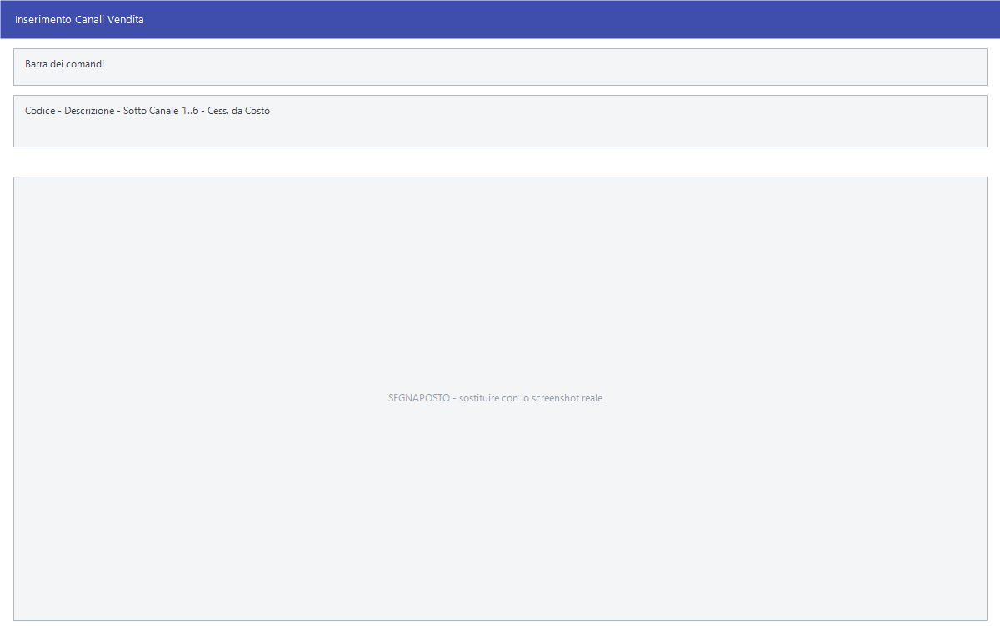

# Canali di vendita

Il canale dice **a che tipo di mercato** si sta vendendo — il bar, il
supermercato, la mensa — e porta con sé le regole con cui si calcola il prezzo
di cessione e si applicano gli sconti dei contratti con i fornitori.

!!! info "In sintesi"

    - **Percorso:** Menu ▸ Archivi ▸ Altre Tabelle ▸ Canali di Vendita ▸ Inserimento *(oppure* Modifica*)*
    - **Scorciatoia:** ++f2++ salva, ++f5++ cerca
    - **Permessi richiesti:** nessun profilo predefinito; **Inserimento** e **Modifica** si abilitano separatamente per ogni utente da [Archivi ▸ Utenti](../anagrafiche/utenti.md)

---

## A cosa serve

Un distributore vende lo stesso prodotto al bar, al negozio di alimentari e
alla catena di supermercati a condizioni diverse. Il canale è l'etichetta che
distingue i tre casi, e i sei sottocanali permettono di scendere ancora di
livello.

Il canale serve poi ai contratti con i fornitori: dice da quale costo partire
per calcolare il prezzo di cessione e se gli sconti di fine fattura vanno
ribaltati sulle righe.

## Prerequisiti

*Nessuno.*

## La maschera

È una maschera a finestra unica, dal titolo *Inserimento Canali Vendita* —
oppure *Modifica Canali*. In alto codice e descrizione, poi i sei sottocanali,
a destra le caselle che regolano gli sconti, e in fondo, sotto la riga
**+. . : :  T R A S F E R I M E N T I  : : . .**, i codici con cui il canale
viene comunicato ad alcuni fornitori.

## Campi

| Campo | Obbl. | Descrizione | Valori ammessi |
|---|:---:|---|---|
| **Codice** | ● | Identificativo del canale. In modifica non è modificabile. | numero |
| **Descrizione** | ● | Nome del canale, come compare negli elenchi e nelle stampe. | testo |
| **Sotto Canale 1** … **Sotto Canale 6** | | Sei livelli di dettaglio sotto il canale. | testo |
| **Cess. da Costo** | | Da quale costo partire per calcolare il prezzo di cessione. | `ULTIMO`, `MEDIO`, `NETTO`, `FINITO` |
| **del Canale Specifico** | | Prende il costo dal canale indicato invece che da quello generale. | attivo/non attivo |
| **No Agg. se in offerta** | | Non aggiorna il prezzo quando l'articolo è in offerta. | attivo/non attivo |
| **Ribalt. Sconti F.Ft.** | | Ribalta sulle righe gli sconti di fine fattura. Attivandolo compare **Totale**. | attivo/non attivo |
| **Totale** | | Compare **solo** quando **Ribalt. Sconti F.Ft.** è attivo, e scompare se lo togli. | attivo/non attivo |
| **Globe Nestlé** | | Codice con cui questo canale è identificato nei trasferimenti verso Nestlé. | testo |
| **Froneri** | | Codice del canale per i trasferimenti Froneri. | testo |
| **Udial** | | Codice del canale per i trasferimenti Udial. | testo |

{: .campi }

## Pulsanti e comandi

| Comando | Scorciatoia | Effetto |
|---|---|---|
| **F2 - Salva** | ++f2++ | Registra il canale. In inserimento la maschera si svuota per il successivo. |
| **F3 - Prec.** | ++f3++ | Passa al canale precedente. |
| **F4 - Succ.** | ++f4++ | Passa al canale successivo. |
| **F5 - Cerca** | ++f5++ | Apre l'elenco dei canali, con **Codice**, **Descrizione** e i sei **Sottocanale**. |
| **F6 - Elimina** | ++f6++ | Cancella il canale, previa conferma. |
| **Ricarica** | | Rilegge il canale dall'archivio, abbandonando le modifiche non salvate. |
| **Consultazione** | ++f11++ | Apre la consultazione. |
| **Calcolatrice** | ++f12++ | Apre la calcolatrice. |

## Come si fa

### Registrare un canale

1. Apri **Menu ▸ Archivi ▸ Altre Tabelle ▸ Canali di Vendita ▸ Inserimento**.
2. Digita **Codice** e **Descrizione**.
3. Se il canale si articola, compila i **Sotto Canale** che ti servono.
4. Scegli il costo di partenza in **Cess. da Costo**.
5. Premi **F2 - Salva**.

## Controlli e messaggi

| Messaggio | Causa | Cosa fare |
|---|---|---|
| *(nessun messaggio, solo un segnale acustico)* | Manca il **Codice** o la **Descrizione**. | Guarda dove si è posizionato il cursore: è il campo da compilare. |
| *Confermi la Cancellazione....* | Conferma richiesta da **F6 - Elimina**. | Rispondi **Sì** per eliminare il canale. |

## Note

!!! note "I codici dei trasferimenti"

    **Globe Nestlé**, **Froneri** e **Udial** servono solo a chi scambia i dati
    di vendita con quei fornitori: sono i codici con cui loro identificano il
    canale. Se non fai quei trasferimenti, lasciali vuoti.

!!! note "Dove si assegna il canale"

    Su **entrambi**, e non solo:

    - sul **cliente**, nella sua anagrafica: è il canale con cui quel cliente
      viene classificato nelle vendite;
    - sul **contratto fornitore**, che è intestato a fornitore, anno e canale:
      lo stesso fornitore può avere condizioni diverse per canale;
    - sulle regole di **disponibilità** degli articoli, dove il canale a zero
      vale «tutti i canali»;
    - nella versione Ristorazione, anche sui **menu** e sulle **sale**.

    In tutti questi punti il canale dev'essere già in tabella: se non c'è, il
    salvataggio si ferma con *Codice Canale non presente in tabella*.

    Un cliente **senza canale** blocca alcuni trasferimenti dati verso i
    fornitori, che si fermano con *Canale vendita non impostato per il
    cliente …*.

!!! warning "Cess. da Costo e le quattro caselle non fanno ancora niente"

    **Cess. da Costo** (ULTIMO, MEDIO, NETTO, FINITO) e le caselle **del Canale
    Specifico**, **No Agg. se in offerta**, **Ribalt. Sconti F.Ft.** e
    **Totale** vengono salvate sul canale e rilette quando riapri la maschera,
    ma **nessuna parte del programma le consulta**: sono predisposte per uno
    sviluppo futuro.

    Finche' non servono, quello che imposti qui non cambia nessun prezzo e
    nessun calcolo. Non vale la pena compilarle sperando in un effetto, e non
    c'e' rischio a lasciarle come sono.

    Del canale, oggi, si usano il **codice**, la **descrizione** e i **tre
    codici dei trasferimenti**.

## Vedi anche

- [Tabella sconti fornitori](../anagrafiche/tabella-sconti-fornitori.md)
- [Anagrafica fornitori](../anagrafiche/anagrafica-fornitori.md)
