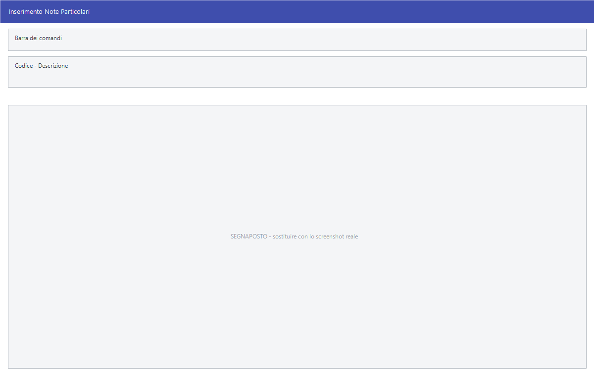

# Note, aspetto e causali di trasporto

Tre tabelle diverse ma identiche nell'uso: si registra un codice e una frase, e
quella frase si richiama poi sui documenti invece di riscriverla ogni volta.

!!! info "In sintesi"

    - **Percorso:**
        - Menu ▸ Archivi ▸ Altre Tabelle ▸ Note Particolari ▸ Inserimento *(oppure* Modifica*)*
        - Menu ▸ Archivi ▸ Altre Tabelle ▸ Aspetto Esteriore Merci ▸ Inserimento *(oppure* Modifica*)*
        - Menu ▸ Archivi ▸ Altre Tabelle ▸ Causali Trasporto Merci ▸ Inserimento *(oppure* Modifica*)*
    - **Scorciatoia:** ++f2++ salva, ++f5++ cerca
    - **Permessi richiesti:** nessun profilo predefinito; **Inserimento** e **Modifica** si abilitano separatamente per ogni utente da [Archivi ▸ Utenti](../anagrafiche/utenti.md)

---

## A cosa serve

Un documento di trasporto deve dire com'è confezionata la merce
(*«cartoni»*, *«bancali»*), perché sta viaggiando (*«vendita»*, *«conto
visione»*, *«reso»*) ed eventualmente riportare una nota che si ripete su molti
documenti. Le tre tabelle contengono queste frasi già pronte.

| Voce di menu | Cosa contiene | Dove si richiama |
|---|---|---|
| **Note Particolari** | Frasi ricorrenti da stampare sui documenti, anche lunghe. | Sull'anagrafica del fornitore, campo **Nota Trasfert**: di lì finiscono da sole sui documenti. |
| **Aspetto Esteriore Merci** | Come si presenta la merce: cartoni, bancali, colli sfusi. | Nel piede del documento di trasporto. |
| **Causali Trasporto Merci** | Il motivo del trasporto: vendita, conto visione, reso, riparazione. | Nel piede del documento di trasporto. |

## Prerequisiti

*Nessuno.*

## La maschera

Tutte e tre sono maschere a finestra unica, senza schede: la barra dei comandi
e due soli campi, **Codice** e **Descrizione**. Il titolo della finestra dice
su quale tabella si sta lavorando.

## Campi

| Campo | Obbl. | Descrizione | Valori ammessi |
|---|:---:|---|---|
| **Codice** | ● | Identificativo della voce. In modifica non è modificabile. | numero |
| **Descrizione** | ● | La frase che comparirà sul documento. Quello che scrivi diventa **maiuscolo**. | testo, fino a 512 caratteri nelle Note Particolari e a 30 nelle altre due |

{: .campi }

!!! note "La casella delle Note Particolari è molto più capiente"

    Aspetto esteriore e causale di trasporto sono etichette brevi — trenta
    caratteri, quanto basta per `CARTONI` o `CONTO VISIONE`. Le **Note
    Particolari** arrivano invece a **512 caratteri**: sono pensate per un
    periodo intero, non per una parola.

## Pulsanti e comandi

| Comando | Scorciatoia | Effetto |
|---|---|---|
| **F2 - Salva** | ++f2++ | Registra la voce. In inserimento la maschera si svuota per la successiva. |
| **F3 - Prec.** | ++f3++ | Passa alla voce precedente. |
| **F4 - Succ.** | ++f4++ | Passa alla voce successiva. |
| **F5 - Cerca** | ++f5++ | Apre l'elenco delle voci della tabella, con **Codice** e **Descrizione**. |
| **F6 - Elimina** | ++f6++ | Cancella la voce, previa conferma. |
| **Ricarica** | | Rilegge la voce dall'archivio, abbandonando le modifiche non salvate. |
| **Consultazione** | ++f11++ | Apre la consultazione. |
| **Calcolatrice** | ++f12++ | Apre la calcolatrice. |

## Come si fa

### Aggiungere una causale di trasporto

1. Apri **Menu ▸ Archivi ▸ Altre Tabelle ▸ Causali Trasporto Merci ▸
   Inserimento**.
2. Digita il **Codice** e la **Descrizione**, per esempio `CONTO VISIONE`.
3. Premi **F2 - Salva**. La maschera si svuota per la voce successiva.

### Correggere una frase

1. Apri la tabella in **Modifica**.
2. Premi **F5 - Cerca** e scegli la voce.
3. Correggi la **Descrizione** e premi **F2 - Salva**.

!!! warning "La correzione si vede anche sui documenti già emessi"

    Aspetto esteriore e causale di trasporto sul documento sono **un rimando
    alla tabella**, non una copia: il documento conserva il codice e la frase
    viene riletta ogni volta che lo apri o lo ristampi.

    Quindi una correzione si propaga all'indietro su tutto lo storico, e una
    voce **cancellata** fa comparire `*** NOT FOUND ***` al posto della frase
    sui documenti che la usavano. Se la frase vecchia deve restare com'era,
    non correggerla: aggiungi una voce nuova e usa quella d'ora in poi.

    Fanno eccezione le **Note Particolari**, che al contrario vengono
    **copiate** dentro il documento nel momento in cui il documento nasce:
    quelle restano come erano.

## Controlli e messaggi

| Messaggio | Causa | Cosa fare |
|---|---|---|
| *(nessun messaggio, solo un segnale acustico)* | Manca il **Codice** o la **Descrizione**. | Guarda dove si è posizionato il cursore: è il campo da compilare. |
| *Confermi la Cancellazione....* | Conferma richiesta da **F6 - Elimina**. | Rispondi **Sì** per eliminare la voce. |

## Note

!!! note "Tre tabelle separate"

    Anche se la finestra è identica, le tre tabelle sono distinte: quello che
    inserisci fra le causali di trasporto non compare fra gli aspetti
    esteriori. Il titolo della finestra è l'unico modo per accorgersi su quale
    si sta scrivendo.

!!! note "Le Note Particolari non si scelgono sul documento"

    A differenza delle altre due, questa tabella non compare fra i campi del
    documento: la nota si aggancia **una volta sola all'anagrafica del
    fornitore**, nel campo **Nota Trasfert** della scheda Generale, e da lì il
    programma la porta sui documenti da sé.

    Succede in due casi:

    - quando emetti un documento di vendita di tipo **Trasfert**,
      **C/Servizi** o **Delivery** che contiene merce di quel fornitore: la
      nota viene aggiunta come riga descrittiva del documento — una riga per
      ogni fornitore presente;
    - quando generi il **DDT di trasfert** a carico del fornitore: lì la nota
      finisce nelle annotazioni di piede del documento, e se supera la riga
      prosegue nelle annotazioni successive.

    Non succede mai su ordini e preventivi.

    La stessa frase viene aggiunta in coda al testo dell'**estratto conto**.

    Nella versione Studio la nota si aggancia allo stesso modo all'anagrafica
    del cliente.

## Vedi anche

- [Trasportatori](../anagrafiche/trasportatori.md)
- [Causali magazzino](../magazzino/causali-magazzino.md)
