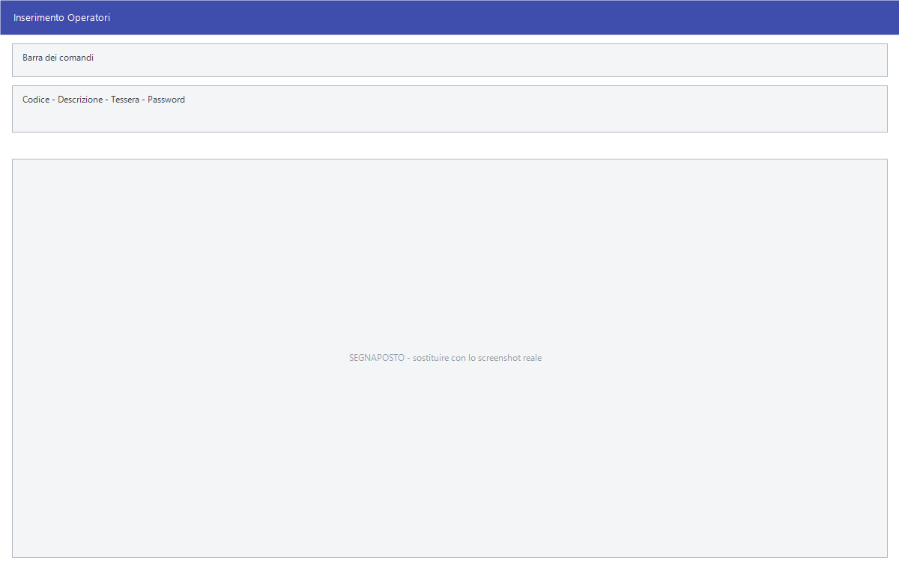

# Operatori

L'elenco di chi sta alla cassa. Ogni operatore ha una tessera e una password
con cui si riconosce, così gli scontrini e i movimenti restano attribuiti a chi
li ha fatti.

!!! info "In sintesi"

    - **Percorso:** Menu ▸ Archivi ▸ Altre Tabelle ▸ Operatori ▸ Inserimento *(oppure* Modifica*)*
    - **Scorciatoia:** ++f2++ salva, ++f5++ cerca
    - **Permessi richiesti:** nessun profilo predefinito; **Inserimento** e **Modifica** si abilitano separatamente per ogni utente da [Archivi ▸ Utenti](../anagrafiche/utenti.md)

---

## A cosa serve

L'operatore non è la stessa cosa dell'[utente](../anagrafiche/utenti.md):
l'utente è chi entra in Facile con il proprio nome e i propri permessi,
l'operatore è chi materialmente batte alla cassa. In un negozio con un solo
computer e tre commessi ci sarà un utente e tre operatori.

L'operatore si collega poi all'utente nel campo **Operatore** della
[maschera Utenti](../anagrafiche/utenti.md).

## Prerequisiti

*Nessuno.*

## La maschera

È una maschera a finestra unica, senza schede: la barra dei comandi e quattro
campi.

## Campi

| Campo | Obbl. | Descrizione | Valori ammessi |
|---|:---:|---|---|
| **Codice** | ● | Identificativo dell'operatore. In modifica non è modificabile. | numero |
| **Descrizione** | ● | Nome dell'operatore, come compare sugli scontrini e nelle stampe. | testo |
| **Tessera** | | Il codice della tessera con cui l'operatore si identifica alla cassa. | testo |
| **Password** | | La password con cui l'operatore si identifica quando non usa la tessera. | testo |

{: .campi }

## Pulsanti e comandi

| Comando | Scorciatoia | Effetto |
|---|---|---|
| **F2 - Salva** | ++f2++ | Registra l'operatore. In inserimento la maschera si svuota per il successivo. |
| **F3 - Prec.** | ++f3++ | Passa all'operatore precedente. |
| **F4 - Succ.** | ++f4++ | Passa all'operatore successivo. |
| **F5 - Cerca** | ++f5++ | Apre l'elenco degli operatori. |
| **F6 - Elimina** | ++f6++ | Cancella l'operatore, previa conferma. |
| **Ricarica** | | Rilegge l'operatore dall'archivio, abbandonando le modifiche non salvate. |
| **Consultazione** | ++f11++ | Apre la consultazione. |
| **Calcolatrice** | ++f12++ | Apre la calcolatrice. |

## Come si fa

### Registrare un operatore di cassa

1. Apri **Menu ▸ Archivi ▸ Altre Tabelle ▸ Operatori ▸ Inserimento**.
2. Digita **Codice** e **Descrizione**.
3. Compila **Tessera** se l'operatore si identifica passando un badge, oppure
   **Password** se digita un codice.
4. Premi **F2 - Salva**.

## Controlli e messaggi

| Messaggio | Causa | Cosa fare |
|---|---|---|
| *(nessun messaggio, solo un segnale acustico)* | Manca il **Codice** o la **Descrizione**. | Guarda dove si è posizionato il cursore: è il campo da compilare. |
| *Confermi la Cancellazione....* | Conferma richiesta da **F6 - Elimina**. | Rispondi **Sì** per eliminare l'operatore. |

## Note

!!! warning "Attenzione"

    L'operatore cancellato sparisce dall'elenco ma resta citato nei movimenti
    già registrati: non riciclare il suo codice per un'altra persona, o le
    statistiche di cassa risulteranno confuse.

<!-- DA VERIFICARE: se la password dell'operatore sia digitata in chiaro o coperta, e dove venga richiesta durante il lavoro alla cassa. -->

<!-- DA VERIFICARE: quale lettore di tessere è previsto e in che formato va scritto il codice in "Tessera". -->

## Vedi anche

- [Utenti](../anagrafiche/utenti.md)
