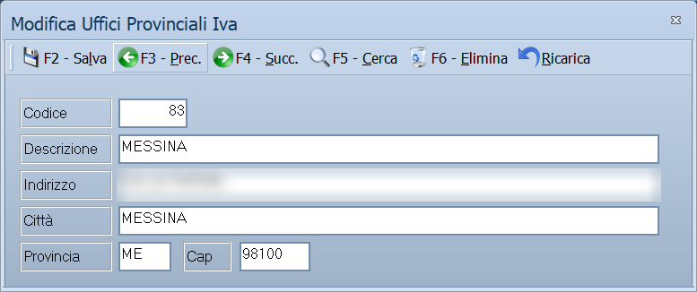

# Uffici provinciali IVA

L'elenco degli uffici IVA di competenza, con il loro indirizzo. Serve alle
stampe e alle comunicazioni fiscali che devono riportare l'ufficio a cui
l'azienda fa capo.

!!! info "In sintesi"

    - **Percorso:** Menu ▸ Archivi ▸ Altre Tabelle ▸ Uffici Provinciali IVA ▸ Inserimento *(oppure* Modifica*)*
    - **Scorciatoia:** ++f2++ salva, ++f5++ cerca
    - **Permessi richiesti:** nessun profilo predefinito; **Inserimento** e **Modifica** si abilitano separatamente per ogni utente da [Archivi ▸ Utenti](../anagrafiche/utenti.md)

---

## A cosa serve

È una tabella di appoggio: si registra una volta l'ufficio IVA della provincia
e lo si richiama dove serve, invece di riscriverne ogni volta l'indirizzo.

## Prerequisiti

*Nessuno.*

## La maschera

È una maschera a finestra unica, dal titolo *Inserimento Uffici Provinciali
IVA*: la barra dei comandi e sei campi.

## Campi

| Campo | Obbl. | Descrizione | Valori ammessi |
|---|:---:|---|---|
| **Codice** | ● | Identificativo dell'ufficio. In modifica non è modificabile. | numero |
| **Descrizione** | ● | Nome dell'ufficio. | testo |
| **Indirizzo** | | Via e numero civico. | testo |
| **Città** | | Comune dell'ufficio. | testo |
| **Provincia** | | Sigla della provincia. | due lettere |
| **Cap** | | Codice di avviamento postale. | cinque cifre |

{: .campi }

## Pulsanti e comandi

| Comando | Scorciatoia | Effetto |
|---|---|---|
| **F2 - Salva** | ++f2++ | Registra l'ufficio. In inserimento la maschera si svuota per il successivo. |
| **F3 - Prec.** | ++f3++ | Passa all'ufficio precedente. |
| **F4 - Succ.** | ++f4++ | Passa all'ufficio successivo. |
| **F5 - Cerca** | ++f5++ | Apre l'elenco degli uffici. |
| **F6 - Elimina** | ++f6++ | Cancella l'ufficio, previa conferma. |
| **Ricarica** | | Rilegge l'ufficio dall'archivio, abbandonando le modifiche non salvate. |
| **Consultazione** | ++f11++ | Apre la consultazione. |
| **Calcolatrice** | ++f12++ | Apre la calcolatrice. |

## Come si fa

### Registrare un ufficio

1. Apri **Menu ▸ Archivi ▸ Altre Tabelle ▸ Uffici Provinciali IVA ▸
   Inserimento**.
2. Digita **Codice** e **Descrizione**.
3. Completa **Indirizzo**, **Città**, **Provincia** e **Cap**.
4. Premi **F2 - Salva**.

## Controlli e messaggi

| Messaggio | Causa | Cosa fare |
|---|---|---|
| *(nessun messaggio, solo un segnale acustico)* | Manca il **Codice** o la **Descrizione**. | Guarda dove si è posizionato il cursore: è il campo da compilare. |
| *Confermi la Cancellazione....* | Conferma richiesta da **F6 - Elimina**. | Rispondi **Sì** per eliminare l'ufficio. |

## Note

Non applicabile.

<!-- DA VERIFICARE: dove l'ufficio provinciale IVA viene richiamato: quale stampa o comunicazione lo usa. -->

## Vedi anche

- [Codici catastali comuni](../anagrafiche/codici-catastali-comuni.md)
