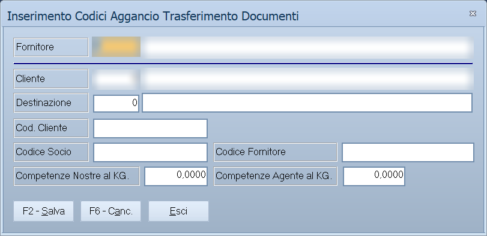

# Agganci trasferimento documenti

Quando si scambiano documenti con un fornitore, lui i clienti li chiama con
codici suoi. Questa tabella tiene la corrispondenza fra i due mondi, così il
trasferimento riconosce chi è chi.

!!! info "In sintesi"

    - **Percorso:**
        - Menu ▸ Archivi ▸ Clienti ▸ Agganci Trasferimento Documenti
        - Menu ▸ Archivi ▸ Clienti ▸ Stampa Agganci Trasferimento Documenti
    - **Scorciatoia:** ++f2++ salva, ++f6++ cancella
    - **Permessi richiesti:** nessun profilo predefinito; le singole voci di menu si abilitano per ogni utente da [Archivi ▸ Utenti](utenti.md)

---

## A cosa serve

Chi lavora come concessionario riceve dal proprio fornitore i documenti già
intestati ai clienti finali, ma con la codifica del fornitore. Senza una tabella
di aggancio quei documenti non si saprebbe a chi attribuirli.

La stessa riga porta anche le **competenze al chilo**: quanto spetta
all'azienda e quanto all'agente su quella merce.

## Prerequisiti

Prima di usare questa maschera occorre avere in archivio i
[clienti](anagrafica-clienti.md) e i
[fornitori](anagrafica-fornitori.md) da mettere in corrispondenza.

## La maschera

La finestra *Inserimento Codici Aggancio Trasferimento Documenti* è divisa in
due da una linea: sopra il **Fornitore**, sotto il cliente e i codici con cui
quel fornitore lo identifica. In fondo **F2 - Salva**, **F6 - Canc.** ed
**Esci**.

La stampa — **Stampa Agganci Trasferimento Documenti** — apre una finestrella
con i soli campi **Fornitore** e **Cliente** per restringere l'elenco.

## Campi

| Campo | Obbl. | Descrizione | Valori ammessi |
|---|:---:|---|---|
| **Fornitore** | ● | Il [fornitore](anagrafica-fornitori.md) con cui si scambiano i documenti. | codice |
| **Cliente** | ● | Il [cliente](anagrafica-clienti.md) di Facile a cui l'aggancio si riferisce. | codice |
| **Destinazione** | | La destinazione merce del cliente, se l'aggancio riguarda solo quella. | codice |
| **Cod. Cliente** | | Il codice con cui il fornitore identifica quel cliente. | testo |
| **Codice Socio** | | Il codice socio presso il fornitore. | testo |
| **Codice Fornitore** | | Il codice con cui il fornitore identifica sé stesso nei documenti. | testo |
| **Competenze Nostre al KG.** | | Quanto spetta all'azienda per ogni chilo. | importo |
| **Competenze Agente al KG.** | | Quanto spetta all'agente per ogni chilo. | importo |

## Pulsanti e comandi

| Comando | Scorciatoia | Effetto |
|---|---|---|
| **F2 - Salva** | ++f2++ | Registra l'aggancio. |
| **F6 - Canc.** | ++f6++ | Cancella l'aggancio. |
| **Esci** | ++esc++ | Chiude senza salvare. |
| Elenco di scelta | ++f10++ o ++space++ | Sul campo con il codice, apre l'elenco da cui scegliere. |
| **Calcolatrice** | ++f12++ | Apre la calcolatrice. |
| **Consultazione** | ++f11++ | Apre la consultazione. |

## Come si fa

### Registrare un aggancio

1. Apri **Menu ▸ Archivi ▸ Clienti ▸ Agganci Trasferimento Documenti**.
2. Indica il **Fornitore**.
3. Indica il **Cliente** di Facile e, se serve, la **Destinazione**.
4. Scrivi in **Cod. Cliente** il codice che il fornitore usa per quel cliente:
   è il dato su cui il trasferimento farà corrispondere le due anagrafiche.
5. Compila le competenze al chilo, se previste.
6. Premi **F2 - Salva**.

### Controllare gli agganci registrati

1. Apri **Menu ▸ Archivi ▸ Clienti ▸ Stampa Agganci Trasferimento Documenti**.
2. Indica il **Fornitore**, oppure lascia vuoto per stamparli tutti.
3. Avvia la stampa.

## Controlli e messaggi

| Messaggio | Causa | Cosa fare |
|---|---|---|
| *(nessun messaggio, solo un segnale acustico)* | Manca il **Fornitore** o il **Cliente**. | Compila il campo su cui si è posizionato il cursore. |

## Note

!!! note "Serve solo a chi scambia documenti con i fornitori"

    Se non si usano i trasferimenti di documenti, questa tabella si lascia
    vuota: nessun'altra parte del programma la richiede.

!!! info "Che cosa fa da chiave, e che cosa è solo contenuto"

    La riga si trova con **tre dati insieme**: il **fornitore**, il
    **cliente** e la sua **destinazione**. Sono quelli la chiave.

    **Cod. Cliente**, **Cod. Fornitore** e **Codice Socio** sono invece il
    contenuto: i codici con cui quel cliente è conosciuto dall'altra parte,
    che il trasferimento scrive nel file al posto del codice tuo. Non
    servono a cercare la riga.

    Una riga con la **destinazione a zero** vale per il cliente senza
    destinazione: la ricerca è esatta, non ci si ricade sopra.

!!! info "Quali trasferimenti la usano"

    Quasi tutti quelli verso le grandi marche e le centrali, dove il
    documento deve uscire con i codici del destinatario e non con i tuoi:
    Nestlé — documenti, clienti, banchi, premi, sconti, sellout — Globe
    premi e sconti, Conad e Filconad, Lactalis, Granarolo, Kraft, Mauri,
    Sammontana, Fini, Smafin, Sicily Food.

    Il trasferimento che non trova l'aggancio del cliente **si ferma su
    quel documento**: è il motivo per cui questa tabella va compilata prima
    del primo invio, e aggiornata quando si aggiunge un cliente.

!!! info "Le competenze al chilo sono provvigioni vere"

    Non sono un promemoria: la **competenza agente** viene usata per
    calcolare la provvigione sulle righe dei documenti, **a peso invece che
    a percentuale**.

    Succede quando l'articolo è impostato per prendere la competenza
    dall'aggancio e la vendita non è una vendita normale: allora la
    provvigione della riga diventa la **competenza moltiplicata per i chili**
    — peso per quantità, convertito secondo l'unità di misura del peso, che
    il programma sa leggere in grammi, ettogrammi, chili, quintali o
    tonnellate.

    È la forma con cui si pagano gli agenti su certe merci: tanto al chilo
    venduto, indipendentemente dal prezzo.

## Vedi anche

- [Anagrafica clienti](anagrafica-clienti.md)
- [Anagrafica fornitori](anagrafica-fornitori.md)
