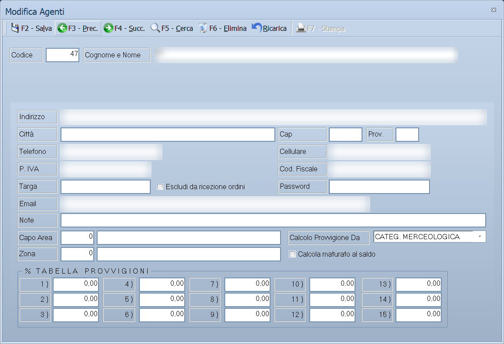

# Anagrafica agenti

Da questa maschera si inseriscono e si aggiornano gli agenti di vendita: i dati
anagrafici, la zona, il capo area e le percentuali di provvigione. Dalla stessa
finestra si consultano le provvigioni maturate mese per mese e il riepilogo
dell'anno.

!!! info "In sintesi"

    - **Percorso:** Menu ▸ Archivi ▸ Agenti ▸ Inserimento *(oppure* Modifica*)*
    - **Scorciatoia:** nessuna; la maschera si apre dal menu o dal pulsante corrispondente nella barra degli strumenti
    - **Permessi richiesti:** nessun profilo predefinito; **Inserimento** e **Modifica** si abilitano separatamente per ogni utente da [Archivi ▸ Utenti](utenti.md)

---

## A cosa serve

L'agente è la persona che porta l'ordine. Ogni cliente ne indica uno, e ogni
documento intestato a quel cliente eredita l'agente: da lì Facile calcola le
provvigioni con le percentuali registrate qui.

Esempio: se imposti **Calcolo Provvigione Da** = *SCAGLIONE CLIENTE*, la
percentuale applicata a ogni documento è quella dello scaglione indicato
nell'anagrafica del cliente, letta nella **% TABELLA PROVVIGIONI** di questo
agente.

## Prerequisiti

Prima di inserire il primo agente conviene aver definito:

- le **zone**, se assegni gli agenti per territorio;
- i **capi area**, se la rete di vendita ha più livelli — si inseriscono da
  **Menu ▸ Archivi ▸ Agenti ▸ Capi Area**.

Nessuno dei due è obbligatorio.

## La maschera

La maschera è divisa in tre parti:

- in alto la **barra dei comandi**;
- sotto la **testata**, sempre visibile, con codice e nominativo dell'agente;
- al centro le **schede**.

Le schede sono queste:

| Scheda | Contenuto |
|---|---|
| **Generale** | Dati anagrafici, zona, capo area e la tabella delle percentuali di provvigione. È la scheda che si compila. |
| **Totali** | Provvigioni e fatturato dell'anno, con le ritenute. Si compila anch'essa. |
| **Prov. Anno** | Le provvigioni di tutto l'anno, documento per documento. |
| **Prov. Gennaio** … **Prov. Dicembre** | Le stesse provvigioni, un mese per scheda. |
| **Mat. Anno** | Il maturato dell'anno: quanto è stato incassato e quanta provvigione ne consegue. |

## Campi

### Testata

| Campo | Obbl. | Descrizione | Valori ammessi |
|---|:---:|---|---|
| Codice | ● | Identificativo dell'agente. In modifica non è modificabile. | Numero |
| Cognome e Nome | ● | Nominativo dell'agente, come compare sui documenti e nelle stampe. | Fino a 91 caratteri |

{: .campi }

### Scheda Generale

| Campo | Obbl. | Descrizione | Valori ammessi |
|---|:---:|---|---|
| Indirizzo | | Via e numero civico. | Fino a 100 caratteri |
| Città | | Comune di residenza. | Fino a 30 caratteri |
| Cap | | Codice di avviamento postale. | Solo cifre, fino a 5 |
| Prov. | | Sigla della provincia. | 2 caratteri |
| Telefono | | Numero di telefono. | Fino a 13 cifre |
| Cellulare | | Numero di cellulare. | Fino a 14 cifre |
| P. IVA | | Partita IVA dell'agente. Il programma ne verifica subito il codice di controllo. | 11 cifre |
| Cod. Fiscale | | Codice fiscale dell'agente. Il programma ne verifica subito il codice di controllo. | Fino a 16 caratteri |
| Targa | | Targa dell'automezzo dell'agente. | Fino a 10 caratteri |
| Escludi da ricezione ordini | | Impedisce all'agente di ricevere ordini sul palmare. | Casella |
| Password | | Password dell'agente per l'accesso da palmare. Si digita in chiaro ma resta nascosta. | Fino a 20 caratteri |
| Email | | Indirizzo di posta dell'agente. | Fino a 45 caratteri, in minuscolo |
| Note | | Annotazione libera. | Fino a 100 caratteri |
| Capo Area | | Capo area a cui l'agente risponde. Accanto compare la descrizione. | Codice dall'archivio capi area |
| Calcolo Provvigione Da | | Stabilisce dove Facile va a prendere la percentuale da applicare. | LISTINO, SCAGLIONE ARTICOLO, SCAGLIONE CLIENTE, CLIENTE, CATEG. MERCEOLOGICA |
| Zona | | Zona di competenza dell'agente. Accanto compare la descrizione. | Codice dall'archivio zone |
| Calcola maturato al saldo | | La provvigione matura quando la fattura è incassata per intero, non quando è emessa. | Casella |
| % TABELLA PROVVIGIONI, da **1 )** a **15 )** | | Le quindici percentuali di provvigione dell'agente. Contano solo con **Calcolo Provvigione Da** impostato su *SCAGLIONE ARTICOLO* o *SCAGLIONE CLIENTE*: a quel punto è lo scaglione scritto sull'articolo o sul cliente a dire quale delle quindici prendere. | Percentuali |

{: .campi }

### Scheda Totali

I valori di questa scheda si riferiscono all'**anno di lavoro in corso** e si
salvano insieme all'agente.

| Campo | Obbl. | Descrizione | Valori ammessi |
|---|:---:|---|---|
| Provvigione Periodo | | Provvigione del periodo in corso. | Importo |
| Fatturato Periodo | | Fatturato del periodo in corso. | Importo |
| Provvigione Anno | | Provvigione dell'intero anno. | Importo |
| Fatturato Anno | | Fatturato dell'intero anno. | Importo |
| Provigione Fatturata | | Quanto l'agente ha già fatturato di provvigioni. | Importo |
| % Ritenuta Acconto | | Ritenuta d'acconto applicata all'agente. | Percentuale |
| % Ritenuta Enasarco | | Ritenuta Enasarco applicata all'agente. | Percentuale |
| Massimale Enasarco | | Tetto annuo oltre il quale la ritenuta Enasarco non si applica. | Importo |

{: .campi }

### Schede delle provvigioni

Non si compilano: elencano i documenti da cui la provvigione deriva.

| Scheda | Colonne |
|---|---|
| **Prov. Anno**, **Prov. Gennaio** … **Prov. Dicembre** | Numero, Data, Tot. Documento, Totale Merci, Totale Provvig. Sull'ultima riga compare il totale della scheda. |
| **Mat. Anno** | Numero, Data, Tot. Documento, Tot. Scadenze, Tot. Incassato, Incasso Periodo, Tot. Provv., Maturato, Tipo, Anno, Cliente, Ult. Incasso |

## Pulsanti e comandi

| Comando | Scorciatoia | Effetto |
|---|---|---|
| **F2 - Salva** | ++f2++ | Registra l'agente e i totali dell'anno. |
| **F3 - Prec.** | ++f3++ | Passa all'agente precedente. |
| **F4 - Succ.** | ++f4++ | Passa all'agente successivo. |
| **F5 - Cerca** | ++f5++ | Apre la finestra **Cerca Agenti**, che elenca codice e descrizione. |
| **F6 - Elimina** | ++f6++ | Cancella l'agente, previa conferma. |
| **Ricarica** | | Rilegge l'agente dall'archivio, abbandonando le modifiche non salvate. |
| **F7 - Stampa** | ++f7++ | Stampa il contenuto della scheda aperta. Funziona solo sulle schede delle provvigioni e del maturato: sulle schede *Generale* e *Totali* il pulsante è spento. |

Valgono inoltre in tutta la maschera:

| Comando | Scorciatoia | Effetto |
|---|---|---|
| Guida | ++f1++ | Apre la pagina di guida dell'operazione in corso. |
| Elenco valori | ++f10++, ++space++ o doppio clic | Su **Capo Area** e **Zona**, apre l'elenco da cui scegliere. |
| Consultazione | ++f11++ | Apre la finestra **Consultazione**. |
| Calcolatrice | ++f12++ | Apre la calcolatrice. |
| Campo successivo | ++enter++ o ++down++ | Sposta il cursore sul campo seguente. |
| Campo precedente | ++up++ | Sposta il cursore sul campo precedente. |
| Chiusura | ++esc++ | Chiude la maschera. |

## Come si fa

### Inserire un nuovo agente

1. Apri **Menu ▸ Archivi ▸ Agenti ▸ Inserimento**.
2. Digita il **Codice** e il **Cognome e Nome**: sono gli unici due dati che il
   programma pretende.
3. Compila i recapiti e, se l'agente emette fattura, **P. IVA** e
   **Cod. Fiscale**.
4. Indica la **Zona** e, se serve, il **Capo Area**, scegliendoli con ++f10++.
5. Scegli **Calcolo Provvigione Da**: è la regola con cui il programma sceglie
   quale percentuale applicare.
6. Compila le percentuali della **% TABELLA PROVVIGIONI** che ti servono.
7. Premi **F2 - Salva**. La maschera si svuota per l'agente successivo.

### Ritrovare e modificare un agente

1. Apri **Menu ▸ Archivi ▸ Agenti ▸ Modifica**. La maschera non si apre vuota:
   mostra già l'agente con il **codice più alto**.
2. Premi **F5 - Cerca** e scegli l'agente dall'elenco, oppure scorri con **F3 -
   Prec.** e **F4 - Succ.**.
3. Correggi i campi e premi **F2 - Salva**. La scheda resta a video su quello
   appena registrato; in inserimento invece si svuota per il successivo.

Finché non salvi puoi tornare indietro con **Ricarica**, che rilegge l'agente
dall'archivio e abbandona le modifiche non salvate. Se l'archivio è ancora
vuoto la voce **Modifica** non apre nulla e non dà alcun messaggio.

### Impostare le ritenute

1. Carica l'agente e apri la scheda *Totali*.
2. Compila **% Ritenuta Acconto**, **% Ritenuta Enasarco** e **Massimale
   Enasarco**.
3. Premi **F2 - Salva**: i valori valgono per l'anno di lavoro in corso.

### Controllare le provvigioni di un mese

1. Carica l'agente.
2. Apri la scheda del mese, per esempio *Prov. Marzo*.
3. Leggi il totale sull'ultima riga.
4. Premi **F7 - Stampa** per averne la stampa.

### Far maturare la provvigione solo sull'incassato

1. Carica l'agente e resta sulla scheda *Generale*.
2. Spunta **Calcola maturato al saldo**.
3. Premi **F2 - Salva**.
4. Da quel momento la scheda *Mat. Anno* considera provvigione maturata solo
   quella delle fatture incassate.

## Controlli e messaggi

| Messaggio | Causa | Cosa fare |
|---|---|---|
| *(nessun messaggio, solo un segnale acustico)* | Manca il **Codice** o il **Cognome e Nome**. | Guarda dove si è posizionato il cursore: è il campo da compilare. |
| *Il codice della zona non è valido o disponibile.* | Il codice digitato in **Zona** non esiste. | Premi ++f10++ sul campo e scegli dall'elenco. |
| *Il codice del Capo Area non è valido o disponibile.* | Il codice digitato in **Capo Area** non esiste. | Premi ++f10++ sul campo e scegli dall'elenco, oppure inserisci prima il capo area. |
| *Confermi la Cancellazione....* | Conferma richiesta da **F6 - Elimina**. | Rispondi **Sì** per eliminare l'agente. |
| *Non è possibile eliminare il record poiché utilizzato in alcuni record del database.* | L'agente è assegnato a dei clienti, oppure compare in documenti, movimenti, scadenze o provvigioni. | Non è eliminabile: lascialo in archivio. |
| *In archivio è già presente un record con lo stesso codice.* | Il codice digitato è già di un altro agente. | Cambia codice. |
| *Il record è stato modificato da un altro nodo della rete.* | Un altro utente ha salvato lo stesso agente mentre lo modificavi. | Premi **Ricarica**, verifica cosa è cambiato e rifai le tue modifiche. |
| *Il record è stato cancellato da un altro nodo della rete.* | Un altro utente ha eliminato l'agente mentre lo modificavi. | La maschera si chiude: non c'è più nulla da salvare. |

## Note

!!! warning "Attenzione"

    ++esc++ chiude la maschera senza chiedere conferma e senza salvare: le
    modifiche fatte dopo l'ultimo **F2 - Salva** vanno perse.

    I valori della scheda *Totali* sono legati all'**anno di lavoro**: cambiando
    esercizio l'agente riparte con totali e ritenute da reimpostare.

!!! info "Quale delle quindici percentuali viene usata"

    Le quindici percentuali servono **solo a due** dei cinque modi. Negli
    altri tre il programma non le guarda nemmeno.

    | Calcolo Provvigione Da | Da dove prende la percentuale |
    |---|---|
    | **LISTINO** | Dal listino di vendita dell'articolo. La percentuale cambia con il tipo di vendita: normale, trasfert, delivery o conto servizi hanno ciascuno la propria. |
    | **SCAGLIONE ARTICOLO** | Dalla tabella qui sotto: la riga è quella che l'**articolo** indica nel suo campo *Scaglione Agente*. Scaglione 3 sull'articolo significa percentuale **3 )** dell'agente. |
    | **SCAGLIONE CLIENTE** | Dalla tabella qui sotto: la riga è quella che il **cliente** indica nel suo campo *Scaglione*. |
    | **CLIENTE** | Dalle quattro percentuali scritte sull'anagrafica del cliente, una per tipo di vendita. |
    | **CATEG. MERCEOLOGICA** | Dalla categoria merceologica dell'articolo, che tiene una percentuale diversa per fascia di sconto applicato. |

    Perché una percentuale della tabella venga presa, lo scaglione dev'essere
    un numero **da 1 a 15**. Con lo scaglione a zero, o fuori da
    quell'intervallo, la riga resta **senza provvigione**: non viene applicato
    nessun valore di ripiego.

!!! warning "Il capo area guadagna solo nel modo LISTINO"

    La provvigione del capo area viene calcolata **soltanto** quando l'agente
    è impostato su **LISTINO**, e viene presa anch'essa dal listino.

    Con gli altri quattro modi la quota del capo area risulta **zero**, anche
    se l'agente ha un capo area assegnato.

!!! note "Il modo CATEG. MERCEOLOGICA si arrende sugli sconti merce"

    Vale solo per le righe senza **sconto merce** e senza **sconto a valore**.
    Se la riga ne ha uno, il calcolo ricade sul modo LISTINO.

!!! note "I due campi che riguardano il palmare"

    **Escludi da ricezione ordini** ha un effetto preciso dentro Facile:
    quando lanci **Menu ▸ Ordini ▸ Ricezione Ordini dal Server FTP**, il
    programma scorre gli agenti uno per uno e **salta** quelli che hanno
    questa casella spuntata. Si spunta agli agenti che non lavorano con il
    palmare, per non far perdere tempo alla procedura.

    **Password** invece Facile non la controlla mai: nessuna maschera la
    chiede. È la password con cui l'agente entra nella **sua** applicazione, e
    da qui viaggia verso il palmare insieme al resto dei suoi dati.

!!! abstract "Come arrivano i dati sul palmare, e cosa torna indietro"

    L’ applicazione che l’ agente usa in giro si chiama **Facile
    Mobile**, ed è un programma a sé: un’ app per **Android e iOS**,
    di solito su smartphone. Facile non le parla direttamente - fra i due
    c’ è un **server FTP**.

    **In uscita**, da ▸ Trasferimenti ▸ **Genera Dati per Facile Mobile**:
    il programma estrae i dati degli agenti in formato **JSON** e li
    deposita sul server FTP. Da lì li scarica l’ app, quando l’ agente
    ha campo.

    **In entrata** ci sono quattro voci, perché l’ agente non raccoglie
    solo ordini:

    | Voce di menu | Cosa rientra |
    |---|---|
    | Ordini ▸ **Ricezione Ordini da Facile Mobile** | gli ordini raccolti dall’ app |
    | Ordini ▸ **Ricezione Ordini dal Server FTP** | gli ordini depositati sul server |
    | Vendite ▸ **Ricezione Fatture da Palmare** | le fatture emesse in giro |
    | Vendite ▸ **Ricezione D.D.T. da Palmare** | i documenti di trasporto emessi in giro |

    La casella **Escludi da ricezione ordini** dell’ agente agisce sulla
    seconda di queste: gli agenti spuntati vengono saltati.

!!! warning "La data dell’ ultimo invio al tablet non si aggiorna da sola"

    Sull’ agente c’ è una **data dell’ ultimo invio al tablet**, ma
    **Genera Dati per Facile Mobile non la scrive**: nessuna parte del
    programma la aggiorna. O la tieni tu a mano, o resta ferma a quello
    che c’ era.

    Quindi non usarla per sapere quando è stata fatta l’ ultima
    generazione: non te lo dice.

<!-- DA VERIFICARE: il giro di Facile Mobile dal lato Facile e' scritto qui sopra (JSON su FTP, l' app lo scarica, quattro voci di rientro). Facile Mobile ha un manuale suo a cui rimandare? Se si', basta il link; se no, serve una pagina che racconti anche il lato dell' app - cosa vede l' agente, cosa puo' fare offline, come si accorge che i dati sono vecchi. -->

## Vedi anche

- [Anagrafica clienti](anagrafica-clienti.md)
- [Documento di vendita](../vendite/documento-di-vendita.md)
