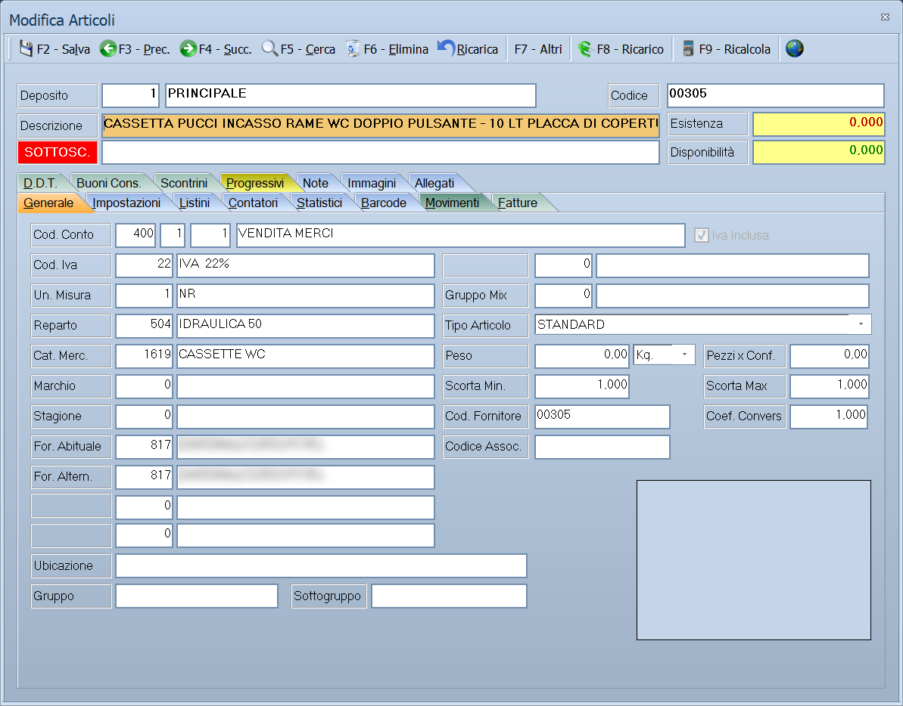

# Anagrafica articoli

Da questa maschera si inseriscono e si aggiornano gli articoli: la
classificazione merceologica, l'aliquota IVA, i listini, i codici a barre, le
scorte e i dati per la vendita al banco. Dalla stessa finestra si consultano i
movimenti di magazzino, i documenti e i progressivi dell'articolo.

!!! info "In sintesi"

    - **Percorso:** Menu ▸ Archivi ▸ Articoli ▸ Inserimento *(oppure* Modifica*)*
    - **Scorciatoia:** nessuna; la maschera si apre dal menu o dal pulsante corrispondente nella barra degli strumenti
    - **Permessi richiesti:** nessun profilo predefinito; **Inserimento** e **Modifica** si abilitano separatamente per ogni utente da [Archivi ▸ Utenti](utenti.md)

---

## A cosa serve

L'articolo è ciò che si compra, si carica, si vende e si conta a inventario.
Ogni riga di documento e ogni movimento di magazzino lo richiama da qui,
riprendendone descrizione, aliquota IVA, unità di misura e prezzo di listino.

Esempio: se imposti qui **Cod. Iva** e **Un. Misura**, ogni riga di fattura che
richiama l'articolo nasce già con quell'aliquota e quell'unità, senza doverle
ripetere.

La maschera lavora sempre su **un deposito alla volta**: quello indicato in
alto, che il programma prende dall'utente collegato o, se non ne ha uno, dal
deposito attivo dell'azienda. Esistenza, disponibilità e progressivi che vedi
sono quelli di quel deposito.

## Prerequisiti

Prima di inserire il primo articolo occorre aver definito:

- le **aliquote IVA**: senza il codice IVA l'articolo non si salva;
- le **unità di misura**;
- i **reparti** e le **categorie merceologiche**, se li usi per classificare;
- almeno un **deposito**.

Sono facoltativi, ma se li usi devono esistere prima: marchi, stagioni,
fornitori, gruppi mix, il piano dei conti e le tabelle libere.

## La maschera

La maschera è divisa in tre parti:

- in alto la **barra dei comandi**;
- sotto la **testata**, sempre visibile, con il deposito su cui stai
  lavorando, il codice, le due righe di descrizione, l'**Esistenza** e la
  **Disponibilità**; quando la giacenza scende sotto la scorta minima compare
  l'indicazione **SOTTOSC.**;
- al centro le **schede**, che occupano il resto della finestra.

Le schede sono queste:

| Scheda | Contenuto |
|---|---|
| **Generale** | Classificazione, IVA, unità di misura, fornitori, scorte. È la scheda che si compila per prima. |
| **Impostazioni** | Dati per la vendita al banco e per il web: colori, PLU, etichette, dati tecnici e ambientali. |
| **Listini** | I prezzi di vendita dell'articolo. |
| **Contatori** | Ultimi acquisti, quantità caricate, scaricate, ordinate e impegnate. |
| **Statistici** | Rimanenze e valori per anno e per sezione. |
| **Barcode** | I codici a barre associati all'articolo. |
| **Alterntaivi** | Gli articoli che possono sostituire questo. |
| **Collegati** | Gli articoli da proporre insieme a questo. |
| **Componenti** | Gli articoli di cui questo è composto. |
| **Fornitori** | I prezzi di acquisto dei diversi fornitori. |
| **Movimenti** | I movimenti di magazzino dell'articolo. |
| **Fatture**, **D.D.T.**, **Pro Forma**, **Bolle**, **Buoni Cons.**, **Ric. Fiscali** | I documenti in cui l'articolo compare, uno per tipo. |
| **Scontrini** | Gli scontrini che contengono l'articolo. |
| **Progressivi** | Quantità acquistate, vendute, caricate e scaricate per data. |
| **Promo Sellout** | Le promozioni di vendita che riguardano l'articolo. |
| **Promo Sellin** | Le promozioni di acquisto. |
| **Tassonomie** | Le classificazioni per il sito web. |
| **Classificazione** | **Solo Megastore.** La classificazione dell'articolo secondo lo schema della distribuzione organizzata. |
| **Listini Taglie**, **Taglie** | **Solo Taglie e Colori.** I prezzi e le giacenze per taglia e colore. |
| **Partite** | **Solo Ortofrutta.** Le partite di merce aperte sull'articolo. |
| **Note** | Le note descrittive dell'articolo, nella lingua selezionata. |
| **Immagini** | Le immagini dell'articolo. |
| **Allegati** | I file collegati all'articolo. |

## Campi

Il programma richiede sempre la **Descrizione** e il **Cod. Iva**. Il
**Reparto** è obbligatorio se così è stato impostato nei dati dell'azienda. Su
ogni installazione l'assistenza può rendere obbligatori anche altri campi della
scheda *Generale*: in quel caso, premendo **F2 - Salva**, il programma non
mostra alcun messaggio — emette un segnale acustico e porta il cursore sul
campo da compilare.

### Testata

| Campo | Obbl. | Descrizione | Valori ammessi |
|---|:---:|---|---|
| Deposito | | Deposito su cui si sta lavorando, con la sua descrizione. Non si modifica da qui. | Impostato all'apertura |
| Codice | | Codice dell'articolo. Lasciandolo vuoto il programma lo genera da solo, ricavandolo da data, fornitore abituale e categoria merceologica. | Fino a 15 caratteri |
| Descrizione | ● | Denominazione dell'articolo, su due righe. La prima è obbligatoria. | Fino a 127 caratteri per riga |
| Esistenza | | Quantità fisicamente presente nel deposito. | Sola lettura |
| Disponibilità | | Esistenza meno la quantità già impegnata. | Sola lettura |

{: .campi }

### Scheda Generale

| Campo | Obbl. | Descrizione | Valori ammessi |
|---|:---:|---|---|
| Cod. Conto | | Conto di ricavo dell'articolo, indicato con mastro, conto e sottoconto. Accanto compare la descrizione e l'indicazione **Iva Inclusa**. | Codici dal piano dei conti |
| Cod. Iva | ● | Aliquota IVA applicata all'articolo. | Codice dall'archivio aliquote |
| Un. Misura | | Unità con cui l'articolo si movimenta. Nella versione Taglie e Colori il campo si chiama **Gru. Taglie** e indica il gruppo di taglie. | Codice dall'archivio unità di misura |
| Reparto | | Reparto di vendita. Obbligatorio se richiesto dai dati dell'azienda. | Codice dall'archivio reparti |
| Cat. Merc. | | Categoria merceologica. | Codice dall'archivio categorie |
| Marchio | | Marca dell'articolo. | Codice dall'archivio marchi |
| Stagione | | Stagione di riferimento. | Codice dall'archivio stagioni |
| For. Abituale | | Fornitore da cui l'articolo si acquista di norma. | Codice dall'archivio fornitori |
| For. Altern. | | Fornitore alternativo. Nella versione Taglie e Colori il campo si chiama **Settore**. | Codice dall'archivio fornitori |
| Tabella 1, Tabella 2, Tabella 3 | | Tre classificazioni libere. Non si chiamano davvero così: ciascuna prende il nome della tabella che le è stata assegnata nei dati dell'azienda, e resta spenta finché non gliene viene assegnata una. Nella versione Bevande la prima si chiama **Cod. Vuoto**. | Codici di tabella |
| Ubicazione | | Posizione dell'articolo in magazzino. | Testo |
| Gruppo, Sottogruppo | | Raggruppamenti liberi dell'articolo. | Fino a 30 caratteri |
| Codice CUN | | Codice unico nazionale. Compare solo se l'azienda è impostata come alimentare. | Fino a 35 caratteri |
| Gruppo Mix | | Gruppo per le promozioni a paniere. | Codice di tabella |
| Tipo Articolo | | Natura dell'articolo per la vendita on line. | STANDARD, PACCHETTO, VIRTUALE (SERVIZI, EBOOK,SOFTWARE, ETC.), VIRTUALE CON VARIANTI |
| Peso | | Peso unitario, con la relativa unità. | Numero, con Gr. / Hg. / Kg. / Q. / T. |
| Pezzi x Conf. | | Quanti pezzi contiene una confezione. | Numero |
| Scorta Min. | | Sotto questa quantità l'articolo è segnalato **SOTTOSC.** | Numero |
| Scorta Max | | Quantità massima da tenere a magazzino. | Numero |
| Cod. Fornitore | | Codice con cui il fornitore abituale identifica l'articolo. | Fino a 25 caratteri |
| Coef. Convers. | | Coefficiente per convertire l'unità del fornitore nella propria. | Numero |
| Codice Assoc. | | Codice dell'articolo presso l'associazione o il consorzio. | Testo |
| Web Id | | Identificativo dell'articolo sul sito web. Compare solo se nei dati dell'azienda è attiva la gestione web, e non è modificabile. | Numero |

{: .campi }

Sopra le schede compaiono, quando ricorrono, le indicazioni **PROMO** —
l'articolo è in promozione — e **Fuori Ass.** — l'articolo è fuori
assortimento.

### Scheda Impostazioni

Raccoglie i dati che non servono al magazzino ma alla vendita e al web,
divisi in riquadri.

| Riquadro | Campi |
|---|---|
| **Impostazioni POS** | **Colore Sfondo (Inizio)**, **Colore Sfondo (Fine)**, **Colore Testo**, **Colore Trasparenza**, **Posizione POS**, **Posiz. POS Preferiti**, **Posiz. POS in Evidenza**, e le caselle **Nascondi Descrizione Testo**, **Applica Trasparenza**, **Preferiti**, **In Evidenza**, **Gift Card** |
| Punti fedeltà | **Punti Erogati**, **Max Punti Erogati**, **Punti Detratti**. Nella versione Fiscali il riquadro non compare. |
| Etichette e bilance | **Dati su etichetta** (CODICE, CODICE + PESO, CODICE + PREZZO, CODICE + PREZZO Q.TA = 1), **Num. PLU**, **Bancone**, **Peso Sgocciolato**, **% Calo Peso**, **Formato Barcode** |
| **Dati Tecnici** | **Tensione (V)**, **Consumo (W)**, **Grado Protezione**, **Classe Energetica**, **Capacità**, **Lunghezza (cm)**, **Larghezza (cm)**, **Altezza (cm)**. Nella versione Taglie e Colori il riquadro non compare. |
| Adempimenti | **730 Precompilato**, **Conai**, **RAEE**, **Contrassegni**, **Accise** |
| Caselle per il web e il magazzino | **Includi WEB**, **Nascondi Prezzo WEB**, **Escludi da Inventario**, **Vendita a Quotazione**, **Escludi da Trasferimenti**, **Sostanza Zuccherina** |

Due caselle dello stesso riquadro cambiano da una versione all'altra:

| Casella | Dove compare |
|---|---|
| **Abilita Stampa DAS** | Compilabile **solo nella versione Energy**. Nella versione Ortofrutta la stessa casella si chiama **Partita Automatica**. |
| **Oro Usato** | **Solo Oreficerie.** Nella versione Ortofrutta la stessa casella si chiama **Passaporto Fitosanitario**. Nelle altre versioni non compare. |

### Schede di consultazione

Le schede seguenti non si compilano: mostrano dati registrati altrove. Su
quelle dei documenti e dei movimenti, il doppio clic o ++f10++ su una riga apre
il documento che l'ha generata.

| Scheda | Colonne |
|---|---|
| **Listini** | Codice, Descrizione, Prezzo, Prezzo Netto |
| **Contatori** | Data Ultimo Acquisto, Ultimo Prezzo d' Acquisto, Data Penultimo Acquisto, Penult. Prezzo d' Acquisto, Q.ta Carichi e Scarichi N/V Clienti e Fornitori, Q.ta Ordinata da Clienti e a Fornitori, Q.ta Cali e Scarti, Q.ta in Lavorazione, %Ric., %Marg. e i tre listini |
| **Statistici** | Rimanenza Iniziale, Caricata, Scaricata, Resi a Fornitore, Resa da Clienti, Impegnato, in quantità e valore |
| **Alterntaivi** | Cod. Principale, Cod. Alternativo, Descrizione |
| **Collegati** | Codice, Descrizione |
| **Componenti** | Codice, Descrizione, Mis., Quantità |
| **Fornitori** | Cod.For., Fornitore, Prezzo, Netto, Codice Art.For. |
| **Movimenti** | Anno, Data, Tipo, Causale, Sez., Cliente/Fornitore, Quantità, Esistenza, Prezzo Unit., Totale, Serial |
| **Fatture**, **D.D.T.**, **Pro Forma**, **Bolle**, **Buoni Cons.**, **Ric. Fiscali** | Anno, Numero, Data, Sez., Cliente, Quantità, Prezzo Unit., Totale, Serial |
| **Scontrini** | Anno, Numero, Data, Cliente, Quantità, Prezzo Unit., Totale, Matricola, Taglia, Colore |
| **Progressivi** | Data, Q.tà Acquistata, Q.tà Venduta, Rimanenza Iniz., Q.tà Caricata, Q.tà Scaricata, Saldo |

Le schede *Contatori* e *Statistici* hanno in alto il campo **Sezione**, che
permette di vedere i dati di una sola sezione anziché di tutte.

## Pulsanti e comandi

| Comando | Scorciatoia | Effetto |
|---|---|---|
| **F2 - Salva** | ++f2++ | Registra l'articolo dopo i controlli. |
| **F3 - Prec.** | ++f3++ | Passa all'articolo precedente nell'ordinamento in uso. |
| **F4 - Succ.** | ++f4++ | Passa all'articolo successivo. |
| **F5 - Cerca** | ++f5++ | Apre la finestra **Cerca Articoli**. |
| **F6 - Elimina** | ++f6++ | Marca l'articolo come cancellato; su un articolo già marcato lo elimina definitivamente. |
| **Ricarica** | | Rilegge l'articolo dall'archivio, abbandonando le modifiche non salvate. |
| **Nuovo** | | Solo in inserimento: svuota la maschera per l'articolo successivo. |
| **F7 - Altri** | ++f7++ | Apre il menu descritto sotto. |
| **F8 - Ricarico** | ++f8++ | Imposta il ricarico sull'articolo. |
| **F9 - Ricalcola** | ++f9++ | Ricalcola i contatori dell'articolo. |
| **Seleziona Lingua** | | Sceglie la lingua in cui scrivere descrizione e note. |

Il menu **F7 - Altri** contiene: **Codici Articolo Fornitori**, **Vendite**,
**Acquisti**, **Andamento**, **Note**, **Promozioni Acquisto**, **Riepilogo
Depositi**, **Dati Articoli Fiscali**, **Ingredienti** e **Competenze su
Vendite**; vi si aggiungono **Gestione Lotti** e **Gestione Matricole** se
quelle gestioni sono attive per l'azienda e per l'articolo. Le voci
**Acquisti**, **Andamento** e **Promozioni Acquisto** non compaiono agli utenti
a cui i costi sono preclusi.

Valgono inoltre in tutta la maschera:

| Comando | Scorciatoia | Effetto |
|---|---|---|
| Guida | ++f1++ | Apre la pagina di guida dell'operazione in corso. |
| Elenco valori | ++f10++, ++space++ o doppio clic | Sui campi che richiamano un archivio, apre l'elenco da cui scegliere. |
| Consultazione | ++f11++ | Apre la finestra **Consultazione**. |
| Calcolatrice | ++f12++ | Apre la calcolatrice. |
| Campo successivo | ++enter++ o ++down++ | Sposta il cursore sul campo seguente. |
| Campo precedente | ++up++ | Sposta il cursore sul campo precedente. |
| Chiusura | ++esc++ | Chiude la maschera. |

## Come si fa

### Inserire un nuovo articolo

1. Apri **Menu ▸ Archivi ▸ Articoli ▸ Inserimento**.
2. Lascia il **Codice** vuoto per farlo generare al programma, oppure
   digitane uno tuo.
3. Scrivi la **Descrizione**: la prima riga è obbligatoria.
4. Nella scheda *Generale* indica il **Cod. Iva**, che serve per salvare, e la
   **Un. Misura**.
5. Classifica l'articolo con **Reparto**, **Cat. Merc.**, **Marchio** e
   **Stagione**, per quanto ti serve.
6. Indica il **For. Abituale** e il **Cod. Fornitore** con cui lo ordini.
7. Se gestisci le scorte, compila **Scorta Min.** e **Scorta Max**.
8. Premi **F2 - Salva**, poi **Nuovo** per passare all'articolo successivo.

### Ritrovare e modificare un articolo

1. Apri **Menu ▸ Archivi ▸ Articoli ▸ Modifica**.
2. Premi **F5 - Cerca**.
3. Nella finestra **Cerca Articoli** digita quello che sai: **Codice**,
   **Descrizione**, **Cod. Fornitore**, **Fornitore**, **Cat. Merc.**,
   **Stagione**, **Gruppo**, **Peso** o **Banco - PLU**.
4. Scegli la riga e conferma: l'articolo viene caricato nella maschera.
5. Correggi i dati e premi **F2 - Salva**.

### Scrivere la descrizione in un'altra lingua

1. Carica l'articolo.
2. Premi il pulsante **Seleziona Lingua** nella barra dei comandi e scegli la
   lingua.
3. Riscrivi **Descrizione** e, nella scheda *Note*, il testo descrittivo.
4. Premi **F2 - Salva**. La descrizione in italiano resta obbligatoria: se la
   cancelli, il programma non salva.

### Vedere dove è finito un articolo

1. Carica l'articolo.
2. Apri la scheda *Movimenti* per l'elenco completo dei carichi e degli
   scarichi, oppure la scheda del tipo di documento che ti interessa.
3. Fai doppio clic sulla riga, oppure premi ++f10++: il documento si apre.

### Eliminare un articolo

1. Carica l'articolo da eliminare.
2. Premi **F6 - Elimina** e conferma: l'articolo viene **marcato come
   cancellato**, non rimosso.
3. Per toglierlo davvero dall'archivio, ricaricalo e premi di nuovo
   **F6 - Elimina**.

## Controlli e messaggi

| Messaggio | Causa | Cosa fare |
|---|---|---|
| *(nessun messaggio, solo un segnale acustico)* | Manca la **Descrizione**, manca il **Cod. Iva**, manca il **Reparto** quando è richiesto, oppure è vuoto uno dei campi resi obbligatori su questa installazione. | Guarda dove si è posizionato il cursore: è il campo da compilare. |
| *La descrizione articolo in italiano e' obbligatoria!* | Stai lavorando in una lingua diversa dall'italiano e la descrizione italiana è vuota. | Torna all'italiano con **Seleziona Lingua** e scrivi la descrizione. |
| *Codice Articolo Presente in Archivio.* | Il codice digitato è già di un altro articolo. | Usa un codice diverso, o lascialo vuoto per farlo generare al programma. |
| *Codice Articolo inferiore al minimo consentito (…)!* — *Codice Articolo superiore al massimo consentito (…)!* | Il codice è fuori dall'intervallo previsto per la generazione automatica dei codici. | Usa un codice compreso nell'intervallo indicato dal messaggio. |
| *Accoppiata Bancone - PLU gia' presente in Archivio ! Vuoi Correggere ?* | Un altro articolo ha già quel numero di PLU su quel bancone. | Rispondi **Sì** e cambia **Num. PLU** o **Bancone** nella scheda *Impostazioni*. |
| *Confermi la cancellazione...* | Conferma richiesta da **F6 - Elimina** sulla prima eliminazione. | Rispondi **Sì** per marcare l'articolo come cancellato. |
| *Confermi la Cancellazione....* | Conferma richiesta dalla seconda eliminazione, quella definitiva. | Rispondi **Sì** per togliere l'articolo dall'archivio. |
| *Non è possibile eliminare il record pochè utilizzato in alcuni record del database.* | Stai eliminando definitivamente un articolo che compare in righe di documento, movimenti, distinte base, promozioni o inventari. | Non è eliminabile: lascialo marcato come cancellato. |
| *Deposito non trovato in archivio!* | L'utente collegato punta a un deposito che non esiste più. | Segnala all'assistenza: va corretto il deposito dell'utente o quello attivo dell'azienda. |
| *Il record è stato modificato da un altro nodo della rete.* | Un altro utente ha salvato lo stesso articolo mentre lo modificavi. | Premi **Ricarica**, verifica cosa è cambiato e rifai le tue modifiche. |
| *Il record è stato cancellato da un altro nodo della rete.* | Un altro utente ha eliminato l'articolo mentre lo modificavi. | La maschera si chiude: non c'è più nulla da salvare. |

## Note

!!! warning "Attenzione"

    **F6 - Elimina** non cancella subito: la prima volta **marca** l'articolo
    come cancellato, la seconda lo elimina davvero. A seconda di come è
    impostato il tuo utente, un articolo marcato può continuare a comparire
    negli elenchi.

    **F7 - Altri** salva l'articolo prima di aprire il menu. Se hai fatto
    modifiche che non volevi registrare, annullale con **Ricarica** prima di
    premere ++f7++.

    ++esc++ chiude la maschera senza chiedere conferma e senza salvare: le
    modifiche fatte dopo l'ultimo **F2 - Salva** vanno perse.

    Esistenza, disponibilità, contatori e progressivi si riferiscono **al solo
    deposito indicato in testata**. Per il quadro di tutti i depositi usa
    **F7 - Altri ▸ Riepilogo Depositi**.

!!! note "Nota"

    La linguetta della settima scheda si legge **Alterntaivi**: è un refuso del
    programma, la scheda contiene gli articoli *alternativi*.

!!! note "Da dove viene il codice generato in automatico"

    Lasciando vuoto il **Codice**, il programma ne assegna uno secondo il
    formato scelto nella scheda **Codici Articoli** delle
    [ditte](ditte.md): `NESSUN CODICE`, `EAN`, `SERIALE DA ARTICOLI` o
    `SERIALE DA CONTATORE`. Alcune versioni ne aggiungono altri — per esempio
    uno composto da **anno, mese, codice del fornitore e progressivo**, un altro
    che parte dalla **categoria merceologica**.

    Il formato non si sceglie articolo per articolo: è un'impostazione della
    ditta, e va decisa prima di cominciare a caricare l'archivio. I messaggi
    *Codice Articolo inferiore/superiore al…* dipendono dall'intervallo
    **Cod. Iniziale / Cod. Finale** impostato lì.

!!! note "I campi obbligatori si configurano per installazione"

    Oltre a quelli segnati in questa pagina, l'elenco dei campi che il programma
    pretende può essere allungato per singola installazione, con un file di
    configurazione (`cfgrticoli_check.ini`, sezione `[CHECK]`) che l'assistenza
    predispone. Quando manca uno di quei campi **il programma non dice nulla**:
    emette un segnale acustico e sposta il cursore. Se il salvataggio si rifiuta
    senza spiegazioni, guarda dov'è finito il cursore.

<!-- DA VERIFICARE: quali chiavi ammette la sezione [CHECK] di articoli_check.ini. -->

## Vedi anche

- [Anagrafica clienti](anagrafica-clienti.md)
- [Anagrafica fornitori](anagrafica-fornitori.md)
- [Documento di vendita](../vendite/documento-di-vendita.md)
