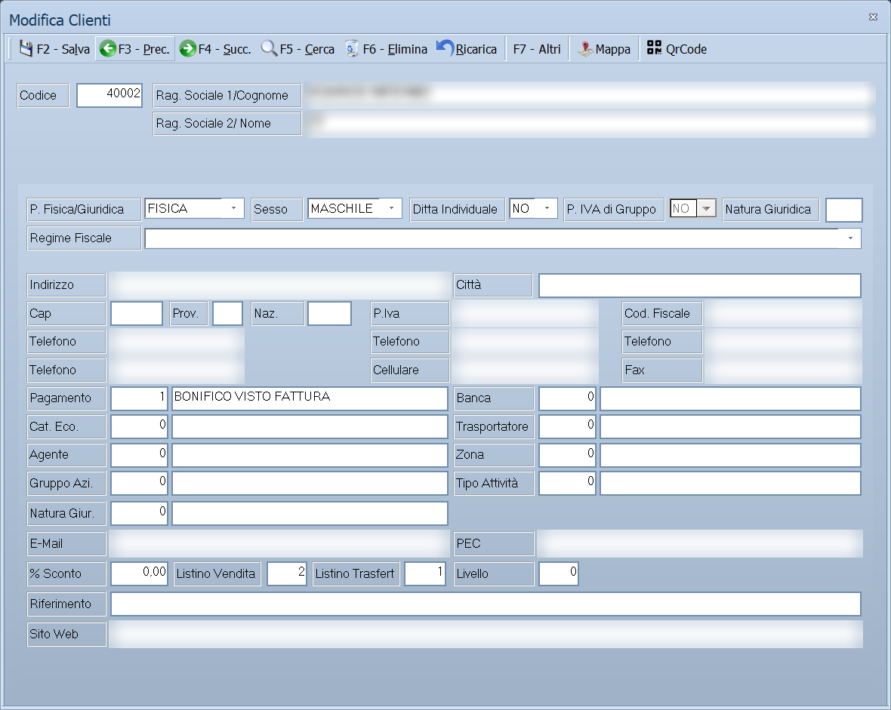

# Anagrafica clienti

Da questa maschera si inseriscono e si aggiornano i clienti dell'azienda: i
dati anagrafici e fiscali usati in fattura, le condizioni commerciali proposte
nei documenti di vendita e i dati richiesti dalla fatturazione elettronica.
Dalla stessa finestra si consultano i documenti emessi, le scadenze, gli
scontrini e i movimenti contabili del cliente.

!!! info "In sintesi"

    - **Percorso:** Menu ▸ Archivi ▸ Clienti ▸ Inserimento *(oppure* Modifica*)*
    - **Scorciatoia:** nessuna; la maschera si apre dal menu o dal pulsante corrispondente nella barra degli strumenti
    - **Permessi richiesti:** nessun profilo predefinito; **Inserimento** e **Modifica** si abilitano separatamente per ogni utente da [Archivi ▸ Utenti](utenti.md)

---

## A cosa serve

Il cliente è il punto di partenza di ogni documento di vendita. Quando emetti
una fattura, un DDT o un ordine, Facile riprende da qui la ragione sociale, i
dati fiscali, il pagamento, il listino e l'agente: compilare bene l'anagrafica
una volta evita di correggere gli stessi dati su ogni documento.

Esempio: se imposti qui **Listino Vendita** e **% Sconto**, ogni documento
intestato a questo cliente nasce già con quel listino e quello sconto, salvo
modifica sul singolo documento.

La maschera si apre in due modi. Con **Inserimento** parte vuota, con il codice
successivo all'ultimo utilizzato, e mostra solo le schede *Generale*,
*Impostazioni*, *Fidelity* e *Note*: le altre riguardano dati che un cliente
appena creato non può ancora avere. Con **Modifica** si apre sull'ultimo
cliente inserito, con tutte le schede e i comandi di navigazione.

## Prerequisiti

Prima di inserire il primo cliente occorre aver definito:

- il [tipo di pagamento](../contabilita/tipi-di-pagamento.md): il programma
  propone quello di codice 1 su ogni nuovo cliente;
- i **listini di vendita**: quello proposto viene preso dai dati dell'azienda;
- l'archivio dei **comuni**, da cui si compilano in automatico provincia e CAP;
- l'archivio delle **nazioni**, richiamato dai campi **Naz.** e **Lingua Doc.**

Sono facoltativi, ma se li usi devono esistere prima: banche, categorie
economiche, trasportatori, agenti, zone, gruppi aziendali, causali di
magazzino e contabili, canali di vendita e le tabelle **Tipo Attività** e
**Natura Giur.**

## La maschera

La maschera è divisa in tre parti:

- in alto la **barra dei comandi**;
- sotto la **testata**, sempre visibile, con codice e ragione sociale del
  cliente su cui stai lavorando;
- al centro le **schede**, che occupano il resto della finestra.

Le schede sono queste:

| Scheda | Contenuto |
|---|---|
| **Generale** | Indirizzo, recapiti, dati fiscali e condizioni commerciali. È la scheda che si compila. |
| **Impostazioni** | Fatturazione elettronica, tipo di documento predefinito, spese e provvigioni. |
| **Totali** | Saldi e progressivi per sezione e per anno. Sola lettura. |
| **Fidelity** | Le tessere fedeltà intestate al cliente. |
| **Destinazioni Diverse** | Le sedi di consegna alternative. |
| **Luoghi Carico** | I luoghi di carico della merce. |
| **Scadenze** | Le [partite](../../appendici/glossario.md#partita) aperte verso il cliente. |
| **Contabilita'** | Le registrazioni di prima nota che lo riguardano. |
| **Acconti** | Le registrazioni di acconto. |
| **Articoli** | Gli articoli che il cliente ha acquistato. |
| **Fatture**, **D.D.T.**, **Pro Forma**, **Bolle**, **Buoni Cons.**, **Ric. Fiscali**, **Ordini**, **Preventivi** | I documenti emessi, uno per tipo. |
| **Scontrini** | Gli scontrini battuti al cliente. |
| **Banchi** | Le attrezzature consegnate al cliente. |
| **Cond. Contr.** | Le condizioni contrattuali concordate. |
| **Commesse** | Le commesse aperte per il cliente. |
| **Margine Vendite** | **Solo Ortofrutta.** Il margine realizzato sulle vendite al cliente. |
| **Licenze** | **Solo RSA Office.** Le licenze software intestate al cliente. |
| **Tickets**, **Attivita'**, **Prodotti** | **Solo CRM.** Le segnalazioni aperte, le attività svolte e i prodotti installati presso il cliente. |
| **Note** | Una nota libera, di lunghezza non prefissata. |
| **Allegati** | I file collegati al cliente. |

Le schede dei documenti, delle scadenze, della contabilità, degli acconti,
degli articoli e delle commesse compaiono solo se hai il permesso di aprire
l'archivio corrispondente **e** se quell'archivio contiene almeno un record: se
una di queste schede non c'è, non è un guasto.

## Campi

Il programma richiede sempre e comunque **Codice** e **Rag. Sociale 1/Cognome**.
Su ogni installazione l'assistenza può rendere obbligatori anche altri campi
della scheda *Generale*: in quel caso, premendo **F2 - Salva**, il programma
non mostra alcun messaggio — emette un segnale acustico e porta il cursore sul
campo da compilare.

<!-- DA VERIFICARE: l'elenco dei campi resi obbligatori è in un file di configurazione dell'installazione. Va documentato in una pagina per l'amministratore, o basta dire all'utente che l'elenco lo decide l'assistenza? -->

### Testata

| Campo | Obbl. | Descrizione | Valori ammessi |
|---|:---:|---|---|
| Codice | ● | Identificativo del cliente. In inserimento il programma propone il primo codice libero; puoi sostituirlo. In modifica non è modificabile. | Da 1 a 99999999 |
| Rag. Sociale 1/Cognome | ● | Denominazione del cliente, o il cognome se è una persona fisica. | Fino a 45 caratteri |
| Rag. Sociale 2/ Nome | | Seconda riga della denominazione, o il nome se è una persona fisica. | Fino a 45 caratteri |

{: .campi }

### Scheda Generale

| Campo | Obbl. | Descrizione | Valori ammessi |
|---|:---:|---|---|
| P. Fisica/Giuridica | | Natura del soggetto. Su un nuovo cliente parte da *FISICA*. | FISICA, GIURIDICA |
| Sesso | | Compilabile solo per le persone fisiche. | (vuoto), MASCHILE, FEMMINILE |
| Ditta Individuale | | Segnala che il soggetto è una ditta individuale. | NO, SI |
| P. IVA di Gruppo | | Segnala che il cliente aderisce a un gruppo IVA. | NO, SI |
| Natura Giuridica | | Codice della forma giuridica usato dalla fattura elettronica: da questo dipende se il capitale sociale e il socio unico vengono trasmessi. | 2 caratteri |
| Regime Fiscale | | Regime fiscale dichiarato dal cliente. | Da elenco (ORDINARIO, REGIME FORFETTARIO, …) |
| Indirizzo | | Via e numero civico della sede. | Fino a 100 caratteri |
| Città | | Digitando un comune presente in archivio, provincia e CAP si compilano da soli. | Fino a 30 caratteri |
| Cap | | Codice di avviamento postale. | Solo cifre, fino a 5 |
| Prov. | | Sigla della provincia. | 2 caratteri |
| Naz. | | Codice della nazione. | Fino a 4 caratteri, dall'archivio nazioni |
| P.Iva | | Partita IVA. Sui soggetti italiani il programma ne verifica il codice di controllo al salvataggio. | Fino a 28 caratteri |
| Cod. Fiscale | | Codice fiscale. Il programma ne verifica il codice di controllo e ne ricava la data di nascita. | Fino a 16 caratteri |
| Telefono | | Quattro campi indipendenti per altrettanti numeri. | Fino a 14 cifre ciascuno |
| Cellulare | | Numero di cellulare. | Fino a 14 cifre |
| Fax | | Numero di fax. | Fino a 14 cifre |
| Pagamento | | Condizione di pagamento proposta nei documenti. Accanto compare la descrizione. | Codice dall'archivio pagamenti |
| Banca | | Banca d'appoggio del cliente. | Codice dall'archivio banche |
| Cat. Eco. | | Categoria economica, usata per raggruppare i clienti nelle statistiche. | Codice dall'archivio categorie economiche |
| Trasportatore | | Vettore abituale. | Codice dall'archivio trasportatori |
| Agente | | Agente che segue il cliente. | Codice dall'archivio agenti |
| Zona | | Zona geografica o commerciale. | Codice dall'archivio zone |
| Gruppo Azi. | | Gruppo aziendale a cui il cliente appartiene. | Codice dall'archivio gruppi |
| Tipo Attività | | Attività svolta dal cliente. | Codice di tabella |
| Natura Giur. | | Forma giuridica scelta dalla tabella, per le statistiche. | Codice di tabella |
| E-Mail | | Indirizzo di posta ordinaria. | Fino a 45 caratteri, in minuscolo |
| PEC | | Indirizzo di posta certificata. | Fino a 60 caratteri, in minuscolo |
| % Sconto | | Sconto abituale concesso al cliente. | Percentuale |
| Listino Vendita | | Listino applicato nei documenti di vendita. | Da 1 a 3 |
| Listino Trasfert | | Listino applicato ai trasferimenti. | Da 1 a 3 |
| Livello | | Livello di prezzo del cliente. Nella versione Studio il campo non compare. | Numero |
| Riferimento | | Persona o ufficio da contattare presso il cliente. | Fino a 50 caratteri |
| Sito Web | | Sito internet del cliente. | Fino a 80 caratteri, in minuscolo |

{: .campi }

### Scheda Impostazioni

| Campo | Obbl. | Descrizione | Valori ammessi |
|---|:---:|---|---|
| Raggruppa DDT in Fatturazione Differita | | Riunisce in una sola fattura i DDT del periodo. | Casella |
| Escludi Stat. Fatturato - Vendite | | Tiene il cliente fuori dalle statistiche di fatturato. | Casella |
| Addebita Bolli | | Aggiunge l'imposta di bollo ai documenti. | Casella |
| Addebita Spese | | Aggiunge le spese ai documenti. | Casella |
| Escludi da esportazione Cerved PayLine | | Esclude il cliente dall'esportazione verso Cerved PayLine. | Casella |
| Escludi da Comunicazioni Iva | | Tiene il cliente fuori dall'elenco IVA. | Casella |
| Note Credito PA in negativo | | Emette le note di credito verso la Pubblica Amministrazione con importi negativi. | Casella |
| Addebita Cauzioni | | **Solo Bevande.** Aggiunge le cauzioni sui vuoti ai documenti. | Casella |
| Cod. Univoco Ufficio - Pubblica Amministraz. | | Codice IPA, per i clienti della Pubblica Amministrazione. | Fino a 7 caratteri |
| Cod. Destinatario - Privati | | Codice destinatario SDI, per i clienti privati. | Fino a 7 caratteri |
| Formato | | Tracciato con cui produrre la fattura elettronica. | STANDARD, CARREFOUR, CONAD AREA1, CONAD AREA2, METRO, CARTA DEL DOCENTE |
| Ufficio U.R.I. | | Provincia dell'ufficio del registro delle imprese. | 2 caratteri |
| Numero R.E.A. | | Numero di iscrizione al repertorio economico amministrativo. | Fino a 20 caratteri |
| Capitale Sociale | | Capitale sociale dichiarato. | Importo |
| Non Iscritto R.E.A. | | Da spuntare per i soggetti non iscritti al R.E.A. | Casella |
| Tipo Doc. Predefinito | | Documento proposto quando si vende a questo cliente. | (vuoto), FATTURA, FATTURA ACC., DOC. TRASPORTO, BOLLA ACCOMP., BUONO CONS., RICEVUTA FISCALE, FATTURA PRO FORMA |
| Trasporto a Cura | | Chi si occupa del trasporto. | (vuoto), VETTORE, MITTENTE, DESTINATARIO |
| Lingua Doc. | | Nazione che determina la lingua dei documenti. | Fino a 4 caratteri, dall'archivio nazioni |
| Codice IVA | | Aliquota IVA proposta nei documenti. | Codice dall'archivio aliquote |
| Scagione Provvog. | | Scaglione di provvigione applicato all'agente. | Numero |
| Password | | Password del cliente per l'accesso ai servizi web. | Fino a 20 caratteri |
| Cod. Aggancio | | Codice con cui il cliente viene riconosciuto nei tracciati esterni. | Fino a 6 caratteri |
| Aggancio Fornitore | | Codice del fornitore corrispondente, quando lo stesso soggetto è anche fornitore. | Codice dall'archivio fornitori |
| Lavorazione | | Costo o percentuale di lavorazione concordata. | Numero |
| Data Acquisizione | | Data in cui il cliente è stato acquisito. | Data |
| Data Cessazione | | Data in cui il rapporto è cessato. | Data |
| In Liquidazione | | Segnala che la società è in liquidazione. Viene trasmesso in fattura elettronica. | (vuoto), NO, SI |
| Causale Cessazione | | Motivo della cessazione del rapporto. | Codice di tabella |
| Causale Magaz. DDT | | Causale di magazzino usata nei DDT. | Codice dall'archivio causali di magazzino |
| Causale Contabile | | Causale proposta nelle registrazioni di prima nota. | Codice dall'archivio causali contabili |
| Canale Vendita | | Canale commerciale a cui il cliente appartiene. | Codice dall'archivio canali |
| Spese Stoccaggio, Spese Trasporto, Altre Spese | | Spese addebitate al cliente. Nella versione Ortofrutta i tre campi si chiamano **% Incid. Stoccaggio**, **% Incid. Trasporto** e **% Incid. Contratto** e si esprimono in percentuale, da 0 a 100. | Importi |
| Normale, Transfert, C.S. Vendita, C.S. Trasfert | | Le quattro percentuali di provvigione, nel riquadro **% Provvigioni**. | Percentuali |
| Crediti Acquistati, Crediti Utilizzati, Crediti Utilizzabili Offilne, Num. Crediti Omaggio, Data Crediti Omaggio, Fine Data Xml -> PDF | | **Solo RSA Office.** I crediti del servizio di invio delle fatture elettroniche, nel riquadro **Crediti Invia Fatture Elettroniche**. Nelle altre versioni il riquadro non compare. | Numeri e date |

{: .campi }

!!! warning "Attenzione"

    **Cod. Univoco Ufficio** e **Cod. Destinatario** si escludono a vicenda: se
    li compili entrambi, il salvataggio si ferma. Usa il primo per i clienti
    della Pubblica Amministrazione, il secondo per tutti gli altri.

### Schede di consultazione

Le schede seguenti non si compilano: mostrano dati registrati altrove. Su
tutte, il doppio clic o ++f10++ su una riga apre il documento che l'ha
generata.

| Scheda | Colonne |
|---|---|
| **Totali** | Sezione, Anno, Dare, Avere, Saldo, Imponibile, Imposta, Esente, N° Fatture, N° Note Cred., N° Insoluti, Tot. Insoluti |
| **Fidelity** | N° Tessera, Cognome e Nome |
| **Destinazioni Diverse**, **Luoghi Carico** | Codice, Ragione Sociale, Città, Indirizzo |
| **Scadenze** | Numero, Data, Num.Fattura, Data Fattura, Tot.Fattura, Importo |
| **Contabilita'**, **Acconti** | Data, Numero Doc., Data Doc., Sez., Descrizione, Dare, Avere, Saldo |
| **Articoli** | Anno, Data, Codice, Descrizione, Quantità, Prezzo Unit., Totale, Serial |
| **Fatture**, **D.D.T.**, **Pro Forma**, **Bolle**, **Buoni Cons.**, **Ric. Fiscali**, **Ordini**, **Preventivi** | Anno, Numero, Data, Stato, Agente, Cliente, Totale |
| **Scontrini** | Anno, Numero, Data, Operatore, Totale |
| **Banchi** | Matricola, Marca, Categoria, Modello, Tipo, Stato, Num. D.D.T., Data D.D.T. |
| **Commesse** | Numero, Data, Descrizione |

Le schede *Destinazioni Diverse* e *Luoghi Carico* hanno in più i pulsanti per
inserire, modificare, cancellare e stampare le righe.

## Pulsanti e comandi

| Comando | Scorciatoia | Effetto |
|---|---|---|
| **F2 - Salva** | ++f2++ | Registra il cliente dopo i controlli. In inserimento, subito dopo il salvataggio la maschera si svuota per il cliente successivo. |
| **F3 - Prec.** | ++f3++ | Passa al cliente precedente nell'ordinamento in uso. |
| **F4 - Succ.** | ++f4++ | Passa al cliente successivo. |
| **F5 - Cerca** | ++f5++ | Apre la finestra **Cerca Clienti**. |
| **F6 - Elimina** | ++f6++ | Cancella il cliente, previa conferma. |
| **Ricarica** | | Rilegge il cliente dall'archivio, abbandonando le modifiche non salvate. |
| **F7 - Altri** | ++f7++ | Apre il menu con **Note**, **Collaboratori**, **Titolare/Rappr. Legale**, **Autorizzazione Trattamento Dati** e, se il modulo è previsto, **Modulo Fidejussione**. Vi si aggiungono **Delegati** nella versione Fiscali e **Dati Trasmissione Agenzia Dogane** nella versione Energy. Nella versione Studio il menu è diverso: contiene **Altri Dati Cliente** e **Autorizzazione Trattamento Dati**. |
| **Mappa** | | Calcola la posizione del cliente dall'indirizzo e la mostra sulla mappa. |
| **QrCode** | | Acquisisce i dati anagrafici dal QR code dell'Agenzia delle Entrate. |

Valgono inoltre in tutta la maschera:

| Comando | Scorciatoia | Effetto |
|---|---|---|
| Guida | ++f1++ | Apre la pagina di guida dell'operazione in corso. |
| Elenco valori | ++f10++, ++space++ o doppio clic | Sui campi che richiamano un archivio, apre l'elenco da cui scegliere. |
| Consultazione | ++f11++ | Apre la finestra **Consultazione**. |
| Calcolatrice | ++f12++ | Apre la calcolatrice. |
| Campo successivo | ++enter++ o ++down++ | Sposta il cursore sul campo seguente. |
| Campo precedente | ++up++ | Sposta il cursore sul campo precedente. |
| Chiusura | ++esc++ | Chiude la maschera. |

## Come si fa

### Inserire un nuovo cliente

1. Apri **Menu ▸ Archivi ▸ Clienti ▸ Inserimento**.
2. Lascia il **Codice** proposto, oppure digitane uno diverso.
3. Compila **Rag. Sociale 1/Cognome**, e **Rag. Sociale 2/ Nome** se la
   denominazione non entra in una riga sola.
4. Nella scheda *Generale* scegli **P. Fisica/Giuridica**, poi indica
   **Indirizzo** e **Città**: alla conferma del comune, **Prov.** e **Cap** si
   compilano da soli.
5. Inserisci **P.Iva** e **Cod. Fiscale**.
6. Controlla **Pagamento**, **Listino Vendita** e **% Sconto**: sono le
   condizioni che i documenti riprenderanno.
7. Passa alla scheda *Impostazioni* e compila **Cod. Destinatario - Privati**
   *oppure* **Cod. Univoco Ufficio - Pubblica Amministraz.**, mai entrambi.
8. Premi **F2 - Salva**. Il programma chiede se stampare l'autorizzazione al
   trattamento dei dati, poi svuota la maschera per l'inserimento successivo.

### Ritrovare e modificare un cliente

1. Apri **Menu ▸ Archivi ▸ Clienti ▸ Modifica**: la maschera si apre
   sull'ultimo cliente inserito.
2. Premi **F5 - Cerca**.
3. Nella finestra **Cerca Clienti** digita quello che sai: **Codice**,
   **Partita IVA**, **Cod. Fiscale**, **Fidelity Card**, **Email**,
   **Telefono**, **Cellulare**, **Città** o **Descrizione**.
4. Scegli la riga e conferma: il cliente viene caricato nella maschera.
5. Correggi i dati e premi **F2 - Salva**.

### Compilare i dati per la fattura elettronica

1. Carica il cliente e apri la scheda *Impostazioni*.
2. Compila **Cod. Destinatario - Privati**, oppure **Cod. Univoco Ufficio -
   Pubblica Amministraz.** se il cliente è un ente pubblico.
3. Scegli il **Formato** se il cliente richiede un tracciato particolare.
4. Torna alla scheda *Generale* e indica **Regime Fiscale** e **Natura
   Giuridica**.
5. Se il cliente è iscritto al R.E.A., compila **Ufficio U.R.I.**, **Numero
   R.E.A.** e **Capitale Sociale**; altrimenti spunta **Non Iscritto R.E.A.**
6. Premi **F2 - Salva**.

### Consultare i documenti di un cliente

1. Carica il cliente.
2. Apri la scheda del tipo di documento che ti interessa — *Fatture*,
   *D.D.T.*, *Ordini* e così via.
3. Fai doppio clic sulla riga, oppure premi ++f10++: il documento si apre.
4. Chiudendolo torni alla scheda, con la riga aggiornata.

### Eliminare un cliente

1. Carica il cliente da eliminare.
2. Premi **F6 - Elimina**.
3. Rispondi **Sì** alla richiesta di conferma.
4. La maschera si posiziona sul cliente successivo. Se non ce ne sono altri,
   si chiude.

## Controlli e messaggi

| Messaggio | Causa | Cosa fare |
|---|---|---|
| *(nessun messaggio, solo un segnale acustico)* | Manca il **Codice**, manca la **Rag. Sociale 1/Cognome**, oppure è vuoto uno dei campi resi obbligatori su questa installazione. | Guarda dove si è posizionato il cursore: è il campo da compilare. |
| *Sono entrambi presenti sia il codice IPA che il codice Destinatario, Indicarne solo uno.* | Nella scheda *Impostazioni* sono compilati tutti e due. | Cancella quello che non serve: IPA per la Pubblica Amministrazione, Destinatario per i privati. |
| *Attenzione! Non é stato impostato alcun listino. Nelle vendite sarà preso come prezzo di riferimento il prezzo di acquisto. Vuoi Continuare?* | **Listino Vendita** è a zero. | Rispondi **No** e imposta un listino, a meno che tu non voglia davvero vendere al prezzo di acquisto. |
| *Non è stata digitata la Partita IVA! Vuoi Continuare?* | Stai salvando un cliente senza partita IVA. | Rispondi **No** e inseriscila, oppure **Sì** per salvare comunque. |
| *La Partita IVA digitata risulta già presente in archivio! Vuoi Continuare?* | La stessa partita IVA è già di un altro cliente. | Verifica di non stare duplicando un cliente già presente. |
| *Il Codice Fiscale digitato risulta già presente in archivio! Vuoi Continuare?* | Lo stesso codice fiscale è già di un altro cliente. | Come sopra. |
| *Email gia' presente in archivio! Cliente … Vuoi Continuare ?* | L'indirizzo è già di un altro cliente, indicato nel messaggio. | Verifica di non stare duplicando un cliente già presente. |
| *Numero di telefono gia' presente in archivio! Cliente … Vuoi Continuare ?* | Il numero è già di un altro cliente, indicato nel messaggio. | Come sopra. |
| *Partita IVA non Valida ! Vuoi Continuare?* | Su un soggetto italiano il codice di controllo della partita IVA non torna. | Rispondi **No** e ricontrolla il numero. |
| *Codice Fiscale non Valido ! Vuoi Continuare?* | Su un soggetto italiano il codice di controllo del codice fiscale non torna. | Rispondi **No** e ricontrolla il codice. |
| *Data Nascita Incongruente con Codice Fiscale ! Vuoi Aggiornare la Data di Nascita ?* | La data di nascita registrata non corrisponde a quella contenuta nel codice fiscale. | Rispondi **Sì** per farla correggere dal programma. |
| *Il codice del Tipo di Pagamento non é valido o disponibile.* | Il codice digitato in **Pagamento** non esiste. | Premi ++f10++ sul campo e scegli dall'elenco. Lo stesso messaggio, con il nome dell'archivio corrispondente, compare per Banca, Cat. Eco., Trasportatore, Agente, Zona, Gruppo Azi., Tipo Attività, Natura Giur., Listino, causali e canale di vendita. |
| *Non hai l' Autorizzazioni sufficienti per completare l' operazione.* | Il codice digitato è fuori dall'intervallo riservato ai clienti. | Usa un codice compreso nell'intervallo, o lascia quello proposto dal programma. |
| *In archivio è già presente un record con lo stesso codice.* | Il codice digitato è già di un altro cliente. | Cambia codice. |
| *La cancellazione puo' compromettere il corretto funzionamento sugli altri esercizi ! Vuoi Continuare ?* | Primo dei due avvisi che precedono la cancellazione. | Rispondi **Sì** solo se sei certo che il cliente non serva negli esercizi precedenti. |
| *Confermi la Cancellazione....* | Seconda e ultima conferma prima di eliminare. | Rispondi **Sì** per eliminare davvero il cliente. |
| *Non è possibile eliminare il record pochè utilizzato in alcuni record del database.* | Il cliente è usato in documenti, scadenze, prima nota, movimenti, scontrini, banchi, commesse, provvigioni o contratti. | Non è eliminabile: lascialo in archivio. |
| *Il record è stato modificato da un altro nodo della rete.* | Un altro utente ha salvato lo stesso cliente mentre lo modificavi. | Premi **Ricarica**, verifica cosa è cambiato e rifai le tue modifiche. |
| *Il record è stato cancellato da un altro nodo della rete.* | Un altro utente ha eliminato il cliente mentre lo modificavi. | La maschera si chiude: non c'è più nulla da salvare. |
| *Codice Fiscale Cliente non impostato!* — *Indirizzo Cliente non impostato!* — *Citta' Cliente non impostata!* | Stai stampando l'autorizzazione al trattamento dei dati e mancano dati del cliente. | Completa la scheda *Generale* e ripeti la stampa. |
| *Mancano i dati del titolare/legale rappresentante!* | Stai stampando il modulo di fidejussione e il titolare non è registrato. | Registralo con **F7 - Altri ▸ Titolare/Rappr. Legale**. |
| *Note non presenti! Le vuoi creare ?* | Hai aperto **F7 - Altri ▸ Note** su un cliente che non ne ha. | Rispondi **Sì** per aprire la nota vuota. |
| *Impossibile acquisire i dati!* | Il testo incollato nella finestra del QR code non è leggibile. | Rileggi il QR code e riprova. |

## Note

!!! warning "Attenzione"

    **F7 - Altri** salva il cliente prima di aprire il menu. Se hai fatto
    modifiche che non volevi registrare, annullale con **Ricarica** prima di
    premere ++f7++.

    ++esc++ chiude la maschera senza chiedere conferma e senza salvare: le
    modifiche fatte dopo l'ultimo **F2 - Salva** vanno perse.

    I controlli sui doppioni di partita IVA, codice fiscale, e-mail e telefono
    valgono **solo in inserimento**. Modificando un cliente esistente il
    programma non avvisa se il dato è già di qualcun altro.

    Nei campi **Telefono**, **Cellulare** e **Fax** il programma registra le
    sole cifre: punti, spazi, barre e prefissi scritti con il segno più
    vengono tolti al salvataggio.

<!-- DA VERIFICARE: dove si imposta l'intervallo di codici riservato ai clienti (quello che fa comparire il messaggio sulle autorizzazioni)? È un dato dell'azienda: qual è il percorso di menu da citare? -->

<!-- DA VERIFICARE: il campo Livello nella scheda Generale. Esiste una funzione di servizio che lo allinea alla Cat. Economica, ma non è chiaro a cosa serva nell'uso quotidiano. -->

## Vedi anche

- [Anagrafica fornitori](anagrafica-fornitori.md)
- [Tipi di pagamento](../contabilita/tipi-di-pagamento.md)
- [Documento di vendita](../vendite/documento-di-vendita.md)
- [Partita](../../appendici/glossario.md#partita)
