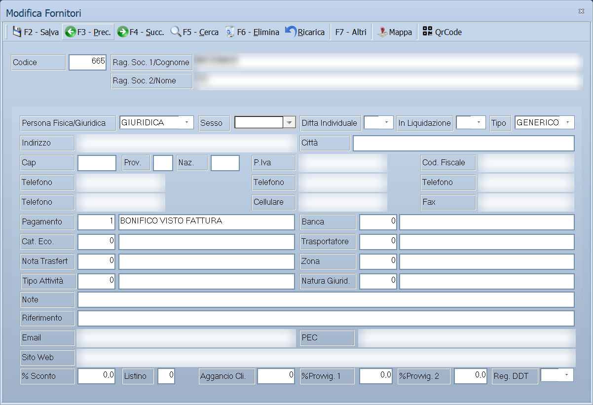

# Anagrafica fornitori

Da questa maschera si inseriscono e si aggiornano i fornitori dell'azienda: i
dati anagrafici e fiscali, le condizioni commerciali proposte negli acquisti e
i dati richiesti dalla fatturazione elettronica. Dalla stessa finestra si
consultano, senza uscire dalla scheda, i documenti, le scadenze e i movimenti
contabili già registrati per quel fornitore.

!!! info "In sintesi"

    - **Percorso:** Menu ▸ Archivi ▸ Fornitori ▸ Inserimento *(oppure* Modifica*)*
    - **Scorciatoia:** nessuna; la maschera si apre dal menu o dal pulsante corrispondente nella barra degli strumenti
    - **Permessi richiesti:** nessun profilo predefinito; **Inserimento** e **Modifica** si abilitano separatamente per ogni utente da [Archivi ▸ Utenti](utenti.md)

---

## A cosa serve

Il fornitore è il soggetto da cui l'azienda acquista. Ogni ordine, DDT di
acquisto, fattura di acquisto e registrazione di prima nota lo richiama da qui,
riprendendone la ragione sociale, i dati fiscali, il pagamento e la causale
contabile: compilare bene l'anagrafica una volta evita di reinserire gli stessi
dati su ogni documento.

Esempio: se imposti qui la **Causale Contab.**, le registrazioni di prima nota
intestate a questo fornitore nascono già con quella causale, e il programma
verifica in fase di salvataggio che sia una causale di acquisto.

La maschera si apre in due modi diversi. Con **Inserimento** parte vuota, con
il codice successivo all'ultimo già utilizzato, e sono disponibili solo le
schede *Generale* e *Impostazioni*: le altre riguardano dati che un fornitore
appena creato non può ancora avere. Con **Modifica** si apre sull'ultimo
fornitore inserito, con tutte le schede e con i comandi di navigazione.

## Prerequisiti

Prima di inserire il primo fornitore occorre aver definito:

- il [tipo di pagamento](../contabilita/tipi-di-pagamento.md): il programma
  propone quello di codice 1 su ogni nuovo fornitore;
- l'archivio dei **comuni**, da cui si compilano in automatico provincia e CAP;
- l'archivio delle **nazioni**, richiamato dai campi **Naz.** e
  **Lingua Docum.**;
- le **causali contabili** di acquisto, se usi la contabilità.

Sono facoltativi, ma se li usi devono esistere prima: banche, categorie
economiche, trasportatori, zone, note particolari e le tabelle **Tipo Attività**
e **Natura Giurid.**

## La maschera

La maschera è divisa in tre parti:

- in alto la **barra dei comandi**;
- sotto la **testata**, sempre visibile, con codice e ragione sociale del
  fornitore su cui stai lavorando;
- al centro le **schede**, che occupano il resto della finestra.

Le schede sono queste:

| Scheda | Contenuto |
|---|---|
| **Generale** | Indirizzo, recapiti, dati fiscali e condizioni commerciali. È la scheda che si compila. |
| **Impostazioni** | Dati per la fatturazione elettronica, causale contabile, template degli ordini. |
| **Totali** | Saldi e progressivi per sezione e per anno. Sola lettura. |
| **Destinazioni Diverse** | Le sedi di consegna alternative del fornitore. |
| **Scadenze** | Le [partite](../../appendici/glossario.md#partita) aperte verso il fornitore. |
| **Contabilita'** | Le registrazioni di prima nota che lo riguardano. |
| **D.D.T.** | I documenti di trasporto di acquisto. |
| **Ordini** | Gli ordini emessi al fornitore. |
| **Rich. Offerta** | Le richieste di offerta inviate. |
| **Gruppi** | I gruppi di fornitori a cui appartiene. |
| **Vendite** | Le vendite dei suoi articoli, per cliente e per agente, in un intervallo di date. |
| **Note** | Una nota libera, di lunghezza non prefissata. |
| **Allegati** | I file collegati al fornitore. |

Le schede *Scadenze*, *Contabilita'*, *D.D.T.*, *Ordini* e *Rich. Offerta*
compaiono solo se hai il permesso di aprire l'archivio corrispondente **e** se
quell'archivio contiene almeno un documento: se una di queste schede non c'è,
non è un guasto.

## Campi

### Testata

| Campo | Obbl. | Descrizione | Valori ammessi |
|---|:---:|---|---|
| Codice | ● | Identificativo del fornitore. In inserimento il programma propone il primo codice libero; puoi sostituirlo. In modifica non è modificabile. | Da 1 a 99999999 |
| Rag. Soc. 1/Cognome | ● | Denominazione del fornitore, o il cognome se è una persona fisica. | Fino a 45 caratteri |
| Rag. Soc. 2/Nome | | Seconda riga della denominazione, o il nome se è una persona fisica. | Fino a 45 caratteri |

{: .campi }

### Scheda Generale

| Campo | Obbl. | Descrizione | Valori ammessi |
|---|:---:|---|---|
| Persona Fisica/Giuridica | | Natura del soggetto. Su un nuovo fornitore parte da *GIURIDICA*. | FISICA, GIURIDICA |
| Sesso | | Compilabile solo per le persone fisiche; sulle giuridiche resta spento. | (vuoto), MASCHILE, FEMMINILE |
| Ditta Individuale | | Compilabile solo per le persone fisiche. | (vuoto), NO, SI |
| In Liquidazione | | Segnala che la società è in liquidazione. | (vuoto), NO, SI |
| Tipo | | Distingue i fornitori di merce da quelli di prestazioni. Filtra l'elenco nella finestra di ricerca. | GENERICO, BENI, SERVIZI |
| Indirizzo | | Via e numero civico. | Fino a 100 caratteri |
| Città | | Digitando un comune presente in archivio, provincia e CAP si compilano da soli. | Fino a 30 caratteri |
| Cap | | Codice di avviamento postale. | Solo cifre, fino a 5 |
| Prov. | | Sigla della provincia. | 2 caratteri |
| Naz. | | Codice della nazione. | Fino a 4 caratteri, dall'archivio nazioni |
| P.Iva | | Partita IVA. Sui soggetti italiani il programma ne verifica il codice di controllo al salvataggio. | Fino a 28 caratteri |
| Cod. Fiscale | | Codice fiscale. Sui soggetti italiani il programma ne verifica il codice di controllo al salvataggio. | Fino a 16 caratteri |
| Telefono | | Quattro campi indipendenti per altrettanti numeri. | Fino a 14 cifre ciascuno |
| Cellulare | | Numero di cellulare. | Fino a 14 cifre |
| Fax | | Numero di fax. | Fino a 14 cifre |
| Pagamento | | Condizione di pagamento proposta nei documenti di acquisto. Accanto compare la descrizione. | Codice dall'archivio pagamenti |
| Banca | | Banca d'appoggio del fornitore. | Codice dall'archivio banche |
| Cat. Eco. | | Categoria economica, usata per raggruppare i fornitori nelle statistiche. | Codice dall'archivio categorie economiche |
| Trasportatore | | Vettore abituale. | Codice dall'archivio trasportatori |
| Nota Trasfert | | Nota, scelta fra le note particolari, che il programma riporta nei documenti in cui compaiono articoli di questo fornitore. | Codice dall'archivio note particolari |
| Zona | | Zona geografica o commerciale. | Codice dall'archivio zone |
| Tipo Attività | | Attività svolta dal fornitore. | Codice di tabella |
| Natura Giurid. | | Forma giuridica scelta dalla tabella, per le statistiche. Da non confondere con **Natura Giuridica** della scheda *Impostazioni*. | Codice di tabella |
| Note | | Annotazione breve, visibile in anagrafica. | Fino a 40 caratteri |
| Riferimento | | Persona o ufficio da contattare presso il fornitore. | Fino a 30 caratteri |
| Email | | Indirizzo di posta ordinaria. | Fino a 35 caratteri, in minuscolo |
| PEC | | Indirizzo di posta certificata. | Fino a 60 caratteri, in minuscolo |
| Sito Web | | Sito internet del fornitore. | Fino a 80 caratteri, in minuscolo |
| % Sconto | | Sconto abituale praticato dal fornitore. | Percentuale |
| Listino | | Listino di riferimento per gli acquisti. | Numero di listino |
| Aggancio Cli. | | Codice del cliente corrispondente, quando lo stesso soggetto è anche cliente. | Codice dall'archivio clienti |
| %Provvig. 1 | | Prima percentuale di provvigione. | Percentuale |
| %Provvig. 2 | | Seconda percentuale di provvigione. | Percentuale |
| Reg. DDT | | Registro su cui numerare i documenti di trasporto di questo fornitore. | (vuoto) o un registro definito in azienda |

{: .campi }

### Scheda Impostazioni

| Campo | Obbl. | Descrizione | Valori ammessi |
|---|:---:|---|---|
| Escludi da Comunicazioni Iva | | Tiene il fornitore fuori dall'elenco IVA. | Casella |
| Cod. Aggancio | | Codice con cui il fornitore viene riconosciuto nei tracciati esterni. | Fino a 6 caratteri |
| Dest. Diverso | | Destinazione di consegna proposta, fra quelle della scheda *Destinazioni Diverse*. | Numero della destinazione |
| Forza Esportazione | | Include comunque il fornitore nelle esportazioni. | Casella |
| Template Ordini | | Numero del modello usato per generare gli ordini da inviare al fornitore. | Numero |
| Tipo | | Formato del file d'ordine da produrre. | NESSUNO, EXCEL XLS, EXCEL XLXS, EVISION, INGROSS LEVANTE s.p.a., EDIFACT D96A, MODERNA, SISA, APULIA DISTRIBUZIONE, EURITMO |
| Frazionabile | | Indica se l'ordine al fornitore può essere spezzato in più consegne. | (vuoto), NO, SI |
| Lingua Docum. | | Nazione che determina la lingua dei documenti emessi verso il fornitore. | Fino a 4 caratteri, dall'archivio nazioni |
| Causale Contab. | | Causale proposta nelle registrazioni di prima nota. Accanto compare la descrizione. | Codice dall'archivio causali contabili |
| Natura Giuridica | | Codice della forma giuridica usato dalla fattura elettronica: da questo dipende se il capitale sociale e il socio unico vengono trasmessi. Da non confondere con **Natura Giurid.** della scheda *Generale*. | 2 caratteri |
| Regime Fiscale | | Regime fiscale dichiarato dal fornitore. | Da elenco (ORDINARIO, REGIME FORFETTARIO, …) |
| Ufficio U.R.I. | | Provincia dell'ufficio del registro delle imprese. | 2 caratteri |
| Numero R.E.A. | | Numero di iscrizione al repertorio economico amministrativo. | Solo cifre, fino a 20 |
| Capitale Sociale | | Capitale sociale dichiarato. | Importo |
| Non Iscritto R.E.A. | | Da spuntare per i soggetti non iscritti al R.E.A. | Casella |
| Passaporto Fitosanit. | | **Solo Ortofrutta.** Numero del passaporto fitosanitario del fornitore. | Fino a 30 caratteri |
| Tipo Codice XML | | Nome del tipo di codice usato dal fornitore nelle sue fatture elettroniche. Se ne possono indicare tre. | Fino a 30 caratteri ciascuno |
| Codice Facile | | Codice di Facile a cui agganciare il tipo indicato a fianco. Uno per ciascuna delle tre righe. | NESSUNO, PRINCIPALE, CODICE A BARRE, CODICE ARTICOLO FORNITORE |

{: .campi }

I tre campi **Tipo Codice XML** e i tre **Codice Facile** stanno nel riquadro
**CODICI AGGANCIO FATTURE ELETTRONICHE** e vanno letti a coppie: a sinistra
come il fornitore chiama il codice nel suo file, a destra a quale codice di
Facile corrisponde. Servono a far riconoscere gli articoli quando si importa
una fattura elettronica di acquisto.

### Schede di consultazione

Le schede seguenti non si compilano: mostrano dati registrati altrove. Su
tutte, il doppio clic o ++f10++ su una riga apre il documento che l'ha
generata.

| Scheda | Colonne |
|---|---|
| **Totali** | Sezione, Anno, Dare, Avere, Saldo, Imponibile, Imposta, Esente, Non imp. art. 8/2 |
| **Destinazioni Diverse** | Codice, Ragione Sociale, Città, Indirizzo |
| **Scadenze** | Numero, Data, Num.Fattura, Data Fattura, Tot.Fattura, Importo |
| **Contabilita'** | Data, Numero Doc., Data Doc., Sez., Descrizione, Dare, Avere, Saldo |
| **D.D.T.**, **Ordini**, **Rich. Offerta** | Anno, Numero, Data, Stato, Agente, Cliente, Totale |
| **Gruppi** | Codice, Descrizione |
| **Vendite** | Cod.Cli., Cliente, Cod.Age., Agente, Tot.Vendite |

La scheda *Destinazioni Diverse* ha in più i pulsanti **Nuovo**, **Modifica**,
**Canc.** e **Stampa**; la scheda *Gruppi* i pulsanti **Aggiungi** e
**Rimuovi**; la scheda *Vendite* i campi **Data Iniziale** e **Data Finale**
per restringere il periodo.

## Pulsanti e comandi

| Comando | Scorciatoia | Effetto |
|---|---|---|
| **F2 - Salva** | ++f2++ | Registra il fornitore dopo i controlli. In inserimento, subito dopo il salvataggio la maschera si svuota per il fornitore successivo. |
| **F3 - Prec.** | ++f3++ | Passa al fornitore precedente nell'ordinamento in uso. |
| **F4 - Succ.** | ++f4++ | Passa al fornitore successivo. |
| **F5 - Cerca** | ++f5++ | Apre la finestra **Cerca Fornitori**. |
| **F6 - Elimina** | ++f6++ | Cancella il fornitore, previa conferma. |
| **Ricarica** | | Rilegge il fornitore dall'archivio, abbandonando le modifiche non salvate. |
| **F7 - Altri** | ++f7++ | Apre il menu con **Titolare/Rappr. Legale**, **Autorizzazione Trattamento Dati** e **Contratto**. Nella versione Energy c'è anche **Dati Trasmissione Agenzia Dogane**. |
| **Mappa** | | Calcola la posizione del fornitore dall'indirizzo e la mostra sulla mappa. |
| **QrCode** | | Acquisisce i dati anagrafici dal QR code dell'Agenzia delle Entrate. |

Valgono inoltre in tutta la maschera:

| Comando | Scorciatoia | Effetto |
|---|---|---|
| Guida | ++f1++ | Apre la pagina di guida dell'operazione in corso. |
| Elenco valori | ++f10++, ++space++ o doppio clic | Sui campi che richiamano un archivio, apre l'elenco da cui scegliere. |
| Consultazione | ++f11++ | Apre la finestra **Consultazione**. |
| Calcolatrice | ++f12++ | Apre la calcolatrice. |
| Campo successivo | ++enter++ o ++down++ | Sposta il cursore sul campo seguente. |
| Campo precedente | ++up++ | Sposta il cursore sul campo precedente. |
| Chiusura | ++esc++ | Chiude la maschera. |

## Come si fa

### Inserire un nuovo fornitore

1. Apri **Menu ▸ Archivi ▸ Fornitori ▸ Inserimento**.
2. Lascia il **Codice** proposto, oppure digitane uno diverso.
3. Compila **Rag. Soc. 1/Cognome**, e **Rag. Soc. 2/Nome** se la denominazione
   non entra in una riga sola.
4. Nella scheda *Generale* indica **Indirizzo** e **Città**: alla conferma del
   comune, **Prov.** e **Cap** si compilano da soli.
5. Inserisci **P.Iva** e **Cod. Fiscale**. Su una persona giuridica con partita
   IVA italiana di 11 cifre, il codice fiscale viene ricopiato dalla partita
   IVA se lo lasci vuoto.
6. Controlla il **Pagamento** proposto e, se serve, correggilo con ++f10++.
7. Passa alla scheda *Impostazioni* e indica la **Causale Contab.** con cui
   registrerai le fatture di questo fornitore.
8. Premi **F2 - Salva**. Il programma chiede se stampare l'autorizzazione al
   trattamento dei dati, poi svuota la maschera per l'inserimento successivo.

### Ritrovare e modificare un fornitore

1. Apri **Menu ▸ Archivi ▸ Fornitori ▸ Modifica**: la maschera si apre
   sull'ultimo fornitore inserito.
2. Premi **F5 - Cerca**.
3. Nella finestra **Cerca Fornitori** digita quello che sai — **Codice**,
   **Partita IVA**, **Cod. Fiscale** o **Descrizione** — e, se vuoi, restringi
   l'elenco con **Filtra Tipo:**.
4. Scegli la riga e conferma: il fornitore viene caricato nella maschera.
5. Correggi i dati e premi **F2 - Salva**.

### Compilare i dati per la fattura elettronica

1. Carica il fornitore e apri la scheda *Impostazioni*.
2. Indica **Regime Fiscale** e **Natura Giuridica**.
3. Se il fornitore è iscritto al R.E.A., compila **Ufficio U.R.I.**,
   **Numero R.E.A.** e **Capitale Sociale**; altrimenti spunta
   **Non Iscritto R.E.A.**
4. Nel riquadro *CODICI AGGANCIO FATTURE ELETTRONICHE* scrivi in **Tipo Codice
   XML** il nome che il fornitore usa nel suo file e scegli in **Codice Facile**
   a quale codice corrisponde.
5. Premi **F2 - Salva**.

### Acquisire i dati dal QR code dell'Agenzia delle Entrate

1. Premi **QrCode** nella barra dei comandi.
2. Incolla nella finestra il contenuto letto dal QR code e conferma.
3. Verifica i campi compilati in automatico: nazione, codice fiscale, partita
   IVA, ragione sociale, indirizzo, città, CAP, provincia e PEC.
4. Premi **F2 - Salva**.

### Eliminare un fornitore

1. Carica il fornitore da eliminare.
2. Premi **F6 - Elimina**.
3. Rispondi **Sì** alla richiesta di conferma.
4. La maschera si posiziona sul fornitore successivo. Se non ce ne sono altri,
   si chiude.

## Controlli e messaggi

| Messaggio | Causa | Cosa fare |
|---|---|---|
| *Non è stata digitata la Partita IVA! Vuoi Continuare?* | Stai salvando un fornitore senza partita IVA. | Rispondi **No** e inseriscila, oppure **Sì** per salvare comunque. |
| *La Partita IVA digitata risulta già presente in archivio! Vuoi Continuare?* | La stessa partita IVA è già di un altro fornitore. | Verifica di non stare duplicando un fornitore già presente. |
| *Il Codice Fiscale digitato risulta già presente in archivio! Vuoi Continuare?* | Lo stesso codice fiscale è già di un altro fornitore. | Come sopra. |
| *Partita IVA non Valida ! Vuoi Continuare?* | Su un soggetto italiano il codice di controllo della partita IVA non torna. | Rispondi **No** e ricontrolla il numero sul documento del fornitore. |
| *Codice Fiscale non Valido ! Vuoi Continuare?* | Su un soggetto italiano il codice di controllo del codice fiscale non torna. | Rispondi **No** e ricontrolla il codice. |
| *Registro Causale Contabile non compatibile!* | La causale indicata non è di acquisti, acquisti CEE o fatture sospese. | Scegli una causale del registro acquisti. |
| *La causale contabile deve essere in relazione con i fornitori!* | La causale indicata è impostata sui clienti. | Scegli una causale collegata ai fornitori. |
| *La causale contabile deve avere il campo Causale IVA = "SI"* | La causale indicata non gestisce l'IVA. | Scegli una causale IVA, o correggi quella esistente nella sua anagrafica. |
| *Il codice del Tipo di Pagamento non é valido o disponibile.* | Il codice digitato in **Pagamento** non esiste. | Premi ++f10++ sul campo e scegli dall'elenco. Lo stesso messaggio, con il nome dell'archivio corrispondente, compare per Banca, Cat. Eco., Trasportatore, Nota Trasfert, Zona, Tipo Attività, Natura Giurid., Causale Contab. e Lingua Docum. |
| *Non hai l' Autorizzazioni sufficienti per completare l' operazione.* | Il codice digitato è fuori dall'intervallo riservato ai fornitori. | Usa un codice compreso nell'intervallo, o lascia quello proposto dal programma. |
| *In archivio è già presente un record con lo stesso codice.* | Il codice digitato è già di un altro fornitore. | Cambia codice. |
| *La cancellazione puo' compromettere il corretto funzionamento sugli altri esercizi ! Vuoi Continuare ?* | Primo dei due avvisi che precedono la cancellazione. | Rispondi **Sì** solo se sei certo che il fornitore non serva negli esercizi precedenti. |
| *Confermi la Cancellazione....* | Seconda e ultima conferma prima di eliminare. | Rispondi **Sì** per eliminare davvero il fornitore. |
| *Non è possibile eliminare il record pochè utilizzato in alcuni record del database.* | Il fornitore è usato in scadenze, prima nota, documenti, movimenti, articoli, contratti o promozioni. | Non è eliminabile: lascialo in archivio. |
| *Il record è stato modificato da un altro nodo della rete.* | Un altro utente ha salvato lo stesso fornitore mentre lo modificavi. | Premi **Ricarica**, verifica cosa è cambiato e rifai le tue modifiche. |
| *Il record è stato cancellato da un altro nodo della rete.* | Un altro utente ha eliminato il fornitore mentre lo modificavi. | La maschera si chiude: non c'è più nulla da salvare. |
| *Record di un archivio relazionato non trovato!* | Il fornitore richiama un pagamento, una banca o un'altra tabella che non esiste più. | Segnala l'anomalia all'assistenza: manca un record in una tabella di base. |
| *Codice Fiscale non impostato!* — *Indirizzo non impostato!* — *Citta' non impostata!* | Stai stampando l'autorizzazione al trattamento dei dati e mancano dati del fornitore. | Completa la scheda *Generale* e ripeti la stampa. |
| *Codice Fiscale Azienda non impostato!* — *Indirizzo Domicilio Legale Azienda non impostato!* — *Citta' Domicilio Legale Azienda non impostata!* — *PEC Azienda non impostata!* | Per la stessa stampa mancano dati della tua azienda. | Completa i dati dell'azienda e ripeti la stampa. |
| *Dati Titolare/Legale Rappresentante non presenti in archivio e da compilare manualmente!* | Il fornitore è una persona giuridica e non ne è stato registrato il titolare. | Registralo con **F7 - Altri ▸ Titolare/Rappr. Legale**, oppure compila a mano il modulo stampato. |
| *Impossibile acquisire i dati!* | Il testo incollato nella finestra del QR code non è leggibile. | Rileggi il QR code e riprova. |

## Note

!!! warning "Attenzione"

    **F7 - Altri** salva il fornitore prima di aprire il menu. Se hai fatto
    modifiche che non volevi registrare, annullale con **Ricarica** prima di
    premere ++f7++.

    ++esc++ chiude la maschera senza chiedere conferma e senza salvare: le
    modifiche fatte dopo l'ultimo **F2 - Salva** vanno perse.

    Nei campi **Telefono**, **Cellulare** e **Fax** il programma registra le
    sole cifre: punti, spazi, barre e prefissi scritti con il segno più
    vengono tolti al salvataggio.

    Cambiando **Indirizzo**, **Città**, **Cap**, **Prov.** o **Naz.** la
    posizione sulla mappa viene azzerata e va ricalcolata con **Mappa**.

!!! note "Nota"

    Nella versione Energy, subito dopo aver salvato un fornitore **nuovo**, si
    apre da sola la finestra **Dati Trasmissione Agenzia Dogane**.

<!-- DA VERIFICARE: dove si imposta l'intervallo di codici riservato ai fornitori (quello che fa comparire il messaggio sulle autorizzazioni)? È un dato dell'azienda: qual è il percorso di menu da citare? -->

<!-- DA VERIFICARE: il campo Nota Trasfert. Dal codice risulta che la nota viene riportata sui documenti in cui compaiono articoli del fornitore, ma non è chiaro in quali casi d'uso reali si compili. -->

## Vedi anche

- [Anagrafica clienti](anagrafica-clienti.md)
- [Tipi di pagamento](../contabilita/tipi-di-pagamento.md)
- [Partita](../../appendici/glossario.md#partita)
