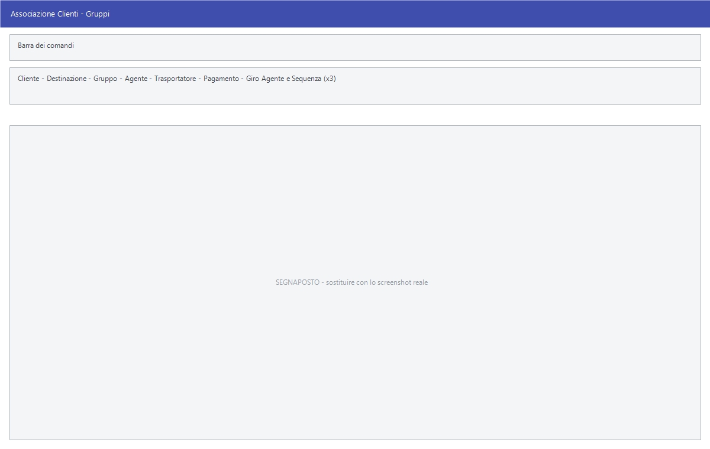

# Associazione gruppi e giri

Due maschere quasi identiche per assegnare in fretta a un cliente — o a una sua
destinazione — le condizioni commerciali e i giri di visita dell'agente, senza
passare dall'anagrafica completa.

!!! info "In sintesi"

    **Percorso:** Menu ▸ Archivi ▸ Clienti ▸ Associazione Gruppi
    Menu ▸ Archivi ▸ Agenti ▸ Associazione Giri
    **Scorciatoia:** ++f2++ salva, ++f6++ cancella l'associazione
    **Permessi richiesti:** nessun profilo predefinito; le singole voci di menu si abilitano per ogni utente da [Archivi ▸ Utenti](utenti.md)

---

## A cosa serve

Aprire la scheda di un cliente per cambiargli l'agente è lento, e la scheda ha
molti campi che in quel momento non interessano. Queste due maschere fanno una
cosa sola: prendono un cliente, o una sua destinazione, e gli assegnano quello
che serve.

**Associazione Clienti - Gruppi** copre gruppo, agente, vettore, pagamento e i
tre giri. **Associazione Giri Agenti** si limita ad agente e giri.

Un cliente può stare su **tre giri diversi**, ciascuno con la sua sequenza: il
numero d'ordine con cui l'agente lo visita all'interno del giro.

## Prerequisiti

Prima di usare queste maschere occorre avere in archivio:

- i [clienti](anagrafica-clienti.md) e le loro destinazioni;
- gli [agenti](anagrafica-agenti.md), i
  [trasportatori](trasportatori.md) e i
  [tipi di pagamento](../contabilita/tipi-di-pagamento.md);
- i **giri agenti**, che si creano da **Menu ▸ Archivi ▸ Agenti ▸ Inserimento
  Giro** (vedi
  [Tabelle di classificazione](../magazzino/tabelle-di-classificazione.md)).

## La maschera

Sono maschere a finestra unica. In alto si sceglie **il chi** — cliente ed
eventualmente destinazione — e sotto la linea si assegna **il che cosa**. In
fondo i tre pulsanti **F2 - Salva**, **F6 - Canc.** ed **Esci**.

## Campi

### Chi

| Campo | Obbl. | Descrizione | Valori ammessi |
|---|:---:|---|---|
| **Cliente** | ● | Il [cliente](anagrafica-clienti.md) a cui assegnare le condizioni. | codice |
| **Destinazione** | | Una destinazione merce del cliente, se l'assegnazione riguarda solo quella. | codice |

{: .campi }

### Che cosa — solo in Associazione Clienti - Gruppi

| Campo | Obbl. | Descrizione | Valori ammessi |
|---|:---:|---|---|
| **Gruppo** | | Il gruppo a cui assegnare il cliente. | codice |
| **Trasportatore** | | Il [vettore](trasportatori.md) che lo serve. | codice |
| **Pagamento** | | Il [tipo di pagamento](../contabilita/tipi-di-pagamento.md) da proporgli. | codice |

{: .campi }

### Che cosa — in entrambe

| Campo | Obbl. | Descrizione | Valori ammessi |
|---|:---:|---|---|
| **Agente** | | L'[agente](anagrafica-agenti.md) che lo segue. | codice |
| **Giro Agente** (primo) e **Sequenza** | | Il primo giro di visita e la posizione del cliente al suo interno. | codice e numero |
| **Giro Agente** (secondo) e **Sequenza** | | Il secondo giro. | codice e numero |
| **Giro Agente** (terzo) e **Sequenza** | | Il terzo giro. | codice e numero |

{: .campi }

## Pulsanti e comandi

| Comando | Scorciatoia | Effetto |
|---|---|---|
| **F2 - Salva** | ++f2++ | Registra l'associazione. |
| **F6 - Canc.** | ++f6++ | Cancella l'associazione del cliente indicato. |
| **Esci** | ++esc++ | Chiude senza salvare. |
| Elenco di scelta | ++f10++ o ++space++ | Sul campo con il codice, apre l'elenco da cui scegliere. |
| **Calcolatrice** | ++f12++ | Apre la calcolatrice. |
| **Consultazione** | ++f11++ | Apre la consultazione. |

## Come si fa

### Mettere un cliente nel giro del lunedì

1. Apri **Menu ▸ Archivi ▸ Agenti ▸ Associazione Giri**.
2. Indica il **Cliente** e, se serve, la **Destinazione**.
3. Indica l'**Agente**.
4. Nel primo **Giro Agente** indica il giro del lunedì e in **Sequenza** il
   numero d'ordine con cui va visitato.
5. Premi **F2 - Salva**.

### Cambiare vettore a un cliente

1. Apri **Menu ▸ Archivi ▸ Clienti ▸ Associazione Gruppi**.
2. Indica il **Cliente**.
3. Compila il **Trasportatore** e premi **F2 - Salva**.

## Controlli e messaggi

| Messaggio | Causa | Cosa fare |
|---|---|---|
| *(nessun messaggio, solo un segnale acustico)* | Manca il **Cliente**. | Compila il campo su cui si è posizionato il cursore. |

## Note

!!! warning "Attenzione"

    Queste maschere **scrivono nell'anagrafica del cliente**: quello che si
    assegna qui è la stessa cosa che si vedrebbe aprendo la scheda del cliente.
    Non è un'assegnazione temporanea.

    **F6 - Canc.** cancella l'associazione, non il cliente.

<!-- DA VERIFICARE: se compilando la Destinazione l'assegnazione valga solo per quella o sovrascriva anche il cliente. -->

<!-- DA VERIFICARE: cosa succede lasciando vuoto un campo in salvataggio: se azzeri il valore che il cliente aveva o lo lasci com'è. -->

<!-- DA VERIFICARE: a quale "Gruppo" si riferisca il campo omonimo: gruppo aziende, gruppo mailing o altro. -->

## Vedi anche

- [Anagrafica clienti](anagrafica-clienti.md)
- [Anagrafica agenti](anagrafica-agenti.md)
- [Stampe agenti](stampe-agenti.md)
