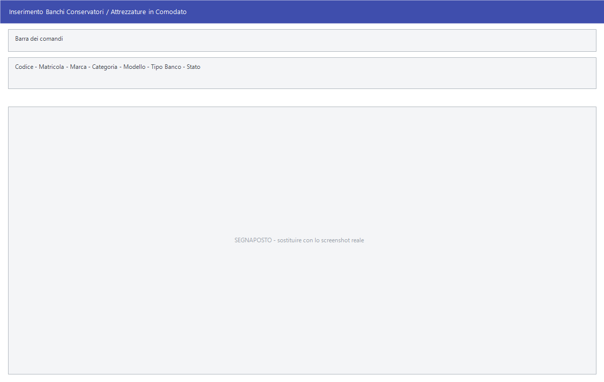

# Banchi conservatori e attrezzature in comodato

Il registro delle attrezzature di proprietà dell'azienda che stanno presso i
clienti: il frigorifero dei gelati, la vetrina, l'impianto alla spina, gli
ombrelloni. Per ognuna si tiene la matricola, dove si trova, in che stato è e
con quale documento è stata consegnata.

!!! info "In sintesi"

    **Percorso:** Menu ▸ Archivi ▸ Banchi Conservatori - Attrezzature in Comodato ▸ Inserimento *(oppure* Modifica*)*
    **Scorciatoia:** ++f2++ salva, ++f5++ cerca, ++f7++ stampa
    **Permessi richiesti:** nessun profilo predefinito; **Inserimento** e **Modifica** si abilitano separatamente per ogni utente da [Archivi ▸ Utenti](utenti.md)

---

## A cosa serve

Chi distribuisce bevande o gelati lascia in comodato le attrezzature per
esporli. Quelle attrezzature restano di proprietà dell'azienda e vanno
ritrovate: qui si tiene traccia di dove ciascuna si trova, presso quale
cliente, con quale bolla è stata consegnata e se è ancora buona.

La **Penale** è quanto si addebita al cliente se l'attrezzatura non torna o
torna danneggiata.

## Prerequisiti

Prima di usare questa maschera occorre:

- avere in archivio i [clienti](anagrafica-clienti.md) presso cui le
  attrezzature si trovano;
- aver popolato le tre tabelle di appoggio **Marche**, **Categorie** e
  **Modelli**, che si aprono dalle voci di menu omonime sotto questa
  (vedi [Tabelle di classificazione](../magazzino/tabelle-di-classificazione.md)).

## La maschera

È una maschera a finestra unica, dal titolo *Inserimento Banchi Conservatori /
Attrezzature in Comodato*, divisa in due da una linea:

1. sopra, **che cosa è** l'attrezzatura: identificazione, tipo, età, stato;
2. sotto, **dove si trova**: il cliente, la destinazione e il documento di
   consegna.

## Campi

### Che cos'è

| Campo | Obbl. | Descrizione | Valori ammessi |
|---|:---:|---|---|
| **Codice** | ● | Identificativo dell'attrezzatura. In modifica non è modificabile. | numero |
| **Matricola** | | Il numero di matricola stampigliato sull'attrezzatura. | testo |
| **Marca** | | Il costruttore, dalla tabella **Marche**. | codice |
| **Categoria** | | La categoria, dalla tabella **Categorie**. | codice |
| **Modello** | | Il modello, dalla tabella **Modelli**. | codice |
| **Tipo Banco** | | Che genere di attrezzatura è. | `CONSERVATORE FRIGORIFERO`, `VETRINA VERTICALE`, `VETRINA ORIZZONTALE`, `FORNO`, `VETRINA ESPOSITIVA`, `OMBRELLONE`, `PANCA`, `TAVOLO`, `SEDIA`, `GAZEBO`, `IMPIANTO SPINA`, `MACCHINA DA CAFFE'`, `POZZETTO CONGELATORE`, `BASE OMBRELLONE` |
| **Ubicazione** | | Dove si trova fisicamente. | testo |
| **Anno Fabbricazione** | | Anno di costruzione. | anno |
| **Anno Acquisto**, **Mese Acquisto** | | Quando l'azienda l'ha comprata. | anno e mese |
| **Canale** | | Il canale commerciale a cui l'attrezzatura è destinata. | `ALIMENTARI`, `BAR`, `FRESCHI` |
| **Stato** | | In che condizioni è. | `NUOVO`, `USATO`, `ROTTAMATO`, `VENDUTO`, `IN RIPARAZIONE` |
| **Ns. proprietà** | | Attiva se l'attrezzatura è dell'azienda. | attivo/non attivo |

{: .campi }

### Dove si trova

| Campo | Obbl. | Descrizione | Valori ammessi |
|---|:---:|---|---|
| **Cliente** | | Il [cliente](anagrafica-clienti.md) che ha l'attrezzatura. | codice |
| **Destinazione** | | La destinazione merce del cliente presso cui si trova. | codice |
| **Numero D.D.T.**, **Data D.D.T.** | | Il documento di trasporto con cui è stata consegnata. | numero e data |
| **Penale** | | Importo da addebitare in caso di mancata restituzione o danneggiamento. | importo |

{: .campi }

## Pulsanti e comandi

| Comando | Scorciatoia | Effetto |
|---|---|---|
| **F2 - Salva** | ++f2++ | Registra l'attrezzatura. |
| **F3 - Prec.** | ++f3++ | Passa all'attrezzatura precedente. |
| **F4 - Succ.** | ++f4++ | Passa all'attrezzatura successiva. |
| **F5 - Cerca** | ++f5++ | Apre l'elenco delle attrezzature. |
| **F6 - Elimina** | ++f6++ | Cancella l'attrezzatura, previa conferma. |
| **F7 - Stampa** | ++f7++ | Stampa la scheda. Compare solo in **Modifica**. |
| **Ricarica** | | Rilegge l'attrezzatura dall'archivio, abbandonando le modifiche non salvate. |
| **Consultazione** | ++f11++ | Apre la consultazione. |
| **Calcolatrice** | ++f12++ | Apre la calcolatrice. |

## Come si fa

### Registrare un'attrezzatura consegnata a un cliente

1. Apri **Menu ▸ Archivi ▸ Banchi Conservatori - Attrezzature in Comodato ▸
   Inserimento**.
2. Compila **Codice** e **Matricola**, poi **Marca**, **Categoria** e
   **Modello**.
3. Scegli **Tipo Banco** e **Stato**.
4. Sotto la linea indica il **Cliente**, la **Destinazione** e gli estremi del
   **D.D.T.** con cui l'hai consegnata.
5. Premi **F2 - Salva**.

### Caricare molte attrezzature da un foglio Excel

1. Prepara un foglio con una colonna intestata `MATRICOLA`.
2. Apri la maschera e avvia l'importazione rispondendo **Sì** a *«Vuoi
   importare i Banchi da un foglio Excel ?»*.
3. Scegli il file e conferma.

### Registrare il rientro di un'attrezzatura

1. Apri l'attrezzatura in **Modifica** e ritrovala con **F5 - Cerca**.
2. Svuota i campi **Cliente** e **Destinazione**.
3. Aggiorna lo **Stato**, per esempio a `IN RIPARAZIONE` o `ROTTAMATO`.
4. Premi **F2 - Salva**.

## Controlli e messaggi

| Messaggio | Causa | Cosa fare |
|---|---|---|
| *Vuoi importare i Banchi da un foglio Excel ?* | Il programma propone l'importazione. | **Sì** apre la scelta del file. |
| *Vuoi procedere con l' importazione dei Banchi ?* | Il foglio è stato letto e il programma sta per scrivere. | **Sì** importa. |
| *Colonna MATRICOLA non trovata nel documento !* | Il foglio non ha la colonna della matricola. | Aggiungi l'intestazione `MATRICOLA`. |
| *Formato file non compatibile!* | Il file scelto non è nel formato atteso. | Verifica di aver scelto il foglio giusto. |
| *File utilizzato da un' altra applicazione o formato file non compatibile!* | Il foglio è aperto in Excel. | Chiudilo e riprova. |
| *Impossibile Creare la tabella* | Il programma non riesce a preparare l'area di lavoro. | Segnala all'assistenza. |
| *Confermi la Cancellazione....* | Conferma richiesta da **F6 - Elimina**. | Rispondi **Sì** per eliminare l'attrezzatura. |

## Note

!!! note "Le tre tabelle di appoggio"

    **Marche**, **Categorie** e **Modelli** sono voci di menu subito sotto
    questa e aprono la maschera generica delle
    [tabelle di classificazione](../magazzino/tabelle-di-classificazione.md):
    codice e descrizione, nulla di più. Vanno popolate prima, altrimenti i tre
    campi corrispondenti restano vuoti.

<!-- DA VERIFICARE: quando compare la richiesta di importazione da Excel: all'apertura della maschera o da un comando che non ho individuato. -->

<!-- DA VERIFICARE: quali colonne del foglio Excel vengono lette oltre a MATRICOLA. -->

<!-- DA VERIFICARE: se la Penale venga usata automaticamente in qualche documento o resti un dato di sola consultazione. -->

<!-- DA VERIFICARE: cosa stampa esattamente F7 - Stampa: la scheda della singola attrezzatura o un elenco. -->

## Vedi anche

- [Anagrafica clienti](anagrafica-clienti.md)
- [Tabelle di classificazione](../magazzino/tabelle-di-classificazione.md)
