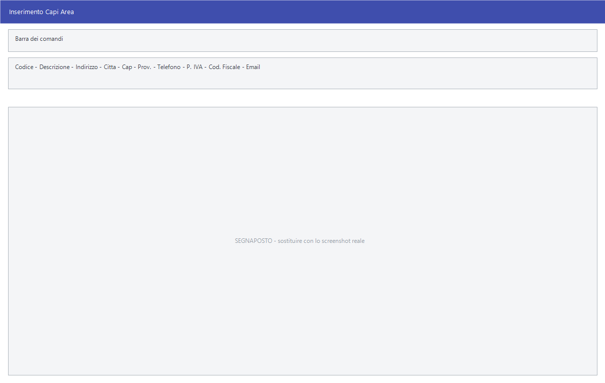

# Capi area

Il livello sopra gli agenti: chi coordina una zona e su cui si aggregano le
vendite e le provvigioni degli agenti che gli rispondono.

!!! info "In sintesi"

    - **Percorso:** Menu ▸ Archivi ▸ Agenti ▸ Capi Area ▸ Inserimento *(oppure* Modifica*)*
    - **Scorciatoia:** ++f2++ salva, ++f5++ cerca
    - **Permessi richiesti:** nessun profilo predefinito; **Inserimento** e **Modifica** si abilitano separatamente per ogni utente da [Archivi ▸ Utenti](utenti.md)

---

## A cosa serve

Nelle reti di vendita con più livelli, il capo area è chi sta sopra gli
[agenti](anagrafica-agenti.md). Registrarlo qui permette di collegargli gli
agenti e di riconoscergli una provvigione propria: nelle
[variazioni di massa dei listini](../listini-vendita/variazioni-di-massa.md) e
nella scheda del listino di un articolo la provvigione del capo area è distinta
da quella dell'agente.

## Prerequisiti

*Nessuno.* Conviene però registrare i capi area **prima** degli
[agenti](anagrafica-agenti.md), così da poterli collegare subito.

## La maschera

È una maschera a finestra unica, senza schede: la barra dei comandi e i dati
anagrafici del capo area.

## Campi

| Campo | Obbl. | Descrizione | Valori ammessi |
|---|:---:|---|---|
| **Codice** | ● | Identificativo del capo area. In modifica non è modificabile. | numero |
| **Descrizione** | ● | Nome del capo area, come compare negli elenchi e nelle stampe. | testo |
| **Indirizzo** | | Via e numero civico. | testo |
| **Città** | | Comune. | testo |
| **Cap** | | Codice di avviamento postale. | cinque cifre |
| **Prov.** | | Sigla della provincia. | due lettere |
| **Telefono** | | Recapito telefonico. | testo |
| **P. IVA** | | Partita IVA del capo area. | undici cifre |
| **Cod. Fiscale** | | Codice fiscale del capo area. | sedici caratteri, o undici cifre per le società |
| **Email** | | Indirizzo di posta. | indirizzo |

{: .campi }

## Pulsanti e comandi

| Comando | Scorciatoia | Effetto |
|---|---|---|
| **F2 - Salva** | ++f2++ | Registra il capo area. In inserimento la maschera si svuota per il successivo. |
| **F3 - Prec.** | ++f3++ | Passa al capo area precedente. |
| **F4 - Succ.** | ++f4++ | Passa al capo area successivo. |
| **F5 - Cerca** | ++f5++ | Apre l'elenco dei capi area. |
| **F6 - Elimina** | ++f6++ | Cancella il capo area, previa conferma. |
| **Ricarica** | | Rilegge il capo area dall'archivio, abbandonando le modifiche non salvate. |
| **Consultazione** | ++f11++ | Apre la consultazione. |
| **Calcolatrice** | ++f12++ | Apre la calcolatrice. |

## Come si fa

### Registrare un capo area

1. Apri **Menu ▸ Archivi ▸ Agenti ▸ Capi Area ▸ Inserimento**.
2. Digita **Codice** e **Descrizione**.
3. Completa i recapiti e i dati fiscali.
4. Premi **F2 - Salva**.
5. Apri gli [agenti](anagrafica-agenti.md) che gli rispondono e collegali al
   capo area.

## Controlli e messaggi

| Messaggio | Causa | Cosa fare |
|---|---|---|
| *(nessun messaggio, solo un segnale acustico)* | Manca il **Codice** o la **Descrizione**. | Guarda dove si è posizionato il cursore: è il campo da compilare. |
| *Confermi la Cancellazione....* | Conferma richiesta da **F6 - Elimina**. | Rispondi **Sì** per eliminare il capo area. |

## Note

!!! note "Il menu non ha la voce Stampa"

    A differenza degli agenti, i capi area hanno solo **Inserimento** e
    **Modifica**: non esiste una stampa dedicata dell'elenco.

<!-- DA VERIFICARE: dove si collega l'agente al suo capo area — se dall'anagrafica agenti o da questa maschera. -->

<!-- DA VERIFICARE: se la partita IVA e il codice fiscale siano controllati come su clienti e fornitori. -->

## Vedi anche

- [Anagrafica agenti](anagrafica-agenti.md)
- [Variazioni di massa dei listini](../listini-vendita/variazioni-di-massa.md)
