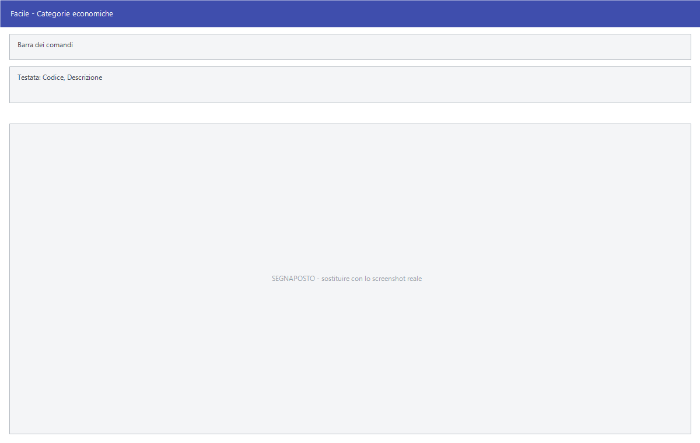

# Categorie economiche

Da questa maschera si definiscono le categorie economiche: i raggruppamenti con
cui si classificano clienti e fornitori. Servono a leggere statistiche e
stampe per tipo di controparte anziché uno per uno.

!!! info "In sintesi"

    **Percorso:** Menu ▸ Archivi ▸ Categorie Economiche ▸ Inserimento *(oppure* Modifica*)*
    **Scorciatoia:** nessuna; la maschera si apre dal menu
    **Permessi richiesti:** nessun profilo predefinito; **Inserimento** e **Modifica** si abilitano separatamente per ogni utente da [Archivi ▸ Utenti](utenti.md)

---

## A cosa serve

La categoria economica risponde alla domanda «che tipo di cliente è questo».
Ogni cliente e ogni fornitore ne indica una nella propria anagrafica, e da lì
le statistiche di fatturato e le stampe si possono leggere per categoria.

Esempio: se dividi i clienti in *Bar*, *Ristoranti* e *Privati*, la stampa del
fatturato per categoria economica ti dice quanto pesa ciascun canale, senza
dover sommare a mano.

È una tabella breve, che si compila all'avvio e si tocca di rado. Conviene
tenerla corta: poche categorie ben separate valgono più di trenta sfumature che
nessuno userà.

## Prerequisiti

*Nessuno.* È una delle prime tabelle da compilare, perché le anagrafiche di
clienti e fornitori la richiamano.

## La maschera

È la maschera più semplice del manuale: in alto la **barra dei comandi**, poi
codice e descrizione, e in fondo le caselle di classificazione.

## Campi

| Campo | Obbl. | Descrizione | Valori ammessi |
|---|:---:|---|---|
| Codice | ● | Identificativo della categoria. In modifica non è modificabile. | Numero |
| Descrizione | ● | Nome della categoria, come compare nelle anagrafiche e nelle stampe. | Fino a 30 caratteri |
| Rivenditore | | Segnala che chi appartiene a questa categoria è un rivenditore e non un consumatore finale. È un dato solo informativo: non cambia l'IVA, i prezzi né il comportamento dei documenti. | Casella |
| Gen. Crediti Sospesa | | **Solo Studio.** Sospende la generazione dei crediti per chi appartiene a questa categoria. | Casella |
| Pagamento con Bonifico | | **Solo Studio.** Segnala che chi appartiene a questa categoria paga con bonifico. | Casella |

{: .campi }

## Pulsanti e comandi

| Comando | Scorciatoia | Effetto |
|---|---|---|
| **F2 - Salva** | ++f2++ | Registra la categoria. In inserimento la maschera si svuota per la successiva. |
| **F3 - Prec.** | ++f3++ | Passa alla categoria precedente. |
| **F4 - Succ.** | ++f4++ | Passa alla categoria successiva. |
| **F5 - Cerca** | ++f5++ | Apre la finestra **Cerca Categorie Economiche**. |
| **F6 - Elimina** | ++f6++ | Cancella la categoria, previa conferma. |
| **Ricarica** | | Rilegge la categoria dall'archivio, abbandonando le modifiche non salvate. |

Valgono inoltre:

| Comando | Scorciatoia | Effetto |
|---|---|---|
| Guida | ++f1++ | Apre la pagina di guida dell'operazione in corso. |
| Consultazione | ++f11++ | Apre la finestra **Consultazione**. |
| Calcolatrice | ++f12++ | Apre la calcolatrice. |
| Campo successivo | ++enter++ | Sposta il cursore sul campo seguente. |
| Chiusura | ++esc++ | Chiude la maschera. |

## Come si fa

### Creare una categoria

1. Apri **Menu ▸ Archivi ▸ Categorie Economiche ▸ Inserimento**.
2. Digita il **Codice** e la **Descrizione**.
3. Spunta **Rivenditore** se la categoria raccoglie rivenditori.
4. Premi **F2 - Salva**. La maschera si svuota per la categoria successiva.

### Assegnare la categoria a un cliente

1. Apri l'[anagrafica del cliente](anagrafica-clienti.md).
2. Nella scheda *Generale*, sul campo **Cat. Eco.**, premi ++f10++ e scegli la
   categoria.
3. Premi **F2 - Salva**.

### Ritrovare una categoria

1. Premi **F5 - Cerca**.
2. Nella finestra **Cerca Categorie Economiche** scorri l'elenco o digita il
   codice o la descrizione.
3. Scegli la riga e conferma.

## Controlli e messaggi

| Messaggio | Causa | Cosa fare |
|---|---|---|
| *(nessun messaggio, solo un segnale acustico)* | Manca il **Codice** o la **Descrizione**. | Guarda dove si è posizionato il cursore: è il campo da compilare. |
| *In archivio è già presente un record con lo stesso codice.* | Il codice digitato è già di un'altra categoria. | Cambia codice. |
| *Confermi la Cancellazione....* | Conferma richiesta da **F6 - Elimina**. | Rispondi **Sì** per eliminare la categoria. |
| *Non è possibile eliminare il record pochè utilizzato in alcuni record del database.* | La categoria è assegnata a un cliente o a un fornitore. | Non è eliminabile: prima cambia categoria a chi la usa. |
| *Il record è stato modificato da un altro nodo della rete.* | Un altro utente ha salvato la stessa categoria mentre la modificavi. | Premi **Ricarica**, verifica cosa è cambiato e rifai le tue modifiche. |
| *Il record è stato cancellato da un altro nodo della rete.* | Un altro utente ha eliminato la categoria mentre la modificavi. | La maschera si chiude: non c'è più nulla da salvare. |

## Note

!!! warning "Attenzione"

    Cambiare la **Descrizione** di una categoria si riflette su tutte le stampe,
    comprese quelle di periodi passati: la categoria resta la stessa, cambia
    solo come si chiama.

    ++esc++ chiude la maschera senza chiedere conferma e senza salvare: le
    modifiche fatte dopo l'ultimo **F2 - Salva** vanno perse.

## Vedi anche

- [Anagrafica clienti](anagrafica-clienti.md)
- [Anagrafica fornitori](anagrafica-fornitori.md)
