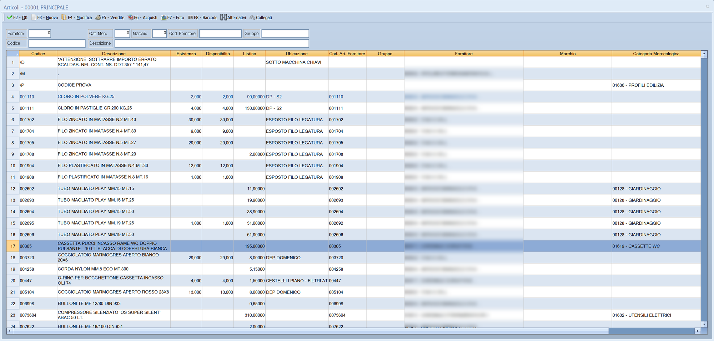

# Cerca articoli

È l'elenco da cui si ritrova un articolo. Mostra esistenza, disponibilità,
prezzo di listino e classificazione di ogni articolo, e lo si scorre o lo si
restringe con i campi di ricerca in alto. Da qui si sceglie l'articolo da
aprire o da portare nel campo da cui si è partiti.

!!! info "In sintesi"

    - **Percorso:**
        - Menu ▸ Archivi ▸ Articoli ▸ Modifica
        - **F5 - Cerca** dall'[anagrafica articoli](anagrafica-articoli.md)
        - ++f10++, ++space++ o doppio clic su un campo che chiede il codice di un articolo, in documenti, carichi, ordini, listini e stampe
    - **Scorciatoia:** nessuna propria; si apre dai punti elencati sopra
    - **Permessi richiesti:** nessun profilo predefinito; la voce **Modifica** si abilita per ogni utente da [Archivi ▸ Utenti](utenti.md). Alcuni comandi dell'elenco compaiono solo a chi ha i permessi corrispondenti: vedi [Pulsanti e comandi](#pulsanti-e-comandi)

---

## A cosa serve

Serve a trovare un articolo quando non ne ricordi il codice esatto, e a
vederne al volo la situazione senza aprirne la scheda: quanto ce n'è a
magazzino, quanto è già impegnato, a che prezzo si vende e chi lo fornisce.

Esempio: in una fattura sei sul campo del codice articolo e sai solo che si
tratta di un «tubo magliato». Premi ++f10++, scrivi `TUBO MAGLIATO` in
**Descrizione** e premi ++enter++: l'elenco mostra solo quei tubi, con
l'esistenza di ciascuno. Scegli la riga con **F2 - OK** e il codice torna
nella riga della fattura.

L'elenco lavora su **un deposito**, indicato nel titolo della finestra
(*Articoli - 00001 PRINCIPALE*): esistenza, disponibilità e ubicazione sono
quelle di quel deposito, per l'anno su cui stai lavorando.

## Prerequisiti

Nessuno. Perché le colonne siano utili, gli articoli devono avere un
[listino](../listini-vendita/gestione-listini.md) di vendita e, se li usi, il
fornitore abituale e la classificazione compilati nell'[anagrafica
articoli](anagrafica-articoli.md).

## La maschera

La finestra ha tre parti:

- in alto la **barra dei comandi**;
- sotto, i **campi di ricerca**, su due righe;
- al centro l'**elenco degli articoli**, che occupa il resto della finestra e
  si allarga quando ingrandisci la finestra.

Quali articoli compaiono dipende dall'utente: chi è impostato in
[Archivi ▸ Utenti](utenti.md) per vedere solo i record `ATTIVI` non vede gli
articoli cancellati, chi vede i `CANCELLATI` vede solo quelli, chi vede
`TUTTI` li vede tutti.

L'elenco si apre già posizionato sull'articolo da cui parti — quello caricato
nell'anagrafica, o quello scritto nel campo — e con la riga evidenziata.

### Colonne dell'elenco

| Colonna | Contenuto |
|---|---|
| **Codice** | Il codice dell'articolo. |
| **Descrizione** | Le due righe della descrizione, una di seguito all'altra. Se non ci stanno nella larghezza della colonna, vanno a capo su due linee. |
| **Esistenza** | La quantità presente nel deposito della finestra. |
| **Disponibilità** | L'esistenza meno quanto è già ordinato dai clienti e quanto è impegnato. |
| **Listino** | Il prezzo nel **Listino Principale** impostato nei [dati dell'azienda](ditte.md#scheda-parametri-magazzino). |
| **Peso** | **Solo Oreficerie.** Il peso dell'articolo. Nella versione **Taglie e Colori - Calzature** la colonna mostra invece il prezzo di un secondo listino, e la sua intestazione dice quale. |
| *fino a tre colonne di classificazione* | Le tabelle libere che l'azienda usa per classificare gli articoli — per esempio **Colore**, **Calibro**, **Famiglia**, **Settore**. L'intestazione prende il nome della tabella; se l'azienda non ne usa, la colonna non compare. |
| **Ubicazione** | Dove si trova l'articolo nel deposito della finestra. |
| **Cod. Art. Fornitore** | Il codice con cui il fornitore conosce l'articolo. |
| **Gruppo** | Il gruppo dell'articolo. |
| **Fornitore** | Il fornitore abituale, con codice e ragione sociale. |
| **Stagione** | La [stagione](../magazzino/stagioni.md), con codice e descrizione. Su alcune installazioni la colonna è **Marchio** e mostra il [marchio](../magazzino/marchi.md): la scelta la fa l'assistenza. |
| **Categoria Merceologica** | La [categoria merceologica](../magazzino/categorie-merceologiche.md), con codice e descrizione. |

Alcune righe si distinguono dal colore del testo:

| Aspetto della riga | Significato |
|---|---|
| testo **blu** | L'articolo è segnato come **Non più Ordinabile**. |
| testo **rosso** | L'articolo è cancellato, oppure è segnato **Fuori Assortimento**. |
| testo in **grassetto** | L'articolo ha una distinta base: è composto da altri articoli. |

## Campi

I campi in alto servono solo a cercare: non modificano nulla. La ricerca
parte quando esci dal campo, con ++enter++ o ++tab++.

| Campo | Obbl. | Descrizione | Valori ammessi |
|---|:---:|---|---|
| **Fornitore** | | Gli articoli che hanno questo fornitore come fornitore abituale. ++f10++, ++space++ o doppio clic aprono l'elenco dei fornitori. | codice fornitore |
| **Peso** | | **Solo Oreficerie.** Gli articoli con peso uguale o superiore a quello indicato. | numero |
| **Cat. Merc.** | | Gli articoli di questa categoria merceologica. ++f10++, ++space++ o doppio clic aprono l'elenco delle categorie. | codice |
| **Stagione** | | Gli articoli di questa stagione. ++f10++, ++space++ o doppio clic aprono l'elenco delle stagioni. Dove la colonna è **Marchio**, anche il campo si chiama **Marchio** e cerca per marchio. | codice |
| **Cod. Fornitore** | | Gli articoli il cui codice presso il fornitore comincia con il testo scritto. | testo |
| **Gruppo** | | Gli articoli il cui gruppo comincia con il testo scritto. ++f10++, ++space++ o doppio clic aprono la tabella dei gruppi, posizionata sul gruppo che comincia con il testo scritto. | testo |
| **Codice** | | Porta l'elenco in ordine di codice e si posiziona sul codice scritto, o sul primo che lo segue. Non restringe l'elenco. | testo |
| **Descrizione** | | Gli articoli la cui descrizione comincia con il testo scritto. Accetta i caratteri jolly: vedi sotto. | testo |
| **Banco - PLU** | | **Solo Megastore.** Due caselle: il numero del bancone e il PLU. Si può compilarne una sola. | numeri |

{: .campi }

Nella versione **Taglie e Colori**, sugli archivi c-tree, un **Codice** fatto
di sole cifre e più corto di sei viene completato con gli zeri davanti:
`123` cerca `000123`.

### Un criterio alla volta

I campi non si sommano: quando cerchi con uno, gli altri si svuotano.

Come si comporta la ricerca dipende dall'archivio dell'installazione:

- sugli archivi **PostgreSQL** l'elenco **si restringe** agli articoli che
  soddisfano il criterio, ordinati per quel criterio. Per tornare all'elenco
  completo, cancella il campo che hai usato ed esci dal campo;
- sugli archivi **c-tree** l'elenco resta completo: viene **riordinato** per
  quel criterio e si **posiziona** sul primo articolo che lo soddisfa. Fa
  eccezione la **Descrizione**, che anche qui restringe l'elenco.

Il **Codice** fa eccezione in tutti e due i casi: si posiziona e basta.

### I caratteri jolly nella descrizione

Senza caratteri jolly, **Descrizione** trova gli articoli la cui descrizione
*comincia* con il testo scritto. Con i caratteri jolly la ricerca diventa
libera:

| Carattere | Significato | Esempio |
|---|---|---|
| `*` | Qualsiasi sequenza di caratteri, anche vuota. | `*RAME*` trova tutti gli articoli che hanno «RAME» in un punto qualsiasi della descrizione. |
| `?` | Un carattere qualsiasi, uno solo. | `*MM.1?*` trova le descrizioni che contengono `MM.15`, `MM.19` e simili. |

Quando usi un carattere jolly, il programma non aggiunge più nulla da sé:
`*RAME` trova solo le descrizioni che *finiscono* per «RAME». Per cercare una
parola in mezzo, metti l'asterisco da tutte e due le parti.

Sugli archivi PostgreSQL la ricerca guarda **la prima riga** della
descrizione; sugli archivi c-tree, con i caratteri jolly, guarda tutte e due
le righe.

## Pulsanti e comandi

| Comando | Scorciatoia | Effetto |
|---|---|---|
| **F2 - OK** | ++f2++, ++enter++ o doppio clic sulla riga | Sceglie l'articolo della riga evidenziata. Aperto da **Archivi ▸ Articoli ▸ Modifica** o dall'[anagrafica](anagrafica-articoli.md), carica l'articolo nell'anagrafica; aperto da un campo, riporta lì il codice. |
| **F3 - Nuovo** | ++f3++ | Apre l'[anagrafica articoli](anagrafica-articoli.md) per inserire un articolo nuovo. Quando la chiudi, l'elenco si riposiziona sull'ultimo articolo inserito. Compare solo a chi ha il permesso **Archivi ▸ Articoli ▸ Inserimento**, e mai quando l'elenco mostra gli articoli cancellati. |
| **F4 - Modifica** | ++f4++ | Apre la scheda dell'articolo evidenziato per modificarlo, senza chiudere l'elenco. Quando la chiudi, l'elenco si riposiziona sull'articolo e i campi di ricerca si svuotano; sugli archivi PostgreSQL torna anche in ordine di descrizione. Compare solo a chi ha il permesso **Archivi ▸ Articoli ▸ Modifica**. |
| **F5 - Vendite** | ++f5++ | Apre *Ultime Vendite Art.*: le ultime vendite dell'articolo evidenziato. Pulsante e tasto ci sono solo per chi ha il permesso **Vendite ▸ Vendita** o **Vendite ▸ Pos Touchscreen**. |
| **F6 - Acquisti** | ++f6++ | Apre *Ultimi Acquisti Art.*: gli ultimi acquisti dell'articolo evidenziato. Pulsante e tasto ci sono solo per chi ha il permesso **Magazzino ▸ Nuovo Carico Merci** o **Modifica Carico Merci**; per gli utenti a cui i costi sono preclusi il comando non fa nulla. |
| **F7 - Foto** | ++f7++ | Apre la *Gestione immagini articoli* dell'articolo evidenziato. |
| **F8 - Barcode** | ++f8++ | Apre *Cerca Codice a Barre*: leggi o scrivi un codice a barre e l'elenco si posiziona sull'articolo a cui appartiene. |
| **Matricola** | | Compare solo se l'azienda gestisce le matricole. Apre *Cerca Matricola*: scritto un numero di matricola, l'elenco mostra solo l'articolo che la porta. |
| **Alternativi** | | Apre gli *Articoli Alternativi* dell'articolo evidenziato. Se ne scegli uno, è quello a essere scelto, come con **F2 - OK**. |
| **Collegati** | | Apre gli *Articoli Collegati* dell'articolo evidenziato. Se ne scegli uno, è quello a essere scelto, come con **F2 - OK**. |
| Note | ++f9++ | Apre in Word le note descrittive dell'articolo evidenziato. Non ha un pulsante: vedi [Consultare le note di un articolo](#consultare-le-note-di-un-articolo). |

Valgono inoltre in tutta la maschera:

| Comando | Scorciatoia | Effetto |
|---|---|---|
| Guida | ++f1++ | Apre questa pagina. |
| Elenco valori | ++f10++, ++space++ o doppio clic | Su **Fornitore**, **Cat. Merc.**, **Stagione** (o **Marchio**) e **Gruppo** apre l'elenco da cui scegliere. |
| Calcolatrice | ++f12++ | Apre la calcolatrice. |
| Campo successivo | ++enter++ o ++down++ | Nei campi di ricerca, sposta il cursore sul campo seguente. Dall'ultima riga dell'elenco, ++down++ passa al campo seguente. |
| Campo precedente | ++up++ | Nei campi di ricerca, sposta il cursore sul campo precedente. Dalla prima riga dell'elenco, ++up++ risale ai campi. |
| Chiusura | ++esc++ | Chiude l'elenco senza scegliere nulla. |

## Come si fa

### Trovare un articolo di cui conosci una parte della descrizione

1. Apri l'elenco, per esempio da **Menu ▸ Archivi ▸ Articoli ▸ Modifica**.
2. Fai clic in **Descrizione**.
3. Scrivi la parola che ricordi fra due asterischi, per esempio `*MAGLIATO*`.
4. Premi ++enter++: l'elenco mostra solo gli articoli che contengono la
   parola.
5. Evidenzia la riga che cerchi e premi **F2 - OK**.

### Trovare un articolo dal codice del fornitore

1. Fai clic in **Cod. Fornitore**.
2. Scrivi il codice riportato sul documento del fornitore, anche solo
   l'inizio.
3. Premi ++enter++: l'elenco va sugli articoli con quel codice.
4. Evidenzia la riga e premi **F2 - OK**.

### Trovare un articolo con il lettore di codici a barre

1. Premi **F8 - Barcode**.
2. Nella finestra *Cerca Codice a Barre* leggi il codice con il lettore.
3. Conferma: l'elenco si posiziona sull'articolo a cui appartiene il codice.
4. Premi **F2 - OK**.

### Vedere gli articoli di un fornitore

1. Fai clic in **Fornitore** e premi ++f10++.
2. Scegli il fornitore dall'elenco: il codice torna nel campo.
3. Premi ++enter++: l'elenco va sugli articoli che hanno quel fornitore come
   fornitore abituale.

### Controllare vendite e acquisti di un articolo senza aprirlo

1. Evidenzia la riga dell'articolo.
2. Premi **F5 - Vendite** per le ultime vendite, oppure **F6 - Acquisti** per
   gli ultimi acquisti.
3. Chiudi la finestra con ++esc++: torni all'elenco, sulla stessa riga.

### Consultare le note di un articolo

Le note di un articolo sono un documento Word, uno per articolo.

1. Evidenzia la riga dell'articolo.
2. Premi ++f9++.
3. La prima volta il programma chiede la cartella in cui tenere le note,
   con la finestra *Percorso Note Articoli*: scegline una condivisa, se le
   note devono vederle tutte le postazioni. Nelle sessioni di Terminal Server
   la cartella la sceglie il programma da sé.
4. Se l'articolo non ha ancora note, rispondi **Sì** alla domanda *Le vuoi
   creare?*: il documento nasce da un modello comune.
5. Il documento si apre in Word, o in WordPad se Word non è installato.
   Salvalo prima di chiuderlo.

## Controlli e messaggi

| Messaggio | Causa | Cosa fare |
|---|---|---|
| *Corrispondenza univoca non trovata !* | Solo sugli archivi c-tree. Nessun articolo ha esattamente il **Cod. Fornitore** scritto: l'elenco si è posizionato sul codice più vicino. | Controlla le righe vicine, oppure cerca con una parte del codice. |
| *Corrispondenza Bancone/Plu non trovata !* | **Solo Megastore**, sugli archivi c-tree. Nessun articolo ha il bancone e il PLU scritti in **Banco - PLU**: l'elenco si è posizionato sul più vicino. | Controlla i due numeri. |
| *Note non presenti! Le vuoi creare?* | Hai premuto ++f9++ su un articolo che non ha ancora il documento delle note. | Rispondi **Sì** per crearlo dal modello, **No** per lasciar perdere. |

## Note

L'ordine in cui l'elenco si apre lo decide, sugli archivi c-tree,
l'impostazione **Preval. Ricerca Codice** dei [dati
dell'azienda](ditte.md#scheda-parametri-magazzino): con `SI` in ordine di
codice, con `NO` in ordine di descrizione. Sugli archivi PostgreSQL l'elenco
parte in ordine di descrizione, e rispetta l'impostazione solo quando lo apri
dalla **Vendita** al banco.
<!-- DA VERIFICARE: su PostgreSQL l'elenco ignora Preval. Ricerca Codice e parte per descrizione (tranne che dalla Vendita al banco), mentre su c-tree la rispetta ovunque. È voluto? -->

## Vedi anche

- [Anagrafica articoli](anagrafica-articoli.md)
- [Utenti](utenti.md) — quali articoli vede ciascun utente e quali comandi
  gli compaiono
- [Dati dell'azienda](ditte.md) — listino principale e ordine di partenza
  dell'elenco
- [Categorie merceologiche](../magazzino/categorie-merceologiche.md),
  [Stagioni](../magazzino/stagioni.md), [Marchi](../magazzino/marchi.md)
