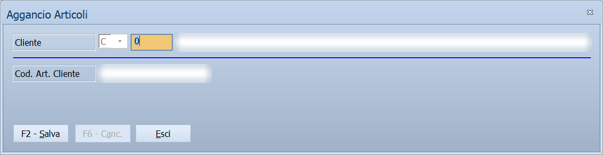

# Codici articolo dei clienti

Alcuni clienti vogliono vedere sui documenti il **loro** codice dell'articolo,
non il tuo. Questa finestra tiene la corrispondenza, articolo per articolo e
cliente per cliente.

!!! info "In sintesi"

    - **Percorso:** Menu ▸ Archivi ▸ Articoli ▸ Modifica, poi **F7 - Altri ▸ Agganci <-> Cod. Art. Clienti**
    - **Scorciatoia:** ++f2++ salva, ++f6++ cancella, ++f1++ apre questa pagina
    - **Permessi richiesti:** gli stessi dell'[anagrafica articoli](anagrafica-articoli.md)

---

## A cosa serve

La catena di supermercati, la centrale o il grossista che ti manda gli ordini
ha una sua codifica degli articoli. Quando il documento deve arrivargli con
quei codici, il programma li prende da qui.

Li usano:

- le **fatture elettroniche** dei clienti con **Formato** `CARREFOUR`
  nell'[anagrafica clienti](anagrafica-clienti.md): il codice va nel file al
  posto del tuo;
- il tracciato **Esportazione Fatture Tracciato SMAFIN**, che segnala le
  righe senza codice;
- solo nella versione Ortofrutta, l'esportazione in Excel di
  [Modifica da griglia](modifica-da-griglia.md), che affianca a ogni articolo
  il codice del cliente scelto.
<!-- DA VERIFICARE: da quale voce di menu parte l'invio EDI degli avvisi di spedizione (DESADV), che usa anch'esso questi codici? -->

Un articolo può avere un codice diverso per ogni cliente.

## Prerequisiti

Prima di usare questa finestra occorre:

- avere l'articolo in [anagrafica](anagrafica-articoli.md) e aprirlo in
  modifica;
- avere in archivio il [cliente](anagrafica-clienti.md);
- conoscere il codice con cui quel cliente chiama l'articolo: te lo dà lui,
  di solito con il suo listino o il suo catalogo.

## La maschera

La finestra *Aggancio Articoli* si apre sull'articolo che hai in modifica.
Sopra la linea c'è il **Cliente**, sotto il codice che quel cliente usa. In
fondo **F2 - Salva**, **F6 - Canc.** ed **Esci**.

La casella piccola accanto al codice del cliente mostra **C** ed è bloccata:
qui si registrano solo codici di clienti.

## Campi

| Campo | Obbl. | Descrizione | Valori ammessi |
|---|:---:|---|---|
| **Cliente** | ● | Il [cliente](anagrafica-clienti.md) a cui il codice si riferisce. Se per quel cliente il codice è già registrato, compare subito. | codice |
| **Cod. Art. Cliente** | ● | Il codice con cui il cliente chiama l'articolo. | testo, fino a 35 caratteri |

La colonna **Obbl.** segna con ● i campi che il programma richiede
obbligatoriamente per salvare.

## Pulsanti e comandi

| Comando | Scorciatoia | Effetto |
|---|---|---|
| **F2 - Salva** | ++f2++ | Registra il codice e svuota la finestra per il cliente successivo. Se per quel cliente c'era già un codice, lo sostituisce. |
| **F6 - Canc.** | ++f6++ | Cancella il codice del cliente indicato. È attivo solo quando il codice è già registrato. |
| **Esci** | ++esc++ | Chiude la finestra e torna all'articolo. |
| Elenco dei clienti | ++f10++, ++space++ o doppio clic | Sul campo **Cliente**, apre l'elenco da cui scegliere. |
| Guida | ++f1++ | Apre questa pagina. |
| Consultazione | ++f11++ | Apre la finestra **Consultazione**. |
| Calcolatrice | ++f12++ | Apre la calcolatrice. |
| Campo successivo | ++enter++ o ++down++ | Sposta il cursore sul campo seguente; ++up++ torna indietro. |

## Come si fa

### Registrare il codice di un cliente

1. Apri l'articolo da **Menu ▸ Archivi ▸ Articoli ▸ Modifica**.
2. Premi **F7 - Altri** e scegli **Agganci <-> Cod. Art. Clienti**.
3. In **Cliente** scrivi il codice del cliente, oppure premi ++f10++ e
   sceglilo dall'elenco.
4. Scrivi in **Cod. Art. Cliente** il codice che usa lui.
5. Premi **F2 - Salva**: la finestra si svuota ed è pronta per un altro
   cliente.

### Cambiare o togliere un codice

1. Apri la finestra dall'articolo come sopra.
2. Indica il **Cliente**: il codice registrato compare in **Cod. Art.
   Cliente**.
3. Per cambiarlo, correggilo e premi **F2 - Salva**; per toglierlo, premi
   **F6 - Canc.**

## Controlli e messaggi

| Messaggio | Causa | Cosa fare |
|---|---|---|
| *(nessun messaggio, solo un segnale acustico)* | Manca il **Cliente** o il **Cod. Art. Cliente**. | Compila il campo su cui si è posizionato il cursore. |

## Note

!!! info "Non è il Cod. Fornitore dell'articolo"

    L'anagrafica articoli ha già un campo **Cod. Fornitore**: è **uno solo** per
    articolo, ed è il codice con cui lo chiama il fornitore, cioè chi te lo
    vende. Quello che si scrive qui è diverso: è il codice di chi **compra** da
    te, e ce n'è uno per ogni cliente.

!!! info "Si vede un cliente alla volta"

    La finestra non mostra l'elenco dei clienti che hanno un codice per
    l'articolo: per sapere se un cliente ce l'ha, lo si indica e si guarda se
    il codice compare.

## Vedi anche

- [Anagrafica articoli](anagrafica-articoli.md)
- [Anagrafica clienti](anagrafica-clienti.md)
- [Agganci trasferimento documenti](agganci-trasferimento-documenti.md), l'analoga tabella per i codici dei clienti
