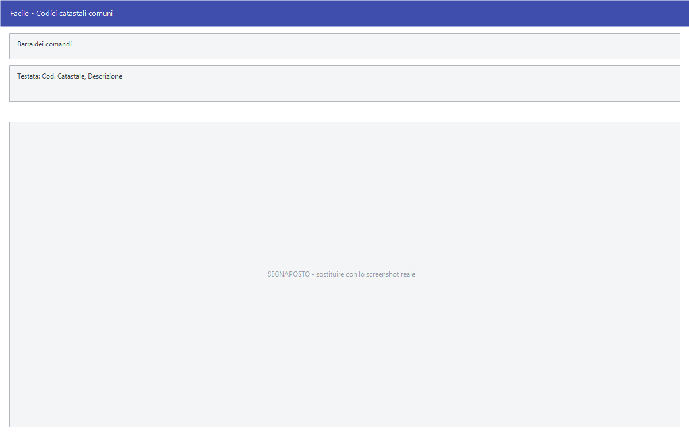

# Codici catastali comuni

Da questa maschera si tiene l'archivio dei comuni italiani: descrizione, CAP,
provincia, codice catastale e i codici degli uffici fiscali. È l'archivio da
cui le anagrafiche pescano provincia e CAP quando digiti il nome di un comune.

!!! info "In sintesi"

    **Percorso:** Menu ▸ Archivi ▸ Codici Catastali Comuni ▸ Inserimento *(oppure* Modifica*)*
    **Scorciatoia:** nessuna; la maschera si apre dal menu
    **Permessi richiesti:** nessun profilo predefinito; **Inserimento** e **Modifica** si abilitano separatamente per ogni utente da [Archivi ▸ Utenti](utenti.md)

---

## A cosa serve

È l'archivio che fa funzionare la compilazione automatica: quando in
anagrafica clienti, fornitori o banche scrivi il nome di un comune, il
programma cerca qui e riempie da solo provincia e CAP.

Serve inoltre il **Cod. Catastale**, che le stampe fiscali e la fatturazione
elettronica richiedono per identificare il comune di nascita o di residenza.

L'archivio arriva già compilato con i comuni italiani: normalmente si apre
questa maschera solo per correggere un CAP cambiato o per aggiungere un comune
di nuova istituzione.

## Prerequisiti

*Nessuno.*

## La maschera

È una maschera a finestra unica, senza schede: la **barra dei comandi** e
quattro righe di campi, con i dati anagrafici del comune in alto e i codici
degli uffici fiscali sotto.

## Campi

| Campo | Obbl. | Descrizione | Valori ammessi |
|---|:---:|---|---|
| Cod. Catastale | | Codice catastale del comune, quello che compare sui certificati e nei codici fiscali. | Fino a 4 caratteri |
| Descrizione | ● | Nome del comune. È l'unico dato che il programma pretende, ed è quello su cui le anagrafiche cercano. | Fino a 30 caratteri |
| CAP | | Codice di avviamento postale principale del comune. | Fino a 5 caratteri |
| Regione | | Regione a cui il comune appartiene. | Da elenco |
| Prov. | | Sigla della provincia. | 2 caratteri |
| Codice Rifiuti | | Codice del comune per gli adempimenti sui rifiuti. | Fino a 7 caratteri |
| Codice Ufficio Registro | | Codice dell'ufficio del registro, su due caselle affiancate. | Fino a 3 caratteri ciascuna |
| Codice Ufficio IVA | | Codice dell'ufficio IVA competente. | Fino a 3 caratteri |
| Codice Ufficio Imposte | | Codice dell'ufficio delle imposte competente. | Fino a 3 caratteri |
| Codice Istat | | Codice ISTAT del comune. | Fino a 6 caratteri |
| Azienda USL | | Codice dell'azienda sanitaria di competenza. | Fino a 3 caratteri |

{: .campi }

## Pulsanti e comandi

| Comando | Scorciatoia | Effetto |
|---|---|---|
| **F2 - Salva** | ++f2++ | Registra il comune. In inserimento la maschera si svuota per il successivo. |
| **F3 - Prec.** | ++f3++ | Passa al comune precedente. |
| **F4 - Succ.** | ++f4++ | Passa al comune successivo. |
| **F5 - Cerca** | ++f5++ | Apre l'elenco dei comuni. |
| **F6 - Elimina** | ++f6++ | Cancella il comune, previa conferma. |
| **Ricarica** | | Rilegge il comune dall'archivio, abbandonando le modifiche non salvate. |

Valgono inoltre:

| Comando | Scorciatoia | Effetto |
|---|---|---|
| Consultazione | ++f11++ | Apre la finestra **Consultazione**. |
| Calcolatrice | ++f12++ | Apre la calcolatrice. |
| Campo successivo | ++enter++ | Sposta il cursore sul campo seguente. |
| Chiusura | ++esc++ | Chiude la maschera. |

## Come si fa

### Aggiungere un comune

1. Apri **Menu ▸ Archivi ▸ Codici Catastali Comuni ▸ Inserimento**.
2. Scrivi la **Descrizione**: è l'unico dato obbligatorio, ed è il nome su cui
   le anagrafiche cercheranno.
3. Compila **Cod. Catastale**, **CAP**, **Prov.** e **Regione**.
4. Se ti servono, aggiungi i codici degli uffici fiscali.
5. Premi **F2 - Salva**.

### Correggere il CAP di un comune

1. Premi **F5 - Cerca** e carica il comune.
2. Correggi il **CAP**.
3. Premi **F2 - Salva**. Da quel momento le anagrafiche proporranno il CAP
   nuovo; quelle già compilate restano come sono.

## Controlli e messaggi

| Messaggio | Causa | Cosa fare |
|---|---|---|
| *(nessun messaggio, solo un segnale acustico)* | Manca la **Descrizione**. | Il cursore torna sul campo: scrivi il nome del comune. |
| *In archivio è già presente un record con lo stesso codice.* | Il comune digitato è già in archivio. | Cerca il comune esistente invece di crearne un altro. |
| *Confermi la Cancellazione....* | Conferma richiesta da **F6 - Elimina**. | Rispondi **Sì** per eliminare il comune. |
| *Non è possibile eliminare il record pochè utilizzato in alcuni record del database.* | Il comune è richiamato da altri archivi. | Non è eliminabile: lascialo in archivio. |
| *Il record è stato modificato da un altro nodo della rete.* | Un altro utente ha salvato lo stesso comune mentre lo modificavi. | Premi **Ricarica**, verifica cosa è cambiato e rifai le tue modifiche. |
| *Il record è stato cancellato da un altro nodo della rete.* | Un altro utente ha eliminato il comune mentre lo modificavi. | La maschera si chiude: non c'è più nulla da salvare. |

## Note

!!! warning "Attenzione"

    La compilazione automatica di provincia e CAP nelle anagrafiche funziona
    **solo se il nome digitato coincide esattamente** con la **Descrizione**
    registrata qui. Un comune scritto in due modi diversi — con o senza
    l'articolo, con o senza l'accento — non viene trovato.

    Un comune con lo stesso nome in province diverse va registrato due volte,
    e in quel caso le anagrafiche chiedono quale dei due si intende invece di
    compilare da sole.

    ++esc++ chiude la maschera senza chiedere conferma e senza salvare: le
    modifiche fatte dopo l'ultimo **F2 - Salva** vanno perse.

<!-- DA VERIFICARE: il campo Cod. Catastale non è obbligatorio, ma serve alla fatturazione elettronica. Vale la pena renderlo obbligatorio nel programma, o basta segnalarlo nel manuale? -->

<!-- DA VERIFICARE: il Codice Ufficio Registro è diviso in due caselle affiancate senza etichette distinte. Che cosa va scritto in ciascuna? -->

## Vedi anche

- [Nazioni](nazioni.md)
- [Anagrafica clienti](anagrafica-clienti.md)
