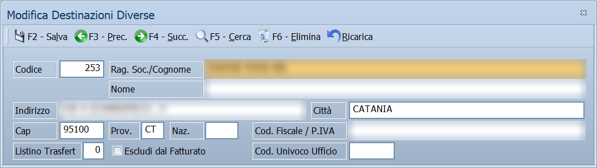
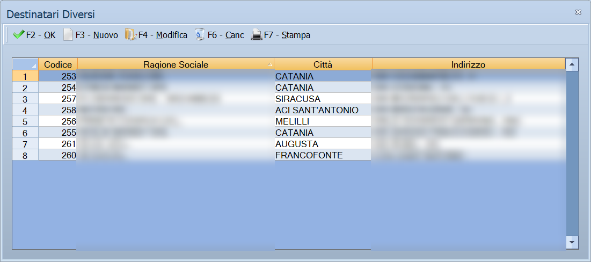

# Destinazioni diverse

In questa maschera si registra un indirizzo **diverso dalla sede** di un cliente,
di un fornitore o della ditta: la destinazione dove consegnare la merce, un
luogo di carico, oppure il titolare o rappresentante legale. È la stessa
maschera in tutti questi casi: cambiano il titolo e i campi che mostra.

!!! info "In sintesi"

    - **Percorso:**
        - Menu ▸ Archivi ▸ Clienti ▸ Inserimento e Modifica, schede *Destinazioni Diverse* e *Luoghi Carico*
        - Menu ▸ Archivi ▸ Fornitori ▸ Inserimento e Modifica, scheda *Destinazioni Diverse*
        - Menu ▸ Archivi ▸ Ditte, scheda *Destinazioni*
        - Clienti e fornitori, **F7 - Altri ▸ Titolare/Rappr. Legale**
        - Clienti, **F7 - Altri ▸ Collaboratori** (e **Delegati** nella versione per studi professionali)
        - L'elenco delle destinazioni, da tutte le maschere in cui si sceglie una destinazione
    - **Scorciatoia:** nessuna; si apre dai pulsanti di inserimento e modifica delle schede
    - **Permessi richiesti:** gli stessi dell'anagrafica da cui si apre

---

## A cosa serve

Un cliente può farsi consegnare la merce in un posto diverso dalla sede: un
cantiere, un magazzino, un secondo punto vendita. Ognuno di questi indirizzi è
una **destinazione diversa**, con un suo numero, e si sceglie poi sui documenti
di vendita al posto dell'indirizzo del cliente.

La stessa maschera registra anche:

- i **luoghi di carico** di un cliente, cioè da dove parte la merce;
- il **titolare o rappresentante legale** di un cliente o di un fornitore,
  con codice fiscale e dati di nascita, che servono alle comunicazioni fiscali;
- i **collaboratori** di un cliente e, nella versione per studi professionali,
  i suoi **delegati**, con gli stessi dati del titolare;
- le destinazioni merce della **ditta**.

## Prerequisiti

- Il [cliente](anagrafica-clienti.md), il [fornitore](anagrafica-fornitori.md)
  o la [ditta](ditte.md) a cui appartiene la destinazione deve essere già
  salvato: la maschera si apre dalle sue schede.

## La maschera

In alto la barra con **F2 - Salva**, sotto i campi. Il titolo della finestra
dice che cosa si sta registrando e se è un inserimento o una modifica:

| Da dove si apre | Titolo |
|---|---|
| Scheda *Destinazioni Diverse* di clienti, fornitori e ditte | *Inserimento Destinazioni Diverse* / *Modifica Destinazioni Diverse* |
| Scheda *Luoghi Carico* dei clienti | *Inserimento Luoghi di Carico* / *Modifica Luoghi di Carico* |
| **F7 - Altri ▸ Titolare/Rappr. Legale** | *Inserimento Titolare - Rappr. Legale* / *Modifica Titolare - Rappr. Legale* |
| **F7 - Altri ▸ Collaboratori**, poi **F3 - Nuovo** o **F4 - Modifica** | *Inserimento Dipendente* / *Modifica Dipendenti* |
| **F7 - Altri ▸ Delegati** (versione per studi professionali) | *Inserimento Delegati* / *Modifica Delegati* |

I campi cambiano con il caso:

- per le **destinazioni** si vedono tutti i campi dell'indirizzo, i dati fiscali,
  **Listino Trasfert** ed **Escludi dal Fatturato**;
- per i **luoghi di carico** spariscono **Cod. Fiscale / P.IVA**, **Listino
  Trasfert** ed **Escludi dal Fatturato**;
- per il **titolare**, i **collaboratori** e i **delegati** spariscono
  **Listino Trasfert** ed **Escludi dal Fatturato**, le etichette diventano
  **Cognome** e **Cod. Fiscale**, e in basso compare un riquadro con i dati di
  nascita.

### L'elenco delle destinazioni

Dove bisogna scegliere una destinazione — nelle scadenze, nei banchi
conservatori, nelle associazioni di gruppi e giri, negli agganci — si apre
l'elenco delle destinazioni del cliente o del fornitore, con le colonne
**Codice**, **Ragione Sociale**, **Città** e **Indirizzo**. Il titolo dice
che cosa elenca: *Destinatari Diversi*, *Luoghi di Carico*, *Dipendenti* (i
collaboratori) e, nella versione per studi professionali, *Titolari* e
*Delegati*. Dall'elenco si sceglie la riga, e si possono anche aggiungere,
correggere, cancellare e stampare le destinazioni.

## Campi

| Campo | Obbl. | Descrizione | Valori ammessi |
|---|:---:|---|---|
| **Codice** | ● | Il numero della destinazione. In inserimento il programma propone il successivo al più alto già usato; in modifica non si può cambiare. La numerazione è unica per tutte le destinazioni, non riparte da 1 per ogni cliente. | Numero |
| **Rag. Soc./Cognome** | ● | La ragione sociale della destinazione. Per il titolare l'etichetta diventa **Cognome**. | Fino a 45 caratteri, maiuscolo |
| **Nome** | | Il seguito della ragione sociale, o il nome del titolare. | Fino a 45 caratteri, maiuscolo |
| **Indirizzo** | | Via e numero civico. | Fino a 100 caratteri, maiuscolo |
| **Città** | | Il comune. Uscendo dal campo il programma lo cerca nei [codici catastali comuni](codici-catastali-comuni.md): se ne trova uno solo compila da solo **Prov.** e **Cap**, se ne trova più d'uno apre l'elenco per sceglierlo. | Fino a 30 caratteri, maiuscolo |
| **Cap** | | Il codice di avviamento postale. | Fino a 5 cifre |
| **Prov.** | | La sigla della provincia. | 2 caratteri |
| **Naz.** | | La nazione, per gli indirizzi esteri. | Fino a 4 caratteri |
| **Cod. Fiscale / P.IVA** | | Il codice fiscale o la partita IVA della destinazione; per il titolare l'etichetta diventa **Cod. Fiscale**. Non c'è per i luoghi di carico. | Fino a 16 caratteri |
| **Listino Trasfert** | | Listino applicato ai trasferimenti verso questa destinazione. Solo per le destinazioni. | Numero di listino |
| **Escludi dal Fatturato** | | Esclude la destinazione dalle [stampe clienti](stampe-clienti.md) che filtrano su questo segno. Solo per le destinazioni. | Sì / No |
| **Cod. Univoco Ufficio** | | Il codice IPA dell'ufficio, per le destinazioni della Pubblica Amministrazione. | Fino a 6 caratteri |

Solo per il **titolare**, nel riquadro in basso:

| Campo | Obbl. | Descrizione | Valori ammessi |
|---|:---:|---|---|
| **Luogo Nascita** | | Il comune di nascita. | Fino a 30 caratteri, maiuscolo |
| **Cap**, **Prov.** | | CAP e provincia del comune di nascita. | 5 cifre; 2 caratteri |
| **Data Nascita** | | La data di nascita. | Data |
| **Sesso** | | Il sesso del titolare. | MASCHILE, FEMMINILE |

## Pulsanti e comandi

| Comando | Scorciatoia | Effetto |
|---|---|---|
| **F2 - Salva** | ++f2++ | Registra la destinazione. In inserimento la maschera si svuota per la successiva; in modifica resta sulla stessa. |
| Calcolatrice | ++f12++ | Apre la calcolatrice. |
| Uscita | ++esc++ | Chiude la maschera senza salvare. |

Nell'elenco delle destinazioni:

| Comando | Scorciatoia | Effetto |
|---|---|---|
| **F2 - OK** | ++f2++ | Sceglie la destinazione della riga attiva. Lo stesso fa il doppio clic sulla riga. |
| **F3 - Nuovo** | ++f3++ | Apre la maschera per aggiungere una destinazione; tornando, l'elenco si aggiorna. |
| **F4 - Modifica** | ++f4++ | Apre la destinazione della riga attiva per correggerla. |
| **F6 - Canc** | ++f6++ | Cancella la destinazione della riga attiva, **senza chiedere conferma**. |
| **F7 - Stampa** | ++f7++ | Stampa l'elenco del cliente o del fornitore, ordinato per ragione sociale, città e indirizzo. |
| Calcolatrice | ++f12++ | Apre la calcolatrice. |

## Come si fa

### Aggiungere una destinazione a un cliente

1. Apri il cliente da **Archivi ▸ Clienti ▸ Inserimento e Modifica**.
2. Passa alla scheda *Destinazioni Diverse* e premi **Nuovo**.
3. Controlla il **Codice** proposto e scrivi **Rag. Soc./Cognome**.
4. Compila **Indirizzo**; in **Città** scrivi il comune e premi ++tab++:
   provincia e CAP si compilano da soli.
5. Premi **F2 - Salva**: la destinazione compare nell'elenco della scheda e la
   maschera si svuota per la successiva.

### Scegliere una destinazione dall'elenco

1. Nella maschera da cui si è aperto l'elenco, controlla che il titolo sia
   quello che cerchi: *Destinatari Diversi*, *Luoghi di Carico*, *Dipendenti*…
2. Se la destinazione non c'è, premi **F3 - Nuovo** e registrala: tornando,
   l'elenco la mostra già.
3. Seleziona la riga e premi **F2 - OK**, o fai doppio clic: l'elenco si chiude
   e la destinazione passa alla maschera di partenza.

### Registrare il titolare di un cliente

Collaboratori e delegati si registrano allo stesso modo, da **F7 - Altri ▸
Collaboratori** e **F7 - Altri ▸ Delegati**, passando dall'elenco con **F3 -
Nuovo**.

1. Apri il cliente e premi **F7 - Altri ▸ Titolare/Rappr. Legale**.
2. Compila **Cognome**, **Nome** e **Cod. Fiscale**.
3. Compila nel riquadro in basso luogo, CAP, provincia e data di nascita e il
   sesso.
4. Premi **F2 - Salva**.

## Controlli e messaggi

Se **Codice** o **Rag. Soc./Cognome** sono vuoti il programma non salva: emette
un segnale acustico e mette il cursore sul campo da compilare, senza messaggio.

| Messaggio | Causa | Cosa fare |
|---|---|---|
| *Codice Fiscale o Partita Iva non Valida ! Vuoi Continuare?* | Il contenuto di **Cod. Fiscale / P.IVA** di una destinazione non è né un codice fiscale né una partita IVA validi. | **No** torna sul campo per correggerlo (è la risposta proposta); **Sì** salva lo stesso. |
| *Codice Fiscale non Valido ! Vuoi Continuare?* | Per il titolare, **Cod. Fiscale** non è un codice fiscale valido. | Come sopra. |
| *Non hai l' Autorizzazioni sufficienti per completare l' operazione.* | Nella ditta è impostato un intervallo di codici clienti e il **Codice** scritto è fuori da quell'intervallo. | Usa un codice dentro l'intervallo: quello proposto lo è già. |
| *Vuoi memorizzare le coordinate delle Destinazioni ?* | All'apertura, solo con Facile avviato in modalità di assistenza tecnica e con **Memorizza Coordinate** attivo nella [ditta](ditte.md). | **Sì** calcola le coordinate geografiche di tutte le destinazioni che non le hanno ancora; **No** apre la maschera e basta. È un'operazione per il tecnico. |

## Note

!!! warning "Nell'elenco, F6 cancella subito"

    **F6 - Canc** cancella la destinazione della riga attiva senza nessuna
    domanda di conferma, e non si torna indietro. Prima di premerlo, controlla
    che la riga selezionata sia quella giusta.

!!! note "Le coordinate si ricalcolano da sole"

    Con **Memorizza Coordinate** attivo nella ditta, il programma tiene la
    posizione geografica di ogni destinazione. Cambiando **Indirizzo**,
    **Città**, **Cap**, **Prov.** o **Naz.** le coordinate vecchie vengono
    cancellate, e il programma le ricalcola sull'indirizzo nuovo.

Nella versione Energy, in modifica di una destinazione di un cliente, la barra
ha in più il pulsante **Dati Agenzia Dogane**, che apre i
[dati doganali della destinazione](../versioni/energy/dati-agenzia-dogane.md).

## Vedi anche

- [Anagrafica clienti](anagrafica-clienti.md)
- [Anagrafica fornitori](anagrafica-fornitori.md)
- [Ditte](ditte.md)
- [Codici catastali comuni](codici-catastali-comuni.md)
