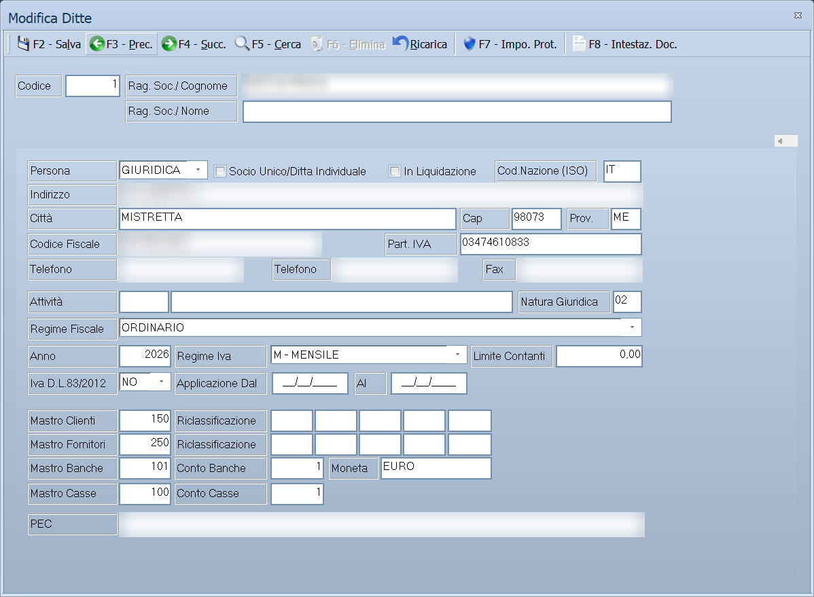

# Ditte

La scheda dell'azienda: i suoi dati fiscali, i progressivi dei documenti, i
parametri di magazzino e di contabilità, la modulistica, la fatturazione
elettronica. È la maschera che decide **come si comporta il programma** per
quella ditta. Da qui si passa anche da un'azienda all'altra.

!!! info "In sintesi"

    - **Percorso:** Menu ▸ Archivi ▸ Ditte ▸ Inserimento *(oppure* Modifica *o* Cambio Ditta*)*
    - **Scorciatoia:** ++f2++ salva, ++f3++ precedente, ++f4++ successiva, ++f5++ cerca, ++f6++ elimina
    - **Permessi richiesti:** l'inserimento chiede una password di amministrazione; la voce di menu si abilita per ogni utente da [Archivi ▸ Utenti](utenti.md). I due comandi **F7** e **F8** compaiono **solo all'utente `ADMIN`**

---

## A cosa serve

Facile può gestire più aziende nello stesso programma, ciascuna con i suoi
archivi e le sue impostazioni. Questa maschera è dove quelle impostazioni si
scrivono.

È anche la risposta a molte domande che nascono altrove nel manuale: quando una
scheda dice *«dipende dalle impostazioni della ditta»* — il deposito attivo,
l'aliquota IVA predefinita, il listino principale, i registri, le causali di
servizio, le tre tabelle di classificazione libere — l'impostazione si trova
qui.

**Cambio Ditta** non modifica nulla: serve solo a spostarsi sull'azienda con cui
si vuole lavorare.

## Prerequisiti

Per creare una ditta nuova serve la password di amministrazione. Per lavorare
davvero con l'azienda appena creata occorrerà poi popolare le tabelle di base:
[aliquote IVA](../contabilita/aliquote-iva.md),
[depositi](../magazzino/depositi.md),
[causali di magazzino](../magazzino/causali-magazzino.md),
[causali contabili](../contabilita/causali-contabili.md) e il
[piano dei conti](../contabilita/conti.md). Il programma lo ricorda alla fine
dell'inserimento.

## La maschera

La finestra si chiama **Inserimento Ditte**. In alto ci sono i tre campi che
identificano l'azienda, sotto una fila di schede, una per famiglia di
impostazioni:

| Scheda | Cosa contiene |
|---|---|
| **Generale** | Dati anagrafici e fiscali dell'azienda, regime fiscale e IVA. |
| **Progressivi** | I numeratori dei registri IVA, del libro giornale e degli altri bollati. |
| **Date Bollati** | L'ultima data stampata su ciascun registro bollato. |
| **Parametri Magazzino** | Deposito attivo, listino, aliquote di servizio e le causali con cui il programma movimenta da solo. |
| **Codici Articoli** | Come sono fatti i codici a barre generati dal programma. |
| **Parametri Contabili** | I sottoconti e le causali con cui Facile scrive in contabilità. |
| **Modulistica** | Quale modulo di stampa e quale registro usare per ciascun documento. |
| **Bolli - Spese** | Scaglioni dei bolli su RI.BA. e tratte, spese addebitate, interessi di mora, Enasarco. |
| **Destinazioni** | Le destinazioni merce dell'azienda. |
| **Fidelity - Buoni Sconto** | Raccolta punti e buoni sconto. |
| **Fatture Elettroniche** | Il collegamento al servizio di trasmissione. |
| **Comunicazioni** | FTP, posta elettronica, SMS e centralino. |
| **Domicilio - Titolare** | Domicilio fiscale, dati camerali e dati del titolare. |
| **Rivendita Tabacchi** | Parametri della rivendita di generi di monopolio. |
| **E-Commerce** | Collegamento al negozio online. |
| **Parametri Ristorazione** | Le stampanti delle comande. |
| **Parametri Hotel** | Parametri della gestione alberghiera. |
| **CRM** | Parametri del modulo CRM. |

!!! note "Non tutte le schede ci sono sempre"

    Le ultime tre dipendono da come è stata compilata la copia in uso:
    **Parametri Ristorazione** e **Parametri Hotel** compaiono nelle versioni che
    comprendono quei moduli, **CRM** solo dove il modulo CRM è attivo. Se non le
    vedi, la tua versione non li ha.

## Campi

### Testata

| Campo | Obbl. | Descrizione | Valori ammessi |
|---|:---:|---|---|
| **Codice** | ● | Identificativo dell'azienda. Non è modificabile dopo l'inserimento. | numero |
| **Rag. Soc./ Cognome** | ● | Ragione sociale, oppure il cognome se l'azienda è una ditta individuale. | testo |
| **Rag. Soc./ Nome** | | Seconda riga della ragione sociale, oppure il nome. | testo |

{: .campi }

### Scheda Generale

| Campo | Obbl. | Descrizione | Valori ammessi |
|---|:---:|---|---|
| **Persona** | ● | Se l'azienda è una persona fisica o giuridica. | `FISICA`, `GIURIDICA` |
| **Cod.Nazione (ISO)** | ● | La sigla ISO della nazione. | 2 lettere |
| **Indirizzo**, **Città**, **Cap**, **Prov.** | ● | La sede. | testo |
| **Codice Fiscale** | ● | Il codice fiscale. | codice |
| **Part. IVA** | ● | La partita IVA. | 11 cifre |
| **Telefono** *(due campi)*, **Fax** | | I recapiti. | testo |
| **Attività** | | Il codice dell'attività esercitata. | codice |
| **Natura Giuridica** | | La forma giuridica dell'azienda. | codice |
| **Regime Fiscale** | ● | Il regime fiscale, nella codifica usata dalla fattura elettronica: `ORDINARIO`, `CONTRIBUENTI MINIMI`, `REGIME FORFETTARIO`, `AGRICOLTURA E ATTIVITA' CONNESSE E PESCA`, `VENDITA SALI E TABACCHI`, `EDITORIA`, `AGENZIE DI VIAGGI E TURISMO`, `AGRITURISMO`, `IVA PER CASSA`, `REGIME TRANSFRONTALIERO DI FRANCHIGIA IVA`, `ALTRO` e gli altri previsti dalla norma. | voce dell'elenco |
| **Anno** | ● | L'anno di gestione. | anno |
| **Regime Iva** | ● | Periodicità della liquidazione IVA. | `M - MENSILE`, `T - TRIMESTRALE` |
| **Limite Contanti** | | La soglia oltre la quale il programma segnala il pagamento in contanti. | importo |
| **Iva D.L.83/2012** | | Se l'azienda applica l'IVA per cassa. Attivandola il programma chiede la data di inizio. | `NO`, `SI` |
| **In Liquidazione** | | L'azienda è in liquidazione. | attivo/non attivo |

{: .campi }

### Scheda Progressivi

La scheda è una griglia con una riga per registro — colonne **Codice**,
**Descrizione**, **PROGRESSIVI IVA** e **PROGRESSIVI PAGINE**, con i
sottotitoli **ACQ.**, **VEN.**, **COR.**, **SOS.**, **A. CEE**, **V. CEE** — e
sotto i progressivi degli altri bollati:

| Campo | Obbl. | Descrizione | Valori ammessi |
|---|:---:|---|---|
| **Progressivi Libro Giornale** — **PAGINA**, **RIGO** | | A che pagina e a che riga è arrivata la stampa del libro giornale. | numeri |
| **Progressivi Sostanze Zuccherine** — **CARICO**, **SCARICO** | | I progressivi del registro delle sostanze zuccherine. | numeri |
| **Progressivi Registri Articoli Fiscali** | | I progressivi dei registri degli articoli fiscali. **Solo nella versione Fiscali.** | numeri |

{: .campi }

### Scheda Date Bollati

Una data per ciascun registro: l'ultima stampata in forma definitiva. Serve al
programma per sapere da dove ripartire e per impedire di ristampare un periodo
già bollato.

| Campo | Obbl. | Descrizione | Valori ammessi |
|---|:---:|---|---|
| **Libro Giornale** | | Ultima data stampata sul [libro giornale](../contabilita/stampe-contabili.md). | data |
| **Registro Acquisti** | | Ultima data sul [registro acquisti](../contabilita/registri-iva.md). | data |
| **Registro Fatture Emesse** | | Ultima data sul registro delle fatture emesse. | data |
| **Registro Corrispettivi** | | Ultima data sul registro dei corrispettivi. | data |
| **Registro Fatture In Sospensione** | | Ultima data sul registro delle fatture in sospensione. | data |
| **Registro Acquisti CEE**, **Registro fatture Emesse CEE** | | I due registri intracomunitari. | date |
| **Registro Sostanze Zuccherine** | | Ultima data sul registro delle sostanze zuccherine. | data |

{: .campi }

### Scheda Parametri Magazzino

È la scheda che decide come Facile movimenta il magazzino da solo. La prima
parte sono i riferimenti fissi:

| Campo | Obbl. | Descrizione | Valori ammessi |
|---|:---:|---|---|
| **Deposito Principale** | ● | Il [deposito](../magazzino/depositi.md) su cui il programma lavora quando non ne viene indicato un altro. | codice |
| **Listino Principale** | ● | Il [listino](../listini-vendita/gestione-listini.md) di vendita predefinito. | codice |
| **Listino Trasfert** | | Il listino usato per i documenti in trasfert. | codice |
| **Codice Iva** | ● | L'aliquota IVA proposta sugli articoli nuovi. | codice |
| **IVA Sconto in Merce** | | L'aliquota da usare sugli sconti in merce. | codice |
| **IVA Esente Art.15** | | L'aliquota delle somme escluse ex art. 15. | codice |
| **IVA Somministr. Pubblico** | | L'aliquota della somministrazione al pubblico. | codice |
| **Unità di Misura** | | L'unità di misura proposta sugli articoli nuovi. | codice |
| **Deposito CE.DI.** | | Il deposito centrale, usato dal [riordino articoli](../ordini/riordino-articoli.md) e dalle procedure di gruppo. | codice |
| **Sezione Fatture Pro Forma** | | La [sezione](../contabilita/sezioni.md) delle pro forma. | codice |
| **Max Righe su Carico** | | Quante righe può avere al massimo un [carico merci](../magazzino/carico-merci.md). | numero |
| **Quotazione Attuale** | | La quotazione corrente, per chi lavora a quotazione. | importo |
| **% Incidenza Costi Fissi** | | La percentuale di costi fissi da caricare sul costo. | percentuale |

{: .campi }

La seconda parte è il gruppo **C A U S A L I**: per ciascuna operazione
automatica si indica quale [causale di magazzino](../magazzino/causali-magazzino.md)
usare.

| Campo | Descrizione |
|---|---|
| **Vendite** | La causale con cui si scarica una vendita. La usano anche [casse e bilance](../casse-bilance/casse.md) nella fine giornata. |
| **Vendite Senza Documenti** | Vendite che non generano documento. |
| **Resi da Cliente** | Rientro della merce dal cliente. |
| **Acquisti**, **Acquisti Senza Documenti** | Carico da fornitore. |
| **Carico su Palmari**, **Cau. Trasp. Carico Palmari** | Carichi provenienti dai palmari. |
| **Inventario da Lettore** | La causale delle rettifiche di [inventario](../inventario/menu-inventario.md). |
| **Rifatturazione** | La rifatturazione. |
| **Carico da Produzione**, **Scarico da Produzione**, **Scarico Sfido di Produzione**, **Impegno di Produzione**, **Avvio Produzione** | Le cinque causali della [produzione](../magazzino/produzione.md). |
| **Trasferimento Tra Depositi**, **Causale Trasporto**, **Cau. Trasp. Rimanenze** | I trasferimenti fra depositi e i documenti che li accompagnano. |
| **Riporto Esistenze Anno Prec.** | La causale del [riporto esistenze](../utility/manutenzione-archivi.md). |
| **Rimanenze Magazzino** | Le rimanenze. |
| **Resi Polymer** | Resi nel circuito Polymer. |

Infine le quattro scelte di comportamento:

| Campo | Descrizione | Valori ammessi |
|---|---|---|
| **Sconti Carico** | Se il carico gestisce gli sconti. | `NO`, `SI` |
| **Prezzi Ivati** | Se i prezzi degli articoli si intendono IVA inclusa. | `NO`, `SI` |
| **Scontrino Parlante Auto.** | Se lo scontrino parlante viene proposto da solo. | `NO`, `SI` |
| **Conferma Dati** | Se il programma chiede conferma prima di salvare. | `NO`, `SI` |

{: .campi }

### Scheda Codici Articoli

Governa i codici a barre che Facile genera per gli articoli nuovi.

| Campo | Obbl. | Descrizione | Valori ammessi |
|---|:---:|---|---|
| **Formato Codice** | ● | Come costruire il codice. | `NESSUN CODICE`, `EAN`, `SERIALE DA ARTICOLI`, `SERIALE DA CONTATORE` |
| **Prefisso Nazione** | | Nel formato EAN, il prefisso di nazione (`80` per l'Italia). | cifre |
| **Codice Produttore** | | Nel formato EAN, il codice assegnato all'azienda. | cifre |
| **Prefisso**, **Cifre**, **Suffisso** | | Nel formato seriale da contatore: cosa mettere prima, quante cifre e cosa mettere dopo. | testo, numero |
| **Cod. Iniziale**, **Cod. Finale** | | L'intervallo entro cui il contatore si muove. | numeri |

{: .campi }

### Scheda Parametri Contabili

I sottoconti su cui Facile registra da solo, e le causali con cui lo fa.

| Campo | Descrizione |
|---|---|
| **Conto Ricavi Vendite** | Il conto dei ricavi. |
| **Conto Acconti Clienti** | Gli [acconti](../vendite/acconti.md) ricevuti. |
| **Conto Abbuoni Attivi**, **Conto Abbuoni Passivi** | Gli abbuoni. |
| **Codice Aggancio Mastro Clienti**, **Codice Aggancio Mastro Fornitori**, **Codice Aggancio Ditta** | Come clienti, fornitori e ditta si agganciano al [piano dei conti](../contabilita/conti.md). |

Il gruppo **C A U S A L I C O N T A B I L I** indica quale
[causale](../contabilita/causali-contabili.md) usare per ciascuna
registrazione automatica: **Fatturazione**, **Ric. Fiscali**, **Iva Fatture
Cassa**, **Autofatture**, **Contabilizzazione Effetti**, **Iva Fatture Banca**,
**Pagamenti per Cassa**, **Pagamenti per Banca**, **Invio Titoli**, **Incassi
per Cassa**, **Incassi per Banca**, **Titoli Insoluti**, **Rettifiche
Fornitori**, **Rettifiche Clienti**, **Titoli non Accettati**, **Titoli
Rinnovati**, **Registraz. Crediti**, **Note Credito Clienti**, **Vendite Senza
Doc.**, **Acquisti**, **Movimenti Cassa del Giorno**, **Registrazione
Corrispettivi**, **Ric. Fiscali Corrispettivo Non Pagato**, **Incassi Ricevute
Fiscali**, **Fatturazione Ricevute Fiscali CNP**, **Contabilizzazione Anomalie
Carichi**.

E le scelte di comportamento:

| Campo | Descrizione | Valori ammessi |
|---|---|---|
| **Riporto su Schede Descriz. Conti** | Se riportare la descrizione del conto sulle schede. | `NO`, `SI` |
| **Ventilazione Corrispettivi** | Se i corrispettivi vanno ventilati. | `NO`, `SI` |
| **Più Esercizi in Linea** | Se tenere più esercizi aperti insieme. | `NO`, `SI` |
| **Contabilizzazione Immediata Docum.** | Se il documento va in contabilità appena emesso, senza passare dalla [contabilizzazione](../vendite/contabilizzazione-documenti.md). | `NO`, `SI` |
| **Nota Split Payment** | Il testo da riportare sui documenti in split payment. | testo |

{: .campi }

### Scheda Modulistica

Per ogni tipo di documento, il **modulo di stampa** e il **Registro** di
numerazione: **Fatture**, **Fatture Accompagnatorie**, **Documenti di
Trasporto**, **Bolle Accompagnamento**, **Preventivi**, **Ricevute Fiscali**,
**Autofatture**, **Buoni Consegna**, **Fatture Proforma**. Più i moduli senza
registro: **Battenti**, **RI.BA.**, **Comodato Banchi**, **Solleciti di
Pagamento**, **Etichette**, **Tracciabilità (L/C)**, **Preconti**, **Resi da
Clienti**.

Il riquadro *Fatture Eletrroniche - Pubblica Amministrazione / Privati* — con un
refuso nel titolo — contiene:

| Campo | Descrizione |
|---|---|
| **Registro Fatture PA**, **Causale Contabile Fatture PA** | Registro e causale delle fatture verso la pubblica amministrazione. |
| **Registro Note Credito PA**, **Causale Contabile Note Credito PA** | Gli stessi per le note di credito. |
| **Cod. Abilitazione Invio** | Il codice che abilita la trasmissione. |
| **Cod. Destinatario** | Il codice destinatario dell'azienda. |

E infine **Suffisso Documenti**, che decide cosa aggiungere al numero del
documento — per esempio `/REGISTRO`.

### Scheda Bolli - Spese

La parte alta sono gli **S c a g l i o n i**: cinque fasce (`---------- 1
-----------` … `---------- 5 -----------`) con **Importo** e **Bolli** per le
**R I . B A .** e per le **T R A T T E**, e gli importi delle **SPESE DI
TRASPORTO**. Sotto:

| Campo | Descrizione |
|---|---|
| **Cod. Iva Esenz.Bolli RI.BA.**, **Cod. Iva Esenzi. Bolli Tratte** | Le aliquote di esenzione dei bolli. |
| **Spese RI.BA.**, **Spese Tratte**, **Spese Richiesta Versam.**, **Spese Fatturazione**, **Spese DDT**, **Spese Trasporto** | Le spese addebitate in fattura. |
| **Cod. IVA Spese** | L'aliquota delle spese. |
| **% Bolli Tratte**, **% Ricarico Spese**, **%Magg. Carico/Rifat.** | Le percentuali. |
| **Bollo Prest. > € 77,47**, **Autoriz. Bollo Virtuale** | Il bollo sulle prestazioni e l'autorizzazione al bollo virtuale. |
| **% Interessi di Mora** | Il tasso usato dalla [stampa degli interessi di mora](../scadenze/stampe-scadenze.md). |
| **Codice Banca Ditta**, **Codice SIA Banca** | La [banca](../contabilita/banche-ditta.md) di presentazione e il suo codice SIA, usati dal [file di flusso RI.BA.](../scadenze/effetti-e-riba.md) |
| **Massimale Enasarco**, **% Enasarco**, **Totale Enasarco** | I parametri Enasarco, ripetuti per due scaglioni. |

{: .campi }

### Scheda Destinazioni

Una griglia con le destinazioni merce dell'azienda — colonne **Codice**,
**Ragione Sociale**, **Città** e **Indirizzo** — e quattro pulsanti: **Nuovo**,
**Modifica**, **Canc.** e **Stampa**.

### Scheda Fidelity - Buoni Sconto

Due riquadri. **FIDELITY**:

| Campo | Descrizione |
|---|---|
| **Soglia Erogazione Bollino** | Ogni quanto spende il cliente si eroga un bollino. |
| **Valore Bollino** | Quanto vale un bollino. |
| **Minimo Bollini per Premio** | Quanti bollini servono per un premio. |
| **Moltiplicatore Num. Bollini Erogati** — **DOM**, **LUN**, **MAR**, **MER**, **GIO**, **VEN**, **SAB** | Un moltiplicatore per giorno della settimana: è il modo di fare la giornata a punti doppi. |
| **Bollini Giorno Compleanno** | Cosa fare il giorno del compleanno del cliente. | `MOLTIPLICA`, `SOMMA` |

**BUONI SCONTO**:

| Campo | Descrizione |
|---|---|
| **Soglia Erogazione Buono** | Ogni quanto si eroga un buono. |
| **Inizio Validità (Giorni)**, **Durata (Giorni)** | Da quando vale e per quanto. |
| **Valore - 1° Listino**, **2° Listino**, **3° Listino**, **Altri Listini** | Il valore del buono per fascia di listino. |
| **Moltiplicatore Valore Buoni Sconto** — un valore per giorno | Come sopra, sul valore. |
| **Formato Stampa** | Il modulo del buono. |
| **Codice Organizzazione**, **Codice Punto Vendita** | I codici del circuito. |
| **Num Buoni Emessi** | Il contatore dei buoni. |
| **Abilità Circolarità** | Rende i buoni spendibili in tutti i punti vendita del circuito. L'etichetta è scritta *Abilità* invece di *Abilita*. |

{: .campi }

### Scheda Fatture Elettroniche

Il collegamento al servizio di trasmissione, nel riquadro *F T P D I G I T H U B*:

| Campo | Descrizione |
|---|---|
| **Indirizzo Server**, **Porta**, **Password** | Il collegamento. |
| **Usa FTP Passive Mode**, **Abilita Log FTP**, **Usa TLS** | Le opzioni di connessione. |
| **Computer abilitato download Stati Fatture Attive** | Quale postazione scarica gli esiti delle [fatture emesse](../vendite/fatture-elettroniche-attive.md). |
| **Computer abilitato download Fatture Passive** | Quale postazione scarica le [fatture ricevute](../contabilita/fatture-elettroniche-passive.md). |

{: .campi }

### Scheda Comunicazioni

Quattro riquadri, uno per canale.

**F T P** — **Server FTP**, **User**, **Password**, e le opzioni **Usa FTP
Passive Mode**, **Abilita Log FTP**, **Usa Server FTP**. È il server usato
dalle [ricezioni e dagli invii](../ordini/scambio-ordini.md).

**S M T P** — **Server SMTP**, **Porta**, **User**, **Password**, **Email
Notifica**, **Email Reply**, **Email Report**, e le opzioni **Abilita Log
SMTP**, **Abilita Connessione SSL**, **Abilita Connessione TLS**, **Notifica al
mittente**.

**S M S** — **Provider SMS** (`SMS HOSTING (www.smshosting.it)`, `R&D
COMMUNICATION (www.rdcom.it)`, `Leader Mobile (www.leadermobile.it)`), **EMail
Provider**, **EMail Sender**, **Password** e **Gateway**
(`INTERNAZIONALE`, `MEDIA QUALITA'`, `ALTA QUALITA'`, `ALTA QUALITA' +
NOTIFICA`).

**P B X** — **Server PBX** e **Porta**. Riguardano una funzione dismessa: vedi
[Rubrica](rubrica.md).

### Scheda Domicilio - Titolare

| Riquadro | Campi |
|---|---|
| **D o m i c i l i o F i s c a l e** | **Indirizzo**, **Città**, **Cap**, **Prov.**, **Naz.**, **Tribunale**, **CCIAA**, **Capitale Sociale**, **Provincia U.R.I.**, **Numero REA**, **Non Iscritta REA** |
| **T i t o l a r e / L e g a l e R a p p r e s e n t a n t e** e il suo domicilio | I dati della persona fisica che rappresenta l'azienda |

Più due campi che riguardano le ritenute: **Causale Pag. Rit. Acconto e Tipo** e
**Tipo Cassa Prev.**, quest'ultimo con l'elenco completo delle casse
previdenziali previste dalla fattura elettronica — ENASARCO, ENPACL, ENPAM,
ENPAF, ENPAV, ENPAIA, INPGI, ONAOSI, CASAGIT, EPPI, EPAP, le casse di avvocati,
commercialisti, geometri, ingegneri e architetti, notai, ragionieri — oppure
`NESSUNA`.

### Scheda Rivendita Tabacchi

| Campo | Descrizione |
|---|---|
| **Cognome Titolare**, **Nome Titolare** | Il titolare della rivendita. |
| **Deposito Fiscale** | Il deposito fiscale di riferimento. |
| **Comune Rivendita** | Il comune della rivendita. |
| **Codice Cliente** | Il codice con cui il deposito conosce la rivendita. |
| **Numero Rivendita** | Il numero della rivendita. |
| **Fido Ordine Tabacchi** | Il limite di spesa per gli [ordini tabacchi](../ordini/ordini-tabacchi.md). |

{: .campi }

### Scheda E-Commerce

| Campo | Descrizione |
|---|---|
| **Server**, **User**, **Password**, **SSH port**, **Token** | Il collegamento al negozio online. |
| **Path documenti** | La cartella in cui scambiare i documenti. |
| **Cod. Deposito**, **Cod. Listino** | Quale deposito e quale listino pubblicare. |
| **Cat. Eco. Clienti** | La [categoria economica](categorie-economiche.md) da attribuire ai clienti del sito. |
| **Registro Ordini** | Il registro su cui numerare gli ordini che arrivano dal sito. |
| **Max Dimensione Immagini** | Il limite di dimensione delle immagini caricate. |
| **Applica sconti listino** | Se applicare gli sconti del listino. |
| **Esporta Cat. Merc.**, **Esporta Reparti**, **Esporta Settori**, **Esporta Marchi**, **Esporta Stagioni** | Quali classificazioni pubblicare sul sito. |

{: .campi }

### Scheda Parametri Ristorazione

Le stampanti delle comande: **Comanda Cassa**, **Comanda Bar**, **Comanda
Cucina**, **Comanda Pizzeria**, **Comanda Pasticceria** e cinque **Comanda
Opzionale-1** … **-5**, più **Modulo Preconto** e **% Maggioraz. Servizio**.

<!-- DA VERIFICARE: i campi delle schede Parametri Hotel e CRM, che nella copia in uso non sono state esaminate. -->

## Pulsanti e comandi

| Comando | Scorciatoia | Effetto |
|---|---|---|
| **F2 - Salva** | ++f2++ | Registra le impostazioni. |
| **F3 - Prec.** | ++f3++ | Passa alla ditta precedente. |
| **F4 - Succ.** | ++f4++ | Passa alla ditta successiva. |
| **F5 - Cerca** | ++f5++ | Apre l'elenco delle ditte, con **Codice**, **Descrizione** e **Anno**. |
| **F6 - Elimina** | ++f6++ | Cancella la ditta, previa conferma. |
| **Ricarica** | | Rilegge la ditta dall'archivio, abbandonando le modifiche non salvate. |
| **F7 - Impo. Prot.** | ++f7++ | Apre le **Impostazioni Protette**. Compare **solo all'utente `ADMIN`** e chiede una password. |
| **F8 - Intestaz. Doc.** | ++f8++ | Apre **Intestazione per Fatturazione**. Compare **solo all'utente `ADMIN`**. |
| **Consultazione** | ++f11++ | Apre la consultazione. |
| **Calcolatrice** | ++f12++ | Apre la calcolatrice. |

### Impostazioni Protette

Dietro **F7** c'è una finestra a sé, *Impostazioni Protette*, che si apre solo
dopo la password e dopo un avviso esplicito. Contiene i parametri più delicati:

| Campo | Descrizione |
|---|---|
| **Tabella 1**, **Tabella 2**, **Tabella 3** | **A cosa servono le tre tabelle di classificazione libere**: si sceglie qui che cosa rappresentano — `COLORI`, `SETTORI`, `FAMIGLIE`, `CALIBRI`, `BANCONI`, `CATEGORIE FISCALI`, `AUTORI`, `CASE EDITRICI`, `TIPI DI TESSUTO`, `TIPI CONTENITORE`, `TIPI INVOLUCRO`, `MATERIALE`, `ORIGINE MERCI`, `UM. MISURA ALTERNATIVA`, `PERIODO` e altre. È da qui che prendono il nome che si legge nei menu e nelle [analisi](../analisi-dati/venduto-per.md). |
| **Codice Agente** | L'agente della postazione. |
| **Livello Import.** | Il livello di importazione: se non è valido, le [ricezioni](../trasferimenti/ricezione-dati.md) si fermano. |
| **N. Postazione** | L'identificativo della postazione, richiesto dall'[esportazione movimenti](../trasferimenti/esportazioni-specifiche.md). |
| **Pref. Tessere** | Il prefisso delle tessere fedeltà. |
| **Numero Ecr** | Il numero del registratore di cassa. |
| **Clienti Dal / Al**, **Fornitori Dal / Al**, **Articoli / Al** | Gli intervalli di codice riservati a questa postazione: è così che più installazioni non si sovrappongono. |
| **Reparto Cassa**, **Cod. Taglie Col.**, **Codici Bilancia** | Codifiche degli apparecchi collegati. |
| **Key SmartCard**, **Pin**, **Utilizzo SmartC.** | La smart card. |
| **Ultima Fattura su Cassa**, **Ultima Scontrino Emesso** | Gli ultimi numeri emessi. |
| **Categoria Premi** | La categoria dei premi fidelity. |

{: .campi }

### Intestazione per Fatturazione

Dietro **F8**, dieci righe di testo libero che compongono l'intestazione
stampata sui documenti, con **F2 - Salva** ed **Esci**.

## Come si fa

### Passare a un'altra azienda

1. Apri **Menu ▸ Archivi ▸ Ditte ▸ Cambio Ditta**.
2. Scegli l'azienda dall'elenco.
3. Il programma chiude gli archivi, apre quelli della ditta scelta e ne scrive
   il nome nella barra del titolo. Se gli archivi vanno aggiornati alla
   versione corrente, lo chiede prima di procedere.

### Correggere un'impostazione della ditta

1. Apri **Menu ▸ Archivi ▸ Ditte ▸ Modifica**.
2. Scegli la scheda che contiene l'impostazione.
3. Correggila e premi **F2 - Salva**.

### Decidere cosa rappresentano le tre tabelle libere

1. Entra come utente `ADMIN`.
2. Apri la ditta e premi **F7 - Impo. Prot.**, poi inserisci la password.
3. In **Tabella 1**, **Tabella 2** e **Tabella 3** scegli cosa devono
   rappresentare.
4. Da quel momento i menu e le analisi useranno quei nomi.

Va deciso **prima** di popolare gli archivi: cambiare idea dopo significa avere
articoli classificati secondo un significato che non c'è più.

### Attivare l'IVA per cassa

1. Nella scheda **Generale**, metti **Iva D.L.83/2012** su `SI`.
2. Il programma chiede la data di inizio: l'opzione decorre dal 1° gennaio
   dell'anno in cui si esercita, o dalla data di inizio attività.
3. Salvando, ricorda che l'opzione vincola per almeno un triennio.

### Cambiare l'intestazione stampata sui documenti

1. Entra come `ADMIN`, apri la ditta e premi **F8 - Intestaz. Doc.**.
2. Compila le dieci righe.
3. Premi **F2 - Salva**.

## Controlli e messaggi

| Messaggio | Causa | Cosa fare |
|---|---|---|
| *Una sola ditta e' presente in archivio!* | Si è chiesto il cambio ditta ma l'azienda gestita è una sola. | Non c'è nulla da fare: si sta già lavorando sull'unica azienda. |
| *Cambio ditta non permesso!* | Il cambio ditta è stato bloccato per questa installazione. | Se serve, chiedi all'assistenza di abilitarlo. |
| *Attenzione! La variazione di queste impostazioni può provocare il blocco del funzionamento del programma. Eseguire l'operazione solo dopo aver contattato l'assistenza al numero 0941/563653.* | Si stanno aprendo le **Impostazioni Protette**. | Chiama prima l'assistenza, come dice il messaggio. |
| *Il numero delle cifre non può essere pari a 0!* | Nel formato seriale da contatore manca il numero di cifre. | Compila **Cifre**. |
| *Il codice finale non può avere valore pari a 0!* | Manca il codice finale del contatore. | Compila **Cod. Finale**. |
| *Il codice finale non può avere valore inferiore o pari al valore iniziale!* | L'intervallo del contatore è a rovescio. | Metti **Cod. Finale** maggiore di **Cod. Iniziale**. |
| *Indicare la data di inizio di applicazione del regima Iva per Cassa. …* | È stata attivata l'IVA per cassa senza indicare la decorrenza. | Indica la data. Il messaggio contiene i refusi *regima* e *d' annno*. |
| *Attenzione ! La data può essere differente dal 1° Gennaio solo in caso di inizio attività in corso d' anno.* | La decorrenza indicata non è il 1° gennaio. | Conferma solo se l'attività è iniziata in corso d'anno. |
| *Attenzione ! Si ricorda che l' opzione è vincolante per almeno un triennio, salvo che venga superata in corso d' anno la soglia di fatturato di 2 milioni di euro.* | Si sta disattivando o attivando l'IVA per cassa. | Conferma solo se sei sicuro. |
| *Se il mittente è un numero di telefono, deve iniziare con il prefisso internazionale (es. +39 Italia)* | Il mittente SMS è un numero senza prefisso. | Aggiungi `+39`. |
| *La lunghezza massima del mittente è di 16 caratteri* / *…di 11 caratteri* | Il mittente SMS è troppo lungo: 16 se numerico, 11 se alfanumerico. | Accorcialo. |
| *Controllare Totali RIBA!* / *Controllare Totali TRATTE!* / *Controllare Totali SPESE!* | Gli scaglioni dei bolli non quadrano. | Rivedi gli importi nella scheda **Bolli - Spese**. |
| *Per completare la configurazione accedi alla Ditta appena creata !* | La ditta nuova è stata creata. | Fai **Cambio Ditta** sulla nuova azienda e completa le tabelle di base. |

## Note

!!! warning "Queste impostazioni cambiano il comportamento del programma per tutti"

    Un deposito attivo, un'aliquota IVA predefinita o una causale di servizio
    sbagliati si ripercuotono su documenti, movimenti, importazioni e stampe, e
    su tutti gli utenti. Modificale con la stessa cautela con cui si tocca un
    archivio, e con una copia di sicurezza fatta.

!!! danger "Le Impostazioni Protette vanno toccate con l'assistenza"

    Il programma lo dice apertamente prima di aprirle: *«La variazione di queste
    impostazioni può provocare il blocco del funzionamento del programma»*.
    Contengono gli intervalli di codice riservati alla postazione e il
    significato delle tabelle libere: cambiarli su un archivio già popolato
    genera collisioni di codici difficili da districare.

!!! note "F7 e F8 esistono solo per l'utente ADMIN"

    I due comandi compaiono nella barra soltanto se si è entrati con l'utente
    `ADMIN`. Con un altro utente non sono disabilitati: **non ci sono proprio**.
    Se un collega dice di vederli e tu no, è questo il motivo.

!!! note "Il cambio ditta chiude e riapre gli archivi"

    Chiudi prima ogni maschera aperta e assicurati che nessuna registrazione sia
    a metà.

!!! note "Le tre tabelle libere prendono nome da qui"

    Quando il manuale parla di *Tabella 1*, *Tabella 2* e *Tabella 3* — nei menu
    delle [tabelle di classificazione](../magazzino/tabelle-di-classificazione.md),
    nei filtri degli articoli, nelle [analisi](../analisi-dati/venduto-per.md) —
    il nome vero è quello scelto nelle Impostazioni Protette.

<!-- DA VERIFICARE: quale password protegge l'inserimento di una ditta nuova e le Impostazioni Protette, e chi la possiede. -->

<!-- DA VERIFICARE: cosa succede alla ditta duplicata quando, dopo il cambio, il programma propone la copia degli archivi. -->

<!-- DA VERIFICARE: se i moduli di stampa della scheda Modulistica si scelgano da un elenco o si scrivano a mano. -->

## Vedi anche

- [Utenti](utenti.md)
- [Depositi](../magazzino/depositi.md)
- [Causali di magazzino](../magazzino/causali-magazzino.md)
- [Causali contabili](../contabilita/causali-contabili.md)
- [Aliquote IVA](../contabilita/aliquote-iva.md)
- [Tabelle di classificazione](../magazzino/tabelle-di-classificazione.md)
- [Impostazioni della postazione](../utility/impostazioni-postazione.md)
