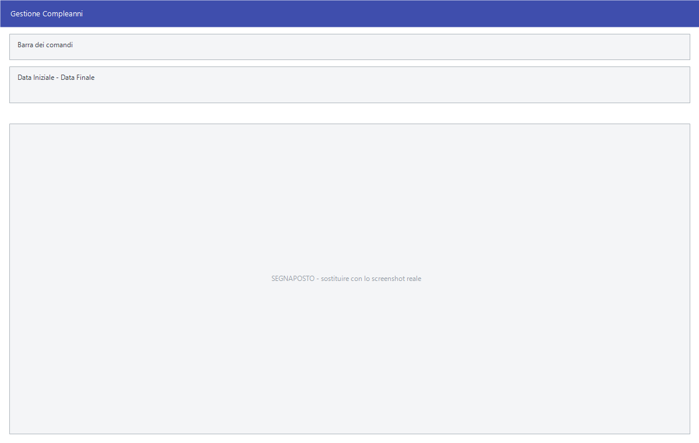

# Gestione compleanni

Chiede un periodo e mostra i clienti che compiono gli anni in quei giorni. Da
lì si mandano gli auguri per email o SMS, o si stampa l'elenco.

!!! info "In sintesi"

    - **Percorso:** Menu ▸ Archivi ▸ Clienti ▸ Gestione Compleanni
    - **Scorciatoia:** ++f2++ seleziona, ++f4++ email, ++f5++ SMS, ++f6++ stampa
    - **Permessi richiesti:** nessun profilo predefinito; la voce di menu si abilita per ogni utente da [Archivi ▸ Utenti](utenti.md)

---

## A cosa serve

È una cortesia commerciale che si automatizza: ogni lunedì si guardano i
compleanni della settimana e si manda un messaggio. Funziona solo per chi ha
la data di nascita registrata.

L'elenco pesca da **due archivi**: l'anagrafica dei clienti e le tessere
fidelity. Chi ha la tessera compare anche se non è un cliente codificato.

## Prerequisiti

Prima di usare questa maschera occorre:

- avere la **data di nascita** compilata nell'anagrafica dei
  [clienti](anagrafica-clienti.md): chi non ce l'ha non compare;
- avere i recapiti — email o cellulare — dei clienti a cui si vuole scrivere;
- avere impostato l'indirizzo del mittente, altrimenti l'invio si ferma.

## La maschera

La finestra *Gestione Compleanni* ha in alto **Data Iniziale** e **Data
Finale**, sotto la griglia dei festeggiati e in basso i sei pulsanti.

La griglia ha queste colonne:

| Colonna | Contenuto |
|---|---|
| **Sel** | La spunta che include la riga nell'invio. |
| **Sms**, **Mail** | Segnano se il cliente è raggiungibile per SMS o per posta. |
| **Compleanno** | Il giorno in cui li compie. |
| **Data Nascita** | La data di nascita registrata. |
| **Cognome e Nome** | Il cliente. |
| **Telefono**, **Telefoni Cellulari**, **Cellulare 2**, **Cellulare 3** | I recapiti telefonici. |
| **Email** | L'indirizzo di posta. |
| **Indirizzo**, **Città**, **Cap**, **Prov** | L'indirizzo postale. |
| **mmdd** | Il compleanno come quattro cifre, mese e giorno. È il campo su cui il programma cerca, e serve alla stampa per raggruppare. |
| **Cod_Cli** | Il codice del cliente, valorizzato se la riga viene dall'anagrafica clienti. |
| **Cod_Fid** | Il codice della tessera, valorizzato se la riga viene da una fidelity. |
| **Data Nas.** | La data di nascita per intero, anno compreso. |

Le ultime quattro colonne non si leggono a video: servono alla stampa
dell'elenco, che le prende da lì.

## Campi

| Campo | Obbl. | Descrizione | Valori ammessi |
|---|:---:|---|---|
| **Data Iniziale** | ● | Primo giorno del periodo da esaminare. | data |
| **Data Finale** | ● | Ultimo giorno del periodo. | data |

{: .campi }

Il periodo si legge su giorno e mese: l'anno di nascita non entra nel
confronto.

## Pulsanti e comandi

| Comando | Scorciatoia | Effetto |
|---|---|---|
| **F2 - Selez.** | ++f2++ | Spunta tutte le righe. |
| **F3 - Deselez.** | ++f3++ | Toglie la spunta a tutte le righe. |
| **F4 - Email** | ++f4++ | Manda l'email di auguri ai selezionati. |
| **F5 - SMS** | ++f5++ | Manda l'SMS di auguri ai selezionati. |
| **F6 - Stampa** | ++f6++ | Stampa l'elenco. |
| **Esci** | ++esc++ | Chiude la finestra. |

## Come si fa

### Mandare gli auguri della settimana

1. Apri **Menu ▸ Archivi ▸ Clienti ▸ Gestione Compleanni**.
2. Indica **Data Iniziale** e **Data Finale** della settimana.
3. Guarda la colonna **Mail**: solo chi è segnato riceverà l'email.
4. Premi **F2 - Selez.** per spuntare tutti, poi togli la spunta a chi non
   vuoi scrivere.
5. Premi **F4 - Email**.

### Mandare gli SMS a chi non ha l'email

1. Imposta il periodo.
2. Premi **F3 - Deselez.** e spunta a mano solo le righe con la colonna **Sms**
   valorizzata e la colonna **Mail** vuota.
3. Premi **F5 - SMS**.

## Controlli e messaggi

| Messaggio | Causa | Cosa fare |
|---|---|---|
| *Indirizzo email del mittente non impostato!* / *Impossibile procedere* | Manca l'indirizzo da cui inviare. | Impostalo nei dati dell'[utente](utenti.md) o della [ditta](ditte.md) e riprova. |

## Note

!!! note "Chi non ha la data di nascita non compare"

    L'elenco si costruisce sulla data di nascita registrata in anagrafica: i
    clienti che non ce l'hanno non compaiono, per quanto si allarghi il
    periodo. Vale soprattutto per le persone giuridiche, che una data di
    nascita non ce l'hanno.

!!! info "Dove si scrive il testo degli auguri"

    Non in questa finestra: il testo si scrive nella finestra che si apre
    **dopo** aver premuto **F4 - Email** o **F5 - SMS**.

    Quella finestra non parte mai vuota. Il testo di partenza sta in due file
    dentro la cartella `template` del programma:

    - `compleanno_email_template.rtf` per l'email, che si può formattare —
      grassetto, colori, immagini;
    - `compleanno_sms_template.txt` per l'SMS, testo semplice.

    Quello che vedi a video lo puoi correggere prima di mandarlo, ma la
    correzione vale **solo per quell'invio**: la volta dopo ricompare il
    testo del file. Per cambiarlo una volta per tutte va cambiato il file.

    L'oggetto dell'email è già scritto — *Auguri di Compleanno* — e si può
    cambiare. Il destinatario non si tocca: lo mette il programma, riga per
    riga, e il campo è nascosto apposta.

!!! warning "Il programma non ricorda chi ha già ricevuto gli auguri"

    Finito l'invio, ogni riga si colora nella colonna **Mail** o **Sms**:
    `OK` in verde se il messaggio è partito, `ERR` in rosso se no.

    Quel segno resta **solo a video**: non viene registrato da nessuna parte
    e sparisce chiudendo la finestra. Rifacendo la stessa ricerca il giorno
    dopo, i messaggi partono di nuovo.

    Chi manda gli auguri ogni giorno non ha problemi, perché il periodo
    cambia. Chi li manda una volta a settimana deve fare attenzione a non
    sovrapporre i periodi.

!!! note "I due pulsanti si spengono da soli"

    **F4 - Email** è spento finché non è configurato il server di posta;
    **F5 - SMS** è spento finché non è scelto un fornitore di SMS. Sono due
    impostazioni della ditta, scheda *Server*.

## Vedi anche

- [Anagrafica clienti](anagrafica-clienti.md)
- [Mailing list](mailing-list.md)
