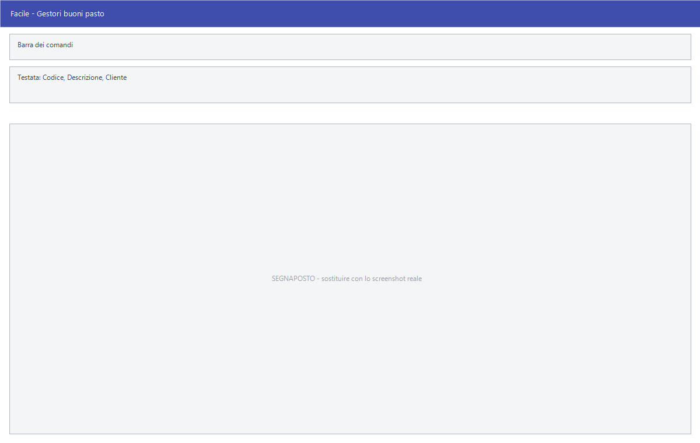

# Gestori buoni pasto

Da questa maschera si registrano le società che emettono i buoni pasto
accettati in cassa, e i buoni celiachia. Per ciascuna si indicano la
commissione trattenuta e i tagli dei buoni che si accettano.

!!! info "In sintesi"

    **Percorso:** Menu ▸ Archivi ▸ Buoni Pasto - Buoni Celiachia ▸ Inserimento Gestori *(oppure* Modifica Gestori*)*
    **Scorciatoia:** nessuna; la maschera si apre dal menu
    **Permessi richiesti:** nessun profilo predefinito; **Inserimento** e **Modifica** si abilitano separatamente per ogni utente da [Archivi ▸ Utenti](utenti.md)

---

## A cosa serve

Quando un cliente paga con un buono pasto, la cassa deve sapere di quale
emittente si tratta, quanto vale il buono e quanta commissione trattiene il
gestore. Quei dati stanno qui.

Esempio: registri il gestore, indichi **% Commissione** = 5 e nei tagli
elenchi 4,00 — 5,16 — 7,00: alla cassa saranno accettati solo quei tre valori,
e il rimborso atteso sarà il valore del buono meno il 5%.

Il gestore va collegato al **Cliente** che rappresenta la società emittente:
è a quel cliente che si fattura il rimborso dei buoni raccolti. Fanno
eccezione i **buoni celiachia**, che non hanno un gestore da fatturare.

## Prerequisiti

Prima di registrare un gestore occorre aver inserito in
[anagrafica clienti](anagrafica-clienti.md) la società emittente — salvo che si
tratti di buoni celiachia.

## La maschera

È una maschera a finestra unica, senza schede: in alto la **barra dei
comandi**, sotto i dati del gestore e, nel riquadro **TAGLIO TICKETS**, i venti
importi dei buoni accettati, disposti su quattro colonne.

## Campi

| Campo | Obbl. | Descrizione | Valori ammessi |
|---|:---:|---|---|
| Codice | ● | Identificativo del gestore. In modifica non è modificabile. | Numero |
| Descrizione | ● | Nome del gestore, come compare alla cassa. | Fino a 30 caratteri |
| Cliente | ● | Cliente a cui corrisponde la società emittente, quello a cui si fattura il rimborso. Accanto compare la ragione sociale. Obbligatorio, **salvo che sia spuntata Buoni Celiachia**. | Codice dall'archivio clienti |
| % Commissione | | Percentuale che il gestore trattiene sul valore dei buoni. | Percentuale |
| Buoni Celiachia | | Segnala che si tratta di buoni celiachia e non di buoni pasto. Spuntandola, il **Cliente** non è più richiesto. | Casella |
| **1° Taglio** … **20° Taglio** | | I venti valori facciali dei buoni che si accettano da questo gestore. Si compilano solo quelli che servono. | Importi |

{: .campi }

## Pulsanti e comandi

| Comando | Scorciatoia | Effetto |
|---|---|---|
| **F2 - Salva** | ++f2++ | Registra il gestore. |
| **F3 - Prec.** | ++f3++ | Passa al gestore precedente. |
| **F4 - Succ.** | ++f4++ | Passa al gestore successivo. |
| **F5 - Cerca** | ++f5++ | Apre l'elenco dei gestori. |
| **F6 - Elimina** | ++f6++ | Cancella il gestore, previa conferma. |
| **Ricarica** | | Rilegge il gestore dall'archivio, abbandonando le modifiche non salvate. |

Valgono inoltre:

| Comando | Scorciatoia | Effetto |
|---|---|---|
| Elenco valori | ++f10++, ++space++ o doppio clic su **Cliente** | Apre l'elenco dei clienti. |
| Consultazione | ++f11++ | Apre la finestra **Consultazione**. |
| Calcolatrice | ++f12++ | Apre la calcolatrice. |
| Campo successivo | ++enter++ o ++down++ | Sposta il cursore sul campo seguente. |
| Campo precedente | ++up++ | Sposta il cursore sul campo precedente. |
| Chiusura | ++esc++ | Chiude la maschera. |

## Come si fa

### Registrare un gestore di buoni pasto

1. Apri **Menu ▸ Archivi ▸ Buoni Pasto - Buoni Celiachia ▸ Inserimento
   Gestori**.
2. Digita il **Codice** e la **Descrizione** del gestore.
3. Scegli con ++f10++ il **Cliente** che corrisponde alla società emittente.
4. Indica la **% Commissione** concordata.
5. Nel riquadro *TAGLIO TICKETS* scrivi i valori dei buoni che accetti, uno per
   casella, lasciando vuote quelle che non servono.
6. Premi **F2 - Salva**.

### Registrare i buoni celiachia

1. Apri la maschera in inserimento.
2. Digita **Codice** e **Descrizione**.
3. Spunta **Buoni Celiachia**: il campo **Cliente** non è più richiesto.
4. Indica i tagli previsti.
5. Premi **F2 - Salva**.

### Aggiungere un taglio a un gestore esistente

1. Carica il gestore.
2. Scrivi il nuovo valore nella prima casella libera del riquadro
   *TAGLIO TICKETS*.
3. Premi **F2 - Salva**.

## Controlli e messaggi

| Messaggio | Causa | Cosa fare |
|---|---|---|
| *(nessun messaggio, solo un segnale acustico)* | Manca il **Codice**, la **Descrizione**, oppure il **Cliente** su un gestore che non è di buoni celiachia. | Guarda dove si è posizionato il cursore: è il campo da compilare. |
| *In archivio è già presente un record con lo stesso codice.* | Il codice digitato è già di un altro gestore. | Cambia codice. |
| *Confermi la Cancellazione....* | Conferma richiesta da **F6 - Elimina**. | Rispondi **Sì** per eliminare il gestore. |
| *Non è possibile eliminare il record pochè utilizzato in alcuni record del database.* | Il gestore compare su degli scontrini. | Non è eliminabile: lascialo in archivio. |
| *Il record è stato modificato da un altro nodo della rete.* | Un altro utente ha salvato lo stesso gestore mentre lo modificavi. | Premi **Ricarica**, verifica cosa è cambiato e rifai le tue modifiche. |
| *Il record è stato cancellato da un altro nodo della rete.* | Un altro utente ha eliminato il gestore mentre lo modificavi. | La maschera si chiude: non c'è più nulla da salvare. |

## Note

!!! warning "Attenzione"

    Togliere un taglio a un gestore già in uso non cambia gli scontrini
    passati, ma da quel momento la cassa non accetterà più quel valore.

    ++esc++ chiude la maschera senza chiedere conferma e senza salvare: le
    modifiche fatte dopo l'ultimo **F2 - Salva** vanno perse.

<!-- DA VERIFICARE: cosa succede alla cassa se il cliente presenta un buono di un taglio non previsto — viene rifiutato, o solo segnalato? -->

<!-- DA VERIFICARE: la % Commissione entra automaticamente nella fattura di rimborso al gestore, o è solo un dato di riferimento? -->

## Vedi anche

- [Anagrafica clienti](anagrafica-clienti.md)
