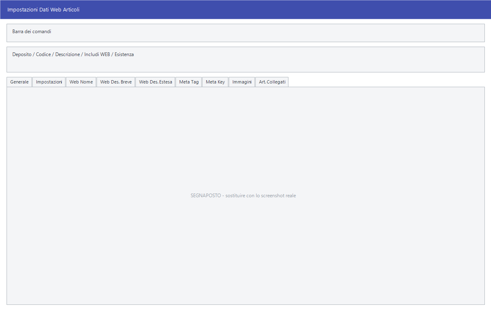

# Impostazione dati web degli articoli

Un articolo che sta bene in magazzino non è ancora pronto per il sito: gli
servono un nome leggibile, una descrizione che venda, delle fotografie, e la
categoria giusta nel catalogo. Sono cose che in
[anagrafica articoli](anagrafica-articoli.md) non ci sono. Si mettono qui.

!!! info "In sintesi"

    - **Percorso:** Menu ▸ Archivi ▸ Articoli ▸ Impostazione Dati Web
    - **Scorciatoia:** ++esc++ esce
    - **Permessi richiesti:** nessun profilo predefinito; la voce di menu si abilita per ogni utente da [Archivi ▸ Utenti](utenti.md)

---

## A cosa serve

È il banco di lavoro dell'articolo destinato al negozio online. Da un'unica
finestra si scorrono gli articoli e per ciascuno si decide:

- **se pubblicarlo** o no;
- **come si chiama sul sito** e come viene descritto, in breve e per esteso;
- quali **fotografie** mostrare;
- in quali **categorie del catalogo** — le *tassonomie* — farlo comparire;
- quali **altri articoli** proporre insieme.

La pubblicazione vera e propria è un'altra cosa: il collegamento al sito si
configura nella scheda **E-Commerce** delle [ditte](ditte.md), e i dati partono
con le procedure di [trasferimento](../trasferimenti/esportazione-documenti.md).

## Prerequisiti

Prima di usarla occorre:

- avere gli [articoli](anagrafica-articoli.md) in archivio;
- avere le **tassonomie** già create, da
  [Attribuzione Tassonomie](manutenzione-articoli.md): qui si spuntano, non si
  creano;
- avere le fotografie a disposizione sul computer;
- per pubblicare davvero, il negozio online configurato nella scheda
  **E-Commerce** delle [ditte](ditte.md).

La maschera chiede **prima** su quale [deposito](../magazzino/depositi.md)
lavorare.

## La maschera

La finestra si chiama **Impostazioni Dati Web Articoli** — al plurale, mentre la
voce di menu dice *Impostazione*. È divisa in quattro zone:

- **in alto** i dati dell'articolo su cui si sta lavorando, con la casella
  **Includi WEB**;
- **al centro** una fila di schede, una per ciascun dato da compilare;
- **a destra** l'albero delle tassonomie, con una casella per ciascuna: si
  spunta dove l'articolo deve comparire;
- **in basso** le anteprime delle immagini e l'elenco degli articoli collegati.

## Campi

### La testata

| Campo | Obbl. | Descrizione | Valori ammessi |
|---|:---:|---|---|
| **Deposito** | | Il deposito scelto all'apertura. Non è modificabile. | — |
| **Codice** | ● | L'articolo su cui si sta lavorando. | codice |
| **Descrizione** *(due righe)* | | Le due righe di descrizione dell'articolo, quelle dell'anagrafica. | testo |
| **Includi WEB** | | **Se l'articolo va pubblicato sul sito.** È l'interruttore principale: senza questa spunta tutto il resto non serve. | attivo/non attivo |
| **Esistenza** | | Quanto ce n'è nel deposito scelto. | quantità |

{: .campi }

### Le schede

| Scheda | Cosa contiene |
|---|---|
| **Generale** | I dati generali dell'articolo, gli stessi dell'[anagrafica](anagrafica-articoli.md). |
| **Impostazioni** | I dati che servono alla vendita al banco e al sito: i quattro colori del tasto (**Colore Sfondo (Inizio)**, **Colore Sfondo (Fine)**, **Colore Testo**, **Colore Trasparenza**), le tre posizioni sul POS (**Posiz. POS Preferiti**, **Posiz. POS in Evidenza**, **Posizione POS**), i punti fedeltà (**Punti Erogati**, **Max Punti Erogati**, **Punti Detratti**) e **Dati su etichetta** (`CODICE`, `CODICE + PESO`). |
| **Web Nome** | Il nome con cui l'articolo compare sul sito, che può essere diverso dalla descrizione di magazzino. |
| **Web Des. Breve** | La descrizione breve, quella dell'elenco prodotti. |
| **Web Des. Estesa** | La descrizione lunga, quella della scheda prodotto. |
| **Meta Tag** | Il meta tag di descrizione per i motori di ricerca. |
| **Meta Key** | Le parole chiave. |
| **Immagini** | Le fotografie dell'articolo, con l'indicazione del **Deposito** per ciascuna. |
| **Art. Collegati** | Gli articoli da proporre insieme a questo. |

Le cinque schede di testo — **Web Nome**, **Web Des. Breve**, **Web Des.
Estesa**, **Meta Tag** e **Meta Key** — sono legate a una **nazione**: lo stesso
articolo può quindi avere nome e descrizioni diversi per ciascun mercato.

### Le tassonomie

L'albero a destra elenca le tassonomie del catalogo e i loro elementi, con una
casella per ciascuno. Spuntando un elemento l'articolo entra in quella
categoria del sito; le voci spuntate si vedono in grassetto.

Spuntando la **radice** di una tassonomia il programma chiede se vuoi agire su
tutto il gruppo.

### Le immagini e gli articoli collegati

In basso a sinistra ci sono le anteprime delle immagini caricate; in basso a
destra l'elenco degli **articoli collegati**, con **Codice** e
**Descrizione**.

## Pulsanti e comandi

| Comando | Scorciatoia | Effetto |
|---|---|---|
| Elenco di scelta | ++f10++ o ++space++ | Sul **Codice**, apre l'elenco degli articoli. |
| **Esci** | ++esc++ | Chiude la maschera. |

## Come si fa

### Preparare un articolo per il sito

1. Apri **Menu ▸ Archivi ▸ Articoli ▸ Impostazione Dati Web** e scegli il
   deposito.
2. Indica il **Codice** dell'articolo.
3. Attiva **Includi WEB**.
4. Nella scheda **Web Nome** scrivi il nome per il sito: qui conviene un nome
   che un cliente capisca, non la sigla di magazzino.
5. Compila **Web Des. Breve** e **Web Des. Estesa**.
6. Nella scheda **Immagini** carica le fotografie.
7. Nell'albero a destra spunta le categorie in cui l'articolo deve comparire.
8. Nella scheda **Art. Collegati** aggiungi gli articoli da proporre insieme.

### Farsi trovare dai motori di ricerca

Compila **Meta Tag** con una frase che descriva il prodotto e **Meta Key** con
le parole con cui un cliente lo cercherebbe. Sono campi liberi: quello che
scrivi finisce nella pagina del prodotto.

### Mettere un articolo in evidenza alla cassa

La scheda **Impostazioni** governa anche il POS: i quattro colori decidono
l'aspetto del tasto e le tre posizioni dove compare — fra i preferiti, fra
quelli in evidenza, o nella posizione fissa. Vedi
[Vendita e POS touchscreen](../vendite/vendita-al-banco.md).

### Togliere un articolo dal sito

Basta togliere la spunta a **Includi WEB**: i testi, le immagini e le
tassonomie restano, e riattivandola l'articolo torna com'era.

## Controlli e messaggi

| Messaggio | Causa | Cosa fare |
|---|---|---|
| *Non è possibile selezionare le tassonomie !* | Si sta spuntando qualcosa che non è un elemento valido dell'albero. | Spunta un elemento dentro una tassonomia, non un livello che non lo prevede. |
| *Vuoi selezionare tutto il gruppo ?* | Hai spuntato la radice di una tassonomia. | **Sì** spunta tutti gli elementi sotto; **No** lascia com'era. |
| *Vuoi deselezionare tutto il gruppo ?* | Hai tolto la spunta alla radice. | **Sì** toglie tutti gli elementi sotto. |

## Note

!!! note "«Includi WEB» è l'interruttore principale"

    Un articolo con nome, descrizioni, immagini e tassonomie compilati ma senza
    quella spunta **non va sul sito**. È il primo posto da guardare quando un
    prodotto non compare online.

!!! note "Il nome per il sito è un'altra cosa dalla descrizione di magazzino"

    La descrizione dell'anagrafica serve a chi lavora in azienda e spesso è
    fatta di sigle. **Web Nome** serve a chi compra. Tenerli distinti è il
    motivo per cui questa maschera esiste.

!!! note "Le tassonomie si spuntano qui, si creano altrove"

    L'albero mostra le tassonomie già esistenti. Per crearne di nuove si passa
    da [Attribuzione Tassonomie](manutenzione-articoli.md), che lavora anche in
    blocco su molti articoli insieme — comodo quando la stessa categoria va data
    a decine di prodotti.

!!! note "Un articolo per volta"

    Questa maschera è pensata per curare **un** articolo alla volta, in
    profondità. Per le attribuzioni di massa ci sono
    [Attribuzione Tassonomie](manutenzione-articoli.md) e
    [Modifica da griglia](modifica-da-griglia.md).

<!-- DA VERIFICARE: come si sceglie la nazione a cui i testi web si riferiscono, e come si passa da una lingua all'altra. -->

<!-- DA VERIFICARE: quante immagini si possono caricare per articolo e a cosa serve il Deposito indicato accanto a ciascuna. -->

<!-- DA VERIFICARE: come si aggiungono e si tolgono gli articoli collegati. -->

<!-- DA VERIFICARE: se i dati web debbano essere salvati esplicitamente o siano registrati mano a mano. -->

## Vedi anche

- [Anagrafica articoli](anagrafica-articoli.md)
- [Manutenzione degli articoli](manutenzione-articoli.md)
- [Modifica articoli da griglia](modifica-da-griglia.md)
- [Ditte](ditte.md)
- [Vendita e POS touchscreen](../vendite/vendita-al-banco.md)
