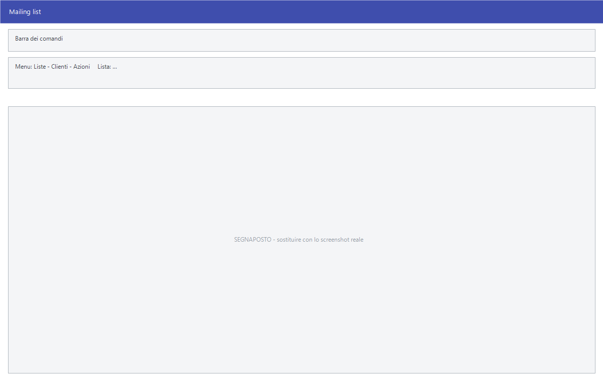

# Mailing list

Si prepara una lista di clienti, la si riempie scegliendoli a mano o a gruppi, e
da lì si manda a tutti un'email o un SMS. La stessa lista si può stampare,
esportare su Excel o usare per le etichette.

!!! info "In sintesi"

    **Percorso:** Menu ▸ Archivi ▸ Clienti ▸ Mailing list
    **Scorciatoia:** ++f2++ email, ++f3++ SMS, ++f4++ Excel, ++f5++ stampa elenco
    **Permessi richiesti:** nessun profilo predefinito; la voce di menu si abilita per ogni utente da [Archivi ▸ Utenti](utenti.md)

---

## A cosa serve

Serve per le comunicazioni a molti: la lettera di Natale, l'avviso di chiusura,
la promozione del mese. Le liste restano in archivio, quindi una volta
costruita la lista «clienti bar della provincia» la si riusa.

## Prerequisiti

Prima di usare questa maschera occorre:

- avere in archivio i [clienti](anagrafica-clienti.md) con i recapiti
  compilati: senza email non si manda posta, senza cellulare non si mandano
  SMS;
- avere impostato l'indirizzo del mittente, altrimenti l'invio si ferma;
- per gli SMS, il servizio di invio configurato.

## La maschera

La finestra *Mailing list* si ridimensiona e ha un menu tutto suo — **Liste**,
**Clienti**, **Azioni** — invece della solita barra dei comandi. In alto il
campo **Lista**, sotto la griglia dei destinatari, in basso una barra di stato.

La griglia ha queste colonne:

| Colonna | Contenuto |
|---|---|
| **Sel** | La spunta che include la riga nell'invio. |
| **SMS** | Segna se al cliente si può mandare un SMS. |
| **Email** | Segna se al cliente si può mandare un'email. |
| **Cliente** | Ragione sociale. |
| **Telefono**, **Cellulare**, **Cellulare 2**, **Cellulare 3** | I recapiti telefonici. |
| **Indirizzo**, **Città**, **Cap**, **Prov.** | L'indirizzo postale, per le etichette. |
| **Codice** | Codice del cliente. |

## Campi

| Campo | Obbl. | Descrizione | Valori ammessi |
|---|:---:|---|---|
| **Lista** | ● | Quale lista si sta lavorando. | codice della lista |

{: .campi }

## Pulsanti e comandi

### Menu Liste

| Comando | Effetto |
|---|---|
| **Inserimento** | Crea una lista nuova. |
| **Modifica** | Cambia i dati della lista. |
| **Stampa** | Stampa la lista. |
| **Duplica** | Crea una copia della lista, per partire da una esistente. |

### Menu Clienti

| Comando | Scorciatoia | Effetto |
|---|---|---|
| **Aggiungi** | ++f9++ | Aggiunge un cliente alla lista. |
| **Aggiungi Gruppo** | | Aggiunge in blocco i clienti di un gruppo. |
| **Visualizza** | ++f8++ | Apre l'[anagrafica](anagrafica-clienti.md) del cliente della riga. |
| **Elimina Riga** | | Toglie dalla lista la riga attiva. |
| **Elimina Selezionati** | | Toglie le righe spuntate. |
| **Elimina non Selezionati** | | Toglie le righe **non** spuntate, tenendo solo quelle scelte. |
| **Elimina Tutti** | | Svuota la lista. |

### Menu Azioni

| Comando | Scorciatoia | Effetto |
|---|---|---|
| **Email** | ++f2++ | Manda l'email ai destinatari spuntati. |
| **Sms** | ++f3++ | Manda l'SMS ai destinatari spuntati. |
| **Esporta su Excel** | ++f4++ | Salva la lista in un foglio Excel. |
| **Stampa Elenco** | ++f5++ | Stampa l'elenco dei destinatari. |
| **Stampa Etichette** | | Stampa le etichette postali. |
| **Deseleziona Tutti** | ++f6++ | Toglie la spunta a tutte le righe. |
| **Seleziona Tutti** | ++f7++ | Spunta tutte le righe. |

## Come si fa

### Mandare un'email a un gruppo di clienti

1. Apri **Menu ▸ Archivi ▸ Clienti ▸ Mailing list**.
2. Da **Liste ▸ Inserimento** crea la lista e dalle un nome.
3. Con **Clienti ▸ Aggiungi Gruppo** porta dentro i clienti che ti servono,
   oppure aggiungili uno a uno con ++f9++.
4. Guarda la colonna **Email**: chi non ce l'ha non riceverà nulla.
5. Premi ++f7++ per spuntare tutti, poi togli la spunta a chi vuoi escludere.
6. Premi ++f2++ per l'invio.

### Riusare una lista dell'anno prima

1. Apri la lista.
2. Usa **Liste ▸ Duplica** per farne una copia.
3. Sulla copia togli i clienti che non servono più con **Clienti ▸ Elimina
   Riga**, e aggiungi i nuovi.

### Stampare le etichette dei destinatari

1. Costruisci la lista e spunta i destinatari.
2. Usa **Azioni ▸ Stampa Etichette**.

## Controlli e messaggi

| Messaggio | Causa | Cosa fare |
|---|---|---|
| *Indirizzo email del mittente non impostato!* / *Impossibile procedere* | Manca l'indirizzo da cui inviare. | Impostalo nei dati dell'[utente](utenti.md) o della [ditta](ditte.md) e riprova. |
| *Confermi l' eliminazione delle righe selezionate ?* | Si è scelto **Elimina Selezionati**. | **Sì** toglie dalla lista le righe spuntate. I clienti restano in archivio. |
| *Confermi l' eliminazione delle righe non selezionate ?* | Si è scelto **Elimina non Selezionati**. | **Sì** tiene solo le righe spuntate. |
| *Confermi l' eliminazione di tutte le righe ?* | Si è scelto **Elimina Tutti**. | **Sì** svuota la lista. |

## Note

!!! warning "Le scorciatoie del menu non corrispondono"

    Le voci **Aggiungi** e **Aggiungi Gruppo** riportano nel menu i tasti
    ++f8++ e ++f9++, ma i tasti che funzionano davvero sono altri: ++f8++ apre
    **Visualizza** e ++f9++ esegue **Aggiungi**; **Aggiungi Gruppo** non ha
    scorciatoia. La tabella qui sopra riporta i tasti che funzionano.

!!! note "Eliminare non cancella il cliente"

    Le voci **Elimina** del menu **Clienti** tolgono i nominativi *dalla
    lista*: l'anagrafica del cliente non viene toccata.

<!-- DA VERIFICARE: dove si configura il servizio di invio SMS e cosa succede se non è configurato. -->

<!-- DA VERIFICARE: se l'indirizzo del mittente venga preso dai dati dell'utente o da quelli della ditta. -->

<!-- DA VERIFICARE: come si compone il testo del messaggio da inviare: non ho individuato il punto in cui si scrive. -->

<!-- DA VERIFICARE: cosa significa "Aggiungi Gruppo": se il gruppo aziende, il gruppo mailing o un altro raggruppamento. -->

## Vedi anche

- [Anagrafica clienti](anagrafica-clienti.md)
- [Gestione compleanni](gestione-compleanni.md)
- [Stampe clienti](stampe-clienti.md)
