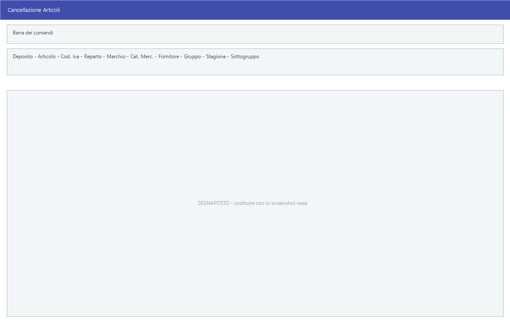

# Manutenzione degli articoli

Le voci di **Archivi ▸ Articoli** che non stampano nulla ma intervengono
sull'archivio: correggere molti articoli in una volta, caricarne i prezzi,
duplicarne uno, cancellarne un gruppo, raggrupparli in panieri.

!!! info "In sintesi"

    - **Percorso:**
        - Menu ▸ Archivi ▸ Articoli ▸ Modifica da Griglia
        - Menu ▸ Archivi ▸ Articoli ▸ Impostazione Dati Web
        - Menu ▸ Archivi ▸ Articoli ▸ Attribuzione Tassonomie
        - Menu ▸ Archivi ▸ Articoli ▸ Caricamento Prezzi
        - Menu ▸ Archivi ▸ Articoli ▸ Cancellazione Articoli
        - Menu ▸ Archivi ▸ Articoli ▸ Gestione Panieri
        - Menu ▸ Archivi ▸ Articoli ▸ Duplica
    - **Scorciatoia:** ++f2++ salva o conferma, ++esc++ esce
    - **Permessi richiesti:** nessun profilo predefinito; le singole voci di menu si abilitano per ogni utente da [Archivi ▸ Utenti](utenti.md)

---

## A cosa serve

| Voce di menu | A cosa serve |
|---|---|
| **Modifica da Griglia** | Correggere i dati di molti articoli in una griglia, invece di aprirli uno a uno. Chiede prima il deposito. |
| **Impostazione Dati Web** | Compilare in blocco i dati che servono alla pubblicazione sul negozio online. Chiede prima il deposito. |
| **Attribuzione Tassonomie** | Assegnare agli articoli le tassonomie usate dal catalogo. |
| **Caricamento Prezzi** | Inserire in sequenza i prezzi degli articoli, vedendo accanto ultimo prezzo d'acquisto ed esistenza. |
| **Cancellazione Articoli** | Eliminare in blocco gli articoli che rispondono a certi criteri. |
| **Gestione Panieri** | Raggruppare articoli in panieri. |
| **Duplica** | Creare un articolo copiandone un altro. |

## Prerequisiti

Prima di usare queste maschere occorre avere gli
[articoli](anagrafica-articoli.md) in archivio, e — per **Cancellazione
Articoli** — **una copia di sicurezza recente**.

## La maschera

Sono maschere diverse fra loro.

**Modifica da Griglia** e **Impostazione Dati Web** chiedono prima su quale
[deposito](../magazzino/depositi.md) lavorare, poi aprono una griglia
modificabile.

**Caricamento Prezzi** è una finestra a campi: in alto l'**Articolo**, e sotto
i dati che aiutano a decidere il prezzo — **Ultimo Prezzo d' Acquisto**,
**Esistenza** — insieme alla classificazione dell'articolo.

**Cancellazione Articoli** è un riquadro di selezione con, in più, tre
condizioni di soglia contrassegnate da `<=`.

**Gestione Panieri** ha in alto il campo **Paniere** e sotto la griglia degli
articoli che vi appartengono, con **Codice** e **Descrizione**.

**Duplica** ha due soli campi: **Articolo** e **Nuovo Articolo**.

## Campi

### Caricamento Prezzi

| Campo | Obbl. | Descrizione | Valori ammessi |
|---|:---:|---|---|
| **Articolo** | ● | L'articolo di cui caricare il prezzo. | codice |
| **Listino** | ● | Su quale listino scrivere. | codice |
| **Ultimo Prezzo d' Acquisto** | | Quanto è costato l'ultima volta. Solo lettura. | — |
| **Esistenza** | | Quanto ce n'è. Solo lettura. | — |
| **Cod. Iva**, **Un. Misura**, **Cat. Merc.**, **Reparto**, **Stagione**, **Marchio**, **Gruppo**, **Sottogruppo** | | La classificazione dell'articolo, mostrata per aiutare a decidere. Solo lettura. | — |

{: .campi }

### Cancellazione Articoli

| Campo | Obbl. | Descrizione | Valori ammessi |
|---|:---:|---|---|
| **Deposito** | | Su quale [deposito](../magazzino/depositi.md) valutare le condizioni. | codice |
| **Articolo**, **Cod. Iva**, **Reparto**, **Marchio**, **Cat. Merc.**, **Fornitore**, **Gruppo**, **Stagione**, **Sottogruppo** | | Il riquadro di selezione degli articoli da cancellare. | codici, oppure `TUTTI` |
| *(tre soglie contrassegnate da* `<=` *)* | | Le condizioni che l'articolo deve soddisfare per essere cancellato. | valori |

{: .campi }

### Duplica

| Campo | Obbl. | Descrizione | Valori ammessi |
|---|:---:|---|---|
| **Articolo** | ● | L'articolo da copiare. | codice |
| **Nuovo Articolo** | ● | Il codice del nuovo articolo. Si può farlo generare al programma. | codice |

{: .campi }

### Gestione Panieri

| Campo | Obbl. | Descrizione | Valori ammessi |
|---|:---:|---|---|
| **Paniere** | ● | Quale paniere si sta componendo. | codice |

{: .campi }

## Pulsanti e comandi

| Comando | Scorciatoia | Effetto |
|---|---|---|
| **F2 - Salva** | ++f2++ | Registra. In **Caricamento Prezzi** salva il prezzo e passa all'articolo successivo. |
| **Esci** | ++esc++ | Chiude senza salvare. |
| Elenco di scelta | ++f10++ o ++space++ | Sul campo con il codice, apre l'elenco da cui scegliere. |
| **Calcolatrice** | ++f12++ | Apre la calcolatrice. |
| **Consultazione** | ++f11++ | Apre la consultazione. |

## Come si fa

### Caricare i prezzi di una serie di articoli

1. Apri **Menu ▸ Archivi ▸ Articoli ▸ Caricamento Prezzi**.
2. Indica il primo **Articolo** e il **Listino**.
3. Guarda **Ultimo Prezzo d' Acquisto** ed **Esistenza** per decidere il
   prezzo.
4. Scrivi il prezzo e premi **F2 - Salva**.

### Duplicare un articolo

1. Apri **Menu ▸ Archivi ▸ Articoli ▸ Duplica**.
2. Indica l'**Articolo** da copiare.
3. In **Nuovo Articolo** scrivi il codice nuovo, oppure rispondi **Sì** a
   *«Vuoi generare il codice?»* per farlo assegnare al programma.
4. Alla conferma *«Articolo duplicato!»* apri il nuovo articolo e correggi
   quello che lo distingue dall'originale.

### Cancellare gli articoli che non servono più

1. **Fai una copia di sicurezza degli archivi.**
2. Apri **Menu ▸ Archivi ▸ Articoli ▸ Cancellazione Articoli**.
3. Restringi la selezione e imposta le soglie.
4. Premi il pulsante di conferma e rispondi **Sì** a *«Confermi la
   Cancellazione degli Articoli Selezionati ?»*, poi ancora **Sì** a *«Sei
   Sicuro ?»*.

## Controlli e messaggi

| Messaggio | Causa | Cosa fare |
|---|---|---|
| *Vuoi generare il codice?* | In **Duplica**, il codice del nuovo articolo non è stato scritto. | **Sì** lo fa assegnare al programma. |
| *Articolo duplicato!* | La duplicazione è andata a buon fine. | Nulla: è una conferma. |
| *Confermi la Cancellazione degli Articoli Selezionati ?* | Prima conferma della cancellazione in blocco. | **Sì** prosegue alla seconda domanda. |
| *Sei Sicuro ?* | Seconda conferma della cancellazione. | **Sì** cancella davvero. Non si torna indietro. |

## Note

!!! warning "Attenzione"

    **La cancellazione in blocco non si annulla.** Chiede due conferme proprio
    perché è definitiva: senza una copia di sicurezza gli articoli cancellati e
    la loro storia non si recuperano.

    **La modifica da griglia salva mentre si scrive.** Come nelle altre griglie
    di Facile, la cella confermata è già registrata: non c'è un comando di
    annullamento.

<!-- DA VERIFICARE: quali sono le tre soglie "<=" della cancellazione articoli: le etichette a video sono solo il simbolo, non dicono su quale grandezza si applicano. -->

<!-- DA VERIFICARE: quali colonne si possono modificare in "Modifica da Griglia" e in "Impostazione Dati Web". -->

<!-- DA VERIFICARE: cosa sono le tassonomie e dove vengono usate. -->

<!-- DA VERIFICARE: a cosa servono i panieri e dove vengono richiamati. -->

<!-- DA VERIFICARE: se la duplicazione copi anche listini, codici a barre e scorte, o solo i dati anagrafici. -->

## Vedi anche

- [Anagrafica articoli](anagrafica-articoli.md)
- [Scorte, assortimento e ubicazioni](scorte-e-assortimento.md)
- [Gestione listini](../listini-vendita/gestione-listini.md)
