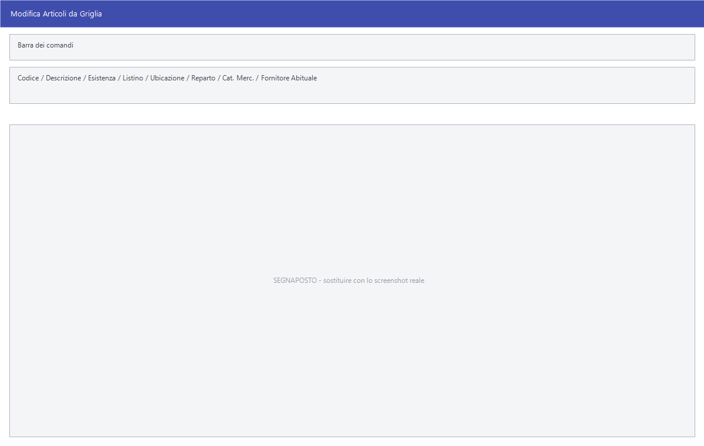

# Modifica articoli da griglia

Cambiare il reparto a duecento articoli aprendoli uno per uno è un pomeriggio
di lavoro. Questa maschera li mette tutti in una griglia, una riga per
articolo, e li fa correggere come in un foglio di calcolo.

!!! info "In sintesi"

    - **Percorso:** Menu ▸ Archivi ▸ Articoli ▸ Modifica da Griglia
    - **Scorciatoia:** ++f2++ apre l'articolo, ++f4++ – ++f8++ i comandi della barra, ++esc++ esce
    - **Permessi richiesti:** nessun profilo predefinito; la voce di menu si abilita per ogni utente da [Archivi ▸ Utenti](utenti.md)

---

## A cosa serve

È lo strumento per le correzioni di massa sull'anagrafica: riclassificare un
gruppo di articoli, assegnare il fornitore abituale a chi non ce l'ha,
sistemare le ubicazioni, rivedere i prezzi di un listino. Tutto quello che si
farebbe in [anagrafica articoli](anagrafica-articoli.md) una scheda alla volta,
qui si fa a colpo d'occhio, confrontando le righe fra loro.

Dalla griglia si arriva anche alle due operazioni che di solito la seguono: la
stampa dei [frontalini](../casse-bilance/frontalini.md) per gli articoli
toccati, e il calcolo del ricarico.

## Prerequisiti

Prima di usarla occorre avere gli [articoli](anagrafica-articoli.md) in
archivio e i [depositi](../magazzino/depositi.md) impostati: la maschera chiede
**prima** su quale deposito lavorare, perché l'esistenza e il listino mostrati
sono quelli di quel deposito.

Conviene avere **una copia di sicurezza recente**: qui si modificano molti
articoli in fretta e non c'è modo di annullare.

## La maschera

Si apre prima l'elenco dei [depositi](../magazzino/depositi.md) per scegliere
su quale lavorare, poi la griglia: la barra dei comandi in alto, una barra di
avanzamento e sotto le righe degli articoli. All'apertura la griglia è
**vuota**: gli articoli si portano dentro con **F5 - Selez.**

## Campi

Non ci sono campi di testata: si lavora nelle celle. Le colonne, nell'ordine:

| Colonna | Contiene |
|---|---|
| **Codice** | Il codice dell'articolo. |
| **Descrizione - 1**, **Descrizione - 2** | Le due righe di descrizione. |
| **Esistenza** | Quanto ce n'è **nel deposito scelto all'apertura**. |
| **Listino** | Il prezzo del listino corrente. Quale listino sia lo dice l'intestazione, che riporta *Listino - N*, e si cambia con **Cambia Listino**. |
| **Fuori Ass.** | Se l'articolo è fuori assortimento. |
| **Ubicazione** | Dove si trova a magazzino. |
| **Codive IVA** e **Descrizione** | L'[aliquota IVA](../contabilita/aliquote-iva.md). L'intestazione contiene un refuso: si legge *Codive* invece di *Codice*. |
| **Unità di Misura** | L'unità di misura. Nelle versioni con taglie e colori la colonna diventa **Gruppo Taglie** e non è modificabile. |
| **Reparto** | Il [reparto](../magazzino/reparti.md). |
| **Categoria Merceologica** | La [categoria](../magazzino/categorie-merceologiche.md). |
| **Marchio** | Il [marchio](../magazzino/marchi.md). |
| **Stagione** | La [stagione](../magazzino/stagioni.md). |
| **Fornitore Abituale** | Il [fornitore](anagrafica-fornitori.md) di riferimento. È il campo che decide a chi vanno gli ordini generati: vedi [Generazione degli ordini](../ordini/generazione-ordini.md). |
| **TA1**, **TA2**, **TA3** | Le tre [tabelle di classificazione libere](../magazzino/tabelle-di-classificazione.md). |
| **Gruppo Mix** | Il gruppo mix. |
| **Cod. Art. Fornitore** | Il codice con cui il fornitore chiama l'articolo. |
| **Gruppo**, **Sottogruppo** | I due livelli di raggruppamento. |
| **NPO** | *Non più ordinabile*: segna gli articoli che non si comprano più. |

Ogni colonna di codice ha accanto la sua **descrizione**, che si compila da sé
quando si scrive il codice.

!!! note "Le colonne che non vedi non sono un errore"

    Le tre tabelle libere compaiono **solo se sono state configurate** nelle
    *Impostazioni Protette* delle [ditte](ditte.md): quelle non impostate
    restano nascoste. Le altre prendono il nome vero deciso lì — non si
    chiamano *TA1*, *TA2* e *TA3* a video.

## Pulsanti e comandi

| Comando | Scorciatoia | Effetto |
|---|---|---|
| **F2 - Apri** | ++f2++ | Apre l'articolo della riga in [anagrafica](anagrafica-articoli.md), per i campi che in griglia non ci sono. |
| **F4 - Trova** | ++f4++ | Cerca dentro la griglia. |
| **F5 - Selez.** | ++f5++ | Sceglie quali articoli portare in griglia. È il primo comando da usare. |
| **Articolo** | | Cerca un articolo e lo aggiunge alla griglia, uno alla volta. |
| **Importa da Excel** | | **Non importa modifiche**: legge da un foglio la colonna `codice` e porta in griglia quegli articoli. È il modo di lavorare su una lista preparata fuori. |
| **Elimina** | | Toglie la riga dalla griglia. L'articolo **non** viene cancellato dall'archivio. |
| **F6 - Pulisci** | ++f6++ | Svuota la griglia. |
| **F7 - Frontalini** | ++f7++ | Stampa i [frontalini](../casse-bilance/frontalini.md) degli articoli presenti in griglia. |
| **F8 - Ricarico** | ++f8++ | Apre la modifica dei listini dell'articolo della riga, con il calcolo del ricarico. |
| **Cambia Listino** | | Cambia il listino mostrato nella colonna **Listino**: si sceglie dall'elenco dei listini e la griglia si rilegge. |
| **Esporta su Excel** | | Esporta la griglia su un foglio. |
| **Esci** | ++esc++ | Chiude la maschera. |

## Come si fa

### Riclassificare un gruppo di articoli

1. Apri **Menu ▸ Archivi ▸ Articoli ▸ Modifica da Griglia** e scegli il
   deposito.
2. Premi **F5 - Selez.** e restringi agli articoli da sistemare — per esempio
   tutti quelli di un fornitore.
3. Correggi direttamente nelle celle: **Reparto**, **Categoria Merceologica**,
   **Marchio**, **Fornitore Abituale**.
4. Ogni cella confermata è già registrata: non serve un comando di salvataggio,
   e non c'è modo di tornare indietro.

### Lavorare su una lista preparata fuori

1. Prepara un foglio Excel con una colonna intestata `codice` e sotto i codici
   degli articoli.
2. Apri la maschera e premi **Importa da Excel**.
3. Gli articoli di quella lista entrano in griglia, pronti da correggere.

È il modo di lavorare su un elenco che arriva da qualcun altro — il fornitore,
la centrale, un inventario — senza doverlo ribattere.

### Rivedere i prezzi di un listino

1. Porta in griglia gli articoli.
2. Premi **Cambia Listino** e scegli il listino da guardare: l'intestazione
   della colonna diventa *Listino - N* e i prezzi si rileggono.
3. Correggi i prezzi nella colonna **Listino**, oppure premi **F8 - Ricarico**
   sulla riga per lavorare sul ricarico invece che sul prezzo finale.
4. Alla fine premi **F7 - Frontalini** per rifare i cartellini degli articoli
   toccati.

### Segnare gli articoli che non si comprano più

Metti **NPO** sulle righe degli articoli fuori produzione: restano a magazzino
finché ce n'è, ma sono marcati come non più ordinabili.

## Controlli e messaggi

| Messaggio | Causa | Cosa fare |
|---|---|---|
| *Colonna CODICE non trovata nel file excel! Impossibile continuare* | Il foglio da importare non ha una cella con l'intestazione `codice`. | Aggiungila. La ricerca non distingue maiuscole e minuscole e la cerca in tutto il foglio, non solo nella prima riga. |
| *Impossibile inizializzare il file excel!* | Il componente Excel non si è avviato. | Chiudi qualche programma e riprova. |
| *Impossibile aprire il file excel!* | Il file non si apre: è aperto altrove, spostato o danneggiato. | Chiudilo e riprova. |
| *(messaggio della libreria Excel)* | Errore in lettura o scrittura del foglio. | Controlla che la cartella sia scrivibile e che il file non sia in uso. |

## Note

!!! warning "Si salva scrivendo, e non si annulla"

    Come nelle altre griglie di Facile, **la cella confermata è già
    registrata**: non c'è un comando di salvataggio né uno di annullamento. Una
    correzione sbagliata su duecento righe si rimedia solo rifacendola a mano, o
    ripristinando la copia degli archivi.

    Per questo conviene selezionare **poco per volta** e controllare il
    risultato prima di passare al gruppo successivo.

!!! warning "«Elimina» toglie dalla griglia, non dall'archivio"

    Serve a sfoltire la vista, non a cancellare articoli. Per quello c'è
    [Cancellazione Articoli](manutenzione-articoli.md).

!!! note "Esistenza e listino sono quelli del deposito scelto"

    Il deposito si sceglie all'apertura e non si cambia dopo: per vedere le
    esistenze di un altro deposito bisogna chiudere e riaprire la maschera.

<!-- DA VERIFICARE: quali colonne sono modificabili e quali di sola lettura: dalle risorse risulta bloccata solo la colonna delle taglie. -->

<!-- DA VERIFICARE: se "Esporta su Excel" produca un foglio reimportabile da "Importa da Excel". -->

<!-- DA VERIFICARE: cosa succede alla colonna NPO quando si spunta: se venga anche registrata la data di non ordinabilità. -->

## Vedi anche

- [Anagrafica articoli](anagrafica-articoli.md)
- [Manutenzione degli articoli](manutenzione-articoli.md)
- [Gestione listini](../listini-vendita/gestione-listini.md)
- [Frontalini](../casse-bilance/frontalini.md)
- [Tabelle di classificazione](../magazzino/tabelle-di-classificazione.md)
