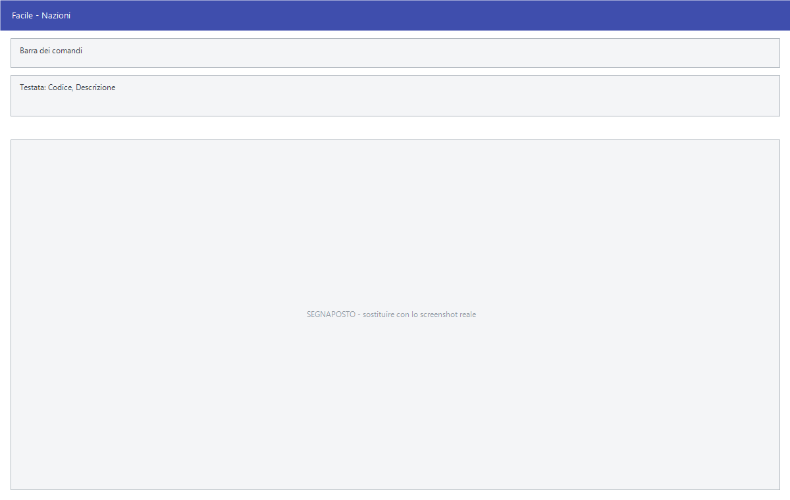

# Nazioni

Da questa maschera si tiene l'archivio delle nazionalità: il codice con cui si
indica il paese nelle anagrafiche, i codici ISO richiesti dalla fatturazione
elettronica e le due segnalazioni che contano ai fini fiscali — appartenenza
all'Unione europea e fiscalità privilegiata.

!!! info "In sintesi"

    **Percorso:** Menu ▸ Archivi ▸ Nazioni ▸ Inserimento *(oppure* Modifica*)*
    **Scorciatoia:** nessuna; la maschera si apre dal menu
    **Permessi richiesti:** nessun profilo predefinito; **Inserimento** e **Modifica** si abilitano separatamente per ogni utente da [Archivi ▸ Utenti](utenti.md)

---

## A cosa serve

La nazione compare in ogni anagrafica: clienti, fornitori, agenti,
trasportatori. Da qui dipendono due cose che il programma non può indovinare:
se l'operazione è intracomunitaria, e se il paese è a fiscalità privilegiata.

Serve inoltre il codice **ISO Alpha-2**, che è quello che la fattura
elettronica trasmette allo SDI: senza, il file viene scartato.

L'archivio arriva già compilato. Normalmente si apre questa maschera solo per
correggere un codice o per spegnere una nazione che non si usa più.

## Prerequisiti

*Nessuno.*

## La maschera

È una maschera a finestra unica, senza schede: la **barra dei comandi** e
quattro righe di campi. La finestra si intitola **Nazionalità**, ed è il nome
giusto: quello che si registra qui è la nazionalità, non il paese.

## Campi

| Campo | Obbl. | Descrizione | Valori ammessi |
|---|:---:|---|---|
| Codice | ● | Codice con cui la nazione si richiama nelle anagrafiche. È un codice di testo, non un numero. | Fino a 4 caratteri |
| Non Attiva | | Spegne la nazione senza eliminarla: non viene più proposta, ma resta sulle anagrafiche che la usano. | Casella |
| Descrizione | ● | La **nazionalità**: *ITALIANA*, *FRANCESE*, *SVIZZERA*. È questo il dato che il programma riporta nelle stampe e nelle esportazioni. | Fino a 30 caratteri |
| Nazione | | Il nome del **paese**: *ITALIA*, *FRANCIA*, *SVIZZERA*. Facile non lo riporta sui documenti — per quelli usa la **Descrizione** — ma tienilo compilato per leggibilità. | Fino a 30 caratteri |
| ISO Alpha-2 | | Sigla ISO di due lettere, quella trasmessa in fattura elettronica. | 2 caratteri |
| Codice ISO | | Codice ISO numerico del paese. | Numero |
| Codice UNICO | | Codice del paese per il modello Unico. | Fino a 3 caratteri |
| Fiscalità Privilegiata | | Segnala che il paese è a fiscalità privilegiata. | Casella |
| Nazione UE | | Segnala che il paese appartiene all'Unione europea. Da questa spunta dipende il trattamento delle operazioni intracomunitarie. | Casella |

{: .campi }

## Pulsanti e comandi

| Comando | Scorciatoia | Effetto |
|---|---|---|
| **F2 - Salva** | ++f2++ | Registra la nazione. In inserimento la maschera si svuota per la successiva. |
| **F3 - Prec.** | ++f3++ | Passa alla nazione precedente. |
| **F4 - Succ.** | ++f4++ | Passa alla nazione successiva. |
| **F5 - Cerca** | ++f5++ | Apre l'elenco delle nazioni. |
| **F6 - Elimina** | ++f6++ | Cancella la nazione, previa conferma. |
| **Ricarica** | | Rilegge la nazione dall'archivio, abbandonando le modifiche non salvate. |

Valgono inoltre:

| Comando | Scorciatoia | Effetto |
|---|---|---|
| Consultazione | ++f11++ | Apre la finestra **Consultazione**. |
| Calcolatrice | ++f12++ | Apre la calcolatrice. |
| Campo successivo | ++enter++ | Sposta il cursore sul campo seguente. |
| Chiusura | ++esc++ | Chiude la maschera. |

## Come si fa

### Aggiungere una nazione

1. Apri **Menu ▸ Archivi ▸ Nazioni ▸ Inserimento**.
2. Digita il **Codice** e la **Descrizione**, cioè la nazionalità — *TEDESCA*,
   non *GERMANIA*: sono i due dati obbligatori.
3. Nel campo **Nazione** scrivi il nome del paese: *GERMANIA*.
4. Compila **ISO Alpha-2**: serve alla fatturazione elettronica.
5. Spunta **Nazione UE** se il paese appartiene all'Unione europea, e
   **Fiscalità Privilegiata** se ricorre.
6. Premi **F2 - Salva**.

### Togliere dall'uso una nazione

1. Premi **F5 - Cerca** e carica la nazione.
2. Spunta **Non Attiva**.
3. Premi **F2 - Salva**. La nazione non viene più proposta, ma le anagrafiche
   che già la usano restano come sono.

## Controlli e messaggi

| Messaggio | Causa | Cosa fare |
|---|---|---|
| *(nessun messaggio, solo un segnale acustico)* | Manca il **Codice** o la **Descrizione**. | Guarda dove si è posizionato il cursore: è il campo da compilare. |
| *In archivio è già presente un record con lo stesso codice.* | Il codice digitato è già di un'altra nazione. | Cambia codice. |
| *Confermi la Cancellazione....* | Conferma richiesta da **F6 - Elimina**. | Rispondi **Sì** per eliminare la nazione. |
| *Non è possibile eliminare il record pochè utilizzato in alcuni record del database.* | La nazione è indicata in un cliente, in un fornitore o nelle descrizioni degli articoli. | Non è eliminabile: spunta invece **Non Attiva**. |
| *Il record è stato modificato da un altro nodo della rete.* | Un altro utente ha salvato la stessa nazione mentre la modificavi. | Premi **Ricarica**, verifica cosa è cambiato e rifai le tue modifiche. |
| *Il record è stato cancellato da un altro nodo della rete.* | Un altro utente ha eliminato la nazione mentre la modificavi. | La maschera si chiude: non c'è più nulla da salvare. |

## Note

!!! warning "Attenzione"

    Il **Codice** della nazione è quello che compare nel campo **Naz.** delle
    anagrafiche. Cambiarlo su una nazione già usata non aggiorna le anagrafiche
    che la richiamano: quelle continuerebbero a puntare a un codice che non
    esiste più. Per togliere una nazione dall'uso, spunta **Non Attiva**
    invece di cambiarne il codice.

    La spunta **Nazione UE** non è un dato descrittivo: è quella che distingue
    un'operazione intracomunitaria da una extra-UE. Verificala prima di
    emettere fatture verso l'estero.

    ++esc++ chiude la maschera senza chiedere conferma e senza salvare: le
    modifiche fatte dopo l'ultimo **F2 - Salva** vanno perse.

<!-- DA VERIFICARE: il Codice UNICO. È il codice del paese per il modello Unico, ma andrebbe confermato a chi cura la modulistica fiscale. -->

## Vedi anche

- [Codici catastali comuni](codici-catastali-comuni.md)
- [Anagrafica clienti](anagrafica-clienti.md)
- [Anagrafica fornitori](anagrafica-fornitori.md)
