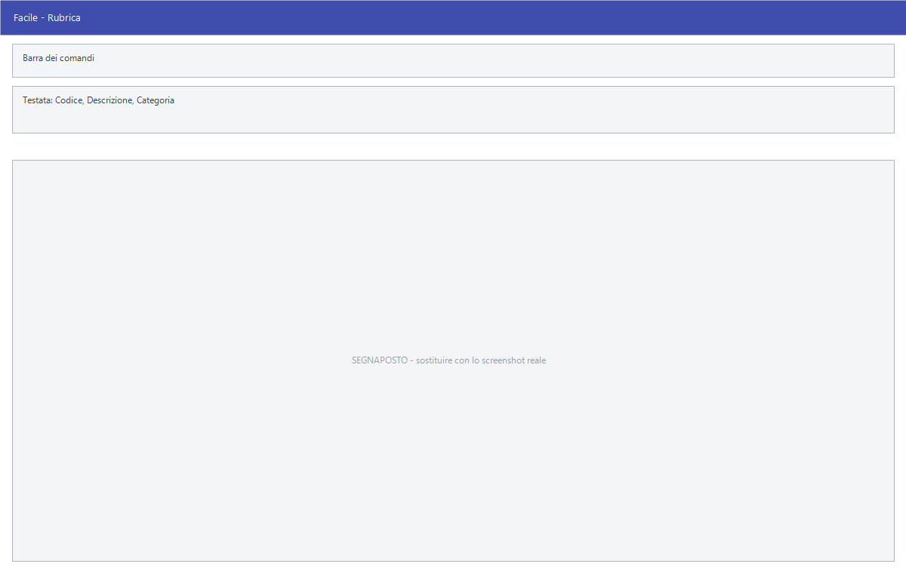

# Rubrica

Da questa maschera si tiene la rubrica dei contatti: nominativi che non sono
necessariamente clienti o fornitori — professionisti, uffici, manutentori — con
tutti i loro numeri di telefono e indirizzi di posta.

!!! info "In sintesi"

    - **Percorso:** Menu ▸ Archivi ▸ Rubrica ▸ Inserimento *(oppure* Modifica*,* Cerca *o* Importa*)*
    - **Scorciatoia:** nessuna; la maschera si apre dal menu
    - **Permessi richiesti:** nessun profilo predefinito; **Inserimento** e **Modifica** si abilitano separatamente per ogni utente da [Archivi ▸ Utenti](utenti.md)

---

## A cosa serve

La rubrica è l'elenco dei numeri che servono in azienda e che non stanno da
nessun'altra parte: il commercialista, il tecnico dell'assistenza, il corriere,
l'ufficio comunale. Ogni contatto tiene fino a dieci numeri, ciascuno con la
propria descrizione, e sei indirizzi di posta.

Esempio: sul contatto del corriere registri *Centralino*, *Magazzino* e
*Cellulare del responsabile* come tre numeri distinti, ognuno con la sua
etichetta, invece di tenerli su un foglio.

Lo stesso menu contiene anche **Cerca**, che apre la consultazione della
rubrica senza passare dalla scheda, e **Importa**, per caricare i contatti da
un file.

## Prerequisiti

Prima di inserire il primo contatto occorre aver definito le **categorie della
rubrica**: la categoria è obbligatoria, e senza almeno una il contatto non si
salva.

## La maschera

È una maschera a finestra unica, senza schede. Dall'alto in basso:

- la **barra dei comandi**;
- l'intestazione con codice, descrizione e categoria del contatto;
- l'indirizzo e i dati fiscali;
- dieci righe di recapiti telefonici, ciascuna con la descrizione a sinistra e
  il numero a destra;
- sei caselle per gli indirizzi di posta.

## Campi

| Campo | Obbl. | Descrizione | Valori ammessi |
|---|:---:|---|---|
| Codice | ● | Identificativo del contatto. In inserimento il programma propone il primo codice libero. | Numero |
| Descrizione | ● | Nome del contatto, come compare nella consultazione. | Fino a 91 caratteri |
| Categoria | ● | Categoria a cui il contatto appartiene. Accanto compare la descrizione. Senza categoria il contatto non si salva. | Codice dalla tabella delle categorie rubrica |
| Aggiornamento Automatico | | Tiene il contatto allineato con l'anagrafica di clienti, fornitori e agenti. | Casella |
| Indirizzo | | Via e numero civico. | Fino a 100 caratteri |
| Città | | Comune del contatto. | Fino a 30 caratteri |
| Cap | | Codice di avviamento postale. | Solo cifre, fino a 5 |
| Prov. | | Sigla della provincia. | 2 caratteri |
| Naz. | | Codice della nazione. | Fino a 4 caratteri |
| P.Iva | | Partita IVA del contatto. | 11 cifre |
| Cod. Fiscale | | Codice fiscale del contatto. | Fino a 16 caratteri |
| Descrizione del recapito | | A sinistra di ogni numero, dice che numero è: *Centralino*, *Ufficio acquisti*, *Cellulare di servizio*. Sono dieci, e le scrivi come vuoi. | Fino a 30 caratteri ciascuna |
| Numero | | Il recapito vero e proprio. Le prime quattro righe sono telefoni, le quattro successive cellulari, le ultime due fax. | Fino a 14 cifre ciascuno |
| E-Mail | | Sei caselle per altrettanti indirizzi di posta. | Fino a 45 caratteri ciascuno |

{: .campi }

## Pulsanti e comandi

| Comando | Scorciatoia | Effetto |
|---|---|---|
| **F2 - Salva** | ++f2++ | Registra il contatto. In inserimento la maschera si svuota per il successivo. |
| **F3 - Prec.** | ++f3++ | Passa al contatto precedente. |
| **F4 - Succ.** | ++f4++ | Passa al contatto successivo. |
| **F5 - Cerca** | ++f5++ | Apre la finestra **Consultazione Rubrica**. |
| **F6 - Elimina** | ++f6++ | Cancella il contatto, previa conferma. |
| **Ricarica** | | Rilegge il contatto dall'archivio, abbandonando le modifiche non salvate. |

Valgono inoltre:

| Comando | Scorciatoia | Effetto |
|---|---|---|
| Elenco valori | ++f10++, ++space++ o doppio clic su **Categoria** | Apre l'elenco delle categorie. |
| Consultazione | ++f11++ | Apre la finestra **Consultazione**. |
| Calcolatrice | ++f12++ | Apre la calcolatrice. |
| Campo successivo | ++enter++ o ++down++ | Salta al campo seguente. Sulle righe dei recapiti il salto è doppio: dalla descrizione si arriva alla descrizione successiva. |
| Campo precedente | ++up++ | Torna al campo precedente. |
| Chiusura | ++esc++ | Chiude la maschera. |

## Come si fa

### Inserire un contatto

1. Apri **Menu ▸ Archivi ▸ Rubrica ▸ Inserimento**.
2. Lascia il **Codice** proposto e scrivi la **Descrizione**.
3. Scegli la **Categoria** con ++f10++: è obbligatoria.
4. Compila indirizzo e dati fiscali, se ti servono.
5. Per ogni recapito scrivi a sinistra a che cosa corrisponde e a destra il
   numero.
6. Premi **F2 - Salva**.

### Ritrovare un contatto

1. Premi **F5 - Cerca**, oppure apri **Menu ▸ Archivi ▸ Rubrica ▸ Cerca**.
2. Nella finestra **Consultazione Rubrica** filtra per **Cat.** o per
   **Descrizione**.
3. L'elenco mostra tipo, descrizione, telefono, cellulare, fax ed e-mail di
   ogni contatto.

### Popolare la rubrica da clienti, fornitori e agenti

1. Apri **Menu ▸ Archivi ▸ Rubrica ▸ Importa**.
2. Rispondi **Sì** a *«Vuoi Importare i dati della rubrica dai Clienti,
   Fornitori e Agenti ?»*.
3. Il programma percorre i tre archivi in sequenza — le finestre di
   avanzamento dicono a che punto è — e porta in rubrica i recapiti che vi
   trova.

## Controlli e messaggi

| Messaggio | Causa | Cosa fare |
|---|---|---|
| *(nessun messaggio, solo un segnale acustico)* | Manca il **Codice**, la **Descrizione** o la **Categoria**. | Guarda dove si è posizionato il cursore: è il campo da compilare. |
| *La Partita IVA digitata risulta già presente in archivio! Vuoi Continuare?* | La stessa partita IVA è già di un altro contatto. Il controllo vale solo in inserimento. | Verifica di non stare duplicando un contatto già presente. |
| *Il Codice Fiscale digitato risulta già presente in archivio! Vuoi Continuare?* | Lo stesso codice fiscale è già di un altro contatto. | Come sopra. |
| *In archivio è già presente un record con lo stesso codice.* | Il codice digitato è già di un altro contatto. | Cambia codice. |
| *Confermi la Cancellazione....* | Conferma richiesta da **F6 - Elimina**. | Rispondi **Sì** per eliminare il contatto. |
| *Il record è stato modificato da un altro nodo della rete.* | Un altro utente ha salvato lo stesso contatto mentre lo modificavi. | Premi **Ricarica**, verifica cosa è cambiato e rifai le tue modifiche. |
| *Il record è stato cancellato da un altro nodo della rete.* | Un altro utente ha eliminato il contatto mentre lo modificavi. | La maschera si chiude: non c'è più nulla da salvare. |
| *Vuoi Importare i dati della rubrica dai Clienti, Fornitori e Agenti ?* | Si è aperto **Menu ▸ Archivi ▸ Rubrica ▸ Importa**. | **Sì** riversa in rubrica i recapiti dei tre archivi. La domanda propone **No**. |

## Note

!!! warning "Attenzione"

    ++esc++ chiude la maschera senza chiedere conferma e senza salvare: le
    modifiche fatte dopo l'ultimo **F2 - Salva** vanno perse.

    I controlli sui doppioni di partita IVA e codice fiscale valgono **solo in
    inserimento**: modificando un contatto esistente il programma non avvisa se
    il dato è già di qualcun altro.

    A differenza di clienti e fornitori, un contatto della rubrica si può
    eliminare sempre: non è collegato ad altri archivi.

<!-- DA VERIFICARE: la casella Aggiornamento Automatico. Nel codice il commento che la descrive è troncato e il campo non risulta usato altrove: cosa fa esattamente, e ogni quanto? -->

<!-- DA VERIFICARE: la voce di menu Importa. Da quale formato di file carica i contatti, e con quale corrispondenza di colonne? -->

<!-- DA VERIFICARE: dove si inseriscono le categorie della rubrica. Sono una tabella generica: qual è il percorso di menu da citare nei prerequisiti? -->

## Vedi anche

- [Anagrafica clienti](anagrafica-clienti.md)
- [Anagrafica fornitori](anagrafica-fornitori.md)
