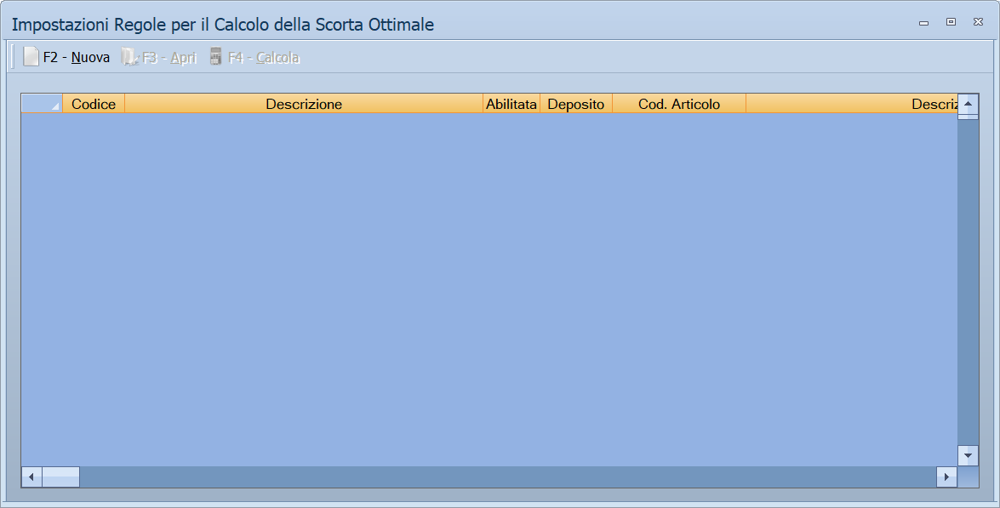

# Scorte, assortimento e ubicazioni

Quattro maschere che rispondono a quattro domande di magazzino: quanta merce
tenere, come spostarla fra i depositi, cosa vendere in ciascun punto vendita e
dove sta fisicamente.

!!! info "In sintesi"

    - **Percorso:**
        - Menu ▸ Archivi ▸ Articoli ▸ Calcolo Scorta Ottimale
        - Menu ▸ Archivi ▸ Articoli ▸ Distribuzione Automatica Scorte e Riordino
        - Menu ▸ Archivi ▸ Articoli ▸ Assortimento Depositi
        - Menu ▸ Archivi ▸ Articoli ▸ Aggiornamento Ubicazione
    - **Scorciatoia:** varia da maschera a maschera, vedi sotto
    - **Permessi richiesti:** nessun profilo predefinito; le singole voci di menu si abilitano per ogni utente da [Archivi ▸ Utenti](utenti.md)

---

## A cosa serve

| Voce di menu | A cosa serve |
|---|---|
| **Calcolo Scorta Ottimale** | Calcola la scorta minima che ogni articolo dovrebbe avere, partendo dal venduto di un periodo e dai giorni di copertura che si vogliono garantire. |
| **Distribuzione Automatica Scorte e Riordino** | Decide cosa spostare da un deposito all'altro e cosa ordinare al fornitore, e può generare gli ordini. |
| **Assortimento Depositi** | Stabilisce quali articoli sono in assortimento su quale deposito. |
| **Aggiornamento Ubicazione** | Scrive dove ogni articolo è sistemato nel magazzino. |

## Prerequisiti

Prima di usare queste maschere occorre:

- avere gli [articoli](anagrafica-articoli.md) e i
  [depositi](../magazzino/depositi.md) in archivio;
- avere movimenti di vendita nel periodo, perché il calcolo delle scorte e la
  distribuzione partono dal venduto;
- **una copia di sicurezza recente**: queste elaborazioni scrivono su molti
  articoli in una volta.

## La maschera



Sono quattro finestre diverse.

**Calcolo Scorta Ottimale** è una griglia di *impostazioni di calcolo*: ogni
riga è una regola, con i filtri a cui si applica e i parametri con cui
calcolare.

| Colonna | Contenuto |
|---|---|
| **Codice**, **Descrizione** | Identificano la regola. |
| **Abilitata** | Se la regola partecipa al calcolo. |
| **Deposito** | Su quale deposito calcolare. |
| **Cod. Articolo**, **Descrizione Articolo** | Restringono a un articolo. |
| **IVA**, **Reparto**, **Cat.Merc.**, **Marchio**, **Stagione**, **Fornitore**, **Gruppo Mix**, **TA1**, **TA2**, **TA3**, **Gruppo**, **Sottogruppo** | I filtri sugli articoli a cui la regola si applica. |
| **Data Calcolo** | Quando la regola è stata calcolata l'ultima volta. |
| **Giorni** | Su quanti giorni di vendite calcolare. |
| **Copertura** | Quanti giorni di vendite la scorta deve coprire. |
| **% LS** | Il livello di servizio da garantire. |
| **File Excel** | Il foglio da cui leggere i dati, in alternativa al calcolo interno. |

**Distribuzione Automatica Scorte e Riordino** ha tre griglie: gli articoli
trovati, quelli selezionati, e i listini dei fornitori per gli articoli da
ordinare (**Cod. For.**, **Fornitore**, **Prezzo**, **%Sc.1** … **%Sc.7**,
**Prezzo Netto**).

**Assortimento Depositi** è una griglia di **Codice** e **Descrizione**.

**Aggiornamento Ubicazione** ha tre soli campi: **Deposito**, **Articolo**,
**Ubicazione**.

## Campi

| Campo | Obbl. | Descrizione | Valori ammessi |
|---|:---:|---|---|
| **Deposito** | ● | Il [deposito](../magazzino/depositi.md) su cui si lavora. | codice |
| **Articolo** | ● | L'articolo da aggiornare, in **Aggiornamento Ubicazione**. | codice |
| **Ubicazione** | | Dove l'articolo è sistemato: corsia, scaffale, ripiano. | testo |

{: .campi }

## Pulsanti e comandi

### Calcolo Scorta Ottimale

| Comando | Scorciatoia | Effetto |
|---|---|---|
| **F2 - Nuova** | ++f2++ | Crea una regola di calcolo. |
| **F3 - Apri** | ++f3++ | Apre la regola selezionata. |
| **F4 - Calcola** | ++f4++ | Esegue il calcolo e scrive le scorte sugli articoli. |

### Distribuzione Automatica Scorte e Riordino

| Comando | Scorciatoia | Effetto |
|---|---|---|
| **F2 - Cerca** | ++f2++ | Cerca gli articoli da riassortire. |
| **F3 - Su**, **F4 - Giu** | ++f3++, ++f4++ | Spostano l'articolo fra le due griglie. |
| **F5 - Importa** | ++f5++ | Legge gli articoli da un foglio Excel. |
| **F6 - St. Art. da Prelevare** | ++f6++ | Stampa la lista di prelievo dal deposito di partenza. |
| **F7 - St. Art. da Ordinare** | ++f7++ | Stampa cosa va ordinato al fornitore. |
| **F8 - Genera Ordini** | ++f8++ | Crea gli ordini a fornitore. |

### Assortimento Depositi

| Comando | Scorciatoia | Effetto |
|---|---|---|
| **F2 - Apri** | ++f2++ | Apre l'articolo della riga. |
| **F4 - Trova** | ++f4++ | Cerca nella griglia. |
| **F5 - Selez.** | ++f5++ | Sceglie gli articoli da portare in griglia. |
| **F6 - Pulisci** | ++f6++ | Svuota la griglia. |
| **Periodo** | | Imposta il periodo su cui calcolare il venduto. |
| **Carica Articoli da Excel** | | Aggiunge gli articoli elencati in un foglio. Del foglio legge **solo la colonna CODICE**. |
| **Elimina** | | Toglie la riga dalla griglia. |

### Aggiornamento Ubicazione

| Comando | Scorciatoia | Effetto |
|---|---|---|
| **F2 - Salva** | ++f2++ | Registra l'ubicazione. |
| **F3 - Importa** | ++f3++ | Legge le ubicazioni da un file. |

## Come si fa

### Ricalcolare le scorte minime dal venduto

1. Apri **Menu ▸ Archivi ▸ Articoli ▸ Calcolo Scorta Ottimale**.
2. Premi **F2 - Nuova** e definisci la regola: il **Deposito**, i filtri sugli
   articoli, i **Giorni** di vendite da guardare e la **Copertura** da
   garantire.
3. Attiva la casella **Abilitata**.
4. Premi **F4 - Calcola** e attendi: la finestra dice *Attendere Calcolo Scorta
   Ottimale!*.

### Riassortire un punto vendita

1. Apri **Menu ▸ Archivi ▸ Articoli ▸ Distribuzione Automatica Scorte e
   Riordino**.
2. Premi **F2 - Cerca**: escono gli articoli sotto scorta.
3. Con **F3 - Su** e **F4 - Giu** scegli cosa muovere davvero.
4. Premi **F6 - St. Art. da Prelevare** per la lista di prelievo.
5. Per quello che in magazzino non c'è, premi **F7 - St. Art. da Ordinare** e
   poi **F8 - Genera Ordini**.

### Aggiornare l'ubicazione di un articolo

1. Apri **Menu ▸ Archivi ▸ Articoli ▸ Aggiornamento Ubicazione**.
2. Indica **Deposito** e **Articolo**.
3. Scrivi l'**Ubicazione** e premi **F2 - Salva**.

## Controlli e messaggi

| Messaggio | Causa | Cosa fare |
|---|---|---|
| *Impossibile inizializzare il book excel!* | Il programma non riesce a preparare il foglio Excel. | Segnala all'assistenza. |
| *Impossibile aprire il file excel!* | Il file è aperto in Excel, spostato o danneggiato. | Chiudilo e riprova. |
| *Colonna CODICE non trovata nel file excel!* / *Impossibile continuare* | Il foglio non ha l'intestazione `CODICE`. | Aggiungila e riprova. |
| *Impossibile aprire il File!* | Il file delle ubicazioni non si apre. | Controlla nome e posizione del file. |
| *Importazione Ubicazioni conclusa con successo!* | L'importazione è andata a buon fine. | Nulla: è una conferma. |
| *Vuoi Calcolare l'esistenza ed il venduto?* | L'assortimento chiede se calcolare i dati, operazione che richiede tempo. | **Sì** se ti servono le colonne di esistenza e venduto. |
| *Vuoi rimuovere gli articoli dalla griglia ?* | Si sta svuotando la griglia della distribuzione. | **Sì** toglie gli articoli dalla griglia; gli articoli restano in archivio. |

## Note

!!! warning "Attenzione"

    **Il calcolo della scorta ottimale riscrive le scorte degli articoli** che
    rientrano nei filtri della regola. Prima di lanciarlo su tutto l'archivio,
    prova su un reparto solo e controlla i risultati.

    **F8 - Genera Ordini crea documenti d'ordine veri.** Non è una simulazione:
    controlla le due stampe di riepilogo prima di premerlo.

!!! note "Come viene calcolata la scorta"

    Il calcolo parte dal **venduto al giorno** del periodo indicato in
    **Giorni**, e lo moltiplica per i giorni che la scorta deve coprire e per il
    livello di servizio:

    ```
    venduto al giorno = venduto del periodo ÷ giorni del periodo

    scorta minima  = (giorni di riordino dell'articolo + Copertura) ×
                     venduto al giorno × %LS ÷ 100

    scorta massima = (giorni di riordino dell'articolo + 365) ×
                     venduto al giorno × %LS ÷ 100
    ```

    I **giorni di riordino** sono quelli impostati sul singolo
    [articolo](anagrafica-articoli.md): sono il tempo che il fornitore impiega a
    consegnare, e per questo si sommano alla copertura. Nella scorta massima si
    usano 365 giorni, o la **Copertura** se è maggiore.

    Il calcolo **scrive tutte e due le scorte**, minima e massima, e il valore
    non scende mai sotto la quantità minima impostata sulla regola. Gli
    articoli nuovi, che non hanno ancora un venduto, prendono la quantità
    prevista per loro dalla regola.

    Con **Copertura** a 90 o 120 giorni il risultato viene corretto da
    coefficienti stagionali; su periodi di osservazione fino a 60 giorni la
    scorta minima non scende mai sotto 1.

!!! info "La correzione che scatta a 90 e a 120 giorni di copertura"

    Con **Copertura** esattamente `90` o `120` il programma **ridimensiona
    la scorta minima** quando la finestra di osservazione — il campo
    **Giorni** — è troppo corta per reggere quella proiezione.

    | Copertura | Giorni osservati | La scorta minima viene moltiplicata per |
    |:---:|---|:---:|
    | 90 | fino a 15 | 0,166 |
    | 90 | da 16 a 30 | 0,333 |
    | 90 | da 31 a 60 | 0,666 |
    | 90 | oltre 60 | nessuna correzione |
    | 120 | fino a 20 | 0,166 |
    | 120 | da 21 a 40 | 0,333 |
    | 120 | da 41 a 80 | 0,666 |
    | 120 | oltre 80 | nessuna correzione |

    Il senso è questo: se hai guardato due settimane di vendite e chiedi
    una scorta per tre mesi, il conto proporzionale gonfierebbe il
    magazzino. I coefficienti — un sesto, un terzo, due terzi — riportano
    il risultato a una misura prudente, e spariscono quando l'osservazione
    è abbastanza lunga da essere credibile.

    Con qualunque altra copertura — 30, 60, 180 giorni — **la correzione
    non c'è**: vale solo per quei due valori esatti. E la **scorta massima**
    non viene mai corretta.

!!! info "Nella distribuzione non si scelgono partenza e arrivo: si ordina l'elenco"

    Non ci sono due campi «da» e «a». C'è l'elenco dei **depositi**, e
    quello che conta è **l'ordine in cui stanno**: si cambia con **F3 - Su**
    e **F4 - Giù**.

    Il programma scorre l'elenco dall'alto. Per ogni deposito che ha
    **più merce della sua scorta minima** cerca, sempre dall'alto, i
    depositi che ne hanno **meno**, e sposta quanto basta — fino a
    esaurire l'eccedenza del primo o a coprire il fabbisogno del secondo.

    Quindi chi sta **in alto dà per primo e riceve per primo**: mettere in
    cima il deposito centrale significa svuotarlo per primo, metterlo in
    fondo significa usarlo come ultima riserva.

    Quello che resta scoperto dopo tutti gli spostamenti diventa la
    proposta di **ordine al fornitore**.

!!! note "Il file delle ubicazioni è la lettura di un terminale"

    **F3 - Importa** compare **solo nella versione Taglie e Colori -
    Calzature** e legge un file di **testo** prodotto dal terminale
    portatile, proposto dalla cartella `in` dell'utente.

    Il file è un elenco di codici letti, uno per riga, e il programma li
    distingue dalla **lunghezza**:

    - una riga di **esattamente tre caratteri** è il codice di
      un'**ubicazione**;
    - le righe più lunghe che la seguono sono i **codici a barre** degli
      articoli che stanno in quell'ubicazione.

    Si lavora quindi così: si legge l'etichetta dello scaffale, poi tutti i
    prodotti che ci stanno, poi l'etichetta dello scaffale dopo. Non serve
    nessuna intestazione e nessun separatore.

## Vedi anche

- [Anagrafica articoli](anagrafica-articoli.md)
- [Depositi](../magazzino/depositi.md)
- [Stampe articoli](stampe-articoli.md)
