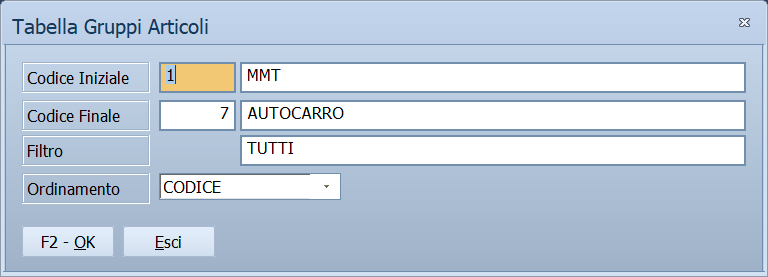

# Stampa delle tabelle

La voce **Stampa** di molte tabelle di base apre la stessa finestra:
si sceglie da quale a quale codice stampare, se filtrare per descrizione e in
che ordine, e il programma prepara l'elenco.

!!! info "In sintesi"

    - **Percorso:**
        - Menu ▸ Archivi ▸ Tipi di Pagamento ▸ Stampa
        - Menu ▸ Archivi ▸ Categorie Economiche ▸ Stampa
        - Menu ▸ Archivi ▸ Aliquote Iva ▸ Stampa
        - Menu ▸ Archivi ▸ Trasportatori ▸ Stampa
        - Menu ▸ Archivi ▸ Zone ▸ Stampa
        - Menu ▸ Archivi ▸ Codici Catastali Comuni ▸ Stampa
        - Menu ▸ Archivi ▸ Magazzino ▸ *(una delle [tabelle di classificazione](../magazzino/tabelle-di-classificazione.md))* ▸ Stampa
        - Menu ▸ Archivi ▸ Altre Tabelle ▸ Causali Cessazione Rapporto, Categorie Rubrica, Origini Merci, Operatori, Tipi Attività, Gruppi Aziende, Mezzi di Trasporto *o* Autisti ▸ Stampa
        - Menu ▸ Archivi ▸ Banchi Conservatori - Attrezzature in Comodato ▸ Marche, Categorie *o* Modelli ▸ Stampa
        - Menu ▸ Archivi ▸ Fornitori ▸ Gruppi Fornitori ▸ Stampa
        - Menu ▸ Archivi ▸ Listini Vendita ▸ Stampa Tabella
        - Menu ▸ Archivi ▸ Agenti ▸ Stampa Giri
    - **Scorciatoia:** ++f2++ avvia la stampa, ++esc++ esce
    - **Permessi richiesti:** nessun profilo predefinito; le singole voci di menu si abilitano per ogni utente da [Archivi ▸ Utenti](utenti.md)

---

## A cosa serve

A tenere su carta, o a controllare in anteprima, il contenuto di una tabella:
l'elenco delle zone da dare agli agenti, le aliquote IVA in uso, i tipi di
pagamento con le loro rate. Si stampa tutta la tabella o solo una parte,
scelta per codice o per descrizione.

È la stessa finestra per tutte le tabelle: cambia solo il titolo, che dice
quale si sta stampando — *Stampa Tabella Zone*, *Stampa Tabella Codici IVA*,
oppure *Tabella Gruppi Articoli*, *Tabella Settori* per le tabelle di
classificazione.

## Prerequisiti

La tabella deve contenere almeno una voce. Se è vuota la finestra non si apre,
e non compare nessun messaggio.

## La maschera

Una finestra piccola, senza barra dei comandi: quattro righe di campi e i due
pulsanti **F2 - OK** ed **Esci** in basso.

## Campi

| Campo | Obbl. | Descrizione | Valori ammessi |
|---|:---:|---|---|
| **Codice Iniziale** | ● | Il primo codice da stampare. La finestra propone il più basso della tabella; accanto compare la sua descrizione. | Codice della tabella |
| **Codice Finale** | ● | L'ultimo codice da stampare. La finestra propone il più alto. | Codice della tabella, non minore dell'iniziale |
| **Filtro** | | Stampa solo le voci la cui descrizione corrisponde al testo. *TUTTI* o *TUTTE* vuol dire nessun filtro; svuotando il campo il programma rimette la parola da solo. Si possono usare i caratteri jolly: `*` per qualsiasi sequenza di caratteri, `?` per un carattere solo. | Testo, in maiuscolo |
| **Ordinamento** | | In che ordine escono le righe. | `CODICE`, `ALFABETICO` |

## Pulsanti e comandi

| Comando | Scorciatoia | Effetto |
|---|---|---|
| **F2 - OK** | ++f2++ | Prepara e mostra l'anteprima della stampa. |
| **Esci** | ++esc++ | Chiude senza stampare. |

Valgono inoltre:

| Comando | Scorciatoia | Effetto |
|---|---|---|
| Guida | ++f1++ | Apre questa pagina. |
| Elenco valori | ++f10++, ++space++ o doppio clic su **Codice Iniziale** o **Codice Finale** | Apre l'elenco delle voci della tabella per sceglierne una. |
| Consultazione | ++f11++ | Apre la finestra **Consultazione**. |
| Calcolatrice | ++f12++ | Apre la calcolatrice. |
| Campo successivo | ++enter++ o ++down++ | Sposta il cursore sul campo seguente. |
| Campo precedente | ++up++ | Torna al campo precedente. |

## Come si fa

### Stampare una tabella intera

1. Apri la voce **Stampa** della tabella, per esempio **Menu ▸ Archivi ▸ Zone
   ▸ Stampa**.
2. Lascia i codici proposti: vanno dal primo all'ultimo.
3. Scegli l'**Ordinamento**: `CODICE` o `ALFABETICO`.
4. Premi **F2 - OK**: compare l'anteprima, da cui si manda in stampa.

### Stampare solo alcune voci

1. Apri la voce **Stampa** della tabella.
2. Restringi l'intervallo con **Codice Iniziale** e **Codice Finale**, oppure
   scrivi nel **Filtro** l'inizio della descrizione seguito da `*` — per
   esempio `NORD*` per tutte le voci che cominciano con *NORD*.
3. Premi **F2 - OK**.

## Controlli e messaggi

| Messaggio | Causa | Cosa fare |
|---|---|---|
| *(nessun messaggio, solo un segnale acustico e il cursore su **Codice Finale**)* | I due codici sono entrambi a zero, oppure il finale è minore dell'iniziale. | Correggi l'intervallo. |

## Note

!!! warning "Il filtro senza asterisco cerca la descrizione esatta"

    Scrivendo nel **Filtro** solo `NORD`, escono unicamente le voci la cui
    descrizione è esattamente *NORD*. Per avere tutte quelle che cominciano
    così serve `NORD*`, per quelle che contengono la parola `*NORD*`. Se
    l'anteprima esce vuota, è quasi sempre per questo.

Sulla tabella dei tipi di tomaia il titolo della finestra è scritto
*Tabella Tpi di Tomaia*, con un refuso.

## Vedi anche

- [Tabelle di classificazione](../magazzino/tabelle-di-classificazione.md)
- [Zone](zone.md)
- [Aliquote IVA](../contabilita/aliquote-iva.md)
- [Tipi di pagamento](../contabilita/tipi-di-pagamento.md)
- [Stampe agenti](stampe-agenti.md), che comprende la stampa dei giri
