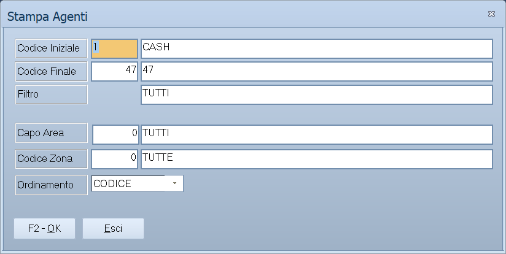

# Stampe agenti

Le quattro voci di stampa che pendono da **Archivi ▸ Agenti**: l'elenco degli
agenti e le tre stampe che riguardano i giri di visita.

!!! info "In sintesi"

    - **Percorso:** Menu ▸ Archivi ▸ Agenti ▸ Stampa *(oppure* Stampa Giri*,* Stampa Giro Agente*,* Stampa Etichette Giri Agenti*)*
    - **Scorciatoia:** ++f2++ avvia la stampa, ++esc++ esce
    - **Permessi richiesti:** nessun profilo predefinito; le singole voci di menu si abilitano per ogni utente da [Archivi ▸ Utenti](utenti.md)

---

## A cosa serve

| Voce di menu | Cosa stampa |
|---|---|
| **Stampa** | L'elenco degli agenti. |
| **Stampa Giri** | L'elenco dei giri di visita: codice e descrizione. |
| **Stampa Giro Agente** | I clienti di un giro, nell'ordine in cui l'agente li visita. È il foglio che l'agente si porta dietro. |
| **Stampa Etichette Giri Agenti** | Le etichette dei clienti di un giro. |

## Prerequisiti

Prima di usare queste maschere occorre:

- avere in archivio gli [agenti](anagrafica-agenti.md);
- per le stampe dei giri, aver creato i giri da **Menu ▸ Archivi ▸ Agenti ▸
  Inserimento Giro** e avervi assegnato i clienti con
  [Associazione Giri](associazioni.md).

## La maschera

**Stampa** ha l'intervallo di codici, due filtri e l'ordinamento. **Stampa Giro
Agente** e **Stampa Etichette Giri Agenti** hanno due soli campi, **Agente** e
**Giro**. **Stampa Giri** apre la stampa generica delle tabelle di codice e
descrizione.

## Campi

### Stampa

| Campo | Obbl. | Descrizione | Valori ammessi |
|---|:---:|---|---|
| **Codice Iniziale**, **Codice Finale** | | Primo e ultimo agente da stampare. | codici |
| **Filtro** | | Restringe per descrizione. | testo |
| **Capo Area** | | Solo gli agenti di quel [capo area](capi-area.md). | codice |
| **Codice Zona** | | Solo gli agenti di quella [zona](zone.md). | codice |
| **Ordinamento** | | Come ordinare la stampa. | `CODICE`, `ALFABETICO` |

{: .campi }

### Stampa Giro Agente ed Etichette Giri Agenti

| Campo | Obbl. | Descrizione | Valori ammessi |
|---|:---:|---|---|
| **Agente** | ● | Di quale agente stampare il giro; a fianco compare il nome. | codice |
| **Giro** | ● | Quale giro stampare; a fianco compare la descrizione. | codice |

{: .campi }

## Pulsanti e comandi

| Comando | Scorciatoia | Effetto |
|---|---|---|
| **F2 - OK** | ++f2++ | Prepara e mostra l'anteprima della stampa. |
| **Esci** | ++esc++ | Chiude senza stampare. |
| Elenco di scelta | ++f10++ o ++space++ | Sul campo con il codice, apre l'elenco da cui scegliere. |
| **Calcolatrice** | ++f12++ | Apre la calcolatrice. |
| **Consultazione** | ++f11++ | Apre la consultazione. |

## Come si fa

### Preparare il foglio di viaggio dell'agente

1. Apri **Menu ▸ Archivi ▸ Agenti ▸ Stampa Giro Agente**.
2. Indica l'**Agente** e il **Giro** del giorno.
3. Premi **F2 - OK**: esce l'elenco dei clienti nell'ordine di visita.

### Stampare le etichette per le consegne di un giro

1. Apri **Menu ▸ Archivi ▸ Agenti ▸ Stampa Etichette Giri Agenti**.
2. Indica **Agente** e **Giro**.
3. Premi **F2 - OK**.

### Stampare l'elenco degli agenti di un capo area

1. Apri **Menu ▸ Archivi ▸ Agenti ▸ Stampa**.
2. Lascia vuoti **Codice Iniziale** e **Codice Finale**.
3. Indica il **Capo Area** e premi **F2 - OK**.

## Controlli e messaggi

| Messaggio | Causa | Cosa fare |
|---|---|---|
| *(nessun messaggio, solo un segnale acustico)* | Manca **Agente** o **Giro** nelle due stampe che li richiedono. | Compila il campo su cui si è posizionato il cursore. |

## Note

!!! note "Stampa Giri è la stampa generica delle tabelle"

    **Stampa Giri** non è una stampa dedicata: apre la stampa della tabella
    generica dei giri agenti, quella descritta in
    [Tabelle di classificazione](../magazzino/tabelle-di-classificazione.md).
    Produce l'elenco di codici e descrizioni, non i clienti dei giri.

<!-- DA VERIFICARE: se la Stampa Giro Agente riporti le tre sequenze o solo quella del giro indicato. -->

<!-- DA VERIFICARE: quale formato di etichette usa la stampa delle etichette dei giri. -->

## Vedi anche

- [Anagrafica agenti](anagrafica-agenti.md)
- [Capi area](capi-area.md)
- [Associazione gruppi e giri](associazioni.md)
