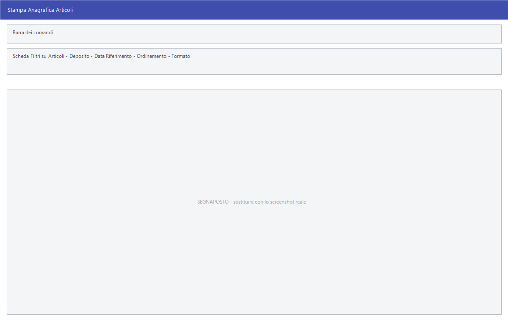

# Stampe articoli

Venti voci di menu sotto **Archivi ▸ Articoli** che sembrano venti maschere
diverse ma aprono **la stessa finestra di selezione**: cambia il titolo e cambia
quello che viene stampato. Questa pagina le documenta tutte.

!!! info "In sintesi"

    - **Percorso:** Menu ▸ Archivi ▸ Articoli ▸ *(una delle voci elencate sotto)*
    - **Scorciatoia:** ++f2++ avvia la stampa, ++esc++ esce
    - **Permessi richiesti:** nessun profilo predefinito; le singole voci di menu si abilitano per ogni utente da [Archivi ▸ Utenti](utenti.md)

---

## A cosa serve

Sono i tabulati con cui si controlla il magazzino: cosa manca, cosa avanza,
cosa non si vende, cosa non ha il codice a barre, dove sta la merce, quanto è
costata. Si sceglie la voce di menu che corrisponde alla domanda, si restringe
la selezione e si stampa.

Queste sono le venti voci, con il titolo che compare in alto:

| Voce di menu | Titolo della finestra | Cosa stampa |
|---|---|---|
| **Stampa Anagrafica** | Stampa Anagrafica Articoli | L'anagrafica completa degli articoli. |
| **Stampa Sintetica Andamento Articoli** | Stampa Sintetica Articoli | Il prospetto sintetico dell'andamento. |
| **Stampa Esistenza** | Stampa Esistenza Articoli | Le giacenze. Nella versione Taglie e Colori apre prima una maschera propria. |
| **Stampa Impostazioni Scorte Min/Max** | Stampa Impostazioni Scorte Min/Max | Le scorte impostate su ogni articolo. |
| **Stampa Articoli Sottoscorta** | Stampa Articoli Sottoscorta | Quello che è sceso sotto la scorta minima. |
| **Stampa Articoli Soprascorta** | Stampa Articoli Soprascorta | Quello che ha superato la scorta massima. |
| **Stampa Articoli con Esistenza a Zero** | Stampa Articoli con Esistenza Uguale a Zero | Gli articoli esauriti. |
| **Stampa Articoli con Esistenza Negativa** | Stampa Articoli con Esistenza Negativa | Le giacenze negative, che segnalano movimenti mancanti o sbagliati. |
| **Stampa Articoli Invenduti** | Stampa Articoli Invenduti | Quello che non si muove. |
| **Stampa Articoli Esclusi dai Listini** | Stampa Articoli Esclusi dal Listino | Gli articoli senza prezzo di vendita. |
| **Stampa Articoli con Codici a Barre Aggiuntivi** | Stampa Articoli con Codici a Barre Aggiuntivi | Gli articoli con più di un codice a barre. |
| **Stampa Articoli senza Codici a Barre Aggiuntivi** | Stampa Articoli Senza Codici a Barre Aggiuntivi | Il complementare del precedente. |
| **Stampa Articoli con Matricole** | Stampa Articoli con Matricole | Gli articoli gestiti a matricola. |
| **Stampa Ultimi Prezzi d' Acquisto** | Stampa Articoli con Ultimo Prezzo Acquisto | Quanto è costata l'ultima fornitura. |
| **Stampa Ubicazione Articoli** | Stampa Ubicazione Articoli | Dove sta fisicamente la merce. |
| **Stampa Articoli Nuovi** | Stampa Nuovi Articoli | Gli articoli inseriti di recente. |
| **Stampa Anagrafica secondo la Classificazione** | Stampa Anagrafica Articoli Secondo Classificazione | L'anagrafica raggruppata per classificazione. |
| **Stampa Articoli senza Codici a Barre** | Stampa Articoli Senza Codice a Barre | Gli articoli da etichettare. |
| **Stampa Articoli Fuori Assortimento** | Stampa Articoli Fuori Assortimento | Quello che è uscito dall'assortimento. |
| **Stampa Indice Rotazione Scorte** | Stampa Indice Rotazione Scorte | Quanto velocemente ruota il magazzino. |
| **Stampa Articoli per Fornitore** | Anagrafica Articoli per Fornitore | L'anagrafica raggruppata per fornitore. |
| **Stampa Catalogo** | Stampa Catalogo Articoli | Il catalogo da consegnare. |
| **Esportazioni su Excel** | Esportazione Excel Anagrafica Articoli | L'anagrafica su foglio Excel invece che su carta. |

## Prerequisiti

Prima di usare queste maschere occorre avere gli
[articoli](anagrafica-articoli.md) in archivio. Le stampe che parlano di
esistenze e scorte hanno senso solo a magazzino movimentato.

## La maschera

La finestra è divisa in tre:

1. in alto la scheda **Filtri su Articoli**, con i criteri di selezione;
2. sotto, **Deposito**, **Data Riferimento**, **Ordinamento** e **Formato**;
3. in fondo le tre caselle di inclusione e i pulsanti **F2 - OK** ed **Esci**.

Non tutti i campi compaiono su tutte le stampe: **Formato**, **Data
Riferimento** e alcune caselle si vedono solo dove hanno senso.

## Campi

### Scheda Filtri su Articoli

| Campo | Obbl. | Descrizione | Valori ammessi |
|---|:---:|---|---|
| **Articolo** | | Codice dell'articolo e, di fianco, la descrizione. | codice, oppure `TUTTI` |
| **Cod. Iva** | | Solo gli articoli con quell'[aliquota IVA](../contabilita/aliquote-iva.md). | codice |
| **Reparto** | | Solo gli articoli del [reparto](../magazzino/reparti.md). | codice |
| **Cat. Merc.** | | Solo gli articoli della [categoria merceologica](../magazzino/categorie-merceologiche.md). | codice |
| **Marchio** | | Solo gli articoli del [marchio](../magazzino/marchi.md). | codice |
| **Stagione** | | Solo gli articoli della [stagione](../magazzino/stagioni.md). | codice |
| **Fornitore** | | Solo gli articoli di quel fornitore abituale. | codice |
| **Gruppo Mix** | | Solo gli articoli di quel gruppo mix. | codice |
| **Gruppo**, **Sottogruppo** | | Il gruppo e il sottogruppo. | testo |
| **Web** | | Se includere gli articoli pubblicati sul web. | `TUTTI`, `INCLUSI WEB`, `ESCLUSI WEB` |
| *(tre campi con il nome delle tabelle di classificazione)* | | Le tre tabelle libere della ditta. Portano a video il nome che hanno nelle impostazioni; se la ditta non le usa restano senza etichetta e non si compilano. | codici |

{: .campi }

Nei campi di testo valgono i caratteri jolly: `*` sostituisce un gruppo di
caratteri e `?` un carattere solo.

### Opzioni di stampa

| Campo | Obbl. | Descrizione | Valori ammessi |
|---|:---:|---|---|
| **Deposito** | | Su quale [deposito](../magazzino/depositi.md) calcolare esistenze e scorte. | codice |
| **Data Riferimento** | | La data a cui riferire i valori. | data |
| **Ordinamento** | | Come ordinare la stampa. | `CASUALE`, `CODICE`, `DESCRIZIONE`; sulla stampa anagrafica anche `CAT.MERC. E POSIZ.POS` |
| **Formato** | | L'impaginazione. | `ESISTENZA, SCORTA MIN/MAX`, `ESISTENZA, SCORTA MIN, Q.TA VENDUTA`, `FORNITORI, MARCHIO, GRUPPO, SOTTOG., ULT. PREZZO ACQ., LISTINI`, `LISTINO 2 - LISTINO 3 - ESISTENZE DEPOSITI` |
| **Solo Articoli con Esistenza Maggiore di** | | Esclude gli articoli sotto la quantità indicata a fianco. | attivo/non attivo, più una quantità |
| **Somma Esistenza Depositi** | | Somma le giacenze di tutti i depositi invece di fermarsi a quello scelto. | attivo/non attivo |
| **Solo Articoli Modificati o Movimentati** | | Limita agli articoli toccati nel periodo. | attivo/non attivo |

{: .campi }

## Pulsanti e comandi

| Comando | Scorciatoia | Effetto |
|---|---|---|
| **F2 - OK** | ++f2++ | Prepara e mostra l'anteprima della stampa. |
| **Esci** | ++esc++ | Chiude senza stampare. |
| Elenco di scelta | ++f10++ o ++space++ | Sul campo con il codice, apre l'elenco da cui scegliere. |
| **Calcolatrice** | ++f12++ | Apre la calcolatrice. |
| **Consultazione** | ++f11++ | Apre la consultazione. |

## Come si fa

### Sapere cosa riordinare

1. Apri **Menu ▸ Archivi ▸ Articoli ▸ Stampa Articoli Sottoscorta**.
2. Indica il **Deposito** del magazzino da rifornire.
3. Restringi con **Fornitore** se vuoi un ordine per volta.
4. Premi **F2 - OK**.

### Trovare le giacenze negative

1. Apri **Menu ▸ Archivi ▸ Articoli ▸ Stampa Articoli con Esistenza
   Negativa**.
2. Lascia i filtri liberi e premi **F2 - OK**.
3. Ogni riga che esce è un movimento mancante o sbagliato da correggere.

### Preparare le etichette da stampare

1. Apri **Menu ▸ Archivi ▸ Articoli ▸ Stampa Articoli senza Codici a Barre**.
2. Premi **F2 - OK**: esce l'elenco degli articoli da etichettare.

### Portare l'anagrafica su Excel

1. Apri **Menu ▸ Archivi ▸ Articoli ▸ Esportazioni su Excel**.
2. Restringi la selezione e premi **F2 - OK**.

## Controlli e messaggi

| Messaggio | Causa | Cosa fare |
|---|---|---|
| *(nessun messaggio, solo un segnale acustico)* | Un campo obbligatorio della selezione è vuoto. | Guarda dove si è posizionato il cursore: è il campo da compilare. |

## Note

!!! note "Il titolo della finestra dice quale stampa è"

    Poiché la maschera è sempre la stessa, l'unico modo per accorgersi di aver
    aperto la stampa sbagliata è leggere il titolo in alto. La tabella
    all'inizio di questa pagina mette in corrispondenza voce di menu e titolo.

<!-- DA VERIFICARE: quali campi (Formato, Data Riferimento, le tre caselle) compaiano su quali stampe: variano da una voce all'altra. -->

<!-- DA VERIFICARE: cosa produce l'ordinamento CASUALE. -->

<!-- DA VERIFICARE: su quale periodo si basa "Solo Articoli Modificati o Movimentati". -->

<!-- DA VERIFICARE: se "Stampa Esistenza" nella versione Taglie e Colori apra una maschera diversa, e con quali campi. -->

## Vedi anche

- [Anagrafica articoli](anagrafica-articoli.md)
- [Stampa listini](../listini-vendita/stampa-listini.md)
- [Analisi listino da vendite ed esistenza](../listini-vendita/analisi-listino.md)
