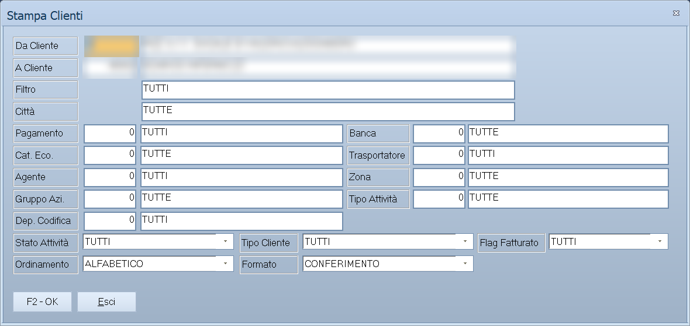

# Stampe clienti

Le sei voci di stampa che pendono da **Archivi ▸ Clienti**. Condividono lo
stesso modo di lavorare: si sceglie l'intervallo di clienti, si restringe con i
filtri e si dice in che formato stampare.

!!! info "In sintesi"

    - **Percorso:** Menu ▸ Archivi ▸ Clienti ▸ Stampa *(oppure* Stampa Schede*,* Stampa Saldi*,* Stampa Elenco IVA*,* Stampa Condizioni Contrattuali*,* Stampa Buoni Sconto*)*
    - **Scorciatoia:** ++f2++ avvia la stampa, ++esc++ esce
    - **Permessi richiesti:** nessun profilo predefinito; le singole voci di menu si abilitano per ogni utente da [Archivi ▸ Utenti](utenti.md)

---

## A cosa serve

| Voce di menu | Cosa stampa |
|---|---|
| **Stampa** | L'elenco dei clienti, in dieci formati diversi. |
| **Stampa Schede** | La scheda contabile del cliente in un periodo: tutte le registrazioni con il saldo progressivo. |
| **Stampa Saldi** | I saldi dei clienti a una data. |
| **Stampa Elenco IVA** | L'elenco IVA clienti. Apre la stessa maschera di **Stampa**, con il titolo *Stampa Elenco IVA Clienti*. |
| **Stampa Condizioni Contrattuali** | Le condizioni concordate con ciascun cliente. |
| **Stampa Buoni Sconto** | I buoni sconto maturati in un periodo, con quota obiettivo e percentuale di sconto. |

## Prerequisiti

Prima di usare queste maschere occorre avere in archivio i
[clienti](anagrafica-clienti.md). Per **Stampa Schede** e **Stampa Saldi**
servono anche le registrazioni contabili del periodo.

## La maschera

Tutte e sei hanno la stessa struttura: in alto l'**intervallo di clienti**, al
centro i **filtri**, in basso le **opzioni di stampa** e i pulsanti **F2 - OK**
ed **Esci**.

## Campi

### Intervallo e filtri (comuni a tutte)

| Campo | Obbl. | Descrizione | Valori ammessi |
|---|:---:|---|---|
| **Da Cliente**, **A Cliente** | | Primo e ultimo codice da stampare. Lasciandoli vuoti si stampano tutti. | codici |
| **Filtro** | | Restringe per descrizione. | testo |
| **Pagamento** | | Solo i clienti con quel [tipo di pagamento](../contabilita/tipi-di-pagamento.md). | codice |
| **Banca** | | Solo i clienti appoggiati a quella [banca](../contabilita/banche.md). | codice |
| **Cat. Eco.** | | Solo i clienti di quella [categoria economica](categorie-economiche.md). | codice |
| **Trasportatore** | | Solo i clienti serviti da quel [vettore](trasportatori.md). Nelle altre stampe l'etichetta è **Vettore**. | codice |
| **Agente** | | Solo i clienti di quell'[agente](anagrafica-agenti.md). | codice |
| **Zona** | | Solo i clienti di quella [zona](zone.md). | codice |
| **Gruppo Azi.** | | Solo i clienti di quel gruppo aziende. | codice |
| **Città** | | Solo i clienti di quel comune. Presente in **Stampa**. | testo |
| **Tipo Attività** | | Solo i clienti con quel tipo di attività. | codice |
| **Dep. Codifica** | | Il deposito che ha acquisito il cliente. Vedi la nota: è un dato che dentro Facile non si può scrivere. | codice |
| **Stato Attività** | | Se includere i clienti che hanno cessato. | `TUTTI`, `NON CESSATA`, `CESSATA` |
| **Tipo Cliente** | | Che genere di soggetto includere. | `TUTTI`, `PERSONE FISICHE`, `PERSONE FISICHE - MASCHI`, `PERSONE FISICHE - FEMMINE`, `PERSONE GIURIDICHE` |
| **Flag Fatturato** | | Se includere i clienti esclusi dalla fatturazione. | `TUTTI`, `ESCLUSI`, `INCLUSI` |
| **Ordinamento** | | Come ordinare la stampa. | `CODICE`, `ALFABETICO`, `CAP + ALFABETICO` |

### Formato della stampa elenco

| Formato | Cosa contiene |
|---|---|
| `SINTETICA` | Codice, ragione sociale e recapiti essenziali. |
| `DETTAGLIATA` | Tutti i dati anagrafici, fiscali e commerciali. |
| `CON TIPI ATTIVITA` | L'elenco con il tipo di attività di ciascuno. |
| `ETICHETTE` | Etichette da affrancare. |
| `DESTINAZIONI` | Le destinazioni merce dei clienti. |
| `RICHIESTA DATI FISCALI` | Il modulo da mandare ai clienti a cui mancano i dati fiscali. |
| `SALDO PUNTI` | Il saldo della raccolta punti. |
| `SCONTO MEDIO` | Lo sconto medio praticato a ciascun cliente. |
| `LISTINO APPLICATO` | Quale listino si applica a ciascun cliente. |
| `SENZA ACQUISTI` | I clienti **inattivi**: nessun movimento in archivio e nessun documento nell'anno di lavoro. |

### Campi propri di alcune stampe

| Campo | Dove compare | Descrizione |
|---|---|---|
| **Data Iniziale**, **Data Finale** | Stampa Schede, Stampa Saldi, Stampa Buoni Sconto | Il periodo da considerare. |
| **Sezione** | Stampa Schede, Stampa Saldi | La [sezione](../contabilita/sezioni.md) contabile. |
| **Quota Obiettivo** | Stampa Buoni Sconto | La soglia oltre la quale il buono matura. |
| **% Sconto** | Stampa Buoni Sconto | La percentuale di sconto del buono. |

## Pulsanti e comandi

| Comando | Scorciatoia | Effetto |
|---|---|---|
| **F2 - OK** | ++f2++ | Prepara e mostra l'anteprima della stampa. |
| **Esci** | ++esc++ | Chiude senza stampare. |
| Elenco di scelta | ++f10++ o ++space++ | Sul campo con il codice, apre l'elenco da cui scegliere. |
| **Calcolatrice** | ++f12++ | Apre la calcolatrice. |
| **Consultazione** | ++f11++ | Apre la consultazione. |

## Come si fa

### Stampare le etichette dei clienti di una zona

1. Apri **Menu ▸ Archivi ▸ Clienti ▸ Stampa**.
2. Lascia vuoti **Da Cliente** e **A Cliente**.
3. Indica la **Zona**.
4. Metti **Ordinamento** su `CAP + ALFABETICO`, che è l'ordine con cui si
   affrancano le buste.
5. Scegli **Formato** `ETICHETTE` e premi **F2 - OK**.

### Chiedere i dati fiscali mancanti

1. Apri **Menu ▸ Archivi ▸ Clienti ▸ Stampa**.
2. Scegli **Formato** `RICHIESTA DATI FISCALI`.
3. Premi **F2 - OK**: escono i moduli da mandare ai clienti incompleti.

### Stampare la scheda contabile di un cliente

1. Apri **Menu ▸ Archivi ▸ Clienti ▸ Stampa Schede**.
2. Metti lo stesso codice in **Da Cliente** e **A Cliente**.
3. Indica **Data Iniziale** e **Data Finale**.
4. Premi **F2 - OK**.

## Controlli e messaggi

| Messaggio | Causa | Cosa fare |
|---|---|---|
| *Vuoi la stampa in ordine alfabetico ?* | Alcuni formati chiedono l'ordinamento al momento della stampa. | Rispondi secondo come vuoi l'elenco. |
| *Impossibile creare il File!* | Il programma non riesce a scrivere il file di appoggio della stampa. | Verifica che la cartella di lavoro sia scrivibile; se il problema resta, segnala all'assistenza. |

## Note

!!! note "Stampa Elenco IVA riusa la stessa maschera"

    **Stampa Elenco IVA** apre la maschera di **Stampa** con il titolo *Stampa
    Elenco IVA Clienti*: i filtri sono gli stessi, cambia quello che viene
    prodotto.

!!! note "Le stesse stampe sono anche nel menu Contabilità"

    **Stampa Schede Clienti** e **Elenco IVA Clienti**, sotto
    **Menu ▸ Contabilità** e **Menu ▸ Contabilità ▸ Stampe Contabili**, aprono
    le stesse maschere descritte qui.

!!! note "Chi chiede l'ordine alfabetico, e perché"

    Una sola stampa: l'**Elenco IVA Clienti**. Là il campo **Ordinamento**
    non c'è — la finestra lo nasconde, perché quel modulo ha un ordinamento
    suo — e l'ordine viene chiesto con la domanda *Vuoi la stampa in ordine
    alfabetico ?* subito prima di stampare.

    Rispondendo **No** l'elenco esce in ordine di codice.

    In tutte le altre stampe l'ordine si sceglie prima, nel campo
    **Ordinamento**, e la domanda non compare.

!!! info "Che cosa intende il programma per SENZA ACQUISTI"

    Escono i clienti che non hanno **né l'una né l'altra** di queste due
    cose:

    - **nessun movimento di magazzino** a loro nome, in tutto l'archivio,
      senza limiti di data;
    - **nessun documento** intestato a loro **nell'anno di lavoro** —
      fatture, note, DDT, bolle, ricevute — fra quelli effettivamente
      emessi.

    Quindi non è «non ha comprato quest'anno»: è «non risulta aver mai
    comprato niente, e quest'anno non ha nemmeno un documento». È l'elenco
    delle anagrafiche da ripulire, non quello dei clienti dormienti.

!!! warning "Dep. Codifica filtra un dato che non si può compilare"

    Il filtro lavora sul **deposito di acquisizione** del cliente, cioè il
    punto vendita dal quale è stato registrato la prima volta.

    Quel dato però **non compare in nessuna maschera**: nella scheda del
    cliente non c'è un campo per scriverlo. Lo riempie soltanto
    l'acquisizione automatica dei clienti dal web, quando l'installazione
    ce l'ha.

    Su un'installazione senza quel collegamento il campo resta a zero per
    tutti: indicando un deposito, la stampa esce vuota.

## Vedi anche

- [Anagrafica clienti](anagrafica-clienti.md)
- [Mailing list](mailing-list.md)
- [Stampe fornitori](stampe-fornitori.md)
