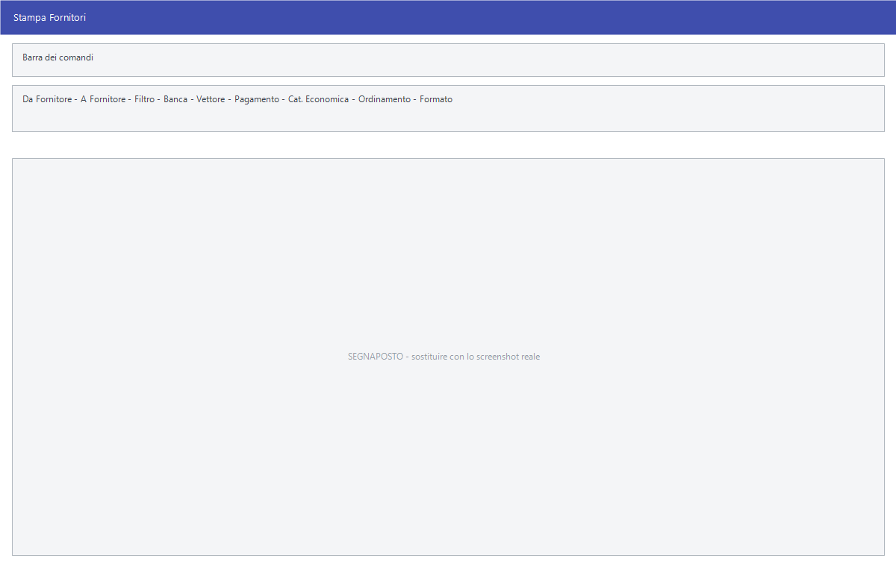

# Stampe fornitori

Le quattro voci di stampa che pendono da **Archivi ▸ Fornitori**: l'elenco
anagrafico e le tre stampe contabili.

!!! info "In sintesi"

    - **Percorso:** Menu ▸ Archivi ▸ Fornitori ▸ Stampa *(oppure* Stampa Schede*,* Stampa Saldi*,* Stampa Elenco IVA*)*
    - **Scorciatoia:** ++f2++ avvia la stampa, ++esc++ esce
    - **Permessi richiesti:** nessun profilo predefinito; le singole voci di menu si abilitano per ogni utente da [Archivi ▸ Utenti](utenti.md)

---

## A cosa serve

| Voce di menu | Cosa stampa |
|---|---|
| **Stampa** | L'elenco dei fornitori, in quattro formati. |
| **Stampa Schede** | La scheda contabile del fornitore in un periodo, con il saldo progressivo. |
| **Stampa Saldi** | I saldi dei fornitori a una data. |
| **Stampa Elenco IVA** | L'elenco IVA fornitori. |

## Prerequisiti

Prima di usare queste maschere occorre avere in archivio i
[fornitori](anagrafica-fornitori.md). Per le stampe contabili servono anche le
registrazioni del periodo.

## La maschera

Struttura identica a quella delle [stampe clienti](stampe-clienti.md): in alto
l'intervallo, al centro i filtri, in basso le opzioni e i pulsanti **F2 - OK**
ed **Esci**.

## Campi

| Campo | Obbl. | Descrizione | Valori ammessi |
|---|:---:|---|---|
| **Da Fornitore**, **A Fornitore** | | Primo e ultimo codice da stampare. Lasciandoli vuoti si stampano tutti. | codici |
| **Filtro** | | Restringe per descrizione. | testo |
| **Banca** | | Solo i fornitori appoggiati a quella [banca](../contabilita/banche.md). | codice |
| **Vettore** | | Solo i fornitori serviti da quel [trasportatore](trasportatori.md). | codice |
| **Pagamento** | | Solo i fornitori con quel [tipo di pagamento](../contabilita/tipi-di-pagamento.md). | codice |
| **Cat. Economica** | | Solo i fornitori di quella [categoria economica](categorie-economiche.md). | codice |
| *(elenco senza etichetta accanto a Ordinamento)* | | Che genere di fornitore includere. | `TUTTI`, `GENERICI`, `BENI`, `SERVIZI` |
| **Ordinamento** | | Come ordinare la stampa. | `CODICE`, `ALFABETICO` |
| **Formato** | ● | L'impaginazione della stampa. | `SINTETICA`, `DETTAGLIATA`, `ETICHETTE`, `RICHIESTA DATI FISCALI` |

{: .campi }

Le stampe contabili — **Stampa Schede** e **Stampa Saldi** — aggiungono
**Data Iniziale**, **Data Finale** e **Sezione**, e usano gli stessi filtri
delle corrispondenti [stampe clienti](stampe-clienti.md).

## Pulsanti e comandi

| Comando | Scorciatoia | Effetto |
|---|---|---|
| **F2 - OK** | ++f2++ | Prepara e mostra l'anteprima della stampa. |
| **Esci** | ++esc++ | Chiude senza stampare. |
| Elenco di scelta | ++f10++ o ++space++ | Sul campo con il codice, apre l'elenco da cui scegliere. |
| **Calcolatrice** | ++f12++ | Apre la calcolatrice. |
| **Consultazione** | ++f11++ | Apre la consultazione. |

## Come si fa

### Stampare l'elenco dei fornitori di servizi

1. Apri **Menu ▸ Archivi ▸ Fornitori ▸ Stampa**.
2. Lascia vuoti **Da Fornitore** e **A Fornitore**.
3. Nell'elenco accanto a **Ordinamento** scegli `SERVIZI`.
4. Scegli **Formato** `SINTETICA` e premi **F2 - OK**.

### Chiedere i dati fiscali mancanti

1. Apri **Menu ▸ Archivi ▸ Fornitori ▸ Stampa**.
2. Scegli **Formato** `RICHIESTA DATI FISCALI`.
3. Premi **F2 - OK**.

### Stampare la scheda contabile di un fornitore

1. Apri **Menu ▸ Archivi ▸ Fornitori ▸ Stampa Schede**.
2. Metti lo stesso codice in **Da Fornitore** e **A Fornitore**.
3. Indica **Data Iniziale** e **Data Finale**.
4. Premi **F2 - OK**.

## Controlli e messaggi

| Messaggio | Causa | Cosa fare |
|---|---|---|
| *Impossibile creare il File!* | Il programma non riesce a scrivere il file di appoggio della stampa. | Verifica che la cartella di lavoro sia scrivibile; se il problema resta, segnala all'assistenza. |

## Note

!!! note "Le stesse stampe sono anche nel menu Contabilità"

    **Stampa Schede Fornitori** e **Elenco IVA Fornitori**, sotto
    **Menu ▸ Contabilità** e **Menu ▸ Contabilità ▸ Stampe Contabili**, aprono
    le stesse maschere descritte qui.

<!-- DA VERIFICARE: come si chiama a video l'elenco senza etichetta con i valori TUTTI / GENERICI / BENI / SERVIZI, e dove il fornitore viene classificato in beni o servizi. -->

<!-- DA VERIFICARE: se Stampa Schede e Stampa Saldi dei fornitori aprano davvero le stesse maschere delle corrispondenti stampe clienti. -->

## Vedi anche

- [Anagrafica fornitori](anagrafica-fornitori.md)
- [Stampe clienti](stampe-clienti.md)
