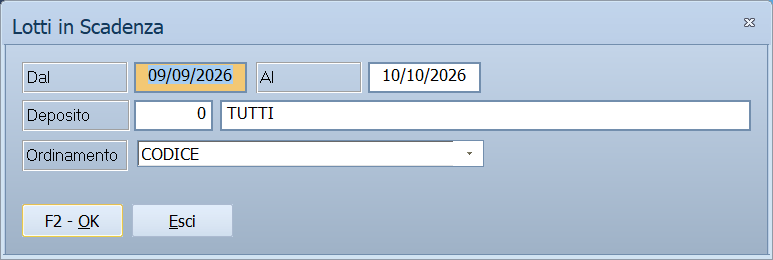

# Stampa lotti in scadenza e spostamenti codici a barre

Due stampe di **Archivi ▸ Articoli** che non usano la maschera comune delle
[stampe articoli](stampe-articoli.md) ma ne hanno una propria, perché ragionano
su un periodo.

!!! info "In sintesi"

    - **Percorso:**
        - Menu ▸ Archivi ▸ Articoli ▸ Stampa Lotti in Scadenza
        - Menu ▸ Archivi ▸ Articoli ▸ Stampa Spostamenti Codici a Barre
    - **Scorciatoia:** ++f2++ avvia la stampa, ++esc++ esce
    - **Permessi richiesti:** nessun profilo predefinito; le singole voci di menu si abilitano per ogni utente da [Archivi ▸ Utenti](utenti.md)

---

## A cosa serve

**Stampa Lotti in Scadenza** elenca i lotti che scadono nel periodo indicato:
serve a smaltire per tempo la merce deperibile e a non trovarsi prodotti
scaduti a scaffale.

**Stampa Spostamenti Codici a Barre** elenca i codici a barre che sono stati
spostati da un articolo a un altro nel periodo. È una stampa di controllo: uno
spostamento sbagliato fa vendere un articolo al posto di un altro.

## Prerequisiti

Prima di usare queste maschere occorre:

- per i lotti, avere la gestione dei lotti attiva e i lotti caricati con la
  loro data di scadenza;
- per gli spostamenti, avere movimentato i codici a barre nel periodo.

## La maschera

Sono due finestrelle con pochi campi e i pulsanti **F2 - OK** ed **Esci**.

La maschera degli spostamenti serve anche una terza stampa, che sta sotto un
altro menu: **Casse e Bilance ▸ Stampa Scarti da Ricezione**. Quando si apre da
lì prende il titolo *Stampa Scarti su Ricezione da Casse* e mostra un campo in
più, descritto qui sotto.

## Campi

### Stampa Lotti in Scadenza

| Campo | Obbl. | Descrizione | Valori ammessi |
|---|:---:|---|---|
| **Dal** | ● | Prima data di scadenza da includere. | data |
| **Al** | ● | Ultima data di scadenza da includere. | data |
| **Deposito** | | Su quale [deposito](../magazzino/depositi.md) guardare. | codice |
| **Ordinamento** | | Come ordinare la stampa. | `CODICE`, `DESCRIZIONE` |

{: .campi }

### Stampa Spostamenti Codici a Barre

| Campo | Obbl. | Descrizione | Valori ammessi |
|---|:---:|---|---|
| **Data Iniziale** | ● | Primo giorno del periodo da esaminare. | data |
| **Data Finale** | ● | Ultimo giorno del periodo. | data |
| **Deposito** | | Su quale [deposito](../magazzino/depositi.md) guardare. | codice |

{: .campi }

## Pulsanti e comandi

| Comando | Scorciatoia | Effetto |
|---|---|---|
| **F2 - OK** | ++f2++ | Prepara e mostra l'anteprima della stampa. |
| **Esci** | ++esc++ | Chiude senza stampare. |
| Elenco di scelta | ++f10++ o ++space++ | Sul campo **Deposito**, apre l'elenco dei depositi. |
| **Calcolatrice** | ++f12++ | Apre la calcolatrice. |
| **Consultazione** | ++f11++ | Apre la consultazione. |

## Come si fa

### Vedere cosa scade nel prossimo mese

1. Apri **Menu ▸ Archivi ▸ Articoli ▸ Stampa Lotti in Scadenza**.
2. In **Dal** metti la data di oggi e in **Al** quella fra un mese.
3. Indica il **Deposito** e premi **F2 - OK**.

### Controllare gli spostamenti di codici a barre della settimana

1. Apri **Menu ▸ Archivi ▸ Articoli ▸ Stampa Spostamenti Codici a Barre**.
2. Indica **Data Iniziale** e **Data Finale**.
3. Premi **F2 - OK** e verifica che ogni spostamento sia voluto.

## Controlli e messaggi

| Messaggio | Causa | Cosa fare |
|---|---|---|
| *(nessun messaggio, solo un segnale acustico)* | Manca una delle due date. | Compila il campo su cui si è posizionato il cursore. |

## Note

Non applicabile.

<!-- DA VERIFICARE: quale impostazione attiva la gestione dei lotti, e cosa mostra la stampa se i lotti non sono gestiti. -->

<!-- DA VERIFICARE: cosa si intende per "spostamento" di un codice a barre e da quale maschera si effettua. -->

## Vedi anche

- [Anagrafica articoli](anagrafica-articoli.md)
- [Stampe articoli](stampe-articoli.md)
