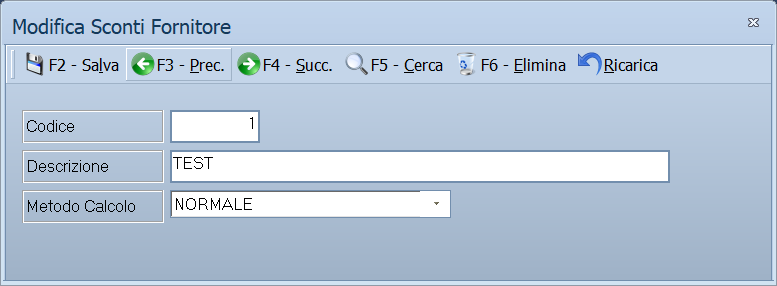

# Tabella sconti fornitori

Le condizioni di sconto concordate con i fornitori, raccolte in tabelle
richiamabili dai contratti. Ogni tabella dice anche **con quale metodo** i suoi
sconti si combinano con gli altri.

!!! info "In sintesi"

    - **Percorso:** Menu ▸ Archivi ▸ Fornitori ▸ Gestione Contratti ▸ Tabella Sconti Fornitori ▸ Inserimento *(oppure* Modifica*)*
    - **Scorciatoia:** ++f2++ salva, ++f5++ cerca
    - **Permessi richiesti:** nessun profilo predefinito; **Inserimento** e **Modifica** si abilitano separatamente per ogni utente da [Archivi ▸ Utenti](utenti.md)

---

## A cosa serve

Un fornitore concede sconti diversi secondo il prodotto, il periodo o il
volume concordato. Questa tabella è l'elenco dei **nomi** di quegli sconti:
*premio di fine anno*, *contributo espositori*, *sconto logistico*.

Qui **non si scrivono percentuali**: si registra solo il codice e il nome, e
i numeri veri si mettono poi sul contratto del singolo fornitore — vedi
sotto.

## Prerequisiti

Prima di usare questa maschera occorre avere in archivio i
[fornitori](anagrafica-fornitori.md) a cui le tabelle si riferiscono.

## La maschera

È una maschera a finestra unica, senza schede: la barra dei comandi e tre
campi. Il titolo in modifica è *Modifica Sconti Fornitore*.

## Campi

| Campo | Obbl. | Descrizione | Valori ammessi |
|---|:---:|---|---|
| **Codice** | ● | Identificativo della tabella. In modifica non è modificabile. | numero |
| **Descrizione** | ● | Nome della tabella, come compare quando la si richiama sul contratto. | testo |
| **Metodo Calcolo** | | Classifica lo sconto. Il programma la registra e la mostra nell'elenco, ma non la usa in nessun calcolo. | `NORMALE`, `PRIMARIO`, `SECONDARIO` |

{: .campi }

## Pulsanti e comandi

| Comando | Scorciatoia | Effetto |
|---|---|---|
| **F2 - Salva** | ++f2++ | Registra la tabella. In inserimento la maschera si svuota per la successiva. |
| **F3 - Prec.** | ++f3++ | Passa alla tabella precedente. |
| **F4 - Succ.** | ++f4++ | Passa alla tabella successiva. |
| **F5 - Cerca** | ++f5++ | Apre l'elenco delle tabelle, con **Codice**, **Descrizione** e **Metodo**. |
| **F6 - Elimina** | ++f6++ | Cancella la tabella, previa conferma. |
| **Ricarica** | | Rilegge la tabella dall'archivio, abbandonando le modifiche non salvate. |
| **Consultazione** | ++f11++ | Apre la consultazione. |
| **Calcolatrice** | ++f12++ | Apre la calcolatrice. |

## Come si fa

### Registrare una tabella di sconti

1. Apri **Menu ▸ Archivi ▸ Fornitori ▸ Gestione Contratti ▸ Tabella Sconti
   Fornitori ▸ Inserimento**.
2. Digita **Codice** e **Descrizione**.
3. Scegli il **Metodo Calcolo**.
4. Premi **F2 - Salva**.

## Controlli e messaggi

| Messaggio | Causa | Cosa fare |
|---|---|---|
| *(nessun messaggio, solo un segnale acustico)* | Manca il **Codice** o la **Descrizione**. | Guarda dove si è posizionato il cursore: è il campo da compilare. |
| *Confermi la Cancellazione....* | Conferma richiesta da **F6 - Elimina**. | Rispondi **Sì** per eliminare la tabella. |

## Note

Non applicabile.

!!! info "Dove si scrivono le percentuali"

    Sul **contratto fornitore**, nel riquadro degli **sconti extra**
    fattura. Il contratto ha **otto righe**, e ogni riga comincia con il
    **codice dello sconto**, che si prende da questa tabella; accanto
    compare il nome, e poi si scrivono i numeri veri:

    - la **percentuale** e l'eventuale **importo** dello sconto;
    - la percentuale di **ribaltamento** sul listino di vendita;
    - gli **obiettivi** a valore e a quantità, se lo sconto è a target;
    - il **periodo** di validità, la **liquidazione** — annuale,
      trimestrale o mensile — e il **documento** con cui si chiude:
      nessuno, fattura o nota di credito.

    Così lo stesso sconto — per esempio *premio di fine anno* — si chiama
    allo stesso modo per tutti i fornitori, ma ha la percentuale e le
    condizioni di ciascuno.

!!! note "I tre metodi di calcolo oggi non calcolano niente"

    `NORMALE`, `PRIMARIO` e `SECONDARIO` vengono registrati sulla tabella e
    compaiono nella colonna **Metodo** dell'elenco, ma **nessuna parte del
    programma li consulta**: l'ordine con cui gli sconti si applicano è
    quello delle otto righe del contratto, dalla prima all'ottava.

    Restano quindi un modo per classificare le tabelle e ritrovarle
    nell'elenco, non un'impostazione di calcolo.

## Vedi anche

- [Anagrafica fornitori](anagrafica-fornitori.md)
- [Canali di vendita](../altre-tabelle/canali-di-vendita.md)
