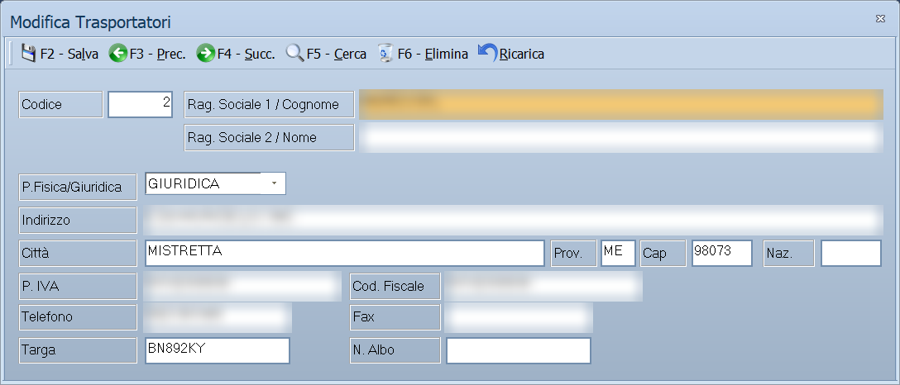

# Trasportatori

Da questa maschera si registrano i vettori: le imprese di trasporto che
consegnano la merce. I loro dati finiscono sui documenti di trasporto, dove la
legge richiede di indicare chi effettua il trasporto.

!!! info "In sintesi"

    - **Percorso:** Menu ▸ Archivi ▸ Trasportatori ▸ Inserisci *(oppure* Modifica*)*
    - **Scorciatoia:** nessuna; la maschera si apre dal menu
    - **Permessi richiesti:** nessun profilo predefinito; **Inserimento** e **Modifica** si abilitano separatamente per ogni utente da [Archivi ▸ Utenti](utenti.md)

---

## A cosa serve

Il trasportatore è il vettore che compare sul DDT. Ogni cliente e ogni
fornitore può averne uno abituale nella propria anagrafica, e i documenti lo
ereditano da lì.

Esempio: se sull'anagrafica del cliente indichi il corriere che lo serve, ogni
DDT intestato a quel cliente nasce già con quel vettore, con targa e numero di
albo, senza doverli riscrivere.

## Prerequisiti

*Nessuno.* Conviene però aver definito l'archivio delle **nazioni**, se
registri vettori esteri.

## La maschera

È una maschera a finestra unica, senza schede: in alto la **barra dei
comandi**, sotto la denominazione del vettore, l'indirizzo, i dati fiscali, i
recapiti e i dati del mezzo.

## Campi

| Campo | Obbl. | Descrizione | Valori ammessi |
|---|:---:|---|---|
| Codice | ● | Identificativo del trasportatore. In modifica non è modificabile. | Numero |
| Rag. Sociale 1 / Cognome | ● | Denominazione del vettore, o il cognome se è una persona fisica. | Fino a 45 caratteri |
| Rag. Sociale 2 / Nome | | Seconda riga della denominazione, o il nome. | Fino a 45 caratteri |
| P.Fisica/Giuridica | | Natura del soggetto. | FISICA, GIURIDICA |
| Indirizzo | | Via e numero civico della sede. | Fino a 100 caratteri |
| Città | | Comune della sede. | Fino a 30 caratteri |
| Prov. | | Sigla della provincia. | 2 caratteri |
| Cap | | Codice di avviamento postale. | Fino a 5 caratteri |
| Naz. | | Codice della nazione. | Fino a 4 caratteri |
| P. IVA | | Partita IVA del vettore. Se non supera il controllo, il programma chiede se salvare comunque. | Fino a 28 caratteri |
| Cod. Fiscale | | Codice fiscale del vettore. | Fino a 16 caratteri |
| Telefono | | Recapito telefonico. | Fino a 13 caratteri |
| Fax | | Numero di fax. | Fino a 13 caratteri |
| Targa | | Targa dell'automezzo abituale. | Fino a 11 caratteri |
| N. Albo | | Numero di iscrizione all'albo degli autotrasportatori, da riportare sui documenti di trasporto. | Fino a 10 caratteri |

{: .campi }

## Pulsanti e comandi

| Comando | Scorciatoia | Effetto |
|---|---|---|
| **F2 - Salva** | ++f2++ | Registra il trasportatore. In inserimento la maschera si svuota per il successivo. |
| **F3 - Prec.** | ++f3++ | Passa al trasportatore precedente. |
| **F4 - Succ.** | ++f4++ | Passa al trasportatore successivo. |
| **F5 - Cerca** | ++f5++ | Apre l'elenco dei trasportatori. |
| **F6 - Elimina** | ++f6++ | Cancella il trasportatore, previa conferma. |
| **Ricarica** | | Rilegge il trasportatore dall'archivio, abbandonando le modifiche non salvate. |

Valgono inoltre:

| Comando | Scorciatoia | Effetto |
|---|---|---|
| Consultazione | ++f11++ | Apre la finestra **Consultazione**. |
| Calcolatrice | ++f12++ | Apre la calcolatrice. |
| Campo successivo | ++enter++ | Sposta il cursore sul campo seguente. |
| Chiusura | ++esc++ | Chiude la maschera. |

## Come si fa

### Registrare un trasportatore

1. Apri **Menu ▸ Archivi ▸ Trasportatori ▸ Inserisci**.
2. Digita il **Codice** e la **Rag. Sociale 1 / Cognome**: sono gli unici due
   dati che il programma pretende.
3. Compila indirizzo, **P. IVA** e **Cod. Fiscale**.
4. Indica **Targa** e **N. Albo**: sono i dati che servono sul documento di
   trasporto.
5. Premi **F2 - Salva**.

### Ritrovare e modificare un trasportatore

1. Apri **Menu ▸ Archivi ▸ Trasportatori ▸ Modifica**. La maschera non si apre
   vuota: mostra già il trasportatore con il **codice più alto**.
2. Premi **F5 - Cerca** e scegli il trasportatore dall'elenco, oppure scorri
   con **F3 - Prec.** e **F4 - Succ.**.
3. Correggi i campi e premi **F2 - Salva**. La scheda resta a video su quello
   appena registrato; in inserimento invece si svuota per il successivo.

Finché non salvi puoi tornare indietro con **Ricarica**, che rilegge il
trasportatore dall'archivio e abbandona le modifiche non salvate. Se l'archivio
è ancora vuoto la voce **Modifica** non apre nulla e non dà alcun messaggio.

### Assegnare il vettore abituale a un cliente

1. Apri l'[anagrafica del cliente](anagrafica-clienti.md).
2. Nella scheda *Generale*, sul campo **Trasportatore**, premi ++f10++ e scegli
   il vettore.
3. Premi **F2 - Salva**.

## Controlli e messaggi

| Messaggio | Causa | Cosa fare |
|---|---|---|
| *(nessun messaggio, solo un segnale acustico)* | Manca il **Codice** o la **Rag. Sociale 1 / Cognome**. | Guarda dove si è posizionato il cursore: è il campo da compilare. |
| *Partita IVA non valida! Vuoi continuare ?* | Il codice di controllo della partita IVA non torna. | Rispondi **No** e ricontrolla il numero, oppure **Sì** per salvare comunque. |
| *In archivio è già presente un record con lo stesso codice.* | Il codice digitato è già di un altro trasportatore. | Cambia codice. |
| *Confermi la Cancellazione....* | Conferma richiesta da **F6 - Elimina**. | Rispondi **Sì** per eliminare il trasportatore. |
| *Non è possibile eliminare il record pochè utilizzato in alcuni record del database.* | Il trasportatore è indicato in un cliente, in un fornitore o su un documento. | Non è eliminabile: lascialo in archivio. |
| *Il record è stato modificato da un altro nodo della rete.* | Un altro utente ha salvato lo stesso trasportatore mentre lo modificavi. | Premi **Ricarica**, verifica cosa è cambiato e rifai le tue modifiche. |
| *Il record è stato cancellato da un altro nodo della rete.* | Un altro utente ha eliminato il trasportatore mentre lo modificavi. | La maschera si chiude: non c'è più nulla da salvare. |

## Note

!!! warning "Attenzione"

    Cambiando la **Targa** di un vettore già usato, i documenti di trasporto
    già emessi conservano quella stampata al momento: la modifica vale solo per
    i documenti successivi.

    ++esc++ chiude la maschera senza chiedere conferma e senza salvare: le
    modifiche fatte dopo l'ultimo **F2 - Salva** vanno perse.

<!-- DA VERIFICARE: il campo Naz. non ha l'elenco da cui scegliere, a differenza degli stessi campi in clienti e fornitori. È voluto? -->

## Vedi anche

- [Anagrafica clienti](anagrafica-clienti.md)
- [Anagrafica fornitori](anagrafica-fornitori.md)
