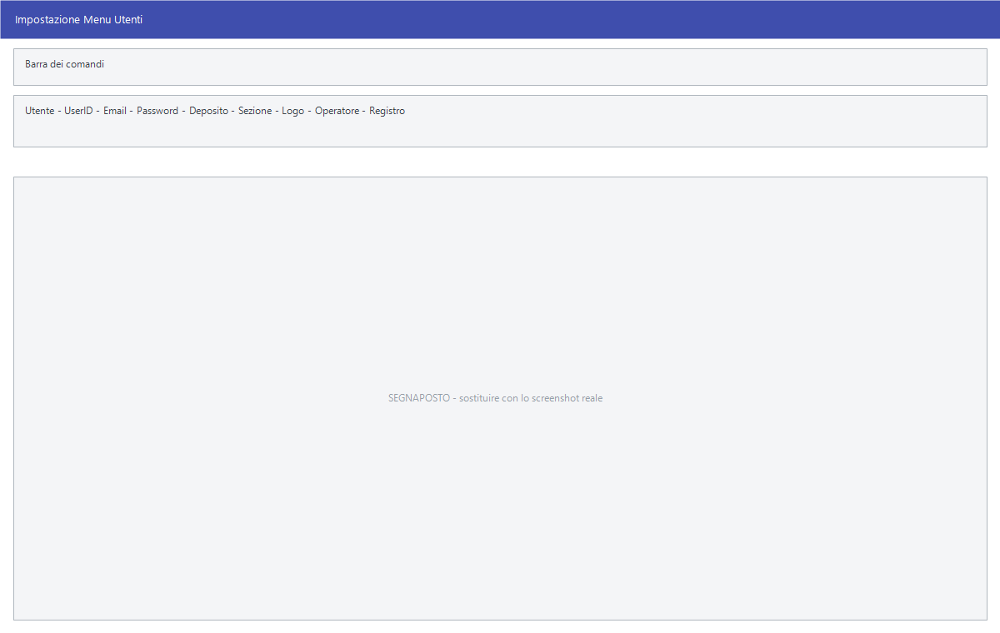

# Utenti

Qui si creano le persone che useranno Facile e si stabilisce **che cosa
ciascuna può fare**, spuntando le voci di menu una per una su un albero che
riproduce l'intero menu del programma.

!!! info "In sintesi"

    - **Percorso:** Menu ▸ Archivi ▸ Utenti ▸ Inserimento *(oppure* Modifica*)*
    - **Scorciatoia:** ++f2++ salva, ++f5++ cerca
    - **Permessi richiesti:** è la maschera che assegna i permessi; tenerla accessibile solo a chi amministra il programma

---

## A cosa serve

Facile non ha profili predefiniti tipo «magazziniere» o «contabile»: **i
permessi si danno voce di menu per voce di menu**, e ogni utente ha il suo
elenco. L'albero al centro della maschera è il menu di Facile: quello che
resta spuntato l'utente lo vede, quello che si toglie sparisce dal suo menu.

Da qui si decidono anche il deposito e la sezione su cui l'utente lavora, il
registro che gli viene proposto, e una serie di divieti puntuali — per esempio
non vedere i prezzi di acquisto, non poter azzerare la cassa, non poter
cancellare.

Ogni utente porta con sé anche i propri dati di posta, usati quando il
programma invia documenti per email a suo nome.

## Prerequisiti

Prima di usare questa maschera occorre:

- avere i [depositi](../magazzino/depositi.md) e le
  [sezioni](../contabilita/sezioni.md) su cui si vuole limitare l'utente;
- avere la tabella degli [operatori](../altre-tabelle/operatori.md), se si vuole
  collegare l'utente a un operatore di cassa;
- per la posta, i parametri del server SMTP forniti dal gestore della casella.

## La maschera

La finestra si chiama *Impostazione Menu Utenti* — in modifica *Modifica
Utenti* — ed è divisa in tre parti:

1. in alto **Utente**, con codice e descrizione;
2. al centro, a sinistra, l'**albero del menu** intestato *..:: F a c i l e
   ::.. Menu*, con una casella per ogni voce; a destra i dati dell'utente e i
   parametri di posta;
3. in basso l'elenco dei divieti, sotto forma di caselle.

## Campi

### Chi è l'utente

| Campo | Obbl. | Descrizione | Valori ammessi |
|---|:---:|---|---|
| **Utente** | ● | Codice e descrizione dell'utente. Il codice non è modificabile dopo l'inserimento. | numero e testo |
| **UserID** | ● | Il nome con cui l'utente si presenta all'avvio. Non è modificabile dopo l'inserimento. | testo, deve essere unico |
| **Password** | | La password di accesso. Si digita in chiaro solo a video coperto. | testo |
| **Conf. Password** | | Ripetizione della password: deve coincidere con la precedente. | testo |
| **Email** | | Indirizzo di posta dell'utente. | indirizzo |

{: .campi }

### Come lavora

| Campo | Obbl. | Descrizione | Valori ammessi |
|---|:---:|---|---|
| **Deposito** | | Il [deposito](../magazzino/depositi.md) su cui l'utente opera. A fianco è ricordato **(0 = TUTTI)**. | codice, `0` per tutti |
| **Sezione** | | La [sezione](../contabilita/sezioni.md) contabile dell'utente. A fianco **(0 = TUTTE)**. | codice, `0` per tutte |
| **Logo** | | Quale logo aziendale usare nelle sue stampe. A fianco **(0 = PREDEFINITO)**. | codice, `0` per il predefinito |
| **Operatore** | | L'[operatore](../altre-tabelle/operatori.md) di cassa a cui l'utente corrisponde. | codice |
| **Registro** | | Il registro proposto all'utente nei documenti. | `PREDEFINITO`, oppure uno dei registri della ditta |
| *(elenco senza etichetta, sotto Registro)* | | Quali record l'utente vede negli elenchi. | `ATTIVI`, `CANCELLATI`, `TUTTI` |

{: .campi }

### Posta in uscita

| Campo | Obbl. | Descrizione | Valori ammessi |
|---|:---:|---|---|
| **Server SMTP** | | Il server da cui l'utente invia la posta. | nome del server |
| *(campo password sotto il server)* | | La password della casella. | testo |
| **Porta SMTP** | | La porta del server. | numero |
| **Usa SSL** | | Attiva la cifratura SSL. | attivo/non attivo |
| **Usa TLS** | | Attiva la cifratura TLS. | attivo/non attivo |

{: .campi }

### Divieti e abilitazioni

| Campo | Obbl. | Descrizione | Valori ammessi |
|---|:---:|---|---|
| **Disabilita Consultazione Prezzi Acquisto** | | Impedisce all'utente di vedere quanto è costata la merce. | attivo/non attivo |
| **Disabilita Rapporti e Azzeramenti Cassa (POS)** | | Gli toglie le chiusure di cassa. | attivo/non attivo |
| **Disabilita Stampe (POS)** | | Gli toglie le stampe da punto cassa. | attivo/non attivo |
| **Privilegi Amministratore** | | Dà all'utente i poteri di amministrazione del programma. | attivo/non attivo |
| **Abilita Accesso Web** | | Gli consente di collegarsi dalla parte web. | attivo/non attivo |
| **Abilita Amministrazione Web** | | Gli dà l'amministrazione della parte web. | attivo/non attivo |
| **Abilita Movimentazione Cassa dopo Chiusure** | | Gli permette di muovere la cassa dopo la chiusura. | attivo/non attivo |
| **Disabilita Stampa Preconti** | | Gli toglie la stampa del preconto. | attivo/non attivo |
| **Disabilita Cancellazioni (SmartCard)** | | Impedisce le cancellazioni sui dispositivi con smartcard. | attivo/non attivo |
| **Abilita download Stati Fatture Attive** | | Gli consente di scaricare gli esiti delle fatture emesse. | attivo/non attivo |
| **Abilita download Fatture Passive** | | Gli consente di scaricare le fatture ricevute. | attivo/non attivo |
| **Abilita Blocco Cancellazioni Dati** | | Gli impedisce di cancellare: al posto dell'eliminazione le maschere rispondono *Cancellazioni non abilitate per l' utente !*. Vale anche sulle cancellazioni di massa, come [Cancellazione Ordini Evasi](../vendite/ordini-clienti.md). | attivo/non attivo |

{: .campi }

### L'albero del menu

Ogni riga dell'albero è una voce del menu di Facile, con la sua casella:
spuntata vuol dire **visibile**, non spuntata vuol dire che l'utente non
troverà quella voce. Togliendo la spunta a un ramo si tolgono anche le voci
che contiene; rimettendola a una voce si riaccende il ramo che la ospita.

## Pulsanti e comandi

| Comando | Scorciatoia | Effetto |
|---|---|---|
| **F2 - Salva** | ++f2++ | Registra l'utente e i suoi permessi. |
| **F3 - Prec.** | ++f3++ | Passa all'utente precedente. |
| **F4 - Succ.** | ++f4++ | Passa all'utente successivo. |
| **F5 - Cerca** | ++f5++ | Apre l'elenco degli utenti. |
| **F6 - Elimina** | ++f6++ | Cancella l'utente, previa conferma. |
| **F7 Firma Email** | ++f7++ | Allega il file da usare come firma nelle email dell'utente. Compare solo in **Modifica**. |
| **Ricarica** | | Rilegge l'utente dall'archivio, abbandonando le modifiche non salvate. |
| **Consultazione** | ++f11++ | Apre la consultazione. |
| **Calcolatrice** | ++f12++ | Apre la calcolatrice. |

## Come si fa

### Creare un utente che veda solo il magazzino

1. Apri **Menu ▸ Archivi ▸ Utenti ▸ Inserimento**.
2. Compila **Utente** con codice e nome, poi **UserID** e la **Password** due
   volte.
3. Nell'albero del menu togli la spunta ai rami che non gli servono, lasciando
   solo **Magazzino** e le voci di **Archivi** che deve poter consultare.
4. Se lavora su un magazzino solo, indica il **Deposito**.
5. Attiva **Disabilita Consultazione Prezzi Acquisto** se non deve vedere i
   costi.
6. Premi **F2 - Salva**.

### Cambiare i permessi a un utente esistente

1. Apri **Menu ▸ Archivi ▸ Utenti ▸ Modifica**.
2. Premi **F5 - Cerca** e scegli l'utente.
3. Spunta o togli la spunta alle voci nell'albero.
4. Premi **F2 - Salva**. L'utente vedrà il menu nuovo al prossimo accesso.

### Cambiare la password a un utente

1. Aprilo in **Modifica**.
2. Scrivi la nuova password in **Password** e ripetila in **Conf. Password**.
3. Premi **F2 - Salva**.

## Controlli e messaggi

| Messaggio | Causa | Cosa fare |
|---|---|---|
| *Le due password digitate non corrispondono !* | **Password** e **Conf. Password** sono diverse. | Ridigita le due password facendo attenzione al blocco maiuscole. |
| *User ID gia' presente in archivio !* | Un altro utente ha già quello **UserID**. | Scegli un identificativo diverso. |

## Note

!!! warning "Attenzione"

    **UserID e Codice non si cambiano più.** Dopo il primo salvataggio i due
    campi restano bloccati: per cambiarli bisogna creare un altro utente.

    **I permessi sono per voce di menu, non per maschera.** Se la stessa
    maschera si apre da due voci diverse, va tolta da entrambe. È il caso delle
    [tabelle di classificazione](../magazzino/tabelle-di-classificazione.md) e
    di parecchie voci dei [listini di vendita](../listini-vendita/index.md).

<!-- DA VERIFICARE: se il nuovo menu venga applicato subito o al successivo accesso dell'utente. -->

<!-- DA VERIFICARE: cosa comportano esattamente i "Privilegi Amministratore" rispetto alle spunte dell'albero: se scavalchino i permessi o si sommino. -->

<!-- DA VERIFICARE: che formato deve avere il file allegato con F7 Firma Email e dove viene usato. -->

<!-- DA VERIFICARE: dove si impostano i loghi a cui fa riferimento il campo Logo. -->

## Vedi anche

- [Ditte](ditte.md)
- [Operatori](../altre-tabelle/operatori.md)
- [Depositi](../magazzino/depositi.md)
- [Sezioni](../contabilita/sezioni.md)
