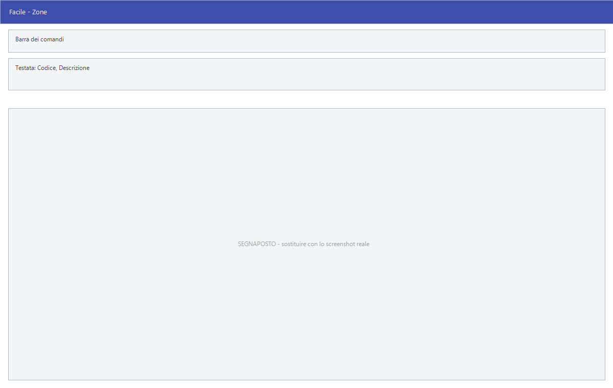

# Zone

Da questa maschera si definiscono le zone: le aree in cui si divide il
territorio su cui l'azienda lavora. Clienti, fornitori e agenti ne indicano una
nella propria anagrafica.

!!! info "In sintesi"

    - **Percorso:** Menu ▸ Archivi ▸ Zone ▸ Inserimento *(oppure* Modifica*)*
    - **Scorciatoia:** nessuna; la maschera si apre dal menu
    - **Permessi richiesti:** nessun profilo predefinito; **Inserimento** e **Modifica** si abilitano separatamente per ogni utente da [Archivi ▸ Utenti](utenti.md)

---

## A cosa serve

La zona serve a leggere il lavoro per territorio: quanto si vende in una certa
area, quali clienti la compongono, quale agente la copre. È un raggruppamento
libero — non c'è una geografia predefinita — e conviene farlo coincidere con
come è organizzata davvero la rete di vendita.

Esempio: se gli agenti sono divisi per province, crea una zona per provincia e
assegnala sia ai clienti sia agli agenti: le stampe per zona diventano
leggibili senza altre elaborazioni.

## Prerequisiti

*Nessuno.* È una delle tabelle da compilare all'avvio, prima di caricare le
anagrafiche.

## La maschera

È la maschera più breve del manuale: la **barra dei comandi** e due soli campi.

## Campi

| Campo | Obbl. | Descrizione | Valori ammessi |
|---|:---:|---|---|
| Codice | ● | Identificativo della zona. In modifica non è modificabile. | Numero |
| Descrizione | ● | Nome della zona, come compare nelle anagrafiche e nelle stampe. | Fino a 30 caratteri |

{: .campi }

## Pulsanti e comandi

| Comando | Scorciatoia | Effetto |
|---|---|---|
| **F2 - Salva** | ++f2++ | Registra la zona. In inserimento la maschera si svuota per la successiva. |
| **F3 - Prec.** | ++f3++ | Passa alla zona precedente. |
| **F4 - Succ.** | ++f4++ | Passa alla zona successiva. |
| **F5 - Cerca** | ++f5++ | Apre l'elenco delle zone. |
| **F6 - Elimina** | ++f6++ | Cancella la zona, previa conferma. |
| **Ricarica** | | Rilegge la zona dall'archivio, abbandonando le modifiche non salvate. |

Valgono inoltre:

| Comando | Scorciatoia | Effetto |
|---|---|---|
| Consultazione | ++f11++ | Apre la finestra **Consultazione**. |
| Calcolatrice | ++f12++ | Apre la calcolatrice. |
| Campo successivo | ++enter++ | Sposta il cursore sul campo seguente. |
| Chiusura | ++esc++ | Chiude la maschera. |

## Come si fa

### Creare una zona

1. Apri **Menu ▸ Archivi ▸ Zone ▸ Inserimento**.
2. Digita il **Codice** e la **Descrizione**.
3. Premi **F2 - Salva**. La maschera si svuota per la zona successiva.

### Assegnare la zona a un cliente

1. Apri l'[anagrafica del cliente](anagrafica-clienti.md).
2. Nella scheda *Generale*, sul campo **Zona**, premi ++f10++ e scegli la zona.
3. Premi **F2 - Salva**.

## Controlli e messaggi

| Messaggio | Causa | Cosa fare |
|---|---|---|
| *(nessun messaggio, solo un segnale acustico)* | Manca il **Codice** o la **Descrizione**. | Guarda dove si è posizionato il cursore: è il campo da compilare. |
| *In archivio è già presente un record con lo stesso codice.* | Il codice digitato è già di un'altra zona. | Cambia codice. |
| *Confermi la Cancellazione....* | Conferma richiesta da **F6 - Elimina**. | Rispondi **Sì** per eliminare la zona. |
| *Non è possibile eliminare il record pochè utilizzato in alcuni record del database.* | La zona è assegnata a un cliente, a un fornitore o a un agente. | Non è eliminabile: prima cambia zona a chi la usa. |
| *Il record è stato modificato da un altro nodo della rete.* | Un altro utente ha salvato la stessa zona mentre la modificavi. | Premi **Ricarica**, verifica cosa è cambiato e rifai le tue modifiche. |
| *Il record è stato cancellato da un altro nodo della rete.* | Un altro utente ha eliminato la zona mentre la modificavi. | La maschera si chiude: non c'è più nulla da salvare. |

## Note

!!! warning "Attenzione"

    Cambiare la **Descrizione** di una zona si riflette su tutte le stampe,
    comprese quelle di periodi passati: la zona resta la stessa, cambia solo
    come si chiama.

    ++esc++ chiude la maschera senza chiedere conferma e senza salvare: le
    modifiche fatte dopo l'ultimo **F2 - Salva** vanno perse.

## Vedi anche

- [Anagrafica clienti](anagrafica-clienti.md)
- [Anagrafica agenti](anagrafica-agenti.md)
