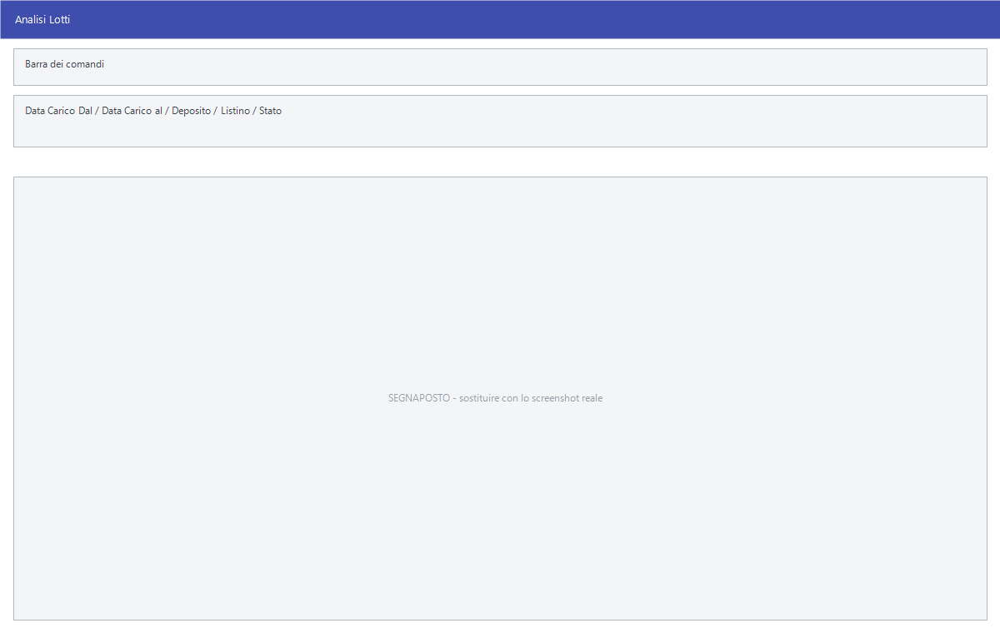

# Analisi e giacenza dei lotti

Chi compra a lotti — una partita di merce, uno stock, una campagna — vuole
sapere due cose: **quanto è rimasto** e **com'è andata**. Le due voci di questa
pagina rispondono all'una e all'altra, con la stessa maschera.

!!! info "In sintesi"

    - **Percorso:**
        - Menu ▸ Analisi Dati ▸ Analisi Lotti
        - Menu ▸ Analisi Dati ▸ Giacenza Lotti
    - **Scorciatoia:** ++f2++ esporta in Excel, ++esc++ esce
    - **Permessi richiesti:** nessun profilo predefinito; le singole voci di menu si abilitano per ogni utente da [Archivi ▸ Utenti](../anagrafiche/utenti.md)

!!! note "Solo nella versione Evolution"

    Il menu **Analisi Dati** compare soltanto in Facile Evolution.

---

## A cosa serve

| Voce di menu | A cosa serve | Titolo della finestra |
|---|---|---|
| **Analisi Lotti** | L'andamento di ciascun lotto: quanto è entrato, quanto è uscito, a che prezzi. | *Analisi Lotti* |
| **Giacenza Lotti** | Quanto resta di ciascun lotto. | *Giacenze Lotti* |

È la stessa maschera con due modi: cambia il titolo e cambia quello che la
griglia mostra.

## Prerequisiti

Prima di analizzare i lotti occorre:

- avere la **gestione dei lotti attiva**;
- avere caricato la merce indicando il lotto, dal
  [carico merci](../magazzino/carico-merci.md);
- avere un [listino](../listini-vendita/gestione-listini.md) da usare come
  riferimento per i valori.

## La maschera

In alto i filtri, sotto la griglia con un lotto per riga, e la barra dei comandi
con l'esportazione.

## Campi

| Campo | Obbl. | Descrizione | Valori ammessi |
|---|:---:|---|---|
| **Data Carico Dal**, **Data Carico al** | ● | Il periodo in cui i lotti sono stati caricati. L'etichetta della seconda ha l'iniziale minuscola. | date |
| **Deposito** | | Restringe a un [deposito](../magazzino/depositi.md). Vuoto significa `TUTTI`. | codice |
| **Listino** | | Il listino con cui valorizzare. | codice |
| **Stato** | | Quali lotti mostrare. | `TUTTI`, `APERTI`, `CHIUSI` |

{: .campi }

## Pulsanti e comandi

| Comando | Scorciatoia | Effetto |
|---|---|---|
| **F2 Esporta** | ++f2++ | Esporta la griglia su un foglio Excel. |
| **Esci** | ++esc++ | Chiude la maschera. |
| Elenco valori | ++f10++ o ++space++ | Su **Deposito** e **Listino**, apre l'elenco. |

## Come si fa

### Vedere cosa resta di una partita

1. Apri **Menu ▸ Analisi Dati ▸ Giacenza Lotti**.
2. Indica il periodo di carico e metti **Stato** su `APERTI`: restano i lotti
   con merce ancora a magazzino.
3. Premi **F2 Esporta** se vuoi lavorarci in Excel.

### Capire com'è andato uno stock

1. Apri **Analisi Lotti**.
2. Indica il periodo di carico e il **Listino** con cui valorizzare.
3. Metti **Stato** su `CHIUSI` per esaminare le partite già esaurite.

### Trovare i lotti fermi

Metti **Stato** su `APERTI` e allarga il periodo di carico all'indietro: i lotti
vecchi ancora aperti sono quelli su cui la merce non gira. Per la scadenza vera
e propria c'è la
[Stampa Lotti in Scadenza](../anagrafiche/stampe-lotti-e-barcode.md).

## Controlli e messaggi

| Messaggio | Causa | Cosa fare |
|---|---|---|
| *Impossibile inizializzare il file excel!* | L'esportazione non è riuscita. | Chiudi qualche programma e riprova. |
| *(messaggio della libreria Excel)* | Errore in scrittura del foglio. | Controlla che il file non sia già aperto e che la cartella sia scrivibile. |

## Note

!!! note "Il menu dice «Giacenza», la finestra dice «Giacenze»"

    La voce di menu è al singolare, il titolo della finestra al plurale. È la
    stessa cosa.

!!! note "Lotti chiusi e lotti scaduti sono cose diverse"

    Qui `CHIUSI` vuol dire *esauriti*, non *scaduti*. La scadenza si guarda dalla
    [stampa dei lotti in scadenza](../anagrafiche/stampe-lotti-e-barcode.md).

<!-- DA VERIFICARE: quali colonne mostra la griglia nei due modi, e cosa cambia fra Analisi e Giacenza. -->

<!-- DA VERIFICARE: quale impostazione attiva la gestione dei lotti e cosa mostrano queste analisi se non è attiva. -->

<!-- DA VERIFICARE: come viene usato il campo "Listino" nella valorizzazione. -->

## Vedi anche

- [Stampa lotti in scadenza e spostamenti codici a barre](../anagrafiche/stampe-lotti-e-barcode.md)
- [Carico merci](../magazzino/carico-merci.md)
- [Venduto per…](venduto-per.md)
