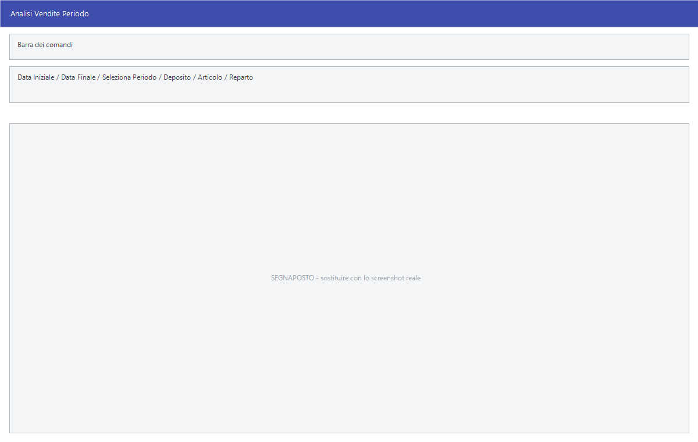

# Analisi delle vendite

Le quattro analisi che non producono un elenco ma **un quadro da guardare**: il
venduto di un periodo con i filtri a portata di mano, il confronto fra depositi
e fra periodi, il cubo multidimensionale che si gira come si vuole, e l'analisi
degli scontrini.

!!! info "In sintesi"

    - **Percorso:**
        - Menu ▸ Analisi Dati ▸ Analisi Vendite Periodo
        - Menu ▸ Analisi Dati ▸ Analisi Vendite Multideposito
        - Menu ▸ Analisi Dati ▸ Analisi Multidimensionale
        - Menu ▸ Analisi Dati ▸ Analisi Scontrini
    - **Scorciatoia:** ++f2++ avvia, e nel cubo ++f2++ – ++f7++ per esportare e stampare; ++esc++ esce
    - **Permessi richiesti:** nessun profilo predefinito; le singole voci di menu si abilitano per ogni utente da [Archivi ▸ Utenti](../anagrafiche/utenti.md)

!!! note "Solo nella versione Evolution"

    Il menu **Analisi Dati** compare soltanto in Facile Evolution.

---

## A cosa serve

| Voce di menu | A cosa serve |
|---|---|
| **Analisi Vendite Periodo** | Il venduto di un periodo, con la scelta rapida del periodo stesso e tutti i filtri di classificazione. |
| **Analisi Vendite Multideposito** | Lo stesso, con il **raffronto**: stesso periodo dell'anno prima, stesso numero di giorni, mese precedente. È l'analisi da usare per capire se si sta andando meglio o peggio. |
| **Analisi Multidimensionale** | Il cubo: si trascinano le dimensioni sulle righe e sulle colonne e il risultato si ricalcola. Si esporta in Excel, HTML, testo, CSV e PDF. |
| **Analisi Scontrini** | Il venduto al banco visto dal lato degli [scontrini](../vendite/scontrini.md), con il dettaglio per operatore. |

## Prerequisiti

Prima di analizzare occorre avere i
[documenti](../vendite/documento-di-vendita.md) e gli
[scontrini](../vendite/scontrini.md) del periodo, e la classificazione compilata
sugli [articoli](../anagrafiche/anagrafica-articoli.md).

Per l'analisi multidimensionale su più anni conviene aver aggiornato lo
**storico dei movimenti** (vedi
[Manutenzione degli archivi](../utility/manutenzione-archivi.md)): il cubo, se
non si limita all'anno corrente, legge da lì.

## La maschera

**Analisi Vendite Periodo** e **Analisi Vendite Multideposito** sono finestre di
selezione con il periodo, un elenco di periodi predefiniti e la solita griglia
di filtri. **Analisi Multidimensionale** apre invece una finestra a sé, con la
barra dei comandi in alto, il cubo al centro e una barra di stato in fondo.

## Campi

### Analisi Vendite Periodo

| Campo | Obbl. | Descrizione | Valori ammessi |
|---|:---:|---|---|
| **Data Iniziale**, **Data Finale** | ● | Il periodo. | date |
| *(elenco dei periodi)* | | Compila da sé le due date. | `--- Seleziona Periodo ---`, `OGGI`, `IERI`, `ULTIMA SETTIMANA`, `ULTIMI 7 GIORNI`, `ULTIMO MESE`, `ULTIMI 30 GIORNI`, `DA INIZIO ANNO` |
| **Deposito** | | Restringe a un [deposito](../magazzino/depositi.md). | codice |
| **Articolo**, **Cod. Iva**, **Reparto**, **Cat. Merceol.**, **Fornitore**, **Stagione**, **Marchio**, **Gruppo Mix**, **Gruppo**, **Sottogruppo**, **Settore**, **Colore**, **Tabella 1**, **Tabella 2**, **Tabella 3** | | I filtri di classificazione. | codici |

{: .campi }

### Analisi Vendite Multideposito

Gli stessi campi, con al posto dei periodi predefiniti l'elenco dei **raffronti**:

| Valore | Confronta il periodo scelto con |
|---|---|
| `RAFFRONTO STESSO PERIODO ANNO PRECEDENTE` | Lo stesso periodo dell'anno prima. |
| `RAFFRONTO STESSO NUMERO GIORNI PRECEDENTI` | I giorni immediatamente precedenti, in pari numero. |
| `OGGI - RAFFRONTO CON IERI` | Ieri. |
| `ULTIMA SETTIMANA - RAFFRONTO SETTIMANA PRECEDENTE` | La settimana prima. |
| `ULTIMO MESE - RAFFRONTO MESE PRECEDENTE` | Il mese prima. |

Ha inoltre i filtri **Taglie** e **Sezione**.

### Analisi Scontrini

| Campo | Obbl. | Descrizione | Valori ammessi |
|---|:---:|---|---|
| **Dal**, **Al** | ● | Il periodo. | date |
| **Deposito** | | Restringe a un deposito. | codice |
| **Operatore** | | Restringe a un [operatore](../altre-tabelle/operatori.md). | codice |

{: .campi }

## Pulsanti e comandi

### Analisi Vendite Periodo, Multideposito e Scontrini

| Comando | Scorciatoia | Effetto |
|---|---|---|
| **F2 - OK** | ++f2++ | Avvia l'analisi. |
| **Esci** | ++esc++ | Chiude senza fare nulla. |
| Elenco valori | ++f10++ o ++space++ | Sui campi con il codice, apre l'elenco. |

### Analisi Multidimensionale

| Comando | Scorciatoia | Effetto |
|---|---|---|
| **F2 - Excel** | ++f2++ | Esporta il cubo in un foglio Excel. |
| **F3 - Html** | ++f3++ | Esporta in HTML. |
| **F4 - Testo** | ++f4++ | Esporta in testo. |
| **F5 - Csv** | ++f5++ | Esporta in CSV. |
| **F6 - PDF** | ++f6++ | Esporta in PDF. |
| **F7 - Stampa** | ++f7++ | Stampa quello che si vede. |
| **Ordina Col.** | | Ordina per colonna. |
| **Rimuovi Ord. Col.** | | Toglie l'ordinamento di colonna. |
| **Ordina Row.** | | Ordina per riga. L'etichetta è metà in inglese. |
| **Rimuovi Ord. Riga** | | Toglie l'ordinamento di riga. |

Nel cubo si lavora anche con il mouse: le dimensioni si trascinano fra righe,
colonne e area esterna, si aprono e si chiudono, e ogni dimensione ha un filtro
proprio. L'elenco delle misure si chiama **Misure**, i totali **Totali**.

## Come si fa

### Vedere com'è andata la settimana

1. Apri **Menu ▸ Analisi Dati ▸ Analisi Vendite Periodo**.
2. Nell'elenco dei periodi scegli `ULTIMA SETTIMANA`: le due date si compilano
   da sole.
3. Premi **F2 - OK**.

### Capire se si sta andando meglio dell'anno scorso

1. Apri **Analisi Vendite Multideposito**.
2. Indica il periodo.
3. Scegli `RAFFRONTO STESSO PERIODO ANNO PRECEDENTE`.
4. Premi **F2 - OK**: le due colonne affiancate dicono la differenza.

### Girare i dati come si vuole

1. Apri **Analisi Multidimensionale**.
2. Alla domanda *Vuoi eseguire l' analisi solo sull' anno corrente ?* rispondi
   **Sì** per restare sull'anno in corso — è molto più rapido — oppure **No**
   per attingere allo storico pluriennale, sapendo che ci vorrà tempo.
3. Trascina sulle righe la dimensione che ti interessa — il reparto, il mese —
   e sulle colonne l'altra.
4. Quando il quadro è quello giusto, premi **F2 - Excel** o **F6 - PDF** per
   portartelo via.

### Guardare la cassa dal lato degli scontrini

1. Apri **Analisi Scontrini**.
2. Indica **Dal** e **Al**, e l'**Operatore** se vuoi il dettaglio di una
   persona.

## Controlli e messaggi

| Messaggio | Causa | Cosa fare |
|---|---|---|
| *Hai selezionato l'intero archivio! L'operazione potrebbe durare parecchi minuti. Vuoi Continuare?* | Nessun filtro è stato indicato. | **Sì** procede. Conviene restringere il periodo o mettere almeno un filtro. |
| *Vuoi eseguire l' analisi solo sull' anno corrente ? L' interrogazione del Database potrebbe richiedere diversi minuti.* | Inizio dell'analisi multidimensionale. | **Sì** resta sull'anno corrente, **No** legge lo storico pluriennale, **Annulla** ferma. |
| *Impossibile creare il Book!* / *Impossibile creare il Foglio di Lavoro!* | L'esportazione in Excel non è riuscita. | Chiudi qualche programma e riprova. |
| *Impossibile salvare il file! Chiudere il file se aperto* | Il file di destinazione è aperto in Excel. | Chiudilo e riprova. |

## Note

!!! note "Il cubo è un componente a sé"

    L'analisi multidimensionale usa un componente esterno (Contour Cube), e si
    comporta come un foglio pivot: si trascina, si espande, si filtra. Le voci
    a video — **Misure**, **Totali** — vengono da lì.

!!! warning "Senza filtri, l'analisi legge tutto"

    Su archivi grandi un'analisi senza filtri e senza limite di periodo può
    durare molti minuti. Facile avvisa quando succede, ma il tempo lo si
    risparmia restringendo prima.

<!-- DA VERIFICARE: quali dimensioni e quali misure sono disponibili nel cubo multidimensionale. -->

<!-- DA VERIFICARE: cosa mostra esattamente "Analisi Scontrini" — se il dettaglio riga per riga o i totali per operatore. -->

<!-- DA VERIFICARE: che differenza c'è fra i filtri di "Analisi Vendite Periodo" e quelli di "Venduto per Articolo". -->

## Vedi anche

- [Venduto per…](venduto-per.md)
- [Venduto incrociato](venduto-incrociato.md)
- [Grafici e report personalizzati](grafici-e-report.md)
- [Scontrini](../vendite/scontrini.md)
