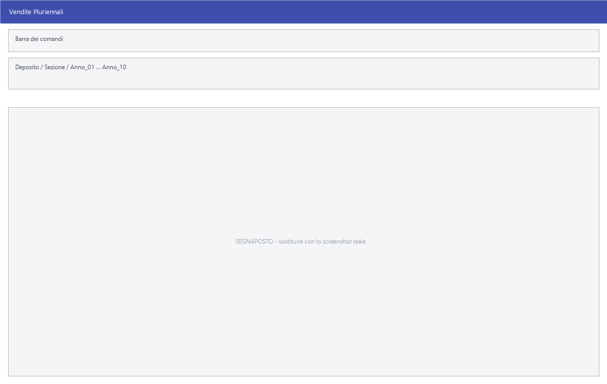

# Grafici pluriennali e report personalizzati

Due modi di guardare i dati che non producono un elenco: **il grafico**, per
vedere l'andamento di più anni a colpo d'occhio, e **i report personalizzati**,
cioè le stampe su misura preparate dall'assistenza per la tua azienda.

!!! info "In sintesi"

    - **Percorso:**
        - Menu ▸ Analisi Dati ▸ Grafico Vendite Pluriennali
        - Menu ▸ Analisi Dati ▸ Grafico Ricavi Pluriennali
        - Menu ▸ Analisi Dati ▸ Report Personalizzati
    - **Scorciatoia:** ++f2++ avvia o stampa, ++esc++ esce
    - **Permessi richiesti:** nessun profilo predefinito; le singole voci di menu si abilitano per ogni utente da [Archivi ▸ Utenti](../anagrafiche/utenti.md)

!!! note "Solo nella versione Evolution"

    Il menu **Analisi Dati** compare soltanto in Facile Evolution.

---

## A cosa serve

| Voce di menu | Cosa mostra | Titolo della finestra |
|---|---|---|
| **Grafico Vendite Pluriennali** | L'andamento del **venduto** su più annate. | *Vendite Pluriennali* |
| **Grafico Ricavi Pluriennali** | L'andamento dei **ricavi** — quindi il margine, non il fatturato. Stessa maschera. | *Ricavi Pluriennali* |
| **Report Personalizzati** | La raccolta dei report su misura installati nella tua azienda, con l'anteprima e la stampa. | *Report Personalizzati* |

## Prerequisiti

Per i grafici occorre avere in archivio le annate da confrontare, e aver
aggiornato lo **storico dei movimenti** con
[Aggiungi Movimenti dell' Anno allo Storico](../utility/manutenzione-archivi.md):
è da lì che i dati pluriennali vengono letti.

Per i report personalizzati occorre che l'assistenza ne abbia installato almeno
uno: sono file `.rpt`, cioè report Crystal, preparati su richiesta.

## La maschera

**Vendite Pluriennali** è una finestrella con due filtri e dieci caselle, una
per anno. **Report Personalizzati** è invece un esploratore: a sinistra la
cartella dei report, al centro l'elenco dei file, e l'anteprima del report
scelto.

## Campi

### Vendite / Ricavi Pluriennali

| Campo | Obbl. | Descrizione | Valori ammessi |
|---|:---:|---|---|
| **Deposito** | | Restringe a un [deposito](../magazzino/depositi.md). | codice |
| **Sezione** | | Restringe a una [sezione](../contabilita/sezioni.md). | codice |
| **Anno_01** … **Anno_10** | ● | Le annate da mettere nel grafico: se ne possono confrontare fino a dieci. | attivo/non attivo |

{: .campi }

## Pulsanti e comandi

### Vendite / Ricavi Pluriennali

| Comando | Scorciatoia | Effetto |
|---|---|---|
| **F2 - OK** | ++f2++ | Costruisce il grafico. |
| **Esci** | ++esc++ | Chiude senza fare nulla. |

### Report Personalizzati

| Comando | Scorciatoia | Effetto |
|---|---|---|
| **F2 - Stampa** | ++f2++ | Stampa il report scelto. |
| **Esci** | ++esc++ | Chiude la maschera. |

## Come si fa

### Confrontare il venduto degli ultimi anni

1. Apri **Menu ▸ Analisi Dati ▸ Grafico Vendite Pluriennali**.
2. Spunta le annate da confrontare.
3. Restringi al **Deposito** se hai più punti vendita e vuoi guardarne uno.
4. Premi **F2 - OK**.

### Vedere se il margine tiene

Apri **Grafico Ricavi Pluriennali** invece di quello delle vendite: il
fatturato può crescere mentre il ricavo cala, ed è quello il dato che conta.

### Usare un report fatto su misura

1. Apri **Menu ▸ Analisi Dati ▸ Report Personalizzati**.
2. Nell'albero a sinistra apri la cartella dei report; al centro compaiono i
   file `.rpt` disponibili.
3. Scegli il report: l'anteprima appare a fianco.
4. Premi **F2 - Stampa**.

## Controlli e messaggi

<!-- DA VERIFICARE: i messaggi di queste due maschere. -->

| Messaggio | Causa | Cosa fare |
|---|---|---|
| *(nessun messaggio, solo un segnale acustico)* | Non è stata spuntata nessuna annata. | Spunta almeno un anno. |

## Note

!!! note "I grafici leggono lo storico, non i movimenti dell'anno"

    Se un'annata non compare o risulta vuota, quasi sempre non è stata portata
    nello storico. Si rimedia da
    [Manutenzione degli archivi](../utility/manutenzione-archivi.md).

!!! note "I report personalizzati sono file, non funzioni del programma"

    Sono report Crystal (`.rpt`) installati nella cartella dei report: se ne
    manca uno che avevi, è un problema di installazione, non del menu. Per
    averne di nuovi si passa dall'assistenza.

<!-- DA VERIFICARE: in quale cartella vengono cercati i file .rpt dei report personalizzati. -->

<!-- DA VERIFICARE: che aspetto ha il grafico prodotto e se sia esportabile o solo stampabile. -->

<!-- DA VERIFICARE: come le dieci caselle Anno_01…Anno_10 si associano agli anni di gestione presenti in archivio. -->

## Vedi anche

- [Analisi delle vendite](analisi-vendite.md)
- [Venduto per…](venduto-per.md)
- [Manutenzione degli archivi](../utility/manutenzione-archivi.md)
