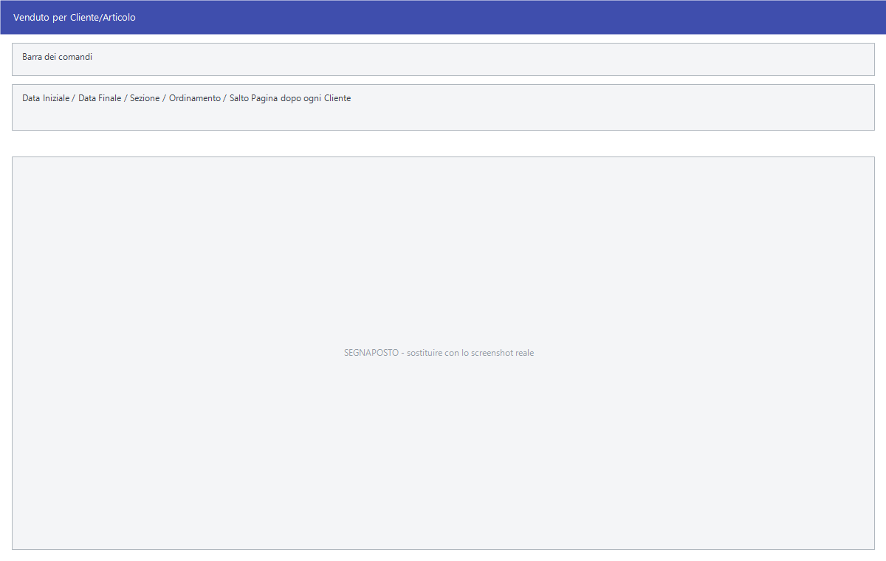

# Venduto incrociato per cliente e per agente

Sapere quanto ha venduto un agente è una cosa; sapere **cosa** ha venduto, e **a
chi**, è un'altra. Queste otto voci incrociano due chiavi: il soggetto sulle
righe, la merce nelle colonne.

!!! info "In sintesi"

    - **Percorso:**
        - Menu ▸ Analisi Dati ▸ Venduto Cliente/Articolo
        - Menu ▸ Analisi Dati ▸ Venduto Cliente/Reparto
        - Menu ▸ Analisi Dati ▸ Venduto Cliente/Categoria Merceologica
        - Menu ▸ Analisi Dati ▸ Venduto Agente/Articolo
        - Menu ▸ Analisi Dati ▸ Venduto Agente/Cliente
        - Menu ▸ Analisi Dati ▸ Venduto Agente/Reparto
        - Menu ▸ Analisi Dati ▸ Venduto Agente/Categoria Merceologica
        - Menu ▸ Analisi Dati ▸ Comparazione Venduto Agenti su Due Anni
    - **Scorciatoia:** ++f2++ avvia l'analisi, ++esc++ esce
    - **Permessi richiesti:** nessun profilo predefinito; le singole voci di menu si abilitano per ogni utente da [Archivi ▸ Utenti](../anagrafiche/utenti.md)

!!! note "Solo nella versione Evolution"

    Il menu **Analisi Dati** compare soltanto in Facile Evolution.

---

## A cosa serve

| Voce di menu | Cosa incrocia | Titolo della finestra |
|---|---|---|
| **Venduto Cliente/Articolo** | Ogni cliente con gli articoli che ha comprato. | *Venduto per Cliente/Articolo* |
| **Venduto Cliente/Reparto** | Ogni cliente con i reparti. | *Venduto per Cliente/Articolo* |
| **Venduto Cliente/Categoria Merceologica** | Ogni cliente con le categorie. | *Venduto per Cliente/Articolo* |
| **Venduto Agente/Articolo** | Ogni agente con gli articoli venduti. | *Venduto per Agente/Articolo* |
| **Venduto Agente/Cliente** | Ogni agente con i suoi clienti. | *Venduto per Agente/Articolo* |
| **Venduto Agente/Reparto** | Ogni agente con i reparti. | *Venduto per Agente/Articolo* |
| **Venduto Agente/Categoria Merceologica** | Ogni agente con le categorie. | *Venduto per Agente/Articolo* |
| **Comparazione Venduto Agenti su Due Anni** | Ogni agente su due annate, per vedere chi cresce e chi cala. | *Comparazione Venduto Agenti su due Anni* |

Le maschere sono due sole: una per il gruppo dei clienti, una per quello degli
agenti. Il titolo non cambia con la seconda chiave — resta sempre quello della
prima voce del gruppo.

## Prerequisiti

Prima di analizzare occorre:

- avere i [documenti](../vendite/documento-di-vendita.md) del periodo;
- avere l'**agente assegnato ai clienti**, altrimenti le analisi per agente
  raggruppano tutto sotto una voce vuota. Si imposta in
  [anagrafica clienti](../anagrafiche/anagrafica-clienti.md);
- per il confronto su due anni, avere in archivio **entrambe le annate**.

## La maschera

Finestre di selezione: il periodo, i filtri sul soggetto, l'ordinamento e i
pulsanti **F2 - OK** ed **Esci**. La maschera del gruppo clienti è più corta,
quella del gruppo agenti ha i filtri sull'anagrafica dei clienti.

## Campi

### Venduto per Cliente/Articolo

| Campo | Obbl. | Descrizione | Valori ammessi |
|---|:---:|---|---|
| **Data Iniziale**, **Data Finale** | ● | Il periodo. | date |
| **Sezione** | | Restringe a una [sezione](../contabilita/sezioni.md). | codice |
| **Ordinamento** | | Come ordinare le righe. | `CODICE`, `ALFABETICO` |
| **Salto Pagina dopo ogni Cliente** | | Manda ogni cliente su una pagina propria: comodo per consegnare a ciascuno il suo foglio. | attivo/non attivo |

{: .campi }

### Venduto per Agente/Articolo

| Campo | Obbl. | Descrizione | Valori ammessi |
|---|:---:|---|---|
| **Data Iniziale**, **Data Finale** | ● | Il periodo. | date |
| **Agente** | | Restringe a un [agente](../anagrafiche/anagrafica-agenti.md). | codice |
| **Cat. Economica** | | Restringe a una [categoria economica](../anagrafiche/categorie-economiche.md). | codice |
| **Cliente** | | Restringe a un cliente. | codice |
| **Gruppo Aziende** | | Restringe a un gruppo di aziende. | codice |
| **Zona** | | Restringe a una [zona](../anagrafiche/zone.md). | codice |
| **Tipo Attività** | | Restringe a un tipo di attività. | codice |
| **Sezione** | | Restringe a una sezione. | codice |
| **Ordinamento** | | Come ordinare. | `CODICE`, `ALFABETICO` |
| **Salto Pagina dopo ogni Cliente** | | Manda ogni raggruppamento su una pagina propria. | attivo/non attivo |

{: .campi }

### Comparazione Venduto Agenti su due Anni

Stessi filtri della maschera per agente, con al posto del periodo:

| Campo | Obbl. | Descrizione | Valori ammessi |
|---|:---:|---|---|
| **Primo Anno** | ● | L'annata di riferimento. | anno |
| **Secondo Anno** | ● | L'annata con cui confrontarla. | anno |

{: .campi }

## Pulsanti e comandi

| Comando | Scorciatoia | Effetto |
|---|---|---|
| **F2 - OK** | ++f2++ | Prepara e mostra l'analisi. |
| **Esci** | ++esc++ | Chiude senza fare nulla. |
| Elenco valori | ++f10++ o ++space++ | Sui campi con il codice, apre l'elenco. |

## Come si fa

### Dare a ogni cliente il quadro dei suoi acquisti

1. Apri **Menu ▸ Analisi Dati ▸ Venduto Cliente/Articolo**.
2. Indica il periodo — di solito l'anno.
3. Attiva **Salto Pagina dopo ogni Cliente**.
4. Premi **F2 - OK**: esce un foglio per cliente, pronto da consegnare.

### Valutare un agente

1. Apri **Venduto Agente/Categoria Merceologica**.
2. Indica il periodo e l'**Agente**.
3. Premi **F2 - OK**: si vede su quali categorie l'agente lavora e quali
   trascura.

### Vedere chi cresce e chi cala

1. Apri **Comparazione Venduto Agenti su Due Anni**.
2. Indica **Primo Anno** e **Secondo Anno**.
3. Premi **F2 - OK**.

Se vuoi confrontare periodi più corti dell'anno — un trimestre con lo stesso
trimestre precedente — usa invece l'
[Analisi Vendite Multideposito](analisi-vendite.md), che ha i raffronti
predefiniti.

## Controlli e messaggi

<!-- DA VERIFICARE: i messaggi propri di queste analisi. -->

| Messaggio | Causa | Cosa fare |
|---|---|---|
| *(nessun messaggio, solo un segnale acustico)* | Manca una delle date o un filtro non è valido. | Guarda dove si è posizionato il cursore. |

## Note

!!! note "Il titolo resta quello della prima voce del gruppo"

    Aprendo *Venduto Agente/Reparto* la finestra si chiama comunque **Venduto
    per Agente/Articolo**: è la stessa maschera, e il titolo non viene adattato
    alla seconda chiave. Il risultato è però quello giusto.

!!! note "Chi non ha agente finisce insieme"

    Le analisi per agente raggruppano sotto una voce vuota tutti i clienti senza
    agente assegnato. Se quel gruppo è grosso, va sistemata l'anagrafica.

<!-- DA VERIFICARE: perché la casella si chiama "Salto Pagina dopo ogni Cliente" anche nelle analisi raggruppate per agente. -->

<!-- DA VERIFICARE: se la comparazione su due anni richieda che entrambe le annate siano nello storico dei movimenti. -->

## Vedi anche

- [Venduto per…](venduto-per.md)
- [Analisi delle vendite](analisi-vendite.md)
- [Provvigioni agenti](../vendite/provvigioni-agenti.md)
- [Stampe agenti](../anagrafiche/stampe-agenti.md)
