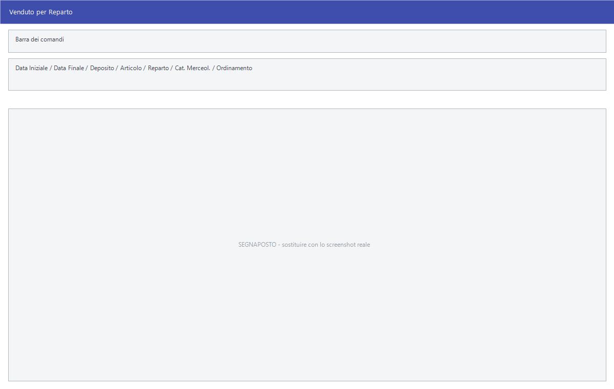

# Venduto per…

Quindici voci di menu, una maschera sola. La domanda è sempre la stessa —
*quanto abbiamo venduto?* — e cambia solo **come si raggruppa la risposta**: per
deposito, per reparto, per agente, per marchio. I filtri da compilare sono
identici in tutti i casi.

!!! info "In sintesi"

    - **Percorso:**
        - Menu ▸ Analisi Dati ▸ Turnover Articoli
        - Menu ▸ Analisi Dati ▸ Venduto per Deposito
        - Menu ▸ Analisi Dati ▸ Venduto per Reparto
        - Menu ▸ Analisi Dati ▸ Venduto per Categoria Merceologica
        - Menu ▸ Analisi Dati ▸ Venduto per Agente
        - Menu ▸ Analisi Dati ▸ Venduto per Marchio
        - Menu ▸ Analisi Dati ▸ Venduto per Stagione
        - Menu ▸ Analisi Dati ▸ Venduto per Fornitore
        - Menu ▸ Analisi Dati ▸ Venduto per Codice IVA
        - Menu ▸ Analisi Dati ▸ Venduto per Articolo
        - Menu ▸ Analisi Dati ▸ Venduto per Gruppo
        - Menu ▸ Analisi Dati ▸ Venduto per Operatore
        - Menu ▸ Analisi Dati ▸ Venduto per Tabella 1
        - Menu ▸ Analisi Dati ▸ Venduto per Tabella 2
        - Menu ▸ Analisi Dati ▸ Venduto per Tabella 3
    - **Scorciatoia:** ++f2++ avvia l'analisi, ++esc++ esce
    - **Permessi richiesti:** nessun profilo predefinito; le singole voci di menu si abilitano per ogni utente da [Archivi ▸ Utenti](../anagrafiche/utenti.md)

!!! note "Solo nella versione Evolution"

    Il menu **Analisi Dati** compare soltanto in Facile Evolution. Nelle licenze
    Lite, Standard e Professional queste voci non ci sono.

---

## A cosa serve

Ogni voce apre la stessa finestra con un raggruppamento diverso, e il titolo lo
dice: aprendo *Venduto per Reparto* la finestra si chiama **Venduto per
Reparto**, aprendo *Venduto per Fornitore* si chiama **Venduto per Fornitore**.

| Voce di menu | Raggruppa per |
|---|---|
| **Venduto per Deposito** | [Deposito](../magazzino/depositi.md). |
| **Venduto per Reparto** | [Reparto](../magazzino/reparti.md). |
| **Venduto per Categoria Merceologica** | [Categoria merceologica](../magazzino/categorie-merceologiche.md). |
| **Venduto per Agente** | [Agente](../anagrafiche/anagrafica-agenti.md). |
| **Venduto per Marchio** | [Marchio](../magazzino/marchi.md). |
| **Venduto per Stagione** | [Stagione](../magazzino/stagioni.md). |
| **Venduto per Fornitore** | [Fornitore](../anagrafiche/anagrafica-fornitori.md). |
| **Venduto per Codice IVA** | [Aliquota IVA](../contabilita/aliquote-iva.md). |
| **Venduto per Articolo** | [Articolo](../anagrafiche/anagrafica-articoli.md). |
| **Venduto per Gruppo** | Gruppo di classificazione. |
| **Venduto per Operatore** | [Operatore](../altre-tabelle/operatori.md) che ha battuto la vendita. |
| **Venduto per Tabella 1**, **Venduto per Tabella 2**, **Venduto per Tabella 3** | Le [tabelle di classificazione](../magazzino/tabelle-di-classificazione.md) libere. La finestra prende il nome vero che la tabella ha nella tua installazione, non «Tabella 1». |
| **Turnover Articoli** | Non raggruppa: misura la rotazione degli articoli, cioè quante volte la merce si rinnova nel periodo. |

## Prerequisiti

Prima di analizzare occorre avere i [documenti](../vendite/documento-di-vendita.md)
del periodo emessi, e la classificazione compilata sugli
[articoli](../anagrafiche/anagrafica-articoli.md): un'analisi per marchio ha
senso solo se il marchio è impostato: gli articoli senza finiscono tutti
insieme.

Per il turnover servono anche le esistenze aggiornate.

## La maschera

Una finestra di selezione: il periodo in alto, poi una griglia fitta di filtri —
uno per ciascuna chiave di classificazione — e in fondo l'ordinamento, il tipo
di vendita e i pulsanti **F2 - OK** ed **Esci**.

I filtri sono gli stessi per tutte e quindici le voci: si può chiedere il
venduto per reparto **limitandolo a un fornitore**, o quello per agente
**limitandolo a una categoria merceologica**.

## Campi

| Campo | Obbl. | Descrizione | Valori ammessi |
|---|:---:|---|---|
| **Data Iniziale**, **Data Finale** | ● | Il periodo da analizzare. | date |
| **Deposito** | | Restringe a un deposito. | codice |
| **Articolo** | | Restringe a un articolo. | codice |
| **Cod. Iva** | | Restringe a un'aliquota. | codice |
| **Reparto** | | Restringe a un reparto. | codice |
| **Cat. Merceol.** | | Restringe a una categoria merceologica. | codice |
| **Fornitore** | | Restringe a un fornitore. | codice |
| **Marchio** | | Restringe a un marchio. | codice |
| **Stagione** | | Restringe a una stagione. | codice |
| **Gruppo Mix** | | Restringe a un gruppo mix. | codice |
| **Gruppo**, **Sottogruppo** | | Restringono ai gruppi di classificazione. | codici |
| **Tabella 1**, **Tabella 2**, **Tabella 3** | | Restringono alle tabelle di classificazione libere. | codici |
| **Sezione** | | Restringe a una [sezione](../contabilita/sezioni.md). | codice |
| **Ordinamento** | | Come ordinare il risultato. Nel *Confronto Vendite* l'etichetta diventa **Raggruppam.** | `CODICE`, `DESCRIZIONE` |
| **Tipo Vendita** | | Quale genere di vendita comprendere. Non compare su tutte le voci. | `TUTTE` e le altre voci dell'elenco |
| **Stampa Pagina con Riepilogo** | | Aggiunge una pagina di riepilogo in coda. Compare solo su deposito, reparto, categoria merceologica, marchio, stagione e agente. | attivo/non attivo |

{: .campi }

## Pulsanti e comandi

| Comando | Scorciatoia | Effetto |
|---|---|---|
| **F2 - OK** | ++f2++ | Prepara e mostra l'analisi. |
| **Esci** | ++esc++ | Chiude senza fare nulla. |
| Elenco valori | ++f10++ o ++space++ | Sui campi con il codice, apre l'elenco. |
| Calcolatrice | ++f12++ | Apre la calcolatrice. |

## Come si fa

### Capire quale reparto tira

1. Apri **Menu ▸ Analisi Dati ▸ Venduto per Reparto**.
2. Indica **Data Iniziale** e **Data Finale**.
3. Attiva **Stampa Pagina con Riepilogo** per avere il quadro d'insieme in
   coda.
4. Premi **F2 - OK**.

### Vedere come va un fornitore, reparto per reparto

1. Apri **Venduto per Reparto**.
2. Indica il periodo **e** il **Fornitore**.
3. Premi **F2 - OK**: il risultato è il venduto di quel fornitore diviso per
   reparto.

È il modo di incrociare due chiavi senza passare dall'
[analisi multidimensionale](analisi-vendite.md): si sceglie il raggruppamento
dalla voce di menu e si filtra dagli altri campi.

### Trovare la merce che non gira

1. Apri **Turnover Articoli**.
2. Indica un periodo abbastanza lungo perché la rotazione abbia senso — un
   trimestre, una stagione.
3. Premi **F2 - OK**: gli articoli con rotazione bassa sono quelli su cui il
   magazzino è fermo.

## Controlli e messaggi

<!-- DA VERIFICARE: i messaggi propri di queste analisi. -->

| Messaggio | Causa | Cosa fare |
|---|---|---|
| *(nessun messaggio, solo un segnale acustico)* | Manca una delle date o un filtro non è valido. | Guarda dove si è posizionato il cursore. |

## Note

!!! warning "«Venduto per Marchio» non sempre mostra i marchi"

    Se sulla ditta la gestione dei marchi non è attiva, la voce **Venduto per
    Marchio** apre l'analisi **per stagione**, con quel titolo. Il risultato è
    quindi identico a quello di *Venduto per Stagione*, e la cosa non è
    segnalata da nessun messaggio. Se le due voci danno lo stesso risultato, è
    questo il motivo.

!!! note "«Tabella 1/2/3» prende il nome vero"

    Le tre tabelle di classificazione libere si chiamano come le hai chiamate tu:
    la voce di menu dice *Venduto per Tabella 1*, ma la finestra che si apre
    porta il nome configurato nella tua installazione.

!!! note "Gli articoli non classificati finiscono insieme"

    Un'analisi per marchio, categoria o stagione raggruppa sotto una voce vuota
    tutti gli articoli in cui quel dato manca. Se il gruppo senza nome è grosso,
    il problema è in anagrafica, non nell'analisi.

<!-- DA VERIFICARE: quali sono le voci dell'elenco "Tipo Vendita" oltre a TUTTE, e su quali analisi compare. -->

<!-- DA VERIFICARE: come viene calcolato il turnover e su quale giacenza media. -->

## Vedi anche

- [Venduto incrociato](venduto-incrociato.md)
- [Analisi delle vendite](analisi-vendite.md)
- [Riepiloghi e statistiche](../vendite/riepiloghi-e-statistiche.md)
- [Tabelle di classificazione](../magazzino/tabelle-di-classificazione.md)
