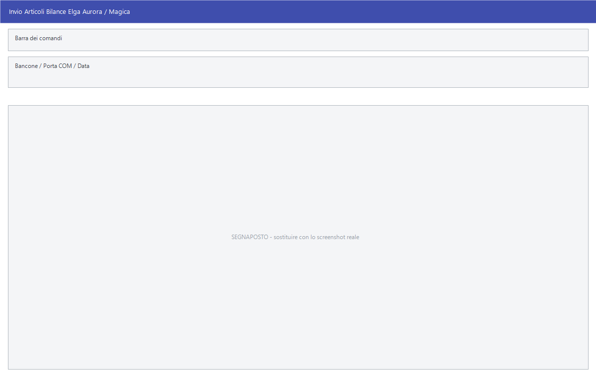

# Bilance

Le bilance da banco vendono a peso e hanno bisogno di sapere, per ogni articolo,
il codice PLU, la descrizione e il prezzo al chilo. Facile gliele manda e ne
riprende il venduto, con lo stesso giro delle casse: **invio articoli**,
vendita, **ricezione vendite**.

!!! info "In sintesi"

    - **Percorso:**
        - Menu ▸ Casse e Bilance ▸ Bilance ▸ Bilance ZENITH ▸ *(le sue voci)*
        - Menu ▸ Casse e Bilance ▸ Bilance ▸ Bilance OMEGA ▸ *(le sue voci)*
        - Menu ▸ Casse e Bilance ▸ Bilance ▸ Bilance MACCHI Driver BENCHCOMM ▸ *(le sue voci)*
        - Menu ▸ Casse e Bilance ▸ Bilance ▸ Bilance BIZERBA ▸ *(le sue voci)*
        - Menu ▸ Casse e Bilance ▸ Bilance ▸ Bilance ELGA ▸ *(le sue voci)*
        - Menu ▸ Casse e Bilance ▸ Bilance ▸ Bilance DIBAL ▸ *(le sue voci)*
        - Menu ▸ Casse e Bilance ▸ Bilance ▸ Bilance HELMAC ▸ Invio Articoli
        - Menu ▸ Casse e Bilance ▸ Bilance ▸ Bilance METTLER TOLEDO - WINSHOP ▸ *(le sue voci)*
    - **Scorciatoia:** ++f2++ avvia, ++esc++ esce
    - **Permessi richiesti:** nessun profilo predefinito; le singole voci di menu si abilitano per ogni utente da [Archivi ▸ Utenti](../anagrafiche/utenti.md)

---

## A cosa serve

Le voci cambiano nome da una marca all'altra, ma fanno tre cose sole:

| Genere di voce | Come si chiama | A cosa serve |
|---|---|---|
| Invio delle variazioni | **Invio Variazioni Articoli**, **Invio variazioni Articoli**, **Invio Articoli**, **Invio Articoli Bilance Macchi**, **Invio variazioni Articoli - CS**, **Invia variazioni Articoli - D900** | Manda alle bilance quello che è cambiato dall'ultimo invio. È l'operazione di tutti i giorni. |
| Invio completo | **Invio Globale Articoli**, **Cancellazione Archivi e Invio Articoli** | Riparte da zero: svuota l'archivio della bilancia e ci rimanda tutto. |
| Ricezione del venduto | **Ricezione Totali Vendite da Bilance**, **Ricezione Vendite**, **Ricezione Vendite da Bilance**, **Ricezione Totali Vendite da File**, **Ricezione Vendite da File**, **Acquisizione Vendita da File** | Riprende il venduto, collegandosi alle bilance oppure leggendo un file già scaricato. |

Due voci esistono solo per le bilance Zenith:

| Voce di menu | A cosa serve |
|---|---|
| **Ricezione Scontrini da Bilance** | Riprende gli scontrini, non solo i totali: si vede la singola vendita. |
| **Ricezione Scontrini da File** | Lo stesso, da un file già scaricato. |

Quale famiglia offre quali voci:

| Bilance | Invio | Ricezione |
|---|---|---|
| **ZENITH** | variazioni; cancellazione archivi e invio completo | da bilance, da file; scontrini da bilance, scontrini da file |
| **OMEGA** | articoli | vendite, vendita da file |
| **MACCHI Driver BENCHCOMM** | articoli | vendite |
| **BIZERBA** | variazioni *(con la scelta del formato file)* | da bilance, da file |
| **ELGA** | variazioni | da bilance, da file |
| **DIBAL** | variazioni CS; variazioni D900 | vendite |
| **HELMAC** | articoli | — |
| **METTLER TOLEDO - WINSHOP** | variazioni; globale | da bilance, da file |

## Prerequisiti

Prima di parlare con le bilance occorre:

- avere gli [articoli](../anagrafiche/anagrafica-articoli.md) con il **codice
  PLU** e il **bancone** impostati: sono i due dati che dicono alla bilancia
  quale tasto è quale articolo. Il controllo di quello che è impostato si fa con
  la [Stampa Articoli Gestione Bilance](stampe-casse-bilance.md);
- avere il **deposito attivo** impostato nei
  [parametri della ditta](../anagrafiche/ditte.md);
- avere il collegamento fisico configurato: porta seriale per le bilance Elga,
  cartella di scambio per le altre.

## La maschera

La maggior parte delle voci non ha maschera: chiedono conferma e lavorano
mostrando l'avanzamento. Hanno una finestra propria le bilance **Bizerba**
(*Invio PLU Bilance BIZERBA*) ed **Elga** (*Invio Articoli Bilance Elga Aurora /
Magica*).

## Campi

### Invio PLU Bilance BIZERBA

| Campo | Obbl. | Descrizione | Valori ammessi |
|---|:---:|---|---|
| **Formato File** | ● | Il tracciato con cui scrivere il file per le bilance. | `SXGX BZ00VARP.DAT`, `SXGX WINVARP.DAT` |
| **Formato BANCONE + PLU** | ● | Come è composto il codice: quante cifre per il bancone e quante per il PLU. | `3 + 3`, `2 + 4` |
| **Invia Tutti gli Articoli** | | Se attivo manda l'intero archivio invece delle sole variazioni. | attivo/non attivo |

{: .campi }

### Invio Articoli Bilance Elga Aurora / Magica

| Campo | Obbl. | Descrizione | Valori ammessi |
|---|:---:|---|---|
| **Bancone** | ● | Il bancone a cui mandare gli articoli. | numero |
| **Porta COM** | ● | La porta seriale a cui la bilancia è collegata. | `NESSUNA`, `COM1` … `COM8` |
| **Data** | | La data a cui riferire l'operazione. | data |

{: .campi }

La stessa finestra serve tutte e tre le voci delle bilance Elga — invio,
ricezione da bilance e ricezione da file — con i campi che restano gli stessi.

## Pulsanti e comandi

| Comando | Scorciatoia | Effetto |
|---|---|---|
| **F2 - OK** | ++f2++ | Conferma e avvia. |
| **Esci** | ++esc++ | Chiude senza fare nulla. |

## Come si fa

### Mandare i prezzi nuovi alle bilance

1. Cambia i prezzi in [anagrafica articoli](../anagrafiche/anagrafica-articoli.md)
   o dai [listini](../listini-vendita/gestione-listini.md).
2. Apri la voce di invio delle variazioni della tua marca di bilance.
3. Conferma alla domanda *Vuoi trasferire gli articoli alle bilance ?*.

### Riallineare una bilancia da capo

Per le Zenith c'è **Cancellazione Archivi e Invio Articoli**, che chiede
conferma con *Confermi la cancellazione degli archivi bilance e la
ritrasmissione completa ?*; per le Bizerba si attiva **Invia Tutti gli
Articoli**; per le Mettler Toledo c'è **Invio Globale Articoli**.

Da fare quando la bilancia è nuova o quando non si è più sicuri di cosa
contenga.

### Riprendere il venduto

1. Apri la voce **Ricezione ... da Bilance** della tua marca: Facile si collega
   e legge.
2. Se il collegamento non c'è, scarica il file con il programma della bilancia
   e usa la voce **... da File**.
3. Se compaiono codici scartati, stampali quando Facile te lo propone.

### Vedere le singole vendite invece dei totali (solo Zenith)

Usa **Ricezione Scontrini da Bilance** invece di **Ricezione Totali Vendite da
Bilance**.

## Controlli e messaggi

| Messaggio | Causa | Cosa fare |
|---|---|---|
| *Vuoi trasferire gli articoli alle bilance ?* | Conferma prima dell'invio. | **Sì** procede. La risposta preimpostata è **No**. |
| *Vuoi trasferire gli articoli alle bilance DIBAL ?* | Come sopra, per le Dibal. | **Sì** procede. |
| *Confermi la cancellazione degli archivi bilance e la ritrasmissione completa ?* | Hai avviato l'invio completo alle Zenith. | **Sì** svuota le bilance e rimanda tutto. |
| *Deposito Attivo non Impostato!* | Manca il deposito nei parametri della ditta. | Impostalo prima di procedere. |
| *Impossibile aprire il file C:\\DIBAL\\TX.TXT!* | Facile non riesce a scrivere il file per le bilance Dibal. | Controlla che la cartella esista e sia scrivibile. |
| *Impossibile aprire il file!* | Facile non riesce a leggere o scrivere il file di scambio. | Controlla percorsi e permessi, e che nessun altro programma tenga il file aperto. |
| *Impossibile spostare il file !* | Il file ricevuto non si è potuto archiviare. | Controlla i permessi della cartella. |
| *Ci sono Codici Scartati durante la Ricezione. Li vuoi stampare?* | Alcuni codici venduti non corrispondono a nessun articolo. | **Sì**: la stampa dice quali. Vanno sistemati in anagrafica. |

## Note

!!! warning "Bancone e PLU sono la chiave"

    Una bilancia non conosce il codice articolo di Facile: conosce il bancone e
    il numero di tasto. Se due articoli finiscono sullo stesso bancone con lo
    stesso PLU, la bilancia ne tiene uno solo e il venduto dell'altro sparisce.
    La [Stampa Articoli Gestione Bilance](stampe-casse-bilance.md) serve
    esattamente a controllare questo.

!!! note "Le bilance Helmac non ricevono il venduto"

    Sotto **Bilance HELMAC** c'è la sola voce **Invio Articoli**: il venduto di
    quelle bilance non torna in Facile. Non è un errore di installazione.

<!-- DA VERIFICARE: la differenza fra le due voci di invio delle bilance DIBAL, "- CS" e "- D900". -->

<!-- DA VERIFICARE: in quale cartella ciascuna marca di bilance scrive e legge i file di scambio. -->

<!-- DA VERIFICARE: se i tre modi della maschera Elga (invio, ricezione, ricezione da file) mostrino campi diversi. -->

<!-- DA VERIFICARE: cosa distingue la "ricezione scontrini" dalla "ricezione totali vendite" nel risultato in Facile. -->

## Vedi anche

- [Casse](casse.md)
- [Frontalini](frontalini.md)
- [Stampe e manutenzione di casse e bilance](stampe-casse-bilance.md)
- [Anagrafica articoli](../anagrafiche/anagrafica-articoli.md)
