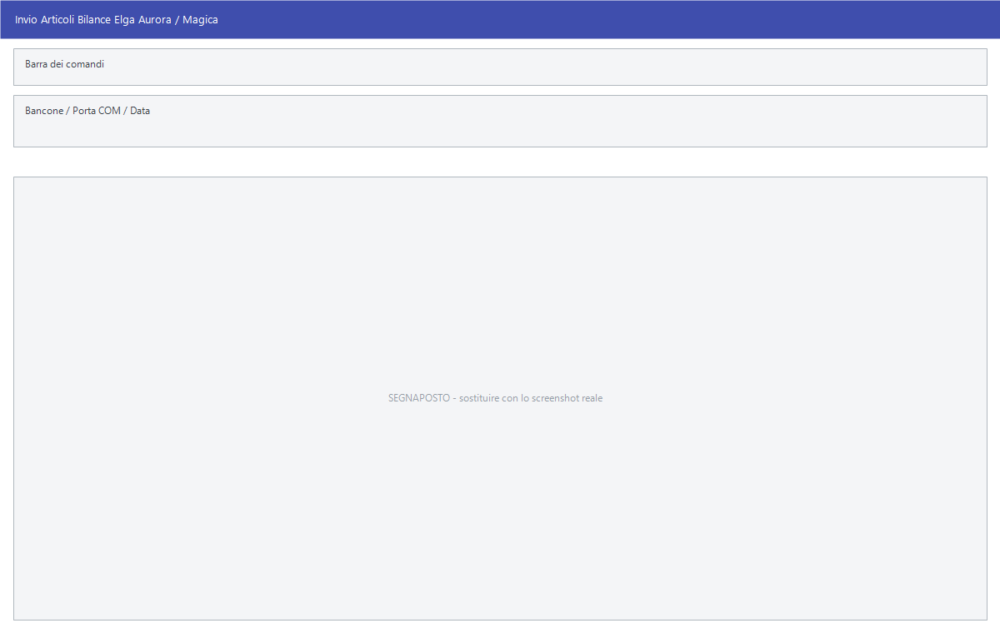

# Bilance

Le bilance da banco vendono a peso e hanno bisogno di sapere, per ogni articolo,
il codice PLU, la descrizione e il prezzo al chilo. Facile gliele manda e ne
riprende il venduto, con lo stesso giro delle casse: **invio articoli**,
vendita, **ricezione vendite**.

!!! info "In sintesi"

    - **Percorso:**
        - Menu ▸ Casse e Bilance ▸ Bilance ▸ Bilance ZENITH ▸ *(le sue voci)*
        - Menu ▸ Casse e Bilance ▸ Bilance ▸ Bilance OMEGA ▸ *(le sue voci)*
        - Menu ▸ Casse e Bilance ▸ Bilance ▸ Bilance MACCHI Driver BENCHCOMM ▸ *(le sue voci)*
        - Menu ▸ Casse e Bilance ▸ Bilance ▸ Bilance BIZERBA ▸ *(le sue voci)*
        - Menu ▸ Casse e Bilance ▸ Bilance ▸ Bilance ELGA ▸ *(le sue voci)*
        - Menu ▸ Casse e Bilance ▸ Bilance ▸ Bilance DIBAL ▸ *(le sue voci)*
        - Menu ▸ Casse e Bilance ▸ Bilance ▸ Bilance HELMAC ▸ Invio Articoli
        - Menu ▸ Casse e Bilance ▸ Bilance ▸ Bilance METTLER TOLEDO - WINSHOP ▸ *(le sue voci)*
    - **Scorciatoia:** ++f2++ avvia, ++esc++ esce
    - **Permessi richiesti:** nessun profilo predefinito; le singole voci di menu si abilitano per ogni utente da [Archivi ▸ Utenti](../anagrafiche/utenti.md)

---

## A cosa serve

Le voci cambiano nome da una marca all'altra, ma fanno tre cose sole:

| Genere di voce | Come si chiama | A cosa serve |
|---|---|---|
| Invio delle variazioni | **Invio Variazioni Articoli**, **Invio variazioni Articoli**, **Invio Articoli**, **Invio Articoli Bilance Macchi**, **Invio variazioni Articoli - CS**, **Invia variazioni Articoli - D900** | Manda alle bilance quello che è cambiato dall'ultimo invio. È l'operazione di tutti i giorni. |
| Invio completo | **Invio Globale Articoli**, **Cancellazione Archivi e Invio Articoli** | Riparte da zero: svuota l'archivio della bilancia e ci rimanda tutto. |
| Ricezione del venduto | **Ricezione Totali Vendite da Bilance**, **Ricezione Vendite**, **Ricezione Vendite da Bilance**, **Ricezione Totali Vendite da File**, **Ricezione Vendite da File**, **Acquisizione Vendita da File** | Riprende il venduto, collegandosi alle bilance oppure leggendo un file già scaricato. |

Due voci esistono solo per le bilance Zenith:

| Voce di menu | A cosa serve |
|---|---|
| **Ricezione Scontrini da Bilance** | Riprende gli scontrini, non solo i totali: si vede la singola vendita. |
| **Ricezione Scontrini da File** | Lo stesso, da un file già scaricato. |

Quale famiglia offre quali voci:

| Bilance | Invio | Ricezione |
|---|---|---|
| **ZENITH** | variazioni; cancellazione archivi e invio completo | da bilance, da file; scontrini da bilance, scontrini da file |
| **OMEGA** | articoli | vendite, vendita da file |
| **MACCHI Driver BENCHCOMM** | articoli | vendite |
| **BIZERBA** | variazioni *(con la scelta del formato file)* | da bilance, da file |
| **ELGA** | variazioni | da bilance, da file |
| **DIBAL** | variazioni CS; variazioni D900 | vendite |
| **HELMAC** | articoli | — |
| **METTLER TOLEDO - WINSHOP** | variazioni; globale | da bilance, da file |

## Prerequisiti

Prima di parlare con le bilance occorre:

- avere gli [articoli](../anagrafiche/anagrafica-articoli.md) con il **codice
  PLU** e il **bancone** impostati: sono i due dati che dicono alla bilancia
  quale tasto è quale articolo. Il controllo di quello che è impostato si fa con
  la [Stampa Articoli Gestione Bilance](stampe-casse-bilance.md);
- avere il **deposito attivo** impostato nei
  [parametri della ditta](../anagrafiche/ditte.md);
- avere il collegamento fisico configurato: porta seriale per le bilance Elga,
  cartella di scambio per le altre.

## La maschera

La maggior parte delle voci non ha maschera: chiedono conferma e lavorano
mostrando l'avanzamento. Hanno una finestra propria le bilance **Bizerba**
(*Invio PLU Bilance BIZERBA*) ed **Elga** (*Invio Articoli Bilance Elga Aurora /
Magica*).

## Campi

### Invio PLU Bilance BIZERBA

| Campo | Obbl. | Descrizione | Valori ammessi |
|---|:---:|---|---|
| **Formato File** | ● | Il tracciato con cui scrivere il file per le bilance. | `SXGX BZ00VARP.DAT`, `SXGX WINVARP.DAT` |
| **Formato BANCONE + PLU** | ● | Come è composto il codice: quante cifre per il bancone e quante per il PLU. | `3 + 3`, `2 + 4` |
| **Invia Tutti gli Articoli** | | Se attivo manda l'intero archivio invece delle sole variazioni. | attivo/non attivo |

### Invio Articoli Bilance Elga Aurora / Magica

| Campo | Obbl. | Descrizione | Valori ammessi |
|---|:---:|---|---|
| **Bancone** | ● | Il bancone a cui mandare gli articoli. | numero |
| **Porta COM** | ● | La porta seriale a cui la bilancia è collegata. | `NESSUNA`, `COM1` … `COM8` |
| **Data** | | La data a cui riferire l'operazione. | data |

La stessa finestra serve tutte e tre le voci delle bilance Elga — invio,
ricezione da bilance e ricezione da file — con i campi che restano gli stessi.

## Pulsanti e comandi

| Comando | Scorciatoia | Effetto |
|---|---|---|
| **F2 - OK** | ++f2++ | Conferma e avvia. |
| **Esci** | ++esc++ | Chiude senza fare nulla. |

## Come si fa

### Mandare i prezzi nuovi alle bilance

1. Cambia i prezzi in [anagrafica articoli](../anagrafiche/anagrafica-articoli.md)
   o dai [listini](../listini-vendita/gestione-listini.md).
2. Apri la voce di invio delle variazioni della tua marca di bilance.
3. Conferma alla domanda *Vuoi trasferire gli articoli alle bilance ?*.

### Riallineare una bilancia da capo

Per le Zenith c'è **Cancellazione Archivi e Invio Articoli**, che chiede
conferma con *Confermi la cancellazione degli archivi bilance e la
ritrasmissione completa ?*; per le Bizerba si attiva **Invia Tutti gli
Articoli**; per le Mettler Toledo c'è **Invio Globale Articoli**.

Da fare quando la bilancia è nuova o quando non si è più sicuri di cosa
contenga.

### Riprendere il venduto

1. Apri la voce **Ricezione ... da Bilance** della tua marca: Facile si collega
   e legge.
2. Se il collegamento non c'è, scarica il file con il programma della bilancia
   e usa la voce **... da File**.
3. Se compaiono codici scartati, stampali quando Facile te lo propone.

### Vedere le singole vendite invece dei totali (solo Zenith)

Usa **Ricezione Scontrini da Bilance** invece di **Ricezione Totali Vendite da
Bilance**.

Ogni riga si riconosce da **Bancone** e **Num. PLU** dell'articolo; il codice a
barre conta solo per gli articoli caricati a mano sulla bilancia. Le righe
dello stesso articolo allo stesso prezzo si sommano in un solo movimento di
scarico, con il peso o i pezzi venduti e l'importo al netto degli sconti fatti
sulla bilancia.

Per passare in cassa lo scontrino stampato da una bilancia, mentre il cliente
paga, vedi [Vendita al banco](../vendite/vendita-al-banco.md#passare-in-cassa-lo-scontrino-di-una-bilancia).

## Controlli e messaggi

| Messaggio | Causa | Cosa fare |
|---|---|---|
| *Vuoi trasferire gli articoli alle bilance ?* | Conferma prima dell'invio. | **Sì** procede. La risposta preimpostata è **No**. |
| *Vuoi trasferire gli articoli alle bilance DIBAL ?* | Come sopra, per le Dibal. | **Sì** procede. |
| *Confermi la cancellazione degli archivi bilance e la ritrasmissione completa ?* | Hai avviato l'invio completo alle Zenith. | **Sì** svuota le bilance e rimanda tutto. |
| *Deposito Attivo non Impostato!* | Manca il deposito nei parametri della ditta. | Impostalo prima di procedere. |
| *Impossibile aprire il file C:\\DIBAL\\articoli.txt!* | Facile non riesce a scrivere il file per le bilance Dibal. | Controlla che la cartella `C:\\DIBAL` esista e sia scrivibile, e che nessun altro programma tenga aperto il file. |
| *Impossibile aprire il file!* | Facile non riesce a leggere o scrivere il file di scambio. | Controlla percorsi e permessi, e che nessun altro programma tenga il file aperto. |
| *Impossibile spostare il file !* | Il file ricevuto non si è potuto archiviare. | Controlla i permessi della cartella. |
| *File inesistente o impossibile da aprire !*, seguito dal percorso | Nella ricezione da file di Zenith, Bizerba o WinShop non c'è il file della data indicata. | Controlla la data, e che il file del giorno sia nella cartella indicata dal messaggio. |
| *Ci sono Codici Scartati durante la Ricezione. Li vuoi stampare?* | Alcuni codici venduti non corrispondono a nessun articolo. | **Sì**: la stampa dice quali. Vanno sistemati in anagrafica. |

## Note

!!! warning "Bancone e PLU sono la chiave"

    Una bilancia non conosce il codice articolo di Facile: conosce il bancone e
    il numero di tasto. Se due articoli finiscono sullo stesso bancone con lo
    stesso PLU, la bilancia ne tiene uno solo e il venduto dell'altro sparisce.
    La [Stampa Articoli Gestione Bilance](stampe-casse-bilance.md) serve
    esattamente a controllare questo.

!!! note "Le bilance Helmac non ricevono il venduto"

    Sotto **Bilance HELMAC** c'è la sola voce **Invio Articoli**: il venduto di
    quelle bilance non torna in Facile. Non è un errore di installazione.

!!! info "DIBAL: «CS» e «D900» cambiano solo come viene scritta la descrizione"

    Le due voci producono **lo stesso file**, nella stessa cartella, con gli
    stessi campi. L'unica differenza è **da dove prendono i due nomi**
    dell'articolo che la bilancia mostra:

    | Voce | Nome 1 | Nome 2 |
    |---|---|---|
    | **- CS** | la **Descrizione 1** dell'articolo, per intero | la **Descrizione 2** dell'articolo, per intero |
    | **- D900** | i **primi 20 caratteri** della Descrizione 1 | quello che **avanza** della Descrizione 1, fino a 20 caratteri |

    Il modello D900 vuole due righe da venti caratteri e Facile gliele ricava
    spezzando la descrizione; i modelli CS accettano due nomi liberi e prendono
    le due descrizioni come sono. **Sui D900 la Descrizione 2 dell'articolo non
    viene mandata affatto.**

    Scegliere la voce sbagliata non dà errore: le bilance si programmano lo
    stesso, con le descrizioni tagliate o duplicate male.

!!! info "Dove ogni marca scrive e legge"

    | Bilancia | Invio articoli | Ricezione |
    |---|---|---|
    | **DIBAL** | `C:\DIBAL\articoli.txt` | tutti i `.txt` in `C:\DIBAL\scontrini` |
    | **Elga** | `out\elgAAMMGG_NN.txt` nella cartella del programma, con data e numero di bancone | lo stesso file, che dopo il caricamento viene spostato in `backup` |
    | **Zenith** | `out\zenart.txt` | `in\zentotart.txt` per i totali e `in\zensco.txt` per gli scontrini, archiviati poi in `zenith\DC-AAAAMMGG.TXT` e `zenith\sco-AAAAMMGG.TXT`; alla cassa, un file per scontrino in `C:\SCONTRINI_BILANCE` (vedi [il tracciato](#il-tracciato-standard-degli-scontrini-zenith)) |
    | **Macchi** | `out\macchiart.txt` | `in\totplu.txt` |
    | **Omega** | `C:\omega\manbil.dat` | i file `.tot` in `C:\omega` |

    Due avvertenze pratiche:

    - **DIBAL e Omega usano percorsi fissi su `C:`**, non configurabili: la
      cartella deve esistere e deve essere scrivibile, anche se il programma è
      installato altrove;
    - **Zenith, Macchi e Omega non parlano direttamente con le bilance**: Facile
      scrive il file e poi lancia un comando di sistema — `invio_art.bat`,
      `ricevi_tot.bat` e simili, nella cartella della marca — che è quello che
      fa il trasferimento vero. Se l'invio non arriva alla bilancia ma il file
      c'è, il problema è in quel comando, non in Facile.

!!! note "I tre modi della maschera Elga"

    È **la stessa finestra**, con gli stessi campi: cambia solo il verso del
    lavoro, e il titolo lo dice. Non c'è niente da compilare di diverso fra
    invio e ricezione.

    **Ricezione da file** non si collega alla bilancia: legge un file già
    scaricato. Per **Zenith**, **Bizerba** e **Mettler Toledo - WinShop** chiede
    la **Data Ricezione** e cerca il file di quel giorno: per Zenith nella
    cartella `zenith` del programma (`DC-AAAAMMGG.TXT` per i totali,
    `sco-AAAAMMGG.TXT` per gli scontrini), per Bizerba e WinShop in
    `C:\backupdc` (`bilAAMMGG.dat`). Serve anche per rileggere un giorno
    passato. La data deve stare nell'esercizio su cui stai lavorando.

!!! info "Scontrini o totali: cambia il dettaglio, non il risultato"

    Tutte e due le ricezioni producono in Facile **le stesse tre cose**: uno
    scontrino, i movimenti di magazzino che scaricano gli articoli venduti e,
    per gli articoli che non si riesce ad abbinare, una riga di **scarto**.

    A cambiare è **quanto dettaglio arriva**:

    | | **Totali vendite** | **Scontrini** |
    |---|---|---|
    | Cosa legge | una riga per articolo, con il venduto della giornata | le singole battute, una per una |
    | Che scontrino nasce | **uno solo**, che raccoglie tutti i totali | **uno solo**, che raccoglie tutte le righe |
    | Orari | tutto con l'ora del caricamento | tutto con l'ora del caricamento |
    | A che serve | scaricare il magazzino e basta | avere anche il dettaglio del venduto |

    In tutti e due i casi **lo scontrino che nasce in Facile porta la data e
    l'ora del caricamento**, non quella della vendita: non è uno scontrino
    fiscale ma il contenitore con cui il venduto entra in archivio.

    La scelta fra le due dipende da come è impostata la bilancia: se produce
    solo i totali, l'altra voce non trova niente da leggere.

### Il tracciato standard degli scontrini Zenith

Facile legge gli scontrini delle bilance Zenith in **un solo tracciato, quello
standard di Facile**. È lo stesso sia per **Ricezione Scontrini da Bilance** e
**da File**, sia per lo scontrino passato
[in cassa](../vendite/vendita-al-banco.md#passare-in-cassa-lo-scontrino-di-una-bilancia).
Si imposta in Zenith System, in **Configurazione ▸ Conf. Programma ▸ Struttura
files di I/O**, sui tracciati **Esportazione Totale Scontrino**,
**Esportazione Transazione Scontrino** ed **Esportazione Riapertura
Scontrino**.

!!! warning "Non è il tracciato «rev.2» della documentazione Zenith"

    Il documento *Struttura dei files di input / output rev.2* di Italiana
    Macchi descrive gli scontrini con record da 27 e 46 caratteri. Facile
    non li legge: una bilancia configurata così non manda niente in cassa, e
    la ricezione degli scontrini non trova righe valide. Va impostato il
    tracciato descritto qui.

**Il file.** Ogni scontrino è un file di testo, con un record per riga. Ogni
riga finisce con ritorno a capo e avanzamento riga, e ha lunghezza fissa. I
numeri sono allineati a destra con zeri davanti, senza virgola: gli importi
sono in centesimi, i pesi in grammi. Uno scontrino è fatto di un record di
totale seguito da tanti record di riga quante sono le vendite.

In cassa, Zenith System scrive ogni scontrino in un file a sé, chiamato `SCO`,
più il bancone su 2 cifre, più il numero dello scontrino su 4 cifre: lo
scontrino 32 del bancone 1 è `SCO010032.dat`. I file stanno in
`C:\SCONTRINI_BILANCE`; la cartella si può cambiare solo con l'assistenza.
Perché i file arrivino mentre si vende, in Zenith System va attivato il
**Recupero scontrino** sulla linea delle bilance (**Config. Linee ▸
Connessioni**), e ZSServer deve restare attivo in modalità residente.
Dopo la lettura il file viene rinominato con l'estensione `.old`.

**Il codice a barre sullo scontrino** va impostato in Zenith System
(**Impostazioni ▸ Barcode ▸ Formato**) come EAN-13 così composto:

| Cifre | Contenuto |
|---|---|
| 1-2 | `29` fisso |
| 3-6 | numero dello scontrino |
| 7-12 | totale dello scontrino in centesimi |
| 13 | cifra di controllo |

Esempio: `2900040553277` è lo scontrino 4, da 553,27 €. Il bancone non è nel
codice: la cassa riconosce il file giusto dal numero e dal totale.

**Record di totale** — 43 caratteri più il ritorno a capo. Gli scostamenti
sono contati da 0, come li chiede Zenith System.

| Scostamento | Lunghezza | Contenuto | A cosa serve in Facile |
|---|---|---|---|
| 0 | 1 | `T` per lo scontrino chiuso, `R` per lo scontrino riaperto | distingue i record |
| 1 | 10 | data, `gg/mm/aaaa` | — |
| 11 | 8 | ora, `hh:mm:ss` | — |
| 19 | 2 | bancone | — |
| 21 | 3 | numero dello scontrino, ultime tre cifre | — |
| 24 | 2 | numero dei record di riga | controllo che lo scontrino sia completo |
| 26 | 6 | totale in centesimi | confronto con il codice a barre e con la somma delle righe |
| 32 | 2 | `01` | — |
| 34 | 2 | operatore | — |
| 36 | 6 | `000000` | — |
| 42 | 1 | `M` | la ricezione degli scontrini scarta le righe degli scontrini senza `M` |

**Record di riga** — 155 caratteri più il ritorno a capo.

| Scostamento | Lunghezza | Contenuto | A cosa serve in Facile |
|---|---|---|---|
| 0 | 1 | `t` | distingue i record |
| 1 | 10 | data, `gg/mm/aaaa` | — |
| 11 | 8 | ora, `hh:mm:ss` | — |
| 19 | 2 | bancone | trova l'articolo, con il PLU |
| 21 | 4 | PLU | trova l'articolo, con il bancone |
| 25 | 70 | descrizione | compare negli avvisi |
| 95 | 1 | indicatore della bilancia, `0` o `1` | — |
| 96 | 5 | numero dello scontrino | — |
| 101 | 6 | peso in grammi | quantità delle vendite a peso |
| 107 | 6 | prezzo in centesimi, al chilo o al pezzo | prezzo della riga |
| 113 | 6 | importo della riga in centesimi, al netto dello sconto | controllo del totale; valore dello scarico |
| 119 | 1 | `P` a peso, `C` a pezzi | sceglie fra peso e pezzi |
| 120 | 2 | aliquota IVA | — |
| 122 | 12 | codice a barre dell'articolo, senza cifra di controllo | solo nella ricezione, se bancone e PLU non trovano l'articolo |
| 134 | 1 | spazio | — |
| 135 | 2 | `01` | — |
| 137 | 3 | pezzi | quantità delle vendite a pezzi |
| 140 | 2 | progressivo della riga nello scontrino, da `00` | — |
| 142 | 1 | `1` se la riga è stata scontata sulla bilancia | in cassa aggiunge la riga di sconto |
| 143 | 7 | sconto in centesimi | importo della riga di sconto |
| 150 | 5 | non usato | — |

Il **record di riapertura** (`R`) ha lo stesso tracciato del totale e non è
seguito da righe: in cassa, uno scontrino con la sola riapertura viene
segnalato e non entra.

## Vedi anche

- [Casse](casse.md)
- [Frontalini](frontalini.md)
- [Stampe e manutenzione di casse e bilance](stampe-casse-bilance.md)
- [Anagrafica articoli](../anagrafiche/anagrafica-articoli.md)
