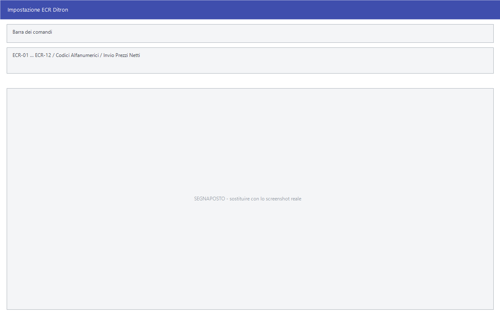

# Casse

Il giro con una cassa è sempre lo stesso: **si mandano gli articoli**, si
vende, **si riprende il venduto**. Facile parla con cinque famiglie di casse e
per tutte fa le stesse tre cose, con lo stesso ordine e gli stessi messaggi;
cambia solo il formato dei file e la cartella in cui li scrive.

!!! info "In sintesi"

    - **Percorso:**
        - Menu ▸ Casse e Bilance ▸ Casse ▸ SysPC ▸ *(le sue voci)*
        - Menu ▸ Casse e Bilance ▸ Casse ▸ Casse DITRON & Compatibili ▸ *(le sue voci)*
        - Menu ▸ Casse e Bilance ▸ Casse ▸ Brainpos 8 ▸ *(le sue voci)*
        - Menu ▸ Casse e Bilance ▸ Casse ▸ Aladino EPOS ▸ *(le sue voci)*
        - Menu ▸ Casse e Bilance ▸ Casse ▸ Custom Retail ▸ *(le sue voci)*
    - **Scorciatoia:** ++f2++ avvia, ++esc++ esce
    - **Permessi richiesti:** nessun profilo predefinito; le singole voci di menu si abilitano per ogni utente da [Archivi ▸ Utenti](../anagrafiche/utenti.md)

---

## A cosa serve

Le stesse quattro voci si ripetono sotto ogni famiglia di casse:

| Voce di menu | A cosa serve |
|---|---|
| **Invio Globale Articoli** | Manda alle casse **tutto** l'archivio articoli. Si usa la prima volta e quando le casse vanno riallineate da capo. |
| **Invio Variazioni Articoli** | Manda **solo quello che è cambiato** dall'ultimo invio. È l'operazione di tutti i giorni. |
| **Fine Giornata** | Lancia la procedura di fine giornata (EOD) della cassa e carica in Facile il venduto, generando i movimenti di magazzino. |
| **Acquisizione Manuale File Vendite** | Carica il venduto da un file già in mano, senza passare dalla procedura di fine giornata. |

Le voci che esistono solo per alcune famiglie:

| Voce di menu | Dove | A cosa serve |
|---|---|---|
| **Invio Clienti Fidelity** | SysPC | Manda alle casse l'anagrafica dei clienti con la tessera fedeltà. |
| **Invio Saldi Fidelity** | SysPC | Manda il saldo punti, di un cliente o di tutti. La finestra si chiama *Invio Saldo Punti Fidelity*. |
| **Cancellazione Promozioni** | SysPC | Cancella dalle casse le offerte vecchie. Apre la finestra *Cancellazione Promozioni SysPC*, dove si sceglie quanto cancellare. |
| **Impostazione Porte ECR** | Ditron | Dice a quali registratori di cassa parlare e come. La finestra si chiama *Impostazione ECR Ditron*. |

## Prerequisiti

Prima di parlare con le casse occorre:

- avere gli [articoli](../anagrafiche/anagrafica-articoli.md) con il codice PLU
  e i prezzi impostati;
- avere il [deposito](../magazzino/depositi.md) a cui riferire il venduto;
- avere impostata nei [parametri della ditta](../anagrafiche/ditte.md) la
  **causale di magazzino delle vendite**, che deve essere **in relazione con i
  clienti** e di tipo **scarico**: senza quella, la fine giornata non parte;
- per le casse Ditron, aver fatto almeno una volta **Impostazione Porte ECR**.

## La maschera

Quasi tutte le voci non hanno una maschera: chiedono conferma e lavorano,
mostrando l'avanzamento. Quando c'è più di un [deposito](../magazzino/depositi.md),
la fine giornata e l'acquisizione del venduto chiedono prima su quale
lavorare.

Hanno una finestra propria soltanto **Impostazione Porte ECR**, **Invio Saldi
Fidelity** e **Cancellazione Promozioni**.

## Campi

### Impostazione ECR Ditron

| Campo | Obbl. | Descrizione | Valori ammessi |
|---|:---:|---|---|
| **ECR - 01** … **ECR - 12** | | Quali registratori di cassa sono collegati. Se ne possono attivare fino a dodici. | attivo/non attivo |
| **Codici Alfanumerici** | | I codici articolo mandati alla cassa contengono anche lettere. | attivo/non attivo |
| **Invio Prezzi Netti** | | Manda i prezzi al netto invece che al lordo. | attivo/non attivo |

{: .campi }

### Invio Saldo Punti Fidelity

| Campo | Obbl. | Descrizione | Valori ammessi |
|---|:---:|---|---|
| **Cliente** | | Il cliente di cui mandare il saldo. Lasciandolo vuoto si mandano tutti. | codice |

{: .campi }

### Cancellazione Promozioni

| Campo | Obbl. | Descrizione | Valori ammessi |
|---|:---:|---|---|
| **Cancellazione Vecchie Offerte** | ● | Quante offerte cancellare dalla cassa. | `COMPLETA`, `PARZIALE (1-31999)`, `PARZIALE (1-998)`, `PARZIALE (1-2000)`, `PARZIALE (1-3000)`, `PARZIALE (1-4000)`, `PARZIALE (1-5000)` |

{: .campi }

## Pulsanti e comandi

| Comando | Scorciatoia | Effetto |
|---|---|---|
| **F2 - OK** | ++f2++ | Conferma e avvia. |
| **Esci** | ++esc++ | Chiude senza fare nulla. |
| Elenco valori | ++f10++ o ++space++ | Sul **Cliente**, apre l'elenco. |

## Come si fa

### Mandare alle casse i prezzi nuovi

1. Cambia i prezzi in [anagrafica articoli](../anagrafiche/anagrafica-articoli.md)
   o dai [listini](../listini-vendita/gestione-listini.md).
2. Apri **Menu ▸ Casse e Bilance ▸ Casse ▸** *(la tua famiglia)* **▸ Invio
   Variazioni Articoli**.
3. Conferma: Facile scrive i file nella cartella `out` del programma —
   `articoli.txt`, `offerte.txt` e `clienti.txt`.
4. Il trasferimento vero alla cassa lo fa il programma della cassa.

### Riallineare una cassa da capo

1. Apri **Invio Globale Articoli**.
2. Alla domanda *Confermi l'invio di tutto l'archivio alle casse ?* rispondi
   **Sì**.

Da fare quando la cassa è nuova, dopo una riparazione, o quando non si è più
sicuri di cosa ci sia dentro. Sulle altre giornate basta l'invio delle
variazioni, che è molto più rapido.

### Chiudere la giornata

1. Apri **Fine Giornata**.
2. Se i depositi sono più d'uno, scegli quello del negozio.
3. Alla domanda *Vuoi eseguire le procedure di Fine Giornata (EOD) ?* rispondi
   **Sì**: parte la procedura della cassa, poi Facile legge il file del venduto
   dalla cartella `in` e scrive i movimenti di magazzino.
4. Se ci sono codici che non ha riconosciuto, te lo dice e propone di
   stamparli: sono gli [scarti](stampe-casse-bilance.md).

### Caricare il venduto da un file

1. Apri **Acquisizione Manuale File Vendite**.
2. Scegli il deposito, poi il file.

## Controlli e messaggi

| Messaggio | Causa | Cosa fare |
|---|---|---|
| *Confermi l'invio di tutto l'archivio alle casse ?* | Hai avviato l'invio globale. | **Sì** procede. La risposta preimpostata è **No**. |
| *Confermi l'invio delle variazioni alle casse ?* | Hai avviato l'invio delle variazioni. | **Sì** procede. |
| *Vuoi eseguire le procedure di Fine Giornata (EOD) ?* | Hai avviato la fine giornata. | **Sì** lancia la procedura della cassa. |
| *Il codice della Causale di Magazzino richiesto non è valido o disponibile.* | Manca la causale delle vendite nei parametri della ditta. | Impostala prima di procedere. |
| *La Causale deve essere di Scarico e in Relazione con Clienti.* | La causale c'è ma è impostata male. | Correggila da [Causali Magazzino](../magazzino/causali-magazzino.md). |
| *Impossibile aprire il file !* | Facile non riesce a scrivere in `out` o a leggere da `in`. | Controlla che le cartelle esistano e siano scrivibili, e che nessun altro programma tenga il file aperto. |
| *Nessun File da Elaborare!* | La fine giornata non ha trovato il file del venduto. | Controlla che la procedura della cassa abbia scritto in `in`. |
| *Path Name Troppo Lungo!* | Il percorso del file supera il limite. | Sposta il file in una cartella dal nome più breve. |
| *Tipo record sconosciuto ! Tipo : …   Riga : … Vuoi continuare ?* | Il file del venduto contiene una riga che Facile non sa leggere. | **No** ferma e conserva il file per l'assistenza; **Sì** salta la riga e prosegue. |
| *Ci sono Codici Scartati durante la Ricezione. Vuoi stampare ?* | Alcuni codici venduti non corrispondono a nessun articolo. | **Sì**: la stampa dice quali. Vanno sistemati in anagrafica e il venduto reinserito a mano. |

## Note

!!! warning "Il venduto scartato non si recupera da solo"

    Un codice venduto alla cassa che in Facile non esiste finisce fra gli
    scarti: **non genera movimento di magazzino**, e l'esistenza resta più alta
    del vero. Stampa sempre gli scarti quando Facile te lo propone, e sistema
    l'articolo prima della fine giornata successiva. Vedi
    [Stampe e manutenzione](stampe-casse-bilance.md).

!!! note "Facile scrive i file, non parla con la cassa"

    Per quasi tutte le famiglie Facile prepara i file in `out` e legge quelli
    che trova in `in`; il trasferimento fisico lo fa il programma della cassa,
    lanciato dai file di comando `RSASyspc_EOD.BAT`, `RSAEpos_EOD.BAT` o
    `RSABrainpos_EOD.BAT` nelle rispettive cartelle. Se il trasferimento non
    avviene, il problema è quasi sempre lì e non in Facile.

!!! info "Tutte le famiglie usano gli stessi file, in due cartelle sole"

    Non c'è un tracciato per marca: **SysPC, Brainpos 8, Aladino EPOS e Custom
    Retail scrivono e leggono gli stessi file**, nelle cartelle `out` e `in`
    dell'installazione.

    | File | Dove | Che cosa contiene |
    |---|---|---|
    | `out\articoli.txt` | in uscita | gli articoli da programmare sulle casse |
    | `out\offerte.txt` | in uscita | le promozioni |
    | `out\clienti.txt` | in uscita | l'anagrafica fidelity |
    | `out\fidelity.txt` | in uscita | i saldi punti |
    | `in\VENDITE.TXT` | in entrata | il venduto della giornata |
    | `in\DC*.TXT` | in entrata | il dettaglio degli scontrini |

    A cambiare è **chi porta il file alla cassa**. Facile scrive il file e poi
    lancia un comando di sistema, diverso per famiglia, che sta in una cartella
    con il nome della marca:

    | Famiglia | Comando per gli articoli | Comando di fine giornata |
    |---|---|---|
    | **SysPC** | `SYSPC\RSASyspc_PLU.BAT` | `Syspc\RSASyspc_EOD.BAT` |
    | **Aladino EPOS** | `EPOS\RSAEpos_PLU.BAT` | `Epos\RSAEpos_EOD.BAT` |
    | **Brainpos 8** | `BRAINPOS\RSABrainpos_PLU.BAT` | `Brainpos\RSABrainpos_EOD.BAT` |

    Per i saldi fidelity il comando è `SYSPC\RSASyspc_FIDELITY.BAT`.

    È il motivo per cui un invio può "riuscire" senza che la cassa cambi
    niente: Facile ha scritto il suo file, ma il comando non l'ha portato a
    destinazione. Quando qualcosa non torna, la prima cosa da guardare è se il
    file in `out` è aggiornato.

!!! note "La fine giornata aspetta il segnale della cassa"

    Lanciato il comando di fine giornata, Facile **non legge subito**: aspetta
    che sparisca il file di blocco `in\RSA_EOD.LCK`, che la procedura della
    cassa crea mentre lavora e cancella quando ha finito. Solo allora cerca
    `VENDITE.TXT` e i `DC*.TXT`.

    Se la procedura della cassa si pianta lasciando il file di blocco,
    **Facile resta in attesa**: in quel caso va chiuso e il file `RSA_EOD.LCK`
    va tolto a mano dalla cartella `in`.

!!! info "Le casse Ditron non usano i file"

    Sono l'eccezione: con i registratori Ditron e compatibili Facile **parla
    direttamente sulla porta seriale**, senza passare da un file di scambio e
    senza comandi esterni. È il motivo per cui quella famiglia ha una voce in
    più, **Impostazione Porte ECR**, e non ha né *Invio Globale* né
    *Acquisizione Manuale File Vendite*.

    **Impostazione Porte ECR** è tutto quello che c'è da configurare dal
    programma: si dice quanti registratori ci sono e su quale porta sta
    ciascuno. Il resto — velocità, parità, cavo — si imposta **sul
    registratore**, non qui: i due lati devono corrispondere, e i valori li dà
    il tecnico che installa la cassa.

!!! info "I sei «PARZIALE» sono sei intervalli di numeri di offerta"

    La scelta dice **fino a quale numero di promozione cancellare** sulle
    casse:

    | Voce | Cancella le offerte |
    |---|---|
    | `COMPLETA` | tutte |
    | `PARZIALE (1-31999)` | dalla 1 alla 31999 |
    | `PARZIALE (1-998)` | dalla 1 alla 998 |
    | `PARZIALE (1-2000)` | dalla 1 alla 2000 |
    | `PARZIALE (1-3000)` | dalla 1 alla 3000 |
    | `PARZIALE (1-4000)` | dalla 1 alla 4000 |
    | `PARZIALE (1-5000)` | dalla 1 alla 5000 |

    Non è un ordine crescente: la prima delle parziali è la più larga di tutte.
    Il numero da scegliere dipende da **come sono numerate le promozioni sulle
    casse**, e va concordato con chi le ha configurate: cancellare oltre il
    necessario toglie anche offerte che devono restare.

    La scelta **resta memorizzata**, e separatamente per ogni famiglia di
    casse: riaprendo la finestra si ritrova quella dell'ultima volta.

!!! warning "Clienti e saldi fidelity si mandano solo alle SysPC"

    **Invio Clienti Fidelity** e **Invio Saldi Fidelity** esistono soltanto
    sotto SysPC, e non è una dimenticanza del menu: il comando che porta il
    file alla cassa è scritto solo per quella famiglia.

    Sulle altre casse il programma **scrive comunque** `out\clienti.txt`
    insieme agli articoli, ma non ha modo di consegnarlo. Chi tiene la raccolta
    punti su casse diverse dalle SysPC deve farsi fare il trasferimento
    dall'assistenza.

## Vedi anche

- [Bilance](bilance.md)
- [Stampe e manutenzione di casse e bilance](stampe-casse-bilance.md)
- [Anagrafica articoli](../anagrafiche/anagrafica-articoli.md)
- [Causali di magazzino](../magazzino/causali-magazzino.md)
