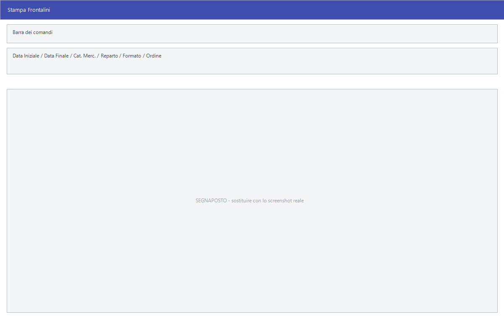

# Frontalini

Il frontalino è il cartellino che sta sul bordo dello scaffale, davanti alla
merce: descrizione, codice a barre, prezzo, e — quando c'è — il prezzo in
promozione con le date di validità. Ogni volta che un prezzo cambia il
frontalino va rifatto, e questa maschera serve a tenerne il conto.

!!! info "In sintesi"

    - **Percorso:** Menu ▸ Casse e Bilance ▸ Gestione e Stampa Frontalini
    - **Scorciatoia:** ++f2++ – ++f8++ i comandi della barra, ++esc++ esce
    - **Permessi richiesti:** nessun profilo predefinito; la voce di menu si abilita per ogni utente da [Archivi ▸ Utenti](../anagrafiche/utenti.md)

---

## A cosa serve

La finestra si chiama **Stampa Frontalini**, ma non è solo una stampa: è
l'elenco dei frontalini da rifare. Si riempie con gli articoli il cui prezzo è
cambiato in un periodo, si sfoltisce a mano, e si stampa quello che resta.

Il pulsante **F8 - Acquisisci** consente anche di riempirlo con i codici letti
da un terminalino: si gira il negozio segnando gli scaffali da aggiornare, e la
lista si compila da sé.

## Prerequisiti

Prima di stampare i frontalini occorre:

- avere gli [articoli](../anagrafiche/anagrafica-articoli.md) con descrizione e
  codice a barre;
- avere impostato il **tipo di stampante barcode** nei
  [parametri della ditta](../anagrafiche/ditte.md): senza quello la stampa non
  parte;
- avere almeno un **formato** di frontalino configurato.

## La maschera

In alto i filtri con cui si popola l'elenco — il periodo, la categoria, il
reparto — poi il formato e l'ordinamento; sotto la griglia dei frontalini, con
la casella di scelta sulla prima colonna. I comandi stanno nella barra in
testa.

Le colonne sono **Sel.**, **Codice**, **Descrizione**, **Barcode**,
**Prezzo**, **Prezzo Promo**, **Dal**, **Al**, **Cod. Bat.** e **Ultima
Stampa**. L'ultima dice quando quel frontalino è stato stampato l'ultima volta:
è il modo per accorgersi di quelli mai rifatti.

## Campi

| Campo | Obbl. | Descrizione | Valori ammessi |
|---|:---:|---|---|
| **Data Iniziale**, **Data Finale** | | Il periodo in cui i prezzi sono cambiati. | date |
| **Cat. Merc.** | | Restringe a una [categoria merceologica](../magazzino/categorie-merceologiche.md). | codice |
| **Reparto** | | Restringe a un [reparto](../magazzino/reparti.md). | codice |
| **Formato** | ● | Il modello di frontalino da stampare. | voce dell'elenco |
| **Ordine** | | Come ordinare la stampa: conviene farla seguire il giro che si fa in negozio. | `NUMERO ACQUISIZIONE`, `DATA ACQUISIZIONE`, `CATEGORIA MERCEOLOGICA` |

{: .campi }

## Pulsanti e comandi

| Comando | Scorciatoia | Effetto |
|---|---|---|
| **F2 - Aggiungi** | ++f2++ | Aggiunge un articolo alla lista. |
| **F3 - Apri** | ++f3++ | Apre la riga corrente. |
| **F4 - Seleziona** | ++f4++ | Spunta le righe. |
| **F5 - Deselez. Tutti** | ++f5++ | Toglie la spunta da tutte. |
| **F6 - Elimina** | ++f6++ | Toglie dalla lista le righe scelte. |
| **F7 - Stampa** | ++f7++ | Stampa i frontalini spuntati. |
| **F8 - Acquisisci** | ++f8++ | Riempie la lista con i codici letti da un terminalino. |
| **Esci** | ++esc++ | Chiude la maschera. |

## Come si fa

### Rifare i frontalini dopo un cambio prezzi

1. Cambia i prezzi dai [listini](../listini-vendita/gestione-listini.md).
2. Apri **Menu ▸ Casse e Bilance ▸ Gestione e Stampa Frontalini**.
3. Metti in **Data Iniziale** e **Data Finale** il periodo del cambio.
4. Scegli il **Formato** e metti **Ordine** su `CATEGORIA MERCEOLOGICA`, così
   la stampa esce nell'ordine in cui girerai il negozio.
5. Controlla la griglia e togli con **F6 - Elimina** quello che non serve.
6. Spunta le righe da stampare e premi **F7 - Stampa**.
7. Alla domanda *Vuoi confermare le etichette ?* rispondi **Sì** se sono uscite
   bene: le righe risultano stampate e la colonna **Ultima Stampa** si
   aggiorna.

### Segnare gli scaffali da rifare con il terminalino

1. Gira il negozio leggendo i codici a barre degli scaffali da aggiornare.
2. Apri la maschera e premi **F8 - Acquisisci**.
3. Alla domanda *Vuoi eliminare le letture?* rispondi **Sì** per svuotare il
   terminalino.

## Controlli e messaggi

| Messaggio | Causa | Cosa fare |
|---|---|---|
| *Nessun formato di stampa disponibile!* | Non è configurato alcun modello di frontalino. | Chiedi all'assistenza di installarne uno. |
| *Nessuna riga selezionata per la stampa!* | Non hai spuntato nulla. | Spunta le righe, o usa **F4 - Seleziona**. |
| *Tipo Stampante Barcode non Impostato.* / *Stampante Barcode non impostata !* | Manca la stampante nei parametri della ditta. | Impostala prima di stampare. |
| *Impossibile Inizializzare la Stampa !* | La stampante non risponde. | Controlla collegamento e driver. |
| *Vuoi confermare le etichette ?* | La stampa è finita. | **Sì** se sono uscite bene: le righe risultano stampate. **No** le lascia da rifare, **Annulla** ferma. |
| *Vuoi eliminare le letture?* | Dopo l'acquisizione dal terminalino. | **Sì** svuota il terminalino, **No** le lascia. |

## Note

!!! note "La conferma dopo la stampa non è una formalità"

    È la domanda *Vuoi confermare le etichette ?* a segnare i frontalini come
    stampati e ad aggiornare la colonna **Ultima Stampa**. Se la carta si
    inceppa, rispondi **No**: le righe restano in lista e si ristampano.

<!-- DA VERIFICARE: dove si configurano i formati dei frontalini e quali sono quelli standard. -->

<!-- DA VERIFICARE: cosa contiene la colonna "Cod. Bat." e a cosa serve. -->

<!-- DA VERIFICARE: quali terminalini sono supportati da "F8 - Acquisisci". -->

## Vedi anche

- [Casse](casse.md)
- [Bilance](bilance.md)
- [Stampe e manutenzione di casse e bilance](stampe-casse-bilance.md)
- [Gestione listini](../listini-vendita/gestione-listini.md)
