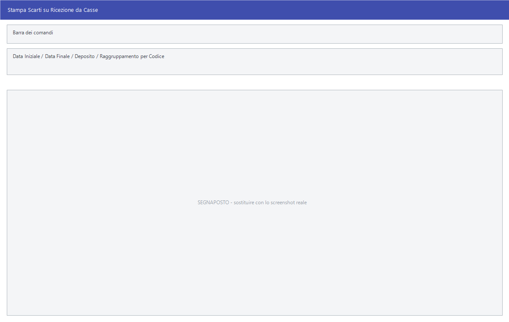

# Stampe e manutenzione di casse e bilance

Quando il venduto non torna, o le bilance non hanno i prezzi giusti, la risposta
è quasi sempre in una di queste stampe: dicono cosa Facile ha mandato, cosa non
è riuscito a leggere e cosa sta ancora aspettando di mandare.

!!! info "In sintesi"

    - **Percorso:**
        - Menu ▸ Casse e Bilance ▸ Bilance ▸ Stampa Articoli Gestione Bilance
        - Menu ▸ Casse e Bilance ▸ Bilance ▸ Stampa Etichette per Banconi
        - Menu ▸ Casse e Bilance ▸ Stampa Scarti da Ricezione
        - Menu ▸ Casse e Bilance ▸ Stampa Articoli con Flag Variazioni Attivo
        - Menu ▸ Casse e Bilance ▸ Azzera Flag Variazioni Articoli
    - **Scorciatoia:** ++f2++ avvia, ++esc++ esce
    - **Permessi richiesti:** nessun profilo predefinito; le singole voci di menu si abilitano per ogni utente da [Archivi ▸ Utenti](../anagrafiche/utenti.md)

---

## A cosa serve

| Voce di menu | A cosa serve |
|---|---|
| **Stampa Articoli Gestione Bilance** | Gli articoli impostati per le bilance, con bancone e PLU: serve a scoprire i doppioni e i buchi prima che si vedano al banco. Usa la maschera delle [stampe articoli](../anagrafiche/stampe-articoli.md). |
| **Stampa Etichette per Banconi** | Le etichette da attaccare al banco. Usa anch'essa la maschera delle stampe articoli. |
| **Stampa Scarti da Ricezione** | I codici che casse e bilance hanno venduto e che Facile non ha saputo riconoscere. La finestra si chiama *Stampa Scarti su Ricezione da Casse* ed è la stessa della [Stampa Spostamenti Codici a Barre](../anagrafiche/stampe-lotti-e-barcode.md). |
| **Stampa Articoli con Flag Variazioni Attivo** | Gli articoli che risultano da mandare: sono quelli che il prossimo **Invio Variazioni** porterebbe a casse e bilance. |
| **Azzera Flag Variazioni Articoli** | Toglie il segno «da mandare» da tutti gli articoli. |

## Prerequisiti

Prima di usare queste stampe occorre avere gli
[articoli](../anagrafiche/anagrafica-articoli.md) in archivio; per gli scarti,
aver fatto almeno una ricezione da [casse](casse.md) o da
[bilance](bilance.md).

## La maschera

Sono finestre di selezione con i pulsanti **F2 - OK** ed **Esci**. **Azzera
Flag Variazioni Articoli** non ha maschera: parte e basta.

## Campi

### Stampa Scarti su Ricezione da Casse

| Campo | Obbl. | Descrizione | Valori ammessi |
|---|:---:|---|---|
| **Data Iniziale**, **Data Finale** | ● | Il periodo delle ricezioni da esaminare. Arrivano già impostate a oggi. | date |
| **Deposito** | | Restringe a un [deposito](../magazzino/depositi.md). Vuoto significa `TUTTI`. | codice |
| **Raggruppamento per Codice** | | Se attivo raggruppa gli scarti per codice invece di elencarli uno per uno. | attivo/non attivo |

{: .campi }

Per i campi delle altre stampe vedi [Stampe articoli](../anagrafiche/stampe-articoli.md).

## Pulsanti e comandi

| Comando | Scorciatoia | Effetto |
|---|---|---|
| **F2 - OK** | ++f2++ | Prepara e mostra l'anteprima della stampa. |
| **Esci** | ++esc++ | Chiude senza stampare. |
| Elenco valori | ++f10++ o ++space++ | Sul **Deposito**, apre l'elenco. |

## Come si fa

### Capire perché il venduto non torna

1. Apri **Menu ▸ Casse e Bilance ▸ Stampa Scarti da Ricezione**.
2. Indica il periodo delle ricezioni sospette.
3. Attiva **Raggruppamento per Codice** per vedere subito quali codici si
   ripetono.
4. Premi **F2 - OK**: ogni riga è una vendita che non ha generato movimento di
   magazzino. Sistema gli articoli in
   [anagrafica](../anagrafiche/anagrafica-articoli.md) e correggi le esistenze
   con un [movimento di rettifica](../magazzino/movimenti-magazzino.md).

### Controllare bancone e PLU prima di mandare le bilance

1. Apri **Menu ▸ Casse e Bilance ▸ Bilance ▸ Stampa Articoli Gestione
   Bilance**.
2. Premi **F2 - OK** e controlla che non ci siano due articoli con lo stesso
   bancone e PLU: la bilancia ne terrebbe uno solo.

### Vedere cosa il prossimo invio manderebbe

Apri **Stampa Articoli con Flag Variazioni Attivo**: quello che esce è
esattamente quello che **Invio Variazioni Articoli** porterebbe a casse e
bilance.

## Controlli e messaggi

<!-- DA VERIFICARE: i messaggi propri di queste stampe. -->

| Messaggio | Causa | Cosa fare |
|---|---|---|
| *(nessun messaggio, solo un segnale acustico)* | Un campo del filtro non è valido. | Guarda dove si è posizionato il cursore. |
| *(la maschera non si apre)* | L'archivio articoli è vuoto. | **Stampa Articoli Gestione Bilance** e **Stampa Articoli con Flag Variazioni Attivo** si chiudono in silenzio se non c'è nessun articolo. |

## Note

!!! warning "«Azzera Flag Variazioni Articoli» non chiede conferma"

    Parte subito e toglie il segno «da mandare» da **tutti** gli articoli, in
    un colpo solo. Dopo, **Invio Variazioni Articoli** non manda più niente
    finché i prezzi non cambiano di nuovo: casse e bilance restano con quello
    che hanno. Se l'hai lanciata per sbaglio, l'unico rimedio è un **Invio
    Globale Articoli**.

    Stampa sempre prima gli **Articoli con Flag Variazioni Attivo**, così sai
    cosa stai per perdere.

!!! note "Perché servono gli scarti"

    Un codice venduto che Facile non riconosce non diventa un movimento: la
    merce esce dal negozio ma resta a magazzino. Finché gli scarti non sono a
    zero, le esistenze sono più alte del vero e l'inventario non tornerà.

<!-- DA VERIFICARE: dove si vedono gli scarti oltre che in stampa, e se si possano correggere senza reinserire il venduto a mano. -->

<!-- DA VERIFICARE: quali campi dell'articolo attivano il flag variazioni, e se lo attivi anche una modifica non di prezzo. -->

## Vedi anche

- [Casse](casse.md)
- [Bilance](bilance.md)
- [Stampe articoli](../anagrafiche/stampe-articoli.md)
- [Stampa lotti in scadenza e spostamenti codici a barre](../anagrafiche/stampe-lotti-e-barcode.md)
