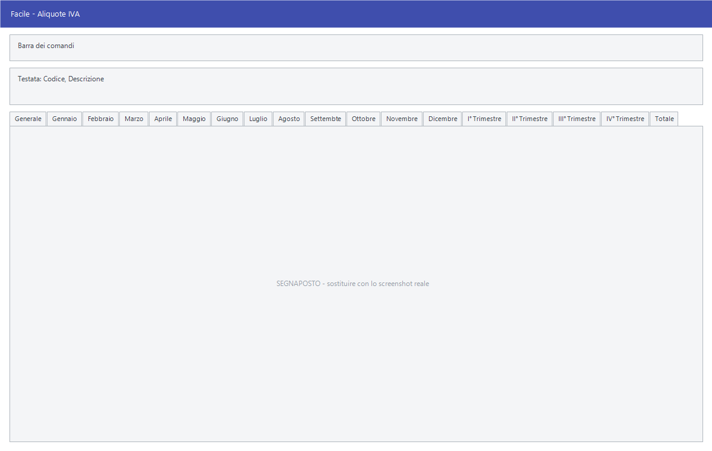

# Aliquote IVA

Da questa maschera si definiscono i codici IVA: l'aliquota, il tipo di
operazione, la natura richiesta dalla fattura elettronica e le percentuali di
ritenuta. Dalla stessa finestra si consultano i progressivi IVA, mese per mese
e trimestre per trimestre.

!!! info "In sintesi"

    - **Percorso:** Menu ▸ Archivi ▸ Aliquote Iva ▸ Inserimento *(oppure* Modifica*)*
    - **Scorciatoia:** nessuna; la maschera si apre dal menu
    - **Permessi richiesti:** nessun profilo predefinito; **Inserimento** e **Modifica** si abilitano separatamente per ogni utente da [Archivi ▸ Utenti](../anagrafiche/utenti.md)

---

## A cosa serve

Il codice IVA è ciò che collega un articolo o una riga di documento al
trattamento fiscale dell'operazione. Da qui dipendono l'imposta calcolata in
fattura, la natura trasmessa allo SDI quando l'imposta non c'è, e i registri
IVA.

Esempio: per una cessione intracomunitaria si crea un codice con **Tipo IVA**
= *03 - NON IMPONIBILE*, **% Aliquota** a zero e **Natura** = *N3.2 -
CESSIONI INTRACOMUNITARIE*: le fatture che lo usano escono senza imposta e con
la natura giusta nel file elettronico.

È una tabella che si compila all'avvio, si aggiorna quando cambia la normativa,
e va tenuta in ordine: un codice sbagliato si propaga su tutte le fatture che
lo usano.

## Prerequisiti

*Nessuno.* È una delle prime tabelle da compilare: l'anagrafica articoli la
pretende — senza codice IVA un articolo non si salva — e i documenti la
richiamano su ogni riga.

## La maschera

La maschera è divisa in tre parti:

- in alto la **barra dei comandi**;
- sotto la **testata**, sempre visibile, con codice e descrizione;
- al centro le **schede**: *Generale*, che si compila, e diciassette schede di
  sola consultazione — i dodici mesi, i quattro trimestri e il **Totale**.

## Campi

### Testata

| Campo | Obbl. | Descrizione | Valori ammessi |
|---|:---:|---|---|
| Codice | ● | Identificativo del codice IVA. In modifica non è modificabile. | Numero |
| Descrizione | ● | Denominazione, come compare sui documenti e nei registri. | Fino a 30 caratteri |

{: .campi }

### Scheda Generale

| Campo | Obbl. | Descrizione | Valori ammessi |
|---|:---:|---|---|
| Tipo IVA | | Trattamento fiscale dell'operazione. È la scelta che comanda tutto il resto. | 01 - IMPONIBILE, 02 - ESENTE, 03 - NON IMPONIBILE, 04 - NON SOGGETTO, 05 - RITENUTA D' ACCONTO, 06 - NON IMPONIBILE ART. 8/2, 07 - RETTIFICA SENZA ALIQUOTA, 08 - ESPORTAZIONI ED IMPORTAZIONI, 09 - CREDITI DIVERSI, 10 - CORRISPETTIVI DA VENTILARE, 11 - ESCLUSE EX ART. 15, 12 - REGIME DEL MARGINE, 13 - REVERSE CHARGE, 14 - IVA ASSOLTA ALTRO STATO UE |
| Natura | | Codice di natura da trasmettere in fattura elettronica. **L'elenco cambia secondo il Tipo IVA scelto**, e sui tipi che non la prevedono il campo non compare affatto. | N1 … N7, con le articolazioni previste dalla normativa |
| % Aliquota | | Percentuale d'imposta. | Percentuale |
| % Indeducibile | | Quota d'imposta che non si può detrarre. | Percentuale |
| % Rit. Acconto | | Percentuale di ritenuta d'acconto. | Percentuale |
| !% Imponibile Calcolo Rit. Acconto | | Percentuale dell'imponibile su cui si calcola la ritenuta. | Percentuale |
| % Cassa Prof. | | Percentuale del contributo alla cassa professionale. | Percentuale |
| Calcola Enasarco | | Applica il contributo Enasarco. | Casella |
| Calcola Enasarco su valori anno Precedente | | Prende a base i valori dell'anno precedente anziché quelli in corso. | Casella |
| Reparto Cassa | | Reparto del registratore di cassa a cui il codice corrisponde. | Numero |
| Beni non Destinati Rivendita | | Segnala che il codice riguarda beni non destinati alla rivendita. | 1 carattere |
| Cod. Aggancio | | Codice con cui l'aliquota viene riconosciuta nei tracciati esterni. | Fino a 6 caratteri |
| Omaggi | | Segnala che il codice si usa per gli omaggi. | Casella |
| Codice Iva Principale per l'aliquota | | Fra più codici con la stessa percentuale, indica quello da preferire nelle ricerche per aliquota. | Casella |
| Rif. Normativo | | Riferimento di legge, riportato in fattura sotto le operazioni senza imposta. | Fino a 100 caratteri |
| Escludi da Comunicazioni IVA | | Tiene il codice fuori dalle comunicazioni IVA. | Casella |
| Escludi Liquid. IVA - Riga VP2 | | Esclude il codice dal rigo VP2 della liquidazione. | Casella |
| Escludi Liquid. IVA - Riga VP3 | | Esclude il codice dal rigo VP3 della liquidazione. | Casella |

{: .campi }

### Schede dei progressivi

Le schede dei dodici mesi, dei quattro trimestri e del **Totale** non si
compilano: mostrano i progressivi maturati, con le stesse colonne.

| Colonne |
|---|
| Codice, Descrizione, Acq. Beni Dest. Rivendita, Altri Acquisti, Indetraibile, Ricavi Fatture, Corrispettivi, Ventilazione, Imponibile, Imposta |

## Pulsanti e comandi

| Comando | Scorciatoia | Effetto |
|---|---|---|
| **F2 - Salva** | ++f2++ | Registra il codice IVA. |
| **F3 - Prec.** | ++f3++ | Passa al codice precedente. |
| **F4 - Succ.** | ++f4++ | Passa al codice successivo. |
| **F5 - Cerca** | ++f5++ | Apre l'elenco dei codici IVA. |
| **F6 - Elimina** | ++f6++ | Cancella il codice, previa conferma. |
| **Ricarica** | | Rilegge il codice dall'archivio, abbandonando le modifiche non salvate. |

Valgono inoltre:

| Comando | Scorciatoia | Effetto |
|---|---|---|
| Consultazione | ++f11++ | Apre la finestra **Consultazione**. |
| Calcolatrice | ++f12++ | Apre la calcolatrice. |
| Campo successivo | ++enter++ | Sposta il cursore sul campo seguente. |
| Chiusura | ++esc++ | Chiude la maschera. |

## Come si fa

### Creare un'aliquota ordinaria

1. Apri **Menu ▸ Archivi ▸ Aliquote Iva ▸ Inserimento**.
2. Digita **Codice** e **Descrizione**, per esempio *IVA 22%*.
3. Imposta **Tipo IVA** = *01 - IMPONIBILE*: il campo **Natura** non compare,
   perché su un'operazione imponibile non serve.
4. Scrivi 22 in **% Aliquota**.
5. Se hai più codici al 22%, spunta **Codice Iva Principale per l'aliquota** su
   quello da preferire.
6. Premi **F2 - Salva**.

### Ritrovare e modificare un codice IVA

1. Apri **Menu ▸ Archivi ▸ Aliquote Iva ▸ Modifica**. La maschera non si apre
   vuota: mostra già il codice con il **numero più alto**.
2. Premi **F5 - Cerca** e scegli il codice dall'elenco, oppure scorri con **F3
   - Prec.** e **F4 - Succ.**.
3. Correggi i campi e premi **F2 - Salva**. La scheda resta a video su quello
   appena registrato; in inserimento invece si svuota per il successivo.

Finché non salvi puoi tornare indietro con **Ricarica**, che rilegge il codice
dall'archivio e abbandona le modifiche non salvate. Se l'archivio è ancora
vuoto la voce **Modifica** non apre nulla e non dà alcun messaggio.

### Creare un codice senza imposta

1. Digita **Codice** e **Descrizione**.
2. Scegli il **Tipo IVA** che corrisponde all'operazione — per esempio
   *03 - NON IMPONIBILE*.
3. Nel campo **Natura**, che ora compare, scegli la voce esatta: l'elenco
   contiene solo le nature ammesse per quel tipo.
4. Lascia **% Aliquota** a zero e compila il **Rif. Normativo**: è il testo che
   comparirà in fattura.
5. Premi **F2 - Salva**.

### Controllare i progressivi di un mese

1. Carica il codice IVA.
2. Apri la scheda del mese, per esempio *Marzo*.
3. Leggi imponibile e imposta nelle ultime due colonne.

## Controlli e messaggi

| Messaggio | Causa | Cosa fare |
|---|---|---|
| *(nessun messaggio, solo un segnale acustico)* | Manca il **Codice** o la **Descrizione**. | Guarda dove si è posizionato il cursore: è il campo da compilare. |
| *In archivio è già presente un record con lo stesso codice.* | Il codice digitato è già di un'altra aliquota. | Cambia codice. |
| *Confermi la Cancellazione....* | Conferma richiesta da **F6 - Elimina**. | Rispondi **Sì** per eliminare il codice IVA. |
| *Non è possibile eliminare il record pochè utilizzato in alcuni record del database.* | Il codice è assegnato ad articoli, righe di documento o registrazioni di prima nota, oppure ha progressivi. | Non è eliminabile: lascialo in archivio. |
| *Il record è stato modificato da un altro nodo della rete.* | Un altro utente ha salvato lo stesso codice mentre lo modificavi. | Premi **Ricarica**, verifica cosa è cambiato e rifai le tue modifiche. |
| *Il record è stato cancellato da un altro nodo della rete.* | Un altro utente ha eliminato il codice mentre lo modificavi. | La maschera si chiude: non c'è più nulla da salvare. |

## Note

!!! warning "Attenzione"

    Cambiare la **% Aliquota** di un codice **non ricalcola i documenti già
    emessi**: la nuova percentuale vale solo da lì in avanti. Quando cambia
    un'aliquota di legge conviene creare un codice nuovo, non modificare il
    vecchio.

    Il campo **Natura** dipende dal **Tipo IVA**: cambiando tipo, l'elenco si
    rifà da capo e la natura scelta prima può non essere più valida. Dopo aver
    cambiato tipo, ricontrolla sempre la natura.

    ++esc++ chiude la maschera senza chiedere conferma e senza salvare: le
    modifiche fatte dopo l'ultimo **F2 - Salva** vanno perse.

<!-- DA VERIFICARE: il campo "!% Imponibile Calcolo Rit. Acconto" ha un punto esclamativo iniziale nell'etichetta a video. È voluto o è un refuso da correggere nel programma? -->

<!-- DA VERIFICARE: il campo Beni non Destinati Rivendita accetta un solo carattere. Quali valori sono previsti? -->

## Vedi anche

- [Tipi di pagamento](tipi-di-pagamento.md)
- [Anagrafica articoli](../anagrafiche/anagrafica-articoli.md)
