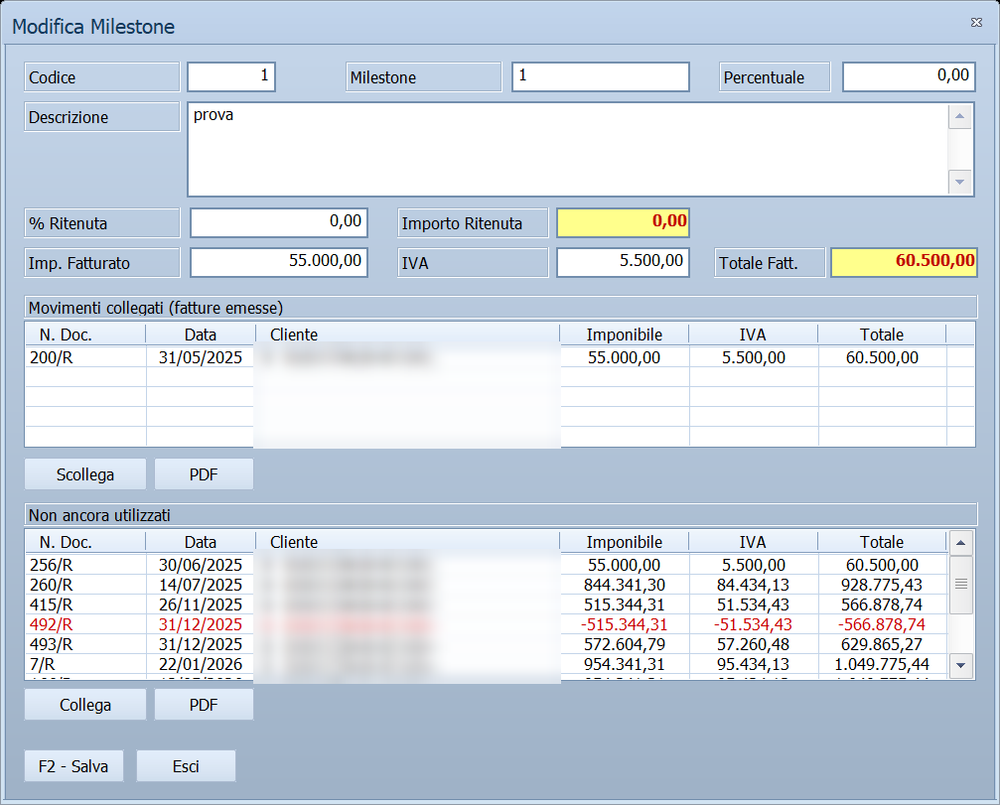

# Avanzamento lavori

Registra **un avanzamento di un contratto della commessa** — una milestone o
uno stato avanzamento lavori — e gli collega le **fatture emesse al cliente**
che lo fatturano. Si apre dalla scheda *Milestone/SAL* della commessa.

!!! info "In sintesi"

    - **Percorso:** Menu ▸ Contabilità ▸ Commesse di Contabilità Analitica ▸ scheda **Milestone/SAL** ▸ **Nuovo** *(oppure* **Modifica***)*
    - **Scorciatoia:** ++f2++ salva, ++esc++ esce
    - **Permessi richiesti:** quelli della [commessa](commesse.md) da cui si apre; non ha un profilo suo

---

## A cosa serve

È il lato ricavi della commessa, speculare ai [SAL del
subappaltatore](sal-subappaltatore.md): lì si annota quanto ti fattura chi
lavora per te, qui quanto fatturi tu al committente.

Ogni avanzamento appartiene a **un contratto**, quello scelto nella tendina in
cima alla scheda. Gli importi non si digitano: si ricavano dalle fatture
collegate, e da lì alimentano la **% Fatturato** della commessa.

## Prerequisiti

Prima di usare questa maschera occorre:

- avere almeno un [contratto](contratto.md) registrato sulla commessa, perché
  l'avanzamento appartiene a un contratto e la tendina va scelta prima;
- per collegare le fatture, averle **emesse e registrate in prima nota**
  sul cliente della commessa.

## La maschera

Una finestra sola. In alto i dati dell'avanzamento — numero, percentuale,
descrizione, ritenuta e i totali; al centro le **fatture collegate**, in basso
quelle **non ancora utilizzate**, e fra i due elenchi i comandi per spostare
una fattura dall'uno all'altro.

Il titolo e il nome del primo campo cambiano con il tipo del contratto:
*Milestone* per un contratto a milestone, *SAL* per un contratto a stati
avanzamento.

## Campi

| Campo | Obbl. | Descrizione | Valori ammessi |
|---|:---:|---|---|
| **Codice** | | **Sola lettura.** Lo assegna il programma. | Numero |
| **Milestone** / **SAL** | ● | Come chiami questo avanzamento. L'etichetta è *Milestone* o *SAL* secondo il tipo del contratto. | Fino a 15 caratteri |
| **Percentuale** | | Quanta parte del contratto rappresenta questo avanzamento. **Compare solo sui contratti a milestone**; su quelli a SAL non c'è. | Numero con decimali |
| **Descrizione** | | Che cosa comprende l'avanzamento. È un campo **su più righe**. | Fino a 512 caratteri |
| **% Ritenuta** | | La percentuale di ritenuta a garanzia da trattenere. È l'**unico** dei campi importo che si digita. | Numero con decimali |
| **Importo Ritenuta** | | **Sola lettura**, in evidenza. È l'importo fatturato per la percentuale di ritenuta. | Calcolato |
| **Imp. Fatturato** | | **Sola lettura**. L'imponibile delle fatture collegate: totale del documento meno l'IVA. | Calcolato |
| **IVA** | | **Sola lettura**. L'IVA delle fatture collegate. | Calcolato |
| **Totale Fatt.** | | **Sola lettura**, in evidenza. Imponibile più IVA, meno la ritenuta. | Calcolato |
| **Movimenti collegati (fatture emesse)** | | Le fatture attribuite a questo avanzamento: **N. Doc.**, **Data**, **Cliente**, **Imponibile**, **IVA**, **Totale**. | Elenco |
| **Non ancora utilizzati** | | Le fatture emesse che non sono collegate a nessun avanzamento. Stesse colonne. | Elenco |

{: .campi }

La colonna **Obbl.** segna con ● i campi che il programma richiede per
salvare: qui è **solo il numero**.

Nei due elenchi, una riga il cui **Totale** è negativo — una nota di credito —
viene scritta in **rosso**.

## Pulsanti e comandi

| Comando | Scorciatoia | Effetto |
|---|---|---|
| **F2 - Salva** | ++f2++ | Registra l'avanzamento. Se lo stai creando, la finestra **resta aperta** e passa in modifica, così puoi collegare subito le fatture. |
| **Esci** | ++esc++ | Chiude la finestra. I collegamenti già fatti restano: non dipendono dal salvataggio. |
| **Collega** | doppio clic sulla riga dell'elenco in basso | Attribuisce a questo avanzamento la fattura selezionata. Gli importi si ricalcolano. |
| **Scollega** | doppio clic sulla riga dell'elenco in alto | Toglie il collegamento: la fattura torna fra quelle disponibili e gli importi si ricalcolano. |
| **PDF** | | Apre il primo PDF allegato alla registrazione selezionata, ciascuno per il proprio elenco. |
| Consultazione | ++f11++ | Apre la finestra **Consultazione**. |
| Calcolatrice | ++f12++ | Apre la calcolatrice. |

## Come si fa

### Registrare un avanzamento e fatturarlo

1. Apri la commessa e vai sulla scheda **Milestone/SAL**.
2. In cima alla scheda scegli il **Contratto**: l'elenco sotto mostra solo i
   suoi avanzamenti, e il nuovo apparterrà a quello.
3. Premi **Nuovo**.
4. Scrivi il numero dell'avanzamento e, su un contratto a milestone, la
   **Percentuale**. Compila la **Descrizione** e la **% Ritenuta** se prevista.
5. Premi **F2 - Salva**. La finestra **non si chiude**: cambia titolo e
   accende i due elenchi.
6. Nell'elenco **Non ancora utilizzati** seleziona la fattura emessa e premi
   **Collega**, oppure falle doppio clic. Sale nell'elenco di sopra e i
   quattro importi in alto si aggiornano.
7. Premi **F2 - Salva**: la finestra si chiude e la riga è aggiornata
   nell'elenco della scheda.

### Correggere un collegamento sbagliato

1. Apri l'avanzamento con **Modifica**.
2. Seleziona la fattura nell'elenco **Movimenti collegati** e premi
   **Scollega**, oppure falle doppio clic.
3. La fattura torna disponibile e gli importi si riducono di conseguenza.

## Controlli e messaggi

| Messaggio | Causa | Cosa fare |
|---|---|---|
| *Nessun PDF allegato a questa registrazione.* | Hai premuto **PDF** su una fattura che in prima nota non ha allegati in formato PDF. | Nessun rimedio dalla maschera: l'allegato va aggiunto alla registrazione di prima nota. |

## Note

!!! warning "Collega e Scollega agiscono subito"

    I due comandi **non aspettano il salvataggio**: il collegamento viene
    registrato nel momento in cui lo fai, ed **Esci** non lo annulla. Per
    tornare indietro devi usare **Scollega**.

!!! note "Gli importi si costruiscono, non si scrivono"

    Di tutti i campi importo se ne digita **uno solo**, la **% Ritenuta**.
    Gli altri tre vengono dalle fatture collegate:

    - **Imp. Fatturato** è il loro imponibile, cioè il totale meno l'IVA;
    - **Importo Ritenuta** è l'imponibile per la percentuale di ritenuta;
    - **Totale Fatt.** è imponibile più IVA, meno la ritenuta.

    Un avanzamento senza fatture collegate vale zero, anche se il lavoro è
    stato consegnato.

!!! note "Prima si salva, poi si collega"

    Finché l'avanzamento non è registrato, i due elenchi sono spenti e al
    posto dell'intestazione si legge *Salva il SAL/Milestone per collegare i
    movimenti di prima nota*. Dopo **F2 - Salva** la finestra resta aperta e
    gli elenchi si accendono: non serve chiuderla e riaprirla.

!!! note "Senza numero il salvataggio non avviene, e non lo dice"

    Premendo **F2 - Salva** con il numero vuoto, il programma emette un
    **segnale acustico** e riporta il cursore su quel campo: non compare
    nessun messaggio. Lo stesso accade premendo **Collega**, **Scollega** o
    **PDF** senza aver selezionato una riga.

## Vedi anche

- [Commesse di Contabilità Analitica](commesse.md)
- [Contratto](contratto.md)
- [SAL Subappaltatore](sal-subappaltatore.md)
