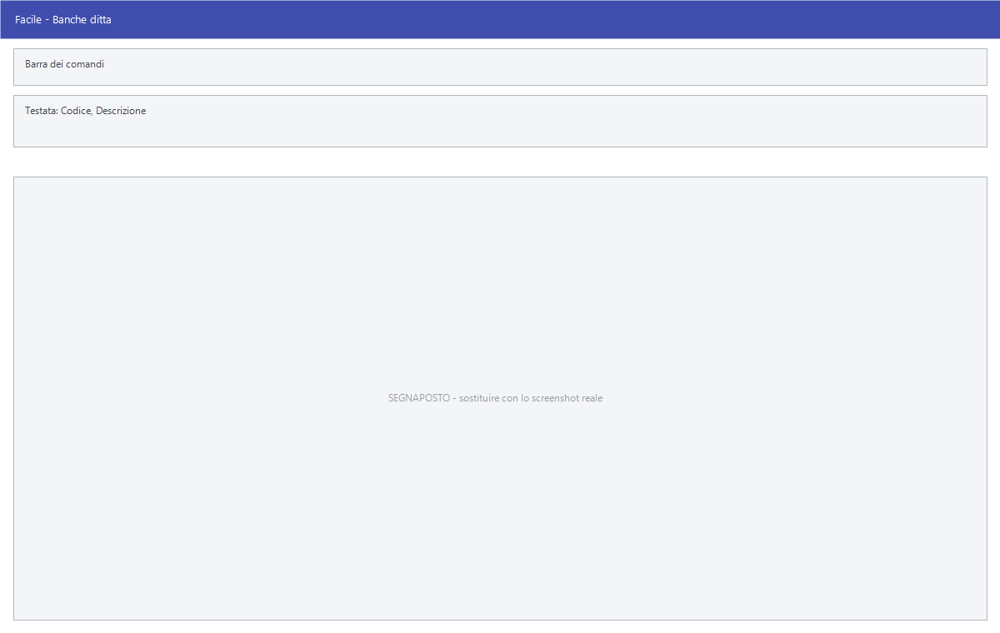

# Banche ditta

**Solo Studio.** Da questa maschera si tengono i conti bancari dell'azienda con
il dettaglio finanziario: saldo, scopertura concessa, castelletti per cambiali,
tratte e RI.BA., e i tassi applicati.

!!! info "In sintesi"

    - **Percorso:** Menu ▸ Archivi ▸ Contabilità ▸ Banche Ditta ▸ Inserimento *(oppure* Modifica*)*
    - **Scorciatoia:** nessuna; la maschera si apre dal menu
    - **Versione:** **solo Studio.** Nelle altre versioni la voce di menu non c'è
    - **Permessi richiesti:** nessun profilo predefinito; **Inserimento** e **Modifica** si abilitano separatamente per ogni utente da [Archivi ▸ Utenti](../anagrafiche/utenti.md)

---

## A cosa serve

Non va confusa con l'archivio [Banche](banche.md), che raccoglie tutte le banche
— comprese quelle d'appoggio di clienti e fornitori. Questa maschera riguarda
**i conti dell'azienda**, e serve a sapere quanto si ha, quanto si può
scoprire, e quanto castelletto resta libero.

Esempio: se sulla banca hai un castelletto RI.BA. di 50.000 euro e ne hai già
utilizzati 32.000, il campo **Disp. Residua** dice che ne restano 18.000 prima
di dover presentare altrove.

!!! info "Solo nella versione Studio"

    Questa maschera esiste **solo nella versione Studio**. Nelle altre versioni
    il programma **toglie le due voci dal menu all'avvio**: se non le trovi
    sotto Archivi ▸ Contabilità, è perché la tua versione non ha questo
    modulo.

## Prerequisiti

*Nessuno.*

## La maschera

È una maschera a finestra unica, senza schede, divisa in tre zone: in alto i
dati della banca e le coordinate, al centro saldo e scopertura, in basso i due
riquadri **CASTELLETTI** e **TASSI**.

## Campi

### Dati della banca

| Campo | Obbl. | Descrizione | Valori ammessi |
|---|:---:|---|---|
| Codice | ● | Identificativo della banca. In modifica non è modificabile. | Numero |
| Descrizione | ● | Denominazione della banca. | Testo |
| Indirizzo, Citta, Provincia, Cap, Telefono | | Recapiti della filiale. | Testo |
| Prestiti Gruppo Interno | | Segnala che il conto riguarda prestiti interni al gruppo. | Casella |
| Ultimo Movimento | | Data dell'ultimo movimento registrato sul conto. | Data |
| Cod. Azienda, Dipendenza, ABI, CAB, Num. Conto, Sportello | | Le coordinate bancarie del conto. | Testo |

{: .campi }

### Disponibilità

| Campo | Obbl. | Descrizione | Valori ammessi |
|---|:---:|---|---|
| Saldo Attuale | | Saldo del conto. | Importo |
| Scopertura Concessa | | Fido concesso dalla banca. | Importo |
| Fuori Scopertura | | Quanto si è oltre il fido. Calcolato dal programma. | Sola lettura |

{: .campi }

### Castelletti

Il riquadro **CASTELLETTI** ha una riga per **Cambiali**, una per **Tratte** e
una per **RI.BA.**, con tre colonne:

| Colonna | Descrizione |
|---|---|
| **Disp. Iniziale** | Il castelletto concesso dalla banca. |
| **Utilizzato** | Quanto ne è già stato impegnato. |
| **Disp. Residua** | Quanto resta. Calcolato dal programma. |

### Tassi

Il riquadro **TASSI** contiene quattro righe, ciascuna con una **Decorrenza** e
i tassi applicati a **Cambiali**, **Tratte** e **RI.BA.** da quella data: si
tiene così lo storico delle condizioni.

## Pulsanti e comandi

| Comando | Scorciatoia | Effetto |
|---|---|---|
| **F2 - Salva** | ++f2++ | Registra la banca. |
| **F3 - Prec.** | ++f3++ | Passa alla banca precedente. |
| **F4 - Succ.** | ++f4++ | Passa alla banca successiva. |
| **F5 - Cerca** | ++f5++ | Apre l'elenco delle banche dell'azienda. |
| **F6 - Elimina** | ++f6++ | Cancella la banca, previa conferma. |
| **Ricarica** | | Rilegge la banca dall'archivio, abbandonando le modifiche non salvate. |

Valgono inoltre:

| Comando | Scorciatoia | Effetto |
|---|---|---|
| Consultazione | ++f11++ | Apre la finestra **Consultazione**. |
| Calcolatrice | ++f12++ | Apre la calcolatrice. |
| Campo successivo | ++enter++ | Sposta il cursore sul campo seguente. |
| Chiusura | ++esc++ | Chiude la maschera. |

## Come si fa

### Registrare un conto bancario dell'azienda

1. Apri **Menu ▸ Archivi ▸ Contabilità ▸ Banche Ditta ▸ Inserimento**.
2. Digita **Codice** e **Descrizione**.
3. Compila le coordinate: **ABI**, **CAB**, **Num. Conto**.
4. Indica la **Scopertura Concessa**.
5. Nel riquadro *CASTELLETTI* scrivi la **Disp. Iniziale** di cambiali, tratte
   e RI.BA.
6. Premi **F2 - Salva**.

### Aggiornare i tassi

1. Carica la banca.
2. Nel riquadro *TASSI* usa la prima riga libera: scrivi la **Decorrenza** e i
   tre tassi.
3. Premi **F2 - Salva**. Le righe precedenti restano come storico.

## Controlli e messaggi

| Messaggio | Causa | Cosa fare |
|---|---|---|
| *(nessun messaggio, solo un segnale acustico)* | Manca il **Codice** o la **Descrizione**. | Guarda dove si è posizionato il cursore: è il campo da compilare. |
| *In archivio è già presente un record con lo stesso codice.* | Il codice digitato è già di un'altra banca. | Cambia codice. |
| *Confermi la Cancellazione....* | Conferma richiesta da **F6 - Elimina**. | Rispondi **Sì** per eliminare la banca. |
| *Il record è stato modificato da un altro nodo della rete.* | Un altro utente ha salvato la stessa banca mentre la modificavi. | Premi **Ricarica**, verifica cosa è cambiato e rifai le tue modifiche. |
| *Il record è stato cancellato da un altro nodo della rete.* | Un altro utente ha eliminato la banca mentre la modificavi. | La maschera si chiude: non c'è più nulla da salvare. |

## Note

!!! warning "Attenzione"

    Questo archivio è **distinto** da quello di **Menu ▸ Archivi ▸ Banche**:
    una stessa banca può comparire in tutti e due, con codici diversi. Qui
    stanno i conti dell'azienda con i loro castelletti, là le banche come
    anagrafica.

    ++esc++ chiude la maschera senza chiedere conferma e senza salvare: le
    modifiche fatte dopo l'ultimo **F2 - Salva** vanno perse.

<!-- DA VERIFICARE: Saldo Attuale e Ultimo Movimento si aggiornano da soli con le registrazioni, o si scrivono a mano? -->

<!-- DA VERIFICARE: le quattro righe dei tassi bastano sempre? Cosa succede quando si esauriscono. -->

<!-- DA VERIFICARE: la casella Prestiti Gruppo Interno. -->

## Vedi anche

- [Banche](banche.md)
- [Titoli](titoli.md)
